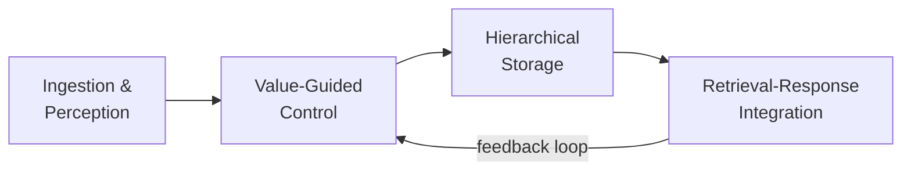
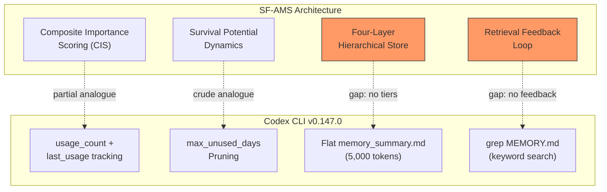

# Strategic Forgetting and Utility-Driven Memory Survival: What SF-AMS Reveals About Codex CLI's Memory Consolidation Gap


---

Every Codex CLI user who has worked through a multi-week project knows the feeling: your `memory_summary.md` grows increasingly noisy, old workarounds for bugs you fixed three sprints ago still surface in the context window, and genuinely critical architectural decisions get buried under trivia. The problem is not that Codex CLI forgets too much — it is that it forgets too crudely.

A recent paper from Yang, Li, Shen, Zhou, Zhang, Li and Zhang — *Strategic Forgetting for Structured Memory in LLM Agent* (SF-AMS) [^1] — offers a principled alternative. Rather than treating memory as an ever-growing append log with periodic compaction, SF-AMS models each memory unit's *survival potential* as a dynamic quantity that rises with retrieval utility and falls with redundancy and time. The result is a hierarchical four-layer memory store where core architectural facts are provably ranked above distractors, and noise is continuously pruned without manual intervention.

This article maps SF-AMS's architecture onto Codex CLI v0.147.0's memory pipeline, identifies the structural gaps, and proposes practical mitigations you can deploy today.

## How Codex CLI Memories Work Today

Codex CLI's built-in memory system follows a two-phase pipeline [^2]:

1. **Phase 1 — Capture**: During a session, the agent writes raw memory entries to `~/.codex/memories/`. Each entry is a markdown snippet tagged with metadata.
2. **Phase 2 — Consolidation**: A consolidation sub-agent merges accumulated raw memories into two navigational files: `MEMORY.md` (a searchable registry of aggregated insights) and `memory_summary.md` (a truncated précis injected into the next session's developer instructions within a fixed 5,000-token budget) [^3].

A basic decay mechanism exists: memories track `usage_count` and `last_usage` timestamps, and entries unused for `max_unused_days` are pruned during consolidation [^3]. Diff-based forgetting labels entries as `removed`, triggering deletion from `rollout_summaries/` and `MEMORY.md`.

This is functional but structurally flat. Every surviving memory competes equally for the 5,000-token budget. There is no concept of importance tiers, no redundancy detection across related entries, and no mechanism for a critical architectural decision to outrank a transient debugging note.

## The SF-AMS Architecture

SF-AMS replaces static retrieval and heuristic decay with a four-stage closed-loop pipeline [^1]:



### Stage 1: Ingestion and Perception

Raw conversational inputs are converted into structured signals enriched with salience, redundancy, and temporal metadata. This is analogous to Codex CLI's Phase 1 capture, but with richer annotation at write time.

### Stage 2: Value-Guided Control — Composite Importance Scoring

The heart of SF-AMS is its **Composite Importance Score (CIS)**:

```
I(mᵢ) = Norm(α · S_LLM(mᵢ) + (1 − α) · Σₖ 𝟙ₖ(mᵢ) · wₖ)
```

Where `S_LLM` measures task-conditioned semantic salience (how important is this memory *for the current task class*?), `𝟙ₖ` indicates entity-type presence (does this memory reference a function, a configuration key, an API endpoint?), and `wₖ` encodes structural priors — some entity types are inherently more durable than others [^1].

The survival potential of each memory then evolves via a discrete-time update:

```
Φᵢ^(t+1) = max{0, Φᵢ^t + I(mᵢ) · Γ_usage^t · Ψ_div(mᵢ, Mₜ) − λ}
```

Three forces shape survival: importance reinforcement (high CIS), usage frequency (`Γ_usage`), and diversity modulation (`Ψ_div`, which down-weights memories that duplicate existing knowledge). A constant decay coefficient `λ` enforces continuous contraction [^1].

### Stage 3: Hierarchical Storage

Memories self-organise into four layers based on survival potential:

| Layer | Share | Avg Importance | Forgetting Rate |
|-------|-------|---------------|-----------------|
| **Core** | 10.62% | 0.930 | 0% |
| **Important** | 14.25% | 0.745 | 14.85% |
| **Secondary** | 49.22% | 0.546 | 39.83% |
| **Irrelevant** | 25.91% | 0.356 | 64.74% |

The distribution is deliberately skewed: roughly a quarter of memories are classified as irrelevant and aggressively pruned, whilst the core tenth — your architectural invariants, your deployment credentials pattern, your test framework conventions — is never forgotten [^1].

### Stage 4: Retrieval-Response Integration

Hybrid retrieval combines semantic similarity with fact-aware matching. Crucially, retrieval decisions feed back into the survival dynamics: a memory that is retrieved and used sees its survival potential reinforced; one that is consistently bypassed drifts toward eviction.

## Evaluation Results

SF-AMS was evaluated against LightMem, MemO, and A-Mem on the LoCoMo and LongMemEval-s benchmarks [^1]:

| Task Type | Model | SF-AMS F1 | Best Baseline F1 | Delta |
|-----------|-------|-----------|-------------------|-------|
| Multi-hop reasoning | Qwen2.5-7B | 37.59 | 27.94 | **+9.65** |
| Temporal reasoning | GPT-4o-mini | 45.84 | 38.93 | **+6.91** |
| Open-domain | Qwen2.5-7B | 32.76 | 26.23 | **+6.53** |

On LongMemEval-s, SF-AMS achieved 68.52% accuracy versus 65.20% for A-Mem, whilst reducing LLM calls by 46.7% compared to LangMem [^1]. The efficiency gain matters: fewer LLM calls during memory management means lower cost per session.

A formal guarantee underpins the hierarchy: under a structural gap condition `γ > 1 + δ`, core factual invariants in layer L₁ are provably ranked above distractors in layer L₄ during retrieval [^1].

## Mapping SF-AMS to Codex CLI's Memory Gaps



### Gap 1: No Composite Importance Scoring

Codex CLI tracks `usage_count` and `last_usage` but does not evaluate semantic salience or entity-type structure. A memory recording "fixed flaky test in CI" and a memory recording "project uses event-sourcing with CQRS" receive identical initial weighting. SF-AMS's CIS would immediately score the architectural decision higher via entity-type priors [^1].

### Gap 2: No Hierarchical Retention Tiers

All memories in `MEMORY.md` compete equally for the 5,000-token `memory_summary.md` budget. There is no mechanism to guarantee that core architectural facts survive consolidation whilst transient debugging notes are pruned. SF-AMS's four-layer hierarchy ensures 0% forgetting at the core tier [^1].

### Gap 3: No Retrieval Feedback Loop

When Codex CLI retrieves a memory via `grep MEMORY.md`, that retrieval event does not reinforce the memory's survival potential. The memory system is open-loop: write, consolidate, read, but never learn from what was useful. SF-AMS's closed-loop design means frequently retrieved memories strengthen whilst ignored ones decay [^1].

### Gap 4: No Redundancy Detection

Codex CLI's consolidation agent merges memories but does not quantify redundancy across entries. If three sessions each record slightly different phrasings of the same architectural constraint, all three survive until manual cleanup. SF-AMS's diversity modulation (`Ψ_div`) automatically down-weights duplicates [^1].

### Gap 5: No Formal Survival Guarantee

Codex CLI's `max_unused_days` is a hard cutoff with no consideration of structural importance. A core deployment procedure that happens to go unreferenced for 31 days is pruned identically to a one-off workaround. SF-AMS's survival potential ensures that high-importance memories resist decay even during periods of low usage [^1].

## Practical Mitigations for Today

Whilst waiting for first-class hierarchical memory support, you can approximate SF-AMS's benefits within Codex CLI v0.147.0:

### 1. Manual Memory Tiering via AGENTS.md

Structure your `AGENTS.md` with explicit sections that mirror SF-AMS's hierarchy:

```markdown
## Core Architectural Facts (Never Forget)
- Event-sourced CQRS with PostgreSQL write store, Redis read projections
- All API endpoints behind Kong gateway with JWT validation
- Deployment: ArgoCD → staging auto-promote → production manual gate

## Important Conventions (Review Quarterly)
- Test naming: `describe_when_should` pattern
- PR template requires architecture-decision link for schema changes

## Transient Context (Prune After Sprint)
- Workaround: pin `libssl` to 3.2.1 until upstream fix ships
```

### 2. PostToolUse Hook for Memory Quality Scoring

Create a PostToolUse hook that scores new memory writes before they reach the consolidation pipeline:

```bash
#!/usr/bin/env bash
# hooks/score-memory.sh
# Exit 2 = send feedback to agent, don't block

if [[ "$CODEX_TOOL_NAME" == "create_memory" ]]; then
  CONTENT="$CODEX_TOOL_OUTPUT"
  # Flag low-value memories
  if echo "$CONTENT" | grep -qiE "(temporary|workaround|hack|quick fix)"; then
    echo "Memory tagged as TRANSIENT — consider adding expiry context"
    exit 2
  fi
fi
exit 0
```

### 3. Scheduled Memory Audit via Automations

Use Codex CLI's thread automations to run a weekly memory review:

```toml
# ~/.codex/automations/memory-audit.toml
[trigger]
schedule = "0 9 * * 1"  # Every Monday 09:00

[task]
prompt = """
Review MEMORY.md. For each entry:
1. Score importance 1-4 (Core/Important/Secondary/Irrelevant)
2. Flag entries not referenced in the last 3 sessions
3. Merge near-duplicate entries
4. Delete entries scored 4 (Irrelevant)
Write a summary of changes to memory_audit_log.md
"""
```

### 4. Named Profiles for Memory-Sensitive Tasks

Use Codex CLI's named profile system to adjust memory behaviour per task type:

```toml
# ~/.codex/architecture-review.config.toml
[memory]
max_unused_days = 90  # Longer retention for architectural work
```

## What Would First-Class Support Look Like?

A native SF-AMS integration in Codex CLI would require four additions:

1. **CIS at write time**: The memory capture phase would score each entry's composite importance using entity-type detection and semantic salience, requiring a lightweight classifier (potentially the Luna tier to keep costs low) [^4].
2. **Survival potential tracking**: Each memory entry in `MEMORY.md` would carry a `survival_potential` field updated on every consolidation cycle.
3. **Tiered consolidation**: The consolidation sub-agent would produce a `memory_summary.md` that allocates budget proportionally — core memories receive guaranteed token allocation, irrelevant memories are excluded entirely.
4. **Retrieval telemetry**: When a memory is retrieved and used during a session, a feedback signal would increment its survival potential for the next consolidation cycle.

The existing `usage_count` and `last_usage` fields provide a foundation, but the jump from flat counting to composite importance scoring with formal survival guarantees is architecturally significant.

## Limitations and Open Questions

SF-AMS was evaluated on conversational benchmarks (LoCoMo, LongMemEval-s), not on software engineering workloads [^1]. Several questions remain open:

- **Entity taxonomy for code**: SF-AMS's entity-type priors assume conversational entities (people, places, events). A code-aware variant would need priors for functions, modules, configuration keys, API contracts, and deployment topology. ⚠️ No published work has validated CIS entity weighting for software engineering memory specifically.
- **Capacity budget**: SF-AMS experiments fixed memory capacity at 300 units [^1]. A typical multi-month Codex CLI project may generate thousands of memory entries — the scaling behaviour is unvalidated.
- **Consolidation cost**: Running CIS scoring on every memory during consolidation adds LLM calls. Whether the 46.7% call reduction observed in retrieval offsets the scoring overhead in a Codex CLI context is untested [^5].
- **Multi-user memory**: SF-AMS models single-agent memory. Codex CLI's Agent Plugins 1.0 shared context introduces multi-principal memory where different agents may have different importance priors [^6].

## Conclusion

Codex CLI's memory system does the hard part — it captures and consolidates session knowledge automatically. What it lacks is the intelligence to decide *what matters*. SF-AMS's contribution is precisely that intelligence: a formal framework for utility-driven memory survival with hierarchical retention guarantees and closed-loop retrieval feedback.

The gap between Codex CLI's flat `max_unused_days` decay and SF-AMS's composite importance scoring with survival dynamics is the difference between a filing cabinet and a curator. Until native support arrives, the mitigations above — manual tiering in `AGENTS.md`, PostToolUse memory scoring hooks, scheduled memory audits, and profile-scoped retention policies — offer a practical approximation of the structured forgetting that SF-AMS demonstrates is both possible and measurably superior.

## Citations

[^1]: Yang, N., Li, S., Shen, M., Zhou, Y., Zhang, M., Li, T. & Zhang, H. (2026). "SF-AMS: Strategic Forgetting for Structured Memory in LLM Agent." arXiv:2607.22562. [https://arxiv.org/abs/2607.22562](https://arxiv.org/abs/2607.22562)

[^2]: OpenAI. (2026). "Codex CLI Features — Memories." ChatGPT Learn Documentation. [https://learn.chatgpt.com/docs/codex/cli](https://learn.chatgpt.com/docs/codex/cli)

[^3]: Vaughan, D. (2026). "Codex CLI Memory Internals: Pipelines, Secret Sanitisation and Intelligent Forgetting." Codex Knowledge Base. [https://codex.danielvaughan.com/2026/04/08/codex-cli-memory-internals/](https://codex.danielvaughan.com/2026/04/08/codex-cli-memory-internals/)

[^4]: OpenAI. (2026). "GPT-5.6 Sol, Terra, and Luna Model Tiers." Codex Models Documentation. [https://developers.openai.com/codex/models](https://developers.openai.com/codex/models)

[^5]: Vaughan, D. (2026). "Codex Built-In Memory Deep Dive: How the Two-Phase Pipeline Turns Sessions into Institutional Knowledge." Codex Knowledge Base. [https://codex.danielvaughan.com/2026/04/18/codex-built-in-memory-system-deep-dive/](https://codex.danielvaughan.com/2026/04/18/codex-built-in-memory-system-deep-dive/)

[^6]: OpenAI. (2026). "Agent Plugins 1.0." Codex CLI v0.147.0 Changelog. [https://github.com/openai/codex/releases/tag/rust-v0.147.0](https://github.com/openai/codex/releases/tag/rust-v0.147.0)
