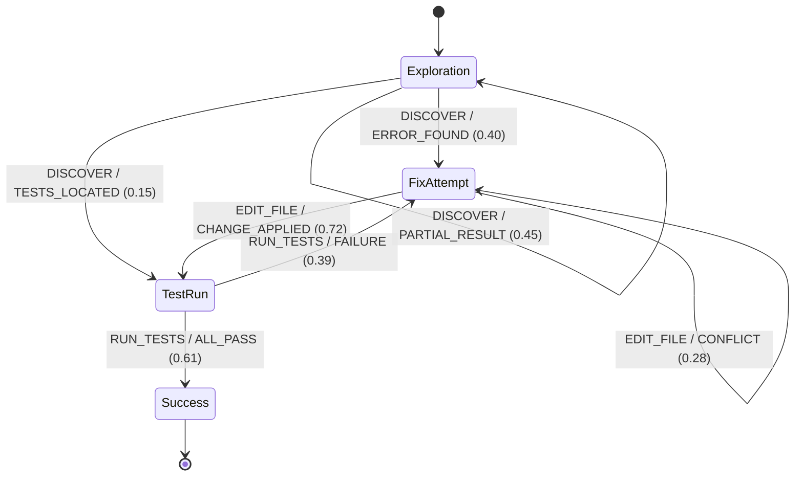

# ATLAS and Automata Learning for Agent Strategy Discovery: What Finite-State Models Mean for Your Codex CLI Rollout Traces


---

When a Codex CLI session fails or produces unexpected results, you open the rollout JSONL and scroll through hundreds of typed events — `turn.started`, `item.command_execution`, `item.mcp_tool_call`, `turn.completed` — searching for the moment things diverged. The raw trace tells you *what* happened but not *why* the agent chose that strategy over another. A new research framework called ATLAS demonstrates that automata learning can transform those opaque traces into compact, interpretable finite-state models that expose the agent's high-level behavioural strategy — and the technique maps directly onto Codex CLI's rollout infrastructure [^1].

## The Explainability Problem in Coding Agents

Coding agents are fundamentally difficult to explain. Each turn involves model reasoning, tool selection, output parsing, and context-dependent branching. Over a multi-turn session, the combinatorial space of possible strategies grows rapidly. Codex CLI's rollout system faithfully records every event — the `RolloutItem` enum covers session metadata, response items, turn context, compaction events, and inter-agent communication [^2] — but this granularity creates a paradox: the more data you capture, the harder it becomes to see the forest for the trees.

Traditional observability tools address this at the span level. Codex CLI's OTLP export emits spans covering API call latency, tool execution duration, and compaction events [^3]. Langfuse and Dynatrace integrations provide dashboards. But spans are structural, not behavioural: they tell you how long each step took, not what decision pattern the agent followed across the session.

## How ATLAS Works

Lopez-Miguel et al. introduced ATLAS at ACM/IEEE MODELS 2026, combining two techniques that individually are well understood but had not previously been applied to LLM agent traces [^1]:

### Stage 1: LLM-Guided Trace Abstraction

Raw execution traces contain concrete commands (`git diff HEAD~3`, `rg -n "TODO" src/`), tool outputs (hundreds of lines of diff), and model reasoning tokens. ATLAS uses an LLM to categorise each concrete action and observation into abstract labels. A shell command like `find . -name "*.test.ts" -exec grep -l "describe" {} \;` becomes `DISCOVERY_TEST_FILES`. A tool output containing a stack trace becomes `ERROR_RUNTIME`.

The abstraction pipeline has three steps:

1. **Categorisation** — map each concrete action/observation to a semantic category
2. **Normalisation** — merge redundant categories across traces
3. **Per-trace labelling** — produce a sequence of abstract action-observation pairs

This intentionally sacrifices low-level detail to expose recurring behavioural patterns [^1].

### Stage 2: Alergia State-Merging

The abstract sequences feed into **Alergia**, a state-merging algorithm for inferring probabilistic finite-state models (specifically, Markov chains). Alergia detects behavioural states through observational differences in future behaviour — if two points in different traces show statistically similar continuations, they are merged into one state [^1].

The result is a compact directed graph where:

- **Nodes** represent behavioural states (e.g., "exploring the codebase", "attempting a fix", "running tests")
- **Edges** carry transition probabilities (e.g., 73% chance of moving from "exploring" to "attempting a fix" after observing test failures)
- **Labels** are human-readable abstract action-observation pairs



### Quantified Results

In the paper's evaluation on 12 penetration-testing targets with DeepSeek V4 Flash:

- Raw traces of 57+ states compressed to **7-state** models via directed acyclic graph extraction [^1]
- Knowledge transfer from frontier models to compact models using the recovered strategy yielded **28.3% success rate** with Ministral-8b (vs 5% baseline) and **38.3%** with Ministral-14b (vs 1.7% baseline) [^1]
- Dynamic guidance — where the symbolic model drives high-level planning while the small model handles execution — outperformed both static prompting and unguided baselines [^1]

## Mapping ATLAS onto Codex CLI's Rollout Infrastructure

Codex CLI already has most of the raw material ATLAS requires. Here is how the framework's components map to the existing toolchain:

| ATLAS Component | Codex CLI Equivalent | Gap |
|---|---|---|
| Raw execution traces | Rollout JSONL files (`~/.codex/sessions/YYYY/MM/DD/rollout-*.jsonl`) [^2] | None — traces are comprehensive |
| Typed events | `RolloutItem` enum: `event_msg`, `response_item`, `turn_context`, `compacted` [^2] | No abstract category labels |
| Action categorisation | Not present | Requires LLM abstraction pass |
| Observation categorisation | Not present | Requires LLM abstraction pass |
| State-merging algorithm | Not present | Requires offline Alergia implementation |
| Finite-state model output | Not present | No model format or viewer |

The critical gap is the **abstraction layer**. Codex CLI's rollout events are typed but concrete: an `item.command_execution` event records the exact shell command and its output. ATLAS needs those events mapped to semantic categories before automata learning can operate.

### Building the Abstraction Pipeline

A practical post-processing pipeline using Python would look like this:

```python
import json
from pathlib import Path
from collections import defaultdict

def load_rollout(path: Path) -> list[dict]:
    """Load a Codex CLI rollout JSONL file."""
    events = []
    with open(path) as f:
        for line in f:
            events.append(json.loads(line))
    return events

def extract_action_observation_pairs(events: list[dict]) -> list[tuple[str, str]]:
    """Extract action-observation pairs from rollout events."""
    pairs = []
    for event in events:
        item = event.get("item", {})
        event_type = item.get("type", "")

        if event_type == "command_execution":
            action = item.get("command", "UNKNOWN_CMD")
            output = item.get("output", "")
            pairs.append((action, output[:500]))
        elif event_type == "mcp_tool_call":
            action = f"MCP:{item.get('tool_name', 'unknown')}"
            result = item.get("result", "")
            pairs.append((action, str(result)[:500]))
        elif event_type == "file_change":
            action = f"EDIT:{item.get('path', 'unknown')}"
            pairs.append((action, "FILE_MODIFIED"))

    return pairs
```

The abstraction step then uses a model call to categorise each pair:

```python
ABSTRACTION_PROMPT = """Categorise this agent action-observation pair into
a semantic label. Return JSON with "action_category" and
"observation_category" fields.

Action: {action}
Observation (truncated): {observation}

Use categories like: DISCOVER_FILES, DISCOVER_SYMBOLS, READ_CODE,
EDIT_CODE, RUN_TESTS, RUN_BUILD, CHECK_STATUS, ANALYSE_ERROR,
INSTALL_DEPENDENCY, CONFIGURE_TOOL.

For observations: SUCCESS, PARTIAL_RESULT, ERROR_FOUND, TEST_PASS,
TEST_FAIL, BUILD_FAIL, NOT_FOUND, PERMISSION_DENIED."""
```

### Applying Alergia

With abstracted sequences in hand, the [AALpy](https://github.com/DES-Lab/AALpy) library provides a Python implementation of Alergia:

```python
from aalpy.learning_algs import run_Alergia
from aalpy.utils import visualize_automaton

# sequences: list of lists of abstract labels
model = run_Alergia(sequences, automaton_type='markov_chain', eps=0.05)
visualize_automaton(model, path='strategy_model')
```

The `eps` parameter controls merging aggressiveness — lower values produce more states (finer-grained strategies), higher values produce more compact models (coarser patterns) [^1].

## What Strategy Models Reveal

Once you have a finite-state model of your agent's behaviour across multiple sessions, several analyses become possible:

### 1. Strategy Comparison Across Models

If you run the same task with GPT-5.6 Terra and GPT-5.6 Luna (via named profiles), you can build separate strategy models and compare them structurally. A model that spends more transitions in `DISCOVER_FILES → DISCOVER_FILES` loops before attempting edits is exhibiting a more cautious exploration strategy. One that jumps directly from `READ_CODE` to `EDIT_CODE` is more aggressive [^4].

```toml
# config.toml — named profiles for strategy comparison
[profile.terra]
model = "gpt-5.6-terra"

[profile.luna]
model = "gpt-5.6-luna"
```

### 2. Detecting Pathological Loops

A strongly connected component in the strategy model where the agent cycles between `EDIT_CODE → RUN_TESTS → ANALYSE_ERROR → EDIT_CODE` with no exit edge to `SUCCESS` reveals a pathological fix loop. This is invisible in raw traces (the agent appears to be "working") but obvious in the state diagram.

### 3. Quantifying Strategy Drift Over Time

By building strategy models from rollout traces grouped by week or by Codex CLI version, you can detect when a model update changes the agent's behavioural strategy — even if benchmark scores remain stable. A shift from a two-phase strategy (explore → fix) to a three-phase strategy (explore → plan → fix) would manifest as a structural change in the automaton.

### 4. Knowledge Transfer to Smaller Models

ATLAS's most striking result — boosting Ministral-8b from 5% to 28.3% success by providing the recovered strategy as dynamic guidance — suggests a practical workflow for cost optimisation [^1]. Extract a strategy model from expensive GPT-5.6 Terra sessions, encode it as structured guidance in AGENTS.md, and run subsequent tasks with the cheaper Luna tier.

```markdown
<!-- AGENTS.md strategy guidance derived from ATLAS analysis -->
## Behavioural Strategy

When resolving test failures, follow this strategy sequence:
1. DISCOVER: Locate failing test files and related source files
2. READ: Read the test expectations and source implementation
3. ANALYSE: Identify the root cause before editing
4. EDIT: Make targeted changes to source (not tests)
5. VERIFY: Run the specific failing test before the full suite

Do NOT loop between EDIT and RUN_TESTS more than 3 times without
returning to ANALYSE.
```

## Current Gaps and Limitations

### Scalability with Long Sessions

ATLAS was evaluated on penetration-testing traces averaging tens of actions per session. Codex CLI goal-mode sessions can run for hours, producing thousands of rollout events. The Alergia algorithm's time complexity is quadratic in the number of unique prefixes, which may require chunking long sessions into sub-episodes before learning [^1].

### Exploration Compression

The paper notes that exploration activities tend to compress into strongly connected components during model simplification, obscuring important intermediate steps [^1]. For coding agents, the exploration phase — where the agent searches for relevant files and builds a mental model of the codebase — is often the most critical to understand. An approach to mitigate this might be to use hierarchical abstraction: coarse categories for the overall strategy and fine-grained categories within exploration sub-phases.

### No Native Integration Point

Codex CLI has no built-in support for strategy-model extraction. The PostToolUse hook system could log abstract categories alongside concrete events, but the hook interface currently exposes only exit codes (0 for proceed, 1 for stop with revert, 2 for stop without revert) [^5]. A richer hook interface that allowed hooks to annotate rollout events with metadata would close this gap.

### Passive Learning Limitation

ATLAS uses passive automata learning — it only observes traces, it cannot query the agent for clarification. Active learning algorithms like L* can produce provably minimal automata but require the ability to pose membership and equivalence queries to the system under learning [^6]. For LLM agents, this would mean running targeted experiments ("what do you do if the tests pass on the first try?"), which is expensive but could produce more accurate models.

## A Practical Workflow Today

Even without native integration, you can build a lightweight ATLAS pipeline today:

1. **Collect traces** — run your task across 10-20 sessions with `codex exec --ephemeral` and collect rollout JSONL files
2. **Abstract** — batch-process the rollout events through an LLM abstraction step using the Codex SDK or direct API calls
3. **Learn** — run Alergia via AALpy on the abstracted sequences
4. **Visualise** — export the model as a DOT graph or render it with Graphviz
5. **Act** — encode discovered strategy patterns into AGENTS.md directives or use them to configure PostToolUse validation hooks

The investment is modest — a few hundred LLM calls for abstraction, a few seconds of compute for automata learning — and the payoff is a fundamentally different view of what your agent is actually doing.

## Citations

[^1]: Lopez-Miguel, I., Happe, A., Cito, J., Bartocci, E., Könighofer, B. & Tappler, M. (2026). "ATLAS: Discovering Agent Strategies through LLM-Guided Abstraction and Automata Learning." arXiv:2608.14352. Accepted at ACM/IEEE MODELS 2026. [https://arxiv.org/abs/2608.14352](https://arxiv.org/abs/2608.14352)

[^2]: OpenAI (2026). Codex CLI Rollout System — RolloutItem typed events and JSONL persistence. Source: `codex/rollout/` crate in openai/codex repository, v0.147.0. [https://github.com/openai/codex](https://github.com/openai/codex)

[^3]: OpenAI (2026). Codex CLI Advanced Configuration — OpenTelemetry trace export settings. [https://developers.openai.com/codex/config-advanced](https://developers.openai.com/codex/config-advanced)

[^4]: OpenAI (2026). Codex CLI Named Profiles documentation — model and configuration switching via `--profile`. [https://developers.openai.com/codex/config-advanced](https://developers.openai.com/codex/config-advanced)

[^5]: OpenAI (2026). Codex CLI Hooks documentation — PostToolUse exit code interface. [https://developers.openai.com/codex/hooks](https://developers.openai.com/codex/hooks)

[^6]: Angluin, D. (1987). "Learning Regular Sets from Queries and Counterexamples." *Information and Computation*, 75(2), 87–106. [https://doi.org/10.1016/0890-5401(87)90052-6](https://doi.org/10.1016/0890-5401(87)90052-6)
