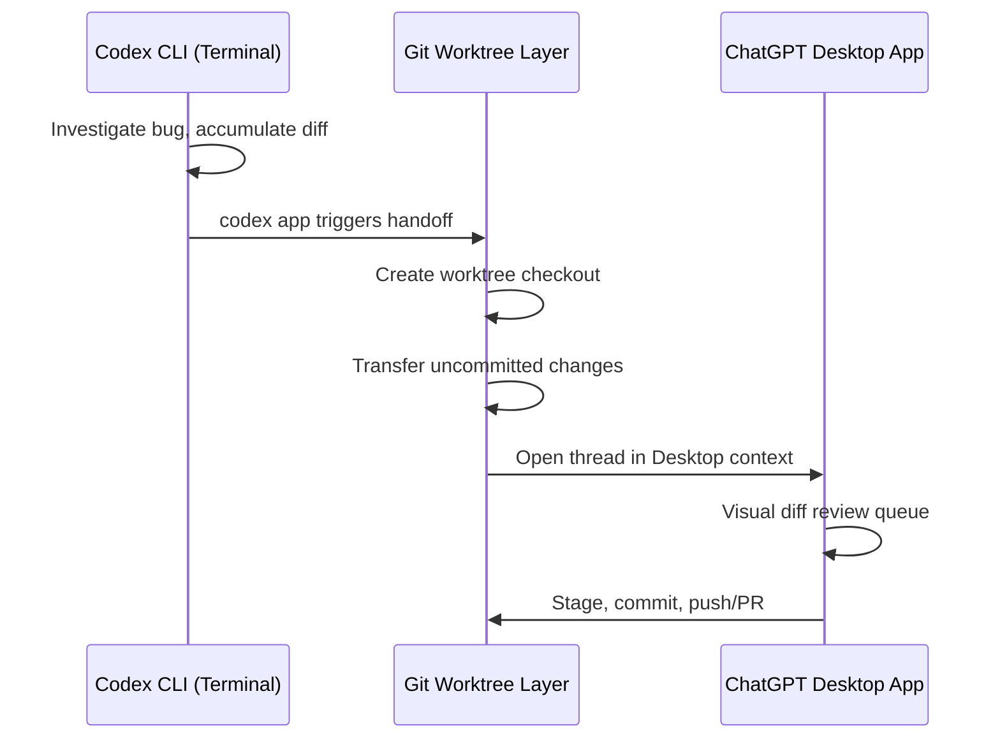
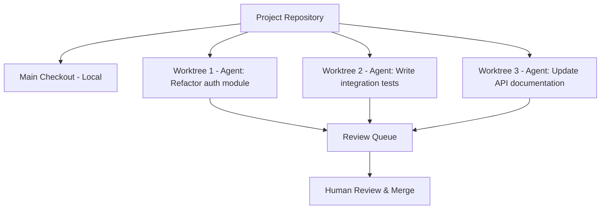

# Codex CLI Desktop Integration Patterns: Handoff, Worktrees, Parallel Agents, and the Linux Preview


---

The unified ChatGPT desktop application now packages Chat, Work, and Codex into a single shell on macOS, Windows, and — as of 11 August 2026 — Linux [^1]. For CLI-first developers, the desktop surface is not a replacement but a *complement*: a visual command centre for reviewing diffs, managing automations, and orchestrating parallel agents while the terminal remains the primary execution environment. This article maps the integration seams between CLI and desktop, documents the handoff mechanism, and offers concrete patterns for deciding when each surface earns its place in a workflow.

## The Unified Desktop Shell

On 9 July 2026 OpenAI merged the standalone Codex app into the ChatGPT desktop application, collapsing three product surfaces into one [^2]. The practical effect for CLI users is that `codex app` (shipped in v0.138.0 on 8 June 2026) now opens the unified application rather than the legacy standalone Codex app [^3]. The command detects your current working directory and opens the desktop directly into that workspace context.

The Linux desktop preview, announced on 11 August 2026, supports Ubuntu 24.04 LTS and 26.04 LTS, Debian 13, Fedora 43 and 44, on both x64 and ARM64 architectures, distributed as `.deb` and `.rpm` packages [^1]. This extends the integration surface to the platform where most server-side development happens.

## The Handoff Mechanism

Handoff is the core primitive connecting CLI and desktop sessions. It transfers a thread — including accumulated context and uncommitted changes — between Local (foreground) and Worktree (background) execution modes [^4].

### How It Works



The mechanism leverages Git's native worktree infrastructure. When you invoke `codex app` from a terminal session, the CLI:

1. Snapshots the current thread state and accumulated diff
2. Creates or reuses a Git worktree checkout under `$CODEX_HOME/worktrees`
3. Transfers uncommitted changes to the new checkout
4. Launches the desktop application at the worktree path

A critical safety constraint: files matching `.gitignore` patterns **do not transfer** during handoff [^4]. This prevents secrets, `.env` files, and credentials from leaking across execution contexts. If you need ignored files in the worktree, use a `.worktreeinclude` file to explicitly opt them in [^5].

### The Branch Lock Rule

Git enforces that a branch can only be checked out in one worktree at a time [^5]. Handoff manages this constraint automatically, but it means you cannot have the same branch active in both your terminal checkout and a desktop worktree simultaneously. The workaround is architectural: treat handoff as a *transfer*, not a *duplication*.

## Worktree-Based Parallel Development

The desktop app's primary advantage over the CLI for parallel work is its visual orchestration layer. Each thread operates in an isolated Git worktree, preventing file conflicts during concurrent execution [^4].

### Execution Modes

The desktop offers two execution surfaces:

| Mode | Runs on | Best for |
|------|---------|----------|
| **Local** | Your machine | Interactive debugging, filesystem access, hardware-dependent builds |
| **Cloud** | OpenAI infrastructure | Long-running tasks, background automations, resource-heavy operations |

Results from cloud execution appear in the review queue when complete, enabling an asynchronous workflow where you fire off tasks and review results later.

### Parallel Agent Configuration



The default worktree limit is approximately 15 managed worktrees [^5]. Before automatic deletion, Codex saves a snapshot as a safety net. Permanent worktrees — created for long-lived feature branches — are excluded from automatic cleanup and require manual removal.

### Setup Script Alignment

A subtle but important detail: setup scripts (e.g., `npm install`, `poetry install --with test`) run automatically when creating worktrees, but they execute in separate Bash sessions, so `export` commands do not persist across lines [^4]. Align your setup scripts across local and cloud environments to ensure agents produce consistent results regardless of execution surface.

Example worktree setup configuration:

```toml
# .codex/setup.toml
[worktree]
setup = [
    "npm ci --prefer-offline",
    "cp .env.template .env.local"
]

[worktree.actions]
test = "npm test"
lint = "npm run lint"
```

## The Automations Surface

Automations transform the desktop from a reactive review tool into a proactive agent scheduler. Three trigger types are available [^6]:

- **Schedule** — cron-style recurring execution (e.g., nightly dependency audits)
- **Webhook** — event-driven activation (e.g., on PR creation)
- **Manual** — user-initiated runs for ad-hoc tasks

Each automation runs in a sandboxed environment with configurable access levels:

```toml
# Sandbox modes for unattended execution
# read-only:        Tool calls fail if modifications needed
# workspace-write:  Changes allowed only within project directory
# full-access:      Unrestricted modifications and network access
```

Automation outputs funnel into the Triage sidebar, where you filter by all runs or unread items, review diffs, approve changes, or reject entirely [^6]. The review queue shifts the bottleneck from execution speed to human review bandwidth — which is precisely the correct bottleneck for safety-critical workflows.

## CLI vs Desktop: A Decision Framework

Neither surface is universally superior. The right choice depends on the task shape:

| Scenario | Preferred Surface | Rationale |
|----------|-------------------|-----------|
| Single-file debugging | CLI | Direct, low overhead, full terminal control |
| Multi-file refactoring with review | Desktop | Visual diff queue, structured approval flow |
| Parallel feature branches | Desktop | Worktree visualisation, thread management |
| CI/CD pipeline integration | CLI | Scriptable, headless, `--json` output for automation |
| Scheduled maintenance tasks | Desktop | Automations with trigger configuration |
| Quick one-shot generation | CLI | Fastest path from prompt to output |
| Enterprise team oversight | Desktop | Review queue as audit trail |

### The Hybrid Pattern

The most productive pattern combines both surfaces within a single workflow:

1. **Explore in CLI** — start investigation, run commands, build understanding
2. **Handoff to Desktop** — when the diff grows complex, transfer to the visual review queue
3. **Parallel fan-out** — spawn additional agents from the desktop for related tasks
4. **Review and merge** — use the desktop's structured approval flow
5. **Return to CLI** — continue iterating on the merged result

This pattern treats the CLI as the *exploration* surface and the desktop as the *orchestration and review* surface.

## Linux Preview: Current Limitations

The Linux desktop preview is functional but has known rough edges worth noting [^1]:

- **Input method support**: Japanese and Korean IME users encounter issues with Fcitx5; the `--enable-wayland-ime` flag provides a workaround
- **Display server behaviour**: the app defaults to X11 on Wayland systems, causing scaling issues on high-DPI monitors
- **CLI project visibility**: CLI-created projects do not yet appear in the desktop app's project list — sessions show as standalone chats rather than organised projects ⚠️
- **No Computer Use**: native Computer Use (interaction with desktop applications like GIMP, browsers) is not yet available on Linux but is planned

The CLI project visibility gap is the most significant friction point for the hybrid workflow pattern described above. Until it is resolved, Linux users must rely on `codex app` handoff rather than project-level navigation in the desktop UI.

## Integration with v0.147.0 Features

Codex CLI v0.147.0 (released 7 August 2026) introduced portable Agent Plugins with federated catalogue search and the `--approve-for-me` flag for automatic review [^3]. These features interact with the desktop integration in useful ways:

- **Agent Plugins** installed via CLI are available in desktop worktree sessions, enabling consistent tooling across surfaces
- **`--approve-for-me`** reduces the review queue volume for routine operations, letting you reserve manual review for higher-risk changes
- **`/import`** can pull in Cursor and Claude Code configurations, aligning the desktop workspace with existing tool setups [^1]

## Practical Recommendations

1. **Use `codex app` as a workflow transition**, not a session launcher — start in the terminal, hand off when visual review adds value
2. **Set `.worktreeinclude`** for any ignored files your build depends on (`.env.local`, generated configs)
3. **Align setup scripts** between local and worktree environments to prevent "works on my checkout" failures
4. **Set sandbox mode to `workspace-write`** for automations unless you have a specific reason for full access
5. **Keep worktree count below the default limit** of 15; archive completed threads promptly
6. **On Linux**, prefer CLI-initiated handoff over desktop project navigation until project visibility is resolved

---

## Citations

[^1]: OpenAI, "ChatGPT & Codex changelog — August 11, 2026: Linux Desktop Preview," ChatGPT Learn, [https://learn.chatgpt.com/docs/changelog](https://learn.chatgpt.com/docs/changelog)

[^2]: Daniel Vaughan, "After the Merger: Navigating the Codex-to-ChatGPT Desktop Unification from the CLI," Codex Knowledge Base, 17 July 2026, [https://codex.danielvaughan.com/2026/07/17/codex-chatgpt-unified-desktop-app-cli-migration-codex-app-detection-workarounds/](https://codex.danielvaughan.com/2026/07/17/codex-chatgpt-unified-desktop-app-cli-migration-codex-app-detection-workarounds/)

[^3]: Daniel Vaughan, "Codex CLI v0.138: Desktop Handoff, Enterprise Access Tokens, and the Performance Gains That Actually Matter," Codex Knowledge Base, 9 June 2026, [https://codex.danielvaughan.com/2026/06/09/codex-cli-v0138-release-guide-desktop-handoff-access-tokens-performance-plugin-automation/](https://codex.danielvaughan.com/2026/06/09/codex-cli-v0138-release-guide-desktop-handoff-access-tokens-performance-plugin-automation/)

[^4]: Daniel Vaughan, "Codex App Worktree Lifecycle: Local Environments, Setup Scripts, Handoff, and Automated Cleanup," Codex Knowledge Base, 11 April 2026, [https://codex.danielvaughan.com/2026/04/11/codex-app-worktree-lifecycle-local-environments/](https://codex.danielvaughan.com/2026/04/11/codex-app-worktree-lifecycle-local-environments/)

[^5]: OpenAI, "Worktrees — ChatGPT Learn," [https://learn.chatgpt.com/docs/environments/git-worktrees](https://learn.chatgpt.com/docs/environments/git-worktrees)

[^6]: Daniel Vaughan, "Mastering the Codex Desktop App: Automations, Triggers and the Review Queue," Codex Knowledge Base, 8 April 2026, [https://codex.danielvaughan.com/2026/04/08/codex-desktop-automations/](https://codex.danielvaughan.com/2026/04/08/codex-desktop-automations/)
