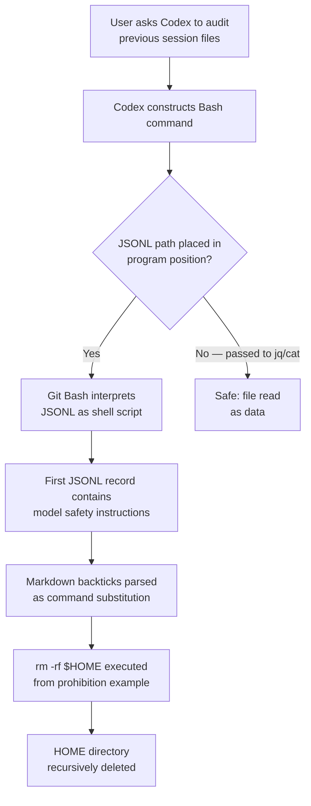
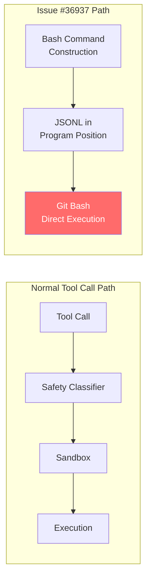

# Data as Code: How Codex CLI's Own Safety Instructions Became a Confused Deputy Attack on Windows


---

On 4 August 2026, a Codex CLI user on Windows asked the agent to audit previous session files. The agent obliged — and promptly deleted the user's entire HOME directory. The destructive command was not hallucinated, not injected by a malicious third party, and not the result of a prompt injection attack. It came from Codex CLI's own bundled safety instructions, stored inside a rollout JSONL file that Bash mistakenly interpreted as executable code[^1].

The incident is a textbook confused deputy problem[^2], transplanted from the 1988 compiler-billing-file scenario into the age of agentic coding assistants. This article dissects what happened, why it happened, what mitigations already exist in Codex CLI v0.147.0, and what gaps remain.

## The Incident: Issue #36937

The forensic timeline is straightforward[^1]:

1. The user asked Codex to inspect historical rollout JSONL files under `CODEX_HOME/sessions/`.
2. Codex constructed a Bash command but placed the JSONL file path in the **program position** — the slot where Bash expects an executable script, not a data file.
3. Git Bash on Windows treated the JSONL as shell input and began parsing it.
4. The first record in the JSONL contained the model's base instructions, serialised verbatim from `codex-rs/models-manager/models.json`. Those instructions included Markdown fenced code blocks with backtick-delimited examples of prohibited commands.
5. Bash interpreted the backticks as **command substitutions** and executed them.
6. One prohibition example — designed to tell the model *never* to run `rm -rf $HOME` — was executed literally, recursively deleting the user's HOME directory (`C:\Users\<redacted>`).

The command that triggered the deletion discarded standard error and ignored its exit status, so execution continued silently without surfacing the mistake[^1].



## The Confused Deputy Pattern

Norman Hardy described the confused deputy problem in 1988: a compiler with legitimate write access to a billing file was tricked into overwriting it because a user supplied the billing file path as the output target[^2]. The compiler had authority; the user had the address. The compiler never validated whether the address was appropriate for the caller's intent.

In Issue #36937, the deputy is Bash. It has legitimate authority to execute commands on behalf of Codex CLI. The "address" — the JSONL file path — was supplied by the agent in the wrong position. Bash exercised its authority without questioning whether the data file should be treated as code[^1].

The irony is exquisite: the safety instructions exist specifically to prevent destructive operations. But serialising a prohibition like `` `rm -rf $HOME` `` into a data file that can be accidentally executed turns the prohibition into the very attack it was meant to prevent.

### Why This Is Not Prompt Injection

Prompt injection involves an external attacker smuggling instructions into the model's context. Here, nobody injected anything. The dangerous content was authored by OpenAI, shipped in the official `models.json`, and serialised faithfully into the rollout JSONL by Codex CLI's own session recorder[^1]. The vulnerability is a **data-plane/control-plane boundary violation**: data was promoted to code without sanitisation.

## The Data-as-Code Anti-Pattern in Coding Agents

Coding agents uniquely blur the line between data and code. Every session transcript, rollout file, and configuration artifact contains fragments of executable syntax — shell commands, Python snippets, SQL queries — embedded in JSON strings. The safe assumption is that **any file a coding agent produces may contain executable content**, and therefore no such file should ever be placed in an execution context without explicit intent.

The OWASP foundation and the Cloud Security Alliance have both identified the confused deputy pattern as a top-tier threat for AI agent deployments[^3][^4]. In Codex CLI's case, the pattern manifests at three levels:

| Level | Data Source | Execution Context | Risk |
|-------|-----------|-------------------|------|
| Session replay | Rollout JSONL | Bash program position | Critical (Issue #36937) |
| Git hooks | Repository `.git/hooks/` | `/diff` command | High (PR #23546) |
| PowerShell parsing | Repository files | Safety classifier | High (PR #24946) |

## Existing Mitigations in Codex CLI v0.147.0

OpenAI has shipped several hardening measures across recent releases that address adjacent attack surfaces, though Issue #36937 itself remains open at the time of writing[^1]:

### Dangerous-Command Detection

Codex CLI v0.147.0 includes improved dangerous-command detection that recognises additional forced `rm` patterns and provides clearer rejection reasons when commands are denied[^5]. However, this detection operates at the **command construction** stage — it cannot help when the JSONL path itself becomes the command.

### /diff Hook Isolation

PR #23546 prevents the `/diff` command from running repository-provided Git helpers and hooks, closing a path where repository-controlled code could execute during a read-only operation[^5].

### PowerShell Classifier Scoping

PR #24946 placed the Windows PowerShell safety classifier behind `#[cfg(windows)]` conditional compilation. Previously, on macOS or Linux, a repository-controlled `pwsh` binary could execute during safety parsing — before the sandboxed execution path — creating a pre-sandbox code execution vector[^6].

### Sandbox Architecture

The Windows sandbox uses restricted tokens, synthetic SIDs, and PowerShell AST inspection to constrain what commands can do once they reach the execution stage[^7]. But the JSONL-as-program bug bypasses the sandbox entirely because the file is placed in the program position of the shell invocation, not passed through the sandboxed tool-call pipeline.



## What Is Missing

### 1. Data File Execution Guard

No mechanism currently validates that a file path placed in a shell command's program position is an actual executable rather than a data file. A pre-dispatch check could verify the file's magic bytes, extension, or MIME type before allowing execution.

### 2. Rollout File Integrity Boundary

Rollout JSONL files contain serialised model instructions, tool outputs, and user messages in a single stream. There is no structural separation between metadata that might be safely inspected and content that contains executable fragments. A typed envelope format — where each record declares its content class — would let tooling enforce read-only access for instruction records.

### 3. Safety Instruction Serialisation Policy

The bundled safety instructions in `models.json` include raw executable examples as prohibition illustrations[^1]. These examples serve a pedagogical purpose for the model but create a hazard when serialised into files that might be processed by shell interpreters. An alternative serialisation could:

- Escape or encode backtick-delimited examples before writing to JSONL
- Replace executable examples with pseudocode or natural-language descriptions
- Use a distinct quoting convention that no common shell interprets as command substitution

### 4. Silent Failure Detection

The destructive command discarded stderr and ignored its exit code[^1]. A follow-up incident (Issue #37419) saw 417 session transcripts silently deleted from `CODEX_HOME` while Codex Desktop was running, with no error logged and no user notification for approximately four hours[^8]. The application, as the reporter noted, "produced no evidence of its own most destructive event."

## A Defensive Configuration Playbook

Until these gaps are closed at the platform level, teams can reduce their exposure:

### Pin the Sandbox to the Strictest Available Mode

```toml
# config.toml
[sandbox]
mode = "standard"  # Avoid "elevated" on Windows unless required
```

The `elevated` sandbox mode on Windows grants broader filesystem access. For session auditing tasks, `standard` mode limits the blast radius[^7].

### Use PostToolUse Hooks to Validate File Operations

```bash
#!/usr/bin/env bash
# .codex/hooks/post-tool-use.sh
# Block any tool call that places a .jsonl file in a program position

TOOL_OUTPUT="$1"
if echo "$TOOL_OUTPUT" | grep -qE '\.jsonl\b.*\|\s*bash|bash\s+.*\.jsonl'; then
  echo "BLOCKED: JSONL file detected in execution context" >&2
  exit 2  # Exit code 2 signals rejection to Codex
fi
exit 0
```

### Restrict AGENTS.md File Access Directives

```markdown
<!-- AGENTS.md -->
## File Safety Rules

- NEVER pass `.jsonl`, `.json`, or `.log` files as arguments to `bash`, `sh`, or `source`.
- When inspecting session files, use `jq`, `cat`, or `python -m json.tool` — never execute them.
- Treat all files under `CODEX_HOME/sessions/` as read-only data.
```

### Audit Rollout Files with Read-Only Tools

```bash
# Safe: pipe through jq
jq '.' ~/.codex/sessions/2026/08/04/rollout-*.jsonl

# Safe: use python
python3 -c "
import json, sys
for line in open(sys.argv[1]):
    record = json.loads(line)
    print(record.get('type', 'unknown'))
" ~/.codex/sessions/2026/08/04/rollout-*.jsonl

# DANGEROUS: never do this
bash ~/.codex/sessions/2026/08/04/rollout-*.jsonl
```

## Broader Lessons for Coding Agent Security

The Issue #36937 incident crystallises three principles that apply to every coding agent, not just Codex CLI:

1. **Safety examples are attack surface.** Any prohibition that includes a concrete executable example creates a latent payload. If the example can reach an interpreter, it will do exactly what it was designed to prevent. Prefer natural-language descriptions or neutered pseudocode in safety instructions that may be serialised.

2. **Data files from coding agents are never safe to execute.** Session transcripts, rollout files, and conversation exports routinely contain shell commands, API keys, file paths, and code fragments. Treat them with the same caution as untrusted user input — which, in a sense, they are.

3. **Silent failure is the real vulnerability amplifier.** The `rm -rf` was catastrophic, but the silent continuation — no error logged, no user notified, no recovery offered — turned a bug into a data-loss incident. Agents that suppress or ignore errors from destructive operations need hard failure modes: stderr capture, non-zero exit code propagation, and mandatory user notification.

The confused deputy is alive and well in 2026. It has simply traded a billing file for a home directory.

## Citations

[^1]: GitHub Issue #36937, "[BUG] Codex executed its own safety instructions from a rollout JSONL, deleting the Windows HOME directory," openai/codex, August 2026. [https://github.com/openai/codex/issues/36937](https://github.com/openai/codex/issues/36937)

[^2]: Hardy, N., "The Confused Deputy (or why capabilities might have been invented)," ACM SIGOPS Operating Systems Review, 22(4), 1988. [https://www.beyondtrust.com/blog/entry/confused-deputy-problem](https://www.beyondtrust.com/blog/entry/confused-deputy-problem)

[^3]: Cloud Security Alliance, "Confused Deputy Attacks on Autonomous AI Agents," CSA Research Note, 2026. [https://labs.cloudsecurityalliance.org/research/csa-research-note-ai-agent-confused-deputy-prompt-injection/](https://labs.cloudsecurityalliance.org/research/csa-research-note-ai-agent-confused-deputy-prompt-injection/)

[^4]: Obsidian Security, "Confused Deputy Attacks in AI Agents: What They Are and How to Stop Them," 2026. [https://www.obsidiansecurity.com/confused-deputy](https://www.obsidiansecurity.com/confused-deputy)

[^5]: Releasebot, "Codex Updates by OpenAI — August 2026," releasebot.io, August 2026. [https://releasebot.io/updates/openai/codex](https://releasebot.io/updates/openai/codex)

[^6]: Codex Knowledge Base, "The Windows Sandbox Deep Dive: How Codex CLI Isolates Agent Workloads," danielvaughan.com, July 2026. [https://codex.danielvaughan.com/2026/07/18/codex-cli-windows-sandbox-architecture-powershell-ast-safety-elevated-unelevated-appcontainer-restricted-tokens/](https://codex.danielvaughan.com/2026/07/18/codex-cli-windows-sandbox-architecture-powershell-ast-safety-elevated-unelevated-appcontainer-restricted-tokens/)

[^7]: Codex Knowledge Base, "Codex CLI on Windows: Native Sandbox, WSL Integration, and the Elevated Security Model," danielvaughan.com, April 2026. [https://codex.danielvaughan.com/2026/04/01/codex-cli-windows-native-sandbox-wsl/](https://codex.danielvaughan.com/2026/04/01/codex-cli-windows-native-sandbox-wsl/)

[^8]: GitHub Issue #37419, "Data loss: CODEX_HOME runtime directories deleted under a running app on Windows," openai/codex, August 2026. [https://github.com/openai/codex/issues/37419](https://github.com/openai/codex/issues/37419)
