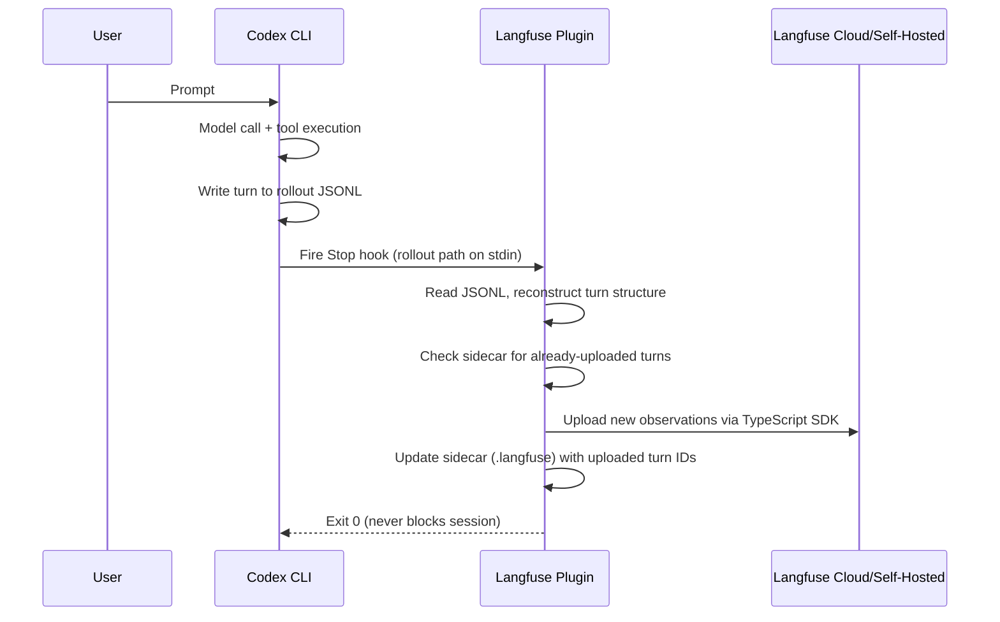

# The Langfuse Codex Observability Plugin: Tracing Agent Turns, Tool Calls, and Token Spend from Your Terminal to a Dashboard


---

Codex CLI sessions produce rollout JSONL files that capture every model response, tool call, and approval decision. The problem is that nobody reads them. They sit in `~/.codex/sessions/` until disk pressure forces a cleanup. Meanwhile, your team has no visibility into what the agent actually did, how much it cost, or why it failed at step fourteen of a twenty-step refactor.

The Langfuse Codex Observability Plugin closes that gap. It reads the same rollout transcripts Codex already writes, converts them into structured traces, and ships them to Langfuse — an open-source observability platform purpose-built for LLM applications [^1]. The result: every agent turn, generation, tool call, and subagent thread appears in a searchable, scorable dashboard within seconds of completion.

This article covers what the plugin captures, how to install and configure it, the trace data model it produces, and the operational patterns that make it worth running in production.

## What the Plugin Captures

The plugin reconstructs five observation types from the rollout JSONL [^2]:

| Observation | Contents |
|---|---|
| **Turn trace** | One per agent turn, from user prompt to final assistant response |
| **Generation** | Each model call within the turn — reasoning tokens, assistant text, tool-call requests, and full token usage breakdown (input, output, cached, reasoning) |
| **Tool span** | Shell commands, `apply_patch`, MCP tool calls, web searches — each with input, output, and error status |
| **Subagent thread** | Spawned agents resolved from their own rollout files and nested under the parent turn |
| **Session** | All turns grouped by Codex session ID for end-to-end replay |

Interrupted turns — where the user cancels mid-generation or a tool times out — are flagged but still uploaded. This matters: the turns you abort are often the ones you most need to debug.

## Architecture: The Stop-Hook Pipeline

The plugin hooks into Codex's lifecycle event system rather than intercepting API calls or injecting middleware. The flow is straightforward:



Two design decisions stand out. First, the plugin reads the rollout *after* the turn completes — it never sits in the hot path of model inference or tool execution [^2]. Second, it maintains a sidecar file (`<rollout>.jsonl.langfuse`) recording which turns have already been uploaded. When you `/resume` a session, the plugin skips completed turns and picks up where it left off. No duplicate traces, no re-upload storms.

The plugin fails safely: tracing errors are logged to stderr but never block the Codex session [^2]. Your coding workflow is never held hostage by an observability outage.

## Installation

Prerequisites: Node.js 22+ and Codex CLI 0.128 or later [^2].

### Step 1: Add the Marketplace and Install

```bash
codex plugin marketplace add langfuse/codex-observability-plugin
codex plugin add tracing@codex-observability-plugin
```

### Step 2: Enable Plugin Hooks

In `~/.codex/config.toml` (or project-scoped `.codex/config.toml`):

```toml
[features]
hooks = true

[plugins."tracing@codex-observability-plugin"]
enabled = true
```

### Step 3: Configure Credentials

Set environment variables — the plugin resolves configuration as defaults → global config → project config → environment, with environment variables winning [^3]:

```bash
export TRACE_TO_LANGFUSE="true"
export LANGFUSE_PUBLIC_KEY="pk-lf-..."
export LANGFUSE_SECRET_KEY="sk-lf-..."
export LANGFUSE_BASE_URL="https://cloud.langfuse.com"
```

Alternatively, use `~/.codex/langfuse.json` for credentials you don't want in your shell profile:

```json
{
  "enabled": true,
  "public_key": "pk-lf-...",
  "secret_key": "sk-lf-...",
  "base_url": "https://cloud.langfuse.com"
}
```

### Step 4: Trust the Hook

Start Codex and run `/hooks` when prompted. Review and trust the Stop hook. This is a one-time step per installation.

### Step 5: Verify

Send two test messages. Check the Langfuse dashboard — both turns should appear as traces within seconds.

## Configuration Reference

The plugin exposes scoped environment variables (`LANGFUSE_CODEX_*`) that take precedence over the standard `LANGFUSE_*` equivalents [^2]:

| Variable | Default | Purpose |
|---|---|---|
| `LANGFUSE_CODEX_ENVIRONMENT` | — | Label traces by environment (dev, staging, prod) |
| `LANGFUSE_CODEX_USER_ID` | Auth email | Override user identifier for team dashboards |
| `LANGFUSE_CODEX_TAGS` | — | JSON array or comma-separated list for filtering |
| `LANGFUSE_CODEX_METADATA` | — | Arbitrary JSON attached to every trace |
| `LANGFUSE_CODEX_MAX_CHARS` | 20000 | Truncation threshold per observation field |
| `LANGFUSE_CODEX_TRACE_SEED` | — | Deterministic trace IDs for CI/headless runs |
| `LANGFUSE_CODEX_DEBUG` | false | Verbose stderr logging for troubleshooting |
| `LANGFUSE_CODEX_FAIL_ON_ERROR` | false | Make hook exit non-zero on tracing failures |

### Region Selection

Langfuse Cloud runs in four regions [^2]:

- **EU**: `https://cloud.langfuse.com`
- **US**: `https://us.cloud.langfuse.com`
- **Japan**: `https://jp.cloud.langfuse.com`
- **HIPAA**: `https://hipaa.cloud.langfuse.com`

Match `LANGFUSE_BASE_URL` to the region where your Langfuse project lives. Mismatched regions are the most common cause of "traces not appearing" reports.

## Deterministic Trace IDs for CI Pipelines

In headless and CI environments, you often need to link a Codex run to a specific dataset item or test case *before* the run completes. The `LANGFUSE_CODEX_TRACE_SEED` variable enables this [^2]:

- Main thread turn N: `hex(sha256("<seed>:<N>")).slice(0, 32)`
- Subagent turn N: `hex(sha256("<seed>:<threadId>:<N>")).slice(0, 32)`

Set a unique seed per session (a commit SHA or CI job ID works well) and you can pre-compute the trace URL for any turn without polling the Langfuse API.

## What You Can Do with the Traces

### Cost Attribution

Langfuse multiplies token counts by its built-in model pricing table and aggregates cost per trace, user, model, and time period [^4]. With GPT-5.6 Sol at \$5/\$30 per million tokens and Luna at \$1/\$6 [^5], knowing which developers are routing work through Sol when Luna would suffice is no longer a guess — it's a dashboard filter.

Tag traces with `LANGFUSE_CODEX_TAGS` to slice cost by project, sprint, or task type.

### Session Debugging

When a Codex session produces wrong output, the Langfuse trace shows the exact sequence: which files were read, which shell commands ran, what the model reasoned about between tool calls, and where it diverged from the expected path. This is materially faster than scrolling through raw JSONL in a text editor.

### Evaluation Scoring

Langfuse supports three scoring methods [^4]: LLM-as-judge (a second model scores accuracy and completeness), exact match against ground-truth test cases, and human annotation through the dashboard UI. Attach scores to Codex traces to build a quality signal over time — particularly useful for tracking whether prompt changes in `AGENTS.md` actually improve output.

### Team Governance

Group traces by `LANGFUSE_CODEX_USER_ID` to build per-developer dashboards. Platform teams can see who is running what, how much it costs, and whether the agent is hitting tool errors at a higher rate for certain repository shapes [^6].

## Known Limitations

The plugin has two structural gaps worth noting:

1. **Session context files are not captured.** Loaded skills, auto-included `AGENTS.md` content, and `MEMORY.md` context do not appear in traces [^6]. You see what the model *produced*, not the full context it was given.

2. **Hook-based tracing is user-disablable.** Developers can turn off the plugin locally. This is a feature for individual use but a limitation for compliance-grade audit requirements. If you need guaranteed capture, you'll need API-level interception rather than client-side hooks [^6].

Additionally, the `LANGFUSE_CODEX_MAX_CHARS` default of 20,000 characters will truncate large tool outputs. For sessions that process big files, consider raising this — but watch Langfuse storage costs.

## Comparison with Raw Rollout Analysis

You could build a similar pipeline from scratch: parse the rollout JSONL, extract turns, compute token costs, and push to your own observability stack. Teams have done this with custom scripts and the `rollout-trace` diagnostic crate [^1]. The Langfuse plugin's advantage is that it ships as a single `dist/index.mjs` bundle that installs in under a minute, handles deduplication and session resume automatically, and gives you Langfuse's dashboard, scoring, and alerting infrastructure without building it yourself.

For teams already using Langfuse for other LLM applications — API services, RAG pipelines, chat products — adding Codex tracing means all your LLM observability lives in one place.

## A Minimal Production Setup

For a team of five running Codex CLI daily, start with this in your shared dotfiles:

```bash
# .env.codex (sourced in shell profile)
export TRACE_TO_LANGFUSE="true"
export LANGFUSE_PUBLIC_KEY="pk-lf-your-key"
export LANGFUSE_SECRET_KEY="sk-lf-your-key"
export LANGFUSE_BASE_URL="https://us.cloud.langfuse.com"
export LANGFUSE_CODEX_ENVIRONMENT="production"
export LANGFUSE_CODEX_TAGS='["team-backend"]'
```

Commit the plugin enablement in your project's `.codex/config.toml` so every clone gets tracing by default:

```toml
[features]
hooks = true

[plugins."tracing@codex-observability-plugin"]
enabled = true
```

After a week, you'll have enough data to answer: which models are we using, how much are we spending, and which session patterns produce the most tool errors. That's the foundation for every optimisation decision that follows.

## Citations

[^1]: Langfuse. "Open-Source LLM Engineering Platform." [https://langfuse.com](https://langfuse.com)
[^2]: Langfuse. "codex-observability-plugin — OpenAI Codex plugin that traces agent turns, tool calls, and subagents to Langfuse." GitHub. [https://github.com/langfuse/codex-observability-plugin](https://github.com/langfuse/codex-observability-plugin)
[^3]: Langfuse. "Trace OpenAI Codex with Langfuse." [https://langfuse.com/integrations/developer-tools/codex](https://langfuse.com/integrations/developer-tools/codex)
[^4]: Langfuse. "Token & Cost Tracking." [https://langfuse.com/docs/observability/features/token-and-cost-tracking](https://langfuse.com/docs/observability/features/token-and-cost-tracking)
[^5]: OpenAI. "GPT-5.6: Frontier intelligence that scales with your ambition." [https://openai.com/index/gpt-5-6/](https://openai.com/index/gpt-5-6/)
[^6]: Langfuse. "Tracing coding agents: Claude Code, Codex, Copilot & more." [https://langfuse.com/resources/engineering/coding-agent-tracing](https://langfuse.com/resources/engineering/coding-agent-tracing)
