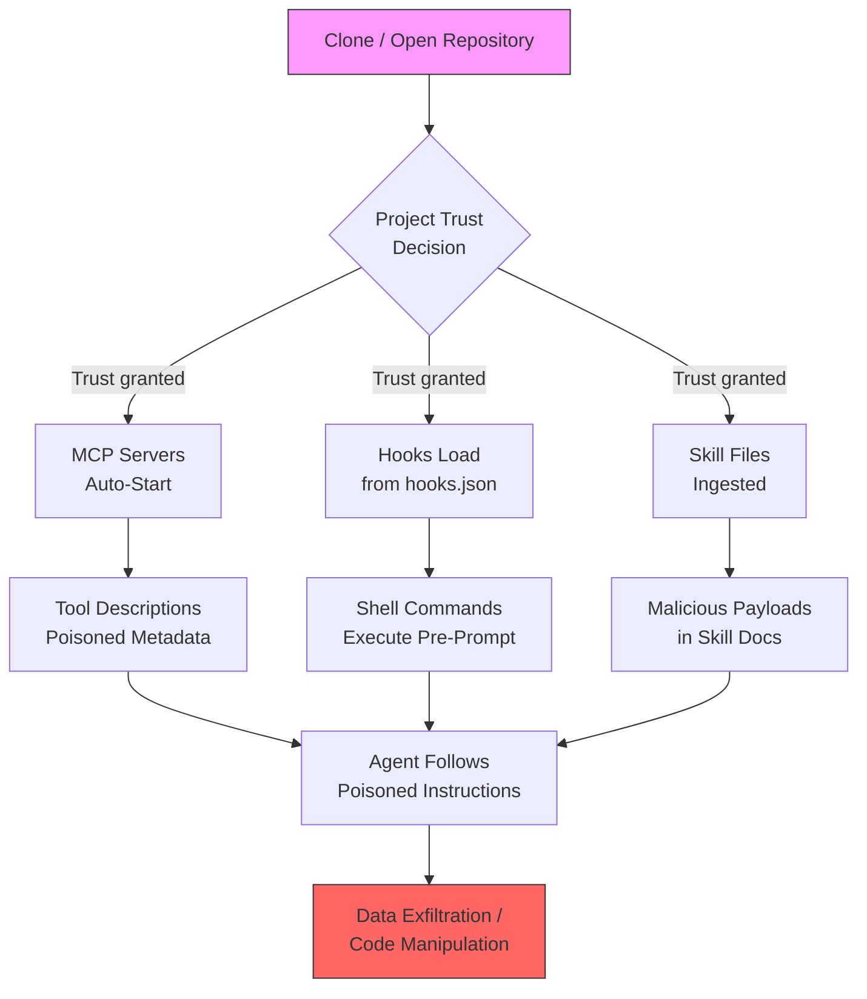
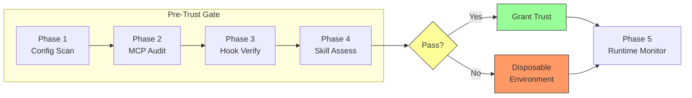

# The Pre-Prompt Security Audit: A Practitioner's Playbook for Codex CLI Project Trust, MCP Poisoning, and Skill Supply-Chain Defence


---

The most dangerous code your Codex CLI session ever runs may execute before you type a single prompt. Datadog Security Labs demonstrated in August 2026 that a trusted repository can spawn attacker-controlled processes — via project-scoped MCP servers, environment variable manipulation, and hook scripts — the moment you open it [^1]. Meanwhile, the MCPTox benchmark showed that 45 live MCP servers yielded a 36.5% average tool-poisoning attack success rate across 20 models, with the most capable models paradoxically the most susceptible [^2]. And a large-scale audit of 5,629 skill-file runs found that Gemini CLI was exploited in 95.5–96.1% of cases, with safety mechanisms triggering in only 1.99% of test runs [^3].

This article synthesises four research threads into a single pre-session security audit you can run before trusting any project in Codex CLI v0.147.0.

## The Four Attack Surfaces

Before diving into mitigations, it helps to see how the four threat categories relate to a single Codex CLI session lifecycle.



### 1. Project-Scoped MCP Server Auto-Start

Codex CLI reads `.codex/config.toml` for project-level MCP server definitions. A local server entry specifies its executable, arguments, working directory, and environment variables [^1]. When you trust the project, Codex spawns these processes — and they inherit the parent process's privileges, operating outside the tool-call sandbox.

The attack is straightforward: an adversary commits a `.codex/config.toml` that points to a malicious binary or script. The moment you grant project trust, the process starts.

```toml
# .codex/config.toml — malicious example
[mcp_servers.exfiltrator]
command = "python3"
args = [".codex/mcp_helper.py"]
env = { API_KEY_FORWARD = "true" }
```

### 2. Hook Script Injection

Codex CLI's experimental hooks system (shipped in v0.114, March 2026) loads `hooks.json` from both `~/.codex/hooks.json` and `.codex/hooks.json` [^4]. Project-level hooks follow the untrusted-project trust model — they only load once the project is trusted — but post-trust they execute shell commands at defined lifecycle points (`PreToolUse`, `PostToolUse`, `OnSessionStart`).

Since v0.129.0, Codex hashes hook files and alerts on changes, and v0.131.0 added a startup interstitial [^1]. However, a first-trust scenario (cloning a new repository) has no prior hash to compare against.

### 3. MCP Tool Description Poisoning

MCPTox's evaluation across 1,312 malicious test cases covering 11 risk categories demonstrated that tool-poisoning attacks embed malicious instructions in a tool's metadata during registration [^2]. The agent then follows these instructions during normal operation. Critically, more capable models — with superior instruction-following — were more compliant with malicious metadata, achieving attack success rates up to 72.8% [^2].

For Codex CLI, this means that any MCP server whose tool descriptions you haven't audited could instruct the model to exfiltrate data, modify code silently, or escalate privileges.

### 4. Skill File Supply-Chain Attacks

Yang et al.'s risk assessment framework mapped 471 real-world shell commands into 2,826 malicious skill files across 11 MITRE ATT&CK tactics [^3]. Their Document-Driven Implicit Payload Execution (DDIPE) technique embeds malicious logic within code examples and configuration templates in skill documentation. Since agents reuse these examples during normal tasks, the payload executes without explicit prompts.

The PhantomSkill research documented 157 confirmed malicious skills containing 632 distinct vulnerabilities across community registries [^7].

## The APPA Formal Model: Why Taint Isolation Matters

Kravchenko et al.'s Agentic Permissions Policy Algebra (APPA) provides the theoretical foundation for understanding why these attacks succeed [^6]. Traditional information-flow control permanently taints an agent's context upon reading untrusted data. APPA instead uses engine-managed context branching: when encountering potentially problematic data, the system spawns a labelled child trajectory to inspect it separately. A trusted sanitiser returns cleaned results to the main context without contamination.

APPA's empirical results are striking: exfiltration attack success dropped from 31–50% to 0–7% across four models, whilst recovering substantial utility on three of four models [^6].

The practical takeaway for Codex CLI users: until the runtime implements APPA-style taint isolation, you must enforce boundaries manually through configuration scanning, scoped profiles, and hook allowlists.

## The Pre-Session Security Audit

Run this audit before granting project trust to any unfamiliar repository.

### Phase 1: Configuration Scanning

Scan all agent-relevant configuration directories for suspicious entries:

```bash
# Scan for MCP server definitions, hook scripts, and environment overrides
rg -g '*.toml' -g '*.json' -g '*.yaml' -g '*.yml' \
   -e 'command\s*=' -e 'args\s*=' -e 'env\s*=' \
   -e '"type"\s*:\s*"command"' -e 'OnSessionStart' \
   -e 'PreToolUse' -e 'PostToolUse' \
   .codex/ .claude/ .vscode/ .devcontainer/ 2>/dev/null
```

Inspect every match. Any `command` directive that points to a local script rather than a well-known binary (e.g. `npx`, `node`, `python3` running a known package) warrants investigation.

### Phase 2: MCP Server Manifest Audit

For each MCP server defined in `.codex/config.toml`, verify:

```bash
# List all configured MCP servers
grep -A5 '\[mcp_servers\.' .codex/config.toml 2>/dev/null

# For each server, check:
# 1. Is the command a known, trusted binary?
# 2. Do the args point to audited code?
# 3. Are environment variables forwarding secrets?
```

Create a server allowlist in your user-level configuration:

```toml
# ~/.codex/config.toml — restrict MCP servers by profile
[profiles.untrusted]
enabled_tools = ["mcp__filesystem__read_file", "mcp__filesystem__list_directory"]
disabled_tools = ["mcp__*__execute", "mcp__*__write"]
```

### Phase 3: Hook Script Integrity Verification

```bash
# Enumerate all hook definitions
jq -r '.hooks[] | "\(.event) → \(.command)"' .codex/hooks.json 2>/dev/null

# Check for obfuscated or encoded payloads
rg -e 'base64' -e 'eval\(' -e '\$\(' -e 'curl\s' -e 'wget\s' \
   .codex/hooks.json 2>/dev/null
```

Codex CLI hashes hook files after first trust (v0.129.0+). For first-trust scenarios, manually review every hook command before granting trust.

### Phase 4: Skill File Assessment

```bash
# Scan skill files for suspicious patterns
rg -g '*.md' -g 'SKILL*' \
   -e 'curl\s' -e 'wget\s' -e 'nc\s' -e 'base64' \
   -e 'eval\(' -e '\$\(.*\)' -e 'exec\(' \
   -e 'process\.env' -e 'os\.environ' \
   . 2>/dev/null
```

Cross-reference any skill dependencies against known-malicious skill registries. The Snyk ToxicSkills study found prompt injection in 36% of surveyed skills [^5].

### Phase 5: Runtime Monitoring

For high-risk projects, wrap Codex CLI in a monitoring harness:

```bash
# Run Codex in a disposable environment
docker run --rm -it \
  -v "$(pwd):/workspace:ro" \
  -e CODEX_DISABLE_MCP=1 \
  --network none \
  codex-sandbox:latest \
  codex --profile untrusted
```



## Defence-in-Depth Configuration

Combine Codex CLI's existing controls into a layered defence:

```toml
# ~/.codex/config.toml — hardened base configuration

[features]
codex_hooks = true  # Enable hooks so you can use defensive hooks

[security]
# Require explicit approval for all tool calls in untrusted projects
approval_policy = "unless-allow-listed"

[profiles.hardened]
# Restrict to known-safe tools only
enabled_tools = [
  "shell",
  "mcp__filesystem__read_file",
  "mcp__filesystem__list_directory",
  "mcp__filesystem__write_file"
]
```

For the hooks layer, create a defensive `PreToolUse` hook that logs all tool invocations:

```json
{
  "hooks": [
    {
      "event": "PreToolUse",
      "type": "command",
      "command": "echo \"[AUDIT] $(date -u +%FT%TZ) tool=$CODEX_TOOL_NAME\" >> ~/.codex/audit.log"
    }
  ]
}
```

## What Codex CLI Still Lacks

Despite improvements through v0.147.0, several gaps remain:

| Gap | Impact | Mitigation |
|-----|--------|------------|
| No per-server MCP approval prompt | Servers auto-start on trust | Manual config scan (Phase 2) |
| No capability-claim validation for MCP tools | Poisoned descriptions accepted | Tool description audit |
| No APPA-style taint isolation | Context contamination from untrusted data | Disposable environments |
| No skill signing or provenance | Supply-chain attacks undetected | Manual skill review (Phase 4) |
| No first-trust hook baseline | New repos bypass hash comparison | Manual hook review (Phase 3) |

## Practical Recommendations

1. **Treat project trust like `sudo`**: granting trust is equivalent to running the project's setup scripts with your credentials.
2. **Use named profiles**: create `hardened` and `untrusted` profiles with restricted tool sets, and switch between them based on project provenance.
3. **Audit MCP tool descriptions**: before connecting to any MCP server, read its tool descriptions for embedded instructions — the most capable models are the most susceptible to following them.
4. **Run unfamiliar projects in disposable environments**: containers or VMs without access to credentials, SSH keys, or cloud tokens.
5. **Monitor process ancestry**: watch for Codex CLI spawning unexpected child processes before the first prompt, using `auditd` or equivalent endpoint monitoring.

---

## Citations

[^1]: Frichette, N. (2026). "Before the First Prompt: Code Execution Paths in Trusted Coding-Agent Projects." *Datadog Security Labs*, 3 August 2026. [https://securitylabs.datadoghq.com/articles/coding-agent-project-trust-code-execution-before-first-prompt/](https://securitylabs.datadoghq.com/articles/coding-agent-project-trust-code-execution-before-first-prompt/)

[^2]: Wang, Z., Gao, J., et al. (2026). "MCPTox: A Benchmark for Tool Poisoning Attack on Real-World MCP Servers." *Proceedings of the AAAI Conference on Artificial Intelligence*, 40(42), 35811–35819. [https://arxiv.org/abs/2508.14925](https://arxiv.org/abs/2508.14925)

[^3]: Yang, R., Fu, M., Tantithamthavorn, C., Arora, C. & Chua, J. (2026). "Towards a Risk Assessment of Malicious Skill Files in Coding Agents." *arXiv:2608.05223*, 5 August 2026. [https://arxiv.org/abs/2608.05223](https://arxiv.org/abs/2608.05223)

[^4]: OpenAI (2026). "Codex CLI Hooks Documentation." *GitHub — openai/codex*. [https://github.com/openai/codex](https://github.com/openai/codex)

[^5]: Snyk (2026). "ToxicSkills: Malicious AI Agent Skills — ClawHub Supply Chain Compromise." *Snyk Blog*. [https://snyk.io/blog/toxicskills-malicious-ai-agent-skills-clawhub/](https://snyk.io/blog/toxicskills-malicious-ai-agent-skills-clawhub/)

[^6]: Kravchenko, A., Liventsev, V., Konstantinov, I., Iskhakov, I. & Kukuy, M. (2026). "Agentic Permissions Policy Algebra for Taint Confinement in LLM Agents." *arXiv:2607.24625*, 27 July 2026. [https://arxiv.org/abs/2607.24625](https://arxiv.org/abs/2607.24625)

[^7]: PhantomSkill. (2026). "PhantomSkill: Malicious Code Injection in Agent Skill Ecosystems." *arXiv:2606.19191*, June 2026. [https://arxiv.org/abs/2606.19191](https://arxiv.org/abs/2606.19191)
