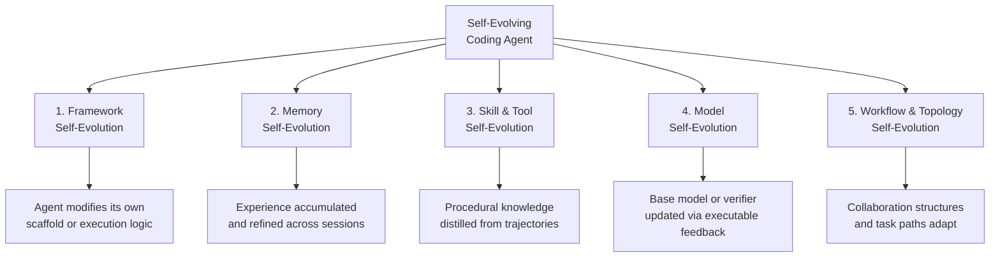
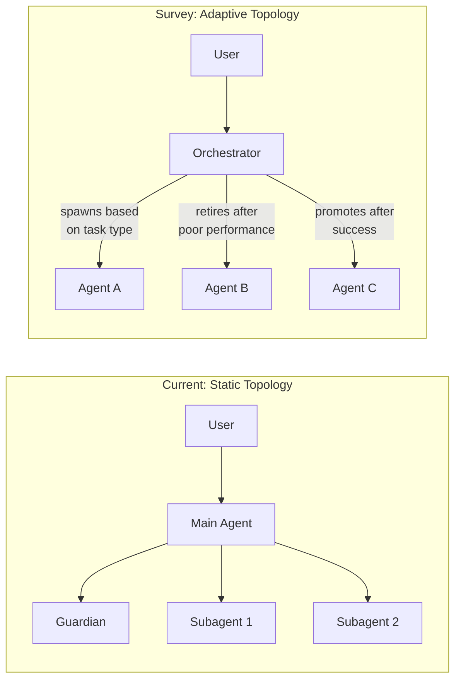

# Self-Evolving Coding Agents: What a Five-Dimension Taxonomy Reveals About Codex CLI's Evolution Gaps


---

Most coding agents ship once and stay frozen. They handle today's repository, today's dependencies, today's test suite — and never learn from the thousand sessions that came before. A new survey by Zhou, Hu, Shang & Zhang (arXiv:2608.03392, August 2026) [^1] provides the first systematic taxonomy of what *self-evolving* coding agents actually change about themselves, when they do it, and what evidence drives the adaptation. The paper analyses over 35 representative systems — from SICA to SWE-Exp to EvoAgentX — and distils five evolution dimensions that separate static agents from self-improving ones.

This article maps those five dimensions onto Codex CLI v0.147.0's current evolution surface: Memories, hooks, Agent Plugins, AGENTS.md, and model configuration. The goal is to identify where Codex CLI already evolves, where it falls short, and what practitioners can build today to close the gaps.

## The five evolution dimensions

The taxonomy organises self-evolution by *what changes* inside the agent:



Each dimension has a distinct feedback loop. Framework evolution rewrites the agent's own code. Memory evolution stores and retrieves experience. Skill evolution distils reusable procedures. Model evolution updates weights or policies. Workflow evolution restructures how agents collaborate [^1].

### Temporal patterns

The survey identifies three timing categories for when evolution occurs:

- **Task-time**: adaptations during active problem-solving (e.g. adjusting strategy mid-session after a test failure)
- **Post-task**: updates after a trajectory completes, consolidating lessons learnt
- **Stage-wise**: broader updates after accumulating evidence across many sessions [^1]

### Evidence sources

Three types of software-specific feedback drive adaptation:

- **Outcome evidence**: pass rates, benchmark scores, resolution success
- **Environmental feedback**: compiler errors, test logs, runtime traces
- **Trajectory-derived evidence**: patterns extracted from complete execution histories [^1]

## Mapping the taxonomy to Codex CLI v0.147.0

### Dimension 1: Framework self-evolution — not supported

Codex CLI does not modify its own execution logic. The Rust-based sandbox, tool dispatch, and conversation loop are compiled artifacts. There is no mechanism for the agent to rewrite its own scaffold.

**Practical mitigation**: AGENTS.md serves as a soft-framework layer. A PostToolUse hook can append directives to AGENTS.md based on observed failures, effectively evolving the agent's behavioural instructions without touching compiled code [^2].

### Dimension 2: Memory self-evolution — partial support

Codex CLI's Memories system (`~/.codex/memories/`) provides the closest analogue to memory self-evolution. After each session, the agent summarises interactions and persists them. On the next session, these summaries are loaded before the system prompt [^3].

What works:
- **Post-task consolidation**: the two-phase pipeline (per-session notes → `memory_summary.md` consolidation) matches the survey's post-task evolution pattern
- **Usage tracking**: `usage_count` and `last_usage` metadata support recency-based retrieval
- **Decay**: `max_unused_days` (default 30) provides automatic pruning [^3]

What is missing:
- **No composite importance scoring**: memories are pruned by recency, not by demonstrated utility. The survey highlights systems like SF-AMS that score memories by semantic salience and retrieval success [^1]
- **No trajectory-derived evidence**: Codex CLI does not analyse execution traces to extract patterns. Memories capture *what the user said*, not *what worked*
- **No validation before storage**: the survey recommends explicit mechanisms to filter unreliable feedback before it enters memory [^1]

### Dimension 3: Skill and tool self-evolution — emerging

Agent Plugins 1.0, shipped in v0.147.0, introduced portable skill packaging with federated catalog search across local, personal, workspace, and remote registries [^4]. This provides the *infrastructure* for skill evolution — but the evolution loop itself is manual.

```toml
# ~/.codex/config.toml — plugin catalog configuration
[plugins]
catalogs = ["local", "personal", "workspace", "remote"]

[plugins.remote]
registry = "https://plugins.openai.com/v1"
```

The survey highlights systems like CODESKILL that automatically distil reusable procedures from successful trajectories. Codex CLI requires a developer to package a plugin, publish it, and install it. There is no automatic skill extraction from session history [^1].

**Practical mitigation**: a PostToolUse hook can log successful tool-call sequences to a trajectory file. A scheduled job can then analyse these trajectories, identify repeated patterns, and generate plugin manifests — approximating automatic skill distillation outside the agent loop.

### Dimension 4: Model self-evolution — not applicable

Codex CLI consumes API-hosted models (currently GPT-5.6 Sol, Terra, and Luna tiers) [^5]. There is no mechanism to fine-tune or update model weights from session feedback. This is architecturally expected for an API-consuming client, but it means the most powerful evolution dimension — where agents like SWE-RL update their own policies from executable test feedback — is structurally unavailable [^1].

**What is available**: model *selection* evolves manually. GPT-5.4 and GPT-5.4-mini are being removed from Codex for ChatGPT sign-in users on 31 August 2026, though the models remain available via the OpenAI API and Codex sessions authenticated with an API key [^5]. For ChatGPT-authenticated users, this requires a configuration migration to GPT-5.6 Terra/Luna. Named profiles in `config.toml` allow per-project model selection, and `model_auto_compact_token_limit` manages context pressure — but none of this constitutes self-evolution.

### Dimension 5: Workflow and topology self-evolution — constrained

Codex CLI supports multi-agent workflows through subagents defined in TOML agent files and the Guardian auto-review system [^2]. However, the workflow topology is static: it does not restructure itself based on task outcomes.



Systems like EvoAgentX and AFlow dynamically spawn, retire, and restructure agent collaborations based on performance evidence. Codex CLI's subagent topology is defined at configuration time and does not adapt at runtime [^1].

## The evolution gap scorecard

| Dimension | Survey expectation | Codex CLI v0.147.0 | Gap |
|-----------|-------------------|-------------------|-----|
| Framework | Agent rewrites own scaffold | AGENTS.md as soft layer | Large |
| Memory | Importance-scored, validated | Recency-pruned summaries | Medium |
| Skill & Tool | Auto-distilled from trajectories | Manual plugin packaging | Medium |
| Model | Fine-tuned from test feedback | API model selection only | Structural |
| Workflow | Adaptive agent topology | Static subagent definitions | Large |

## Building evolution loops with current primitives

The survey's practical recommendations map well to hooks and AGENTS.md:

### 1. Trajectory logging via PostToolUse hooks

```bash
#!/bin/bash
# .codex/hooks/post-tool-use-trajectory.sh
# Log successful tool calls for later skill extraction

TOOL_NAME="$CODEX_TOOL_NAME"
EXIT_CODE="$CODEX_TOOL_EXIT_CODE"
TIMESTAMP=$(date -u +%Y-%m-%dT%H:%M:%SZ)

if [ "$EXIT_CODE" -eq 0 ]; then
  echo "{\"tool\":\"$TOOL_NAME\",\"ts\":\"$TIMESTAMP\",\"success\":true}" \
    >> .codex/trajectories/$(date +%Y-%m-%d).jsonl
fi
```

### 2. Memory validation gate

The survey warns against storing unreliable feedback. A simple validation hook can reject memories that reference failing test suites:

```bash
#!/bin/bash
# Validate memory entries before consolidation
# Run as a scheduled task after sessions

cd ~/.codex/memories/
for f in *.md; do
  if grep -q "FAIL\|ERROR\|broken" "$f"; then
    echo "⚠️  Quarantining potentially unreliable memory: $f"
    mv "$f" quarantine/
  fi
done
```

### 3. AGENTS.md as an evolving directive surface

Rather than static instructions, treat AGENTS.md as a document that evolves based on project history:

```markdown
<!-- AGENTS.md — evolved directives section -->
## Learnt patterns (auto-updated)

- This repo uses pytest with --tb=short; always pass this flag
- The /api/v2/ routes require auth headers; mock them in tests
- Database migrations must run before integration tests

<!-- Last updated: 2026-08-18 by post-session analysis hook -->
```

## Challenges the survey highlights

Three warnings from the survey deserve attention from Codex CLI practitioners:

1. **Benchmark overfitting**: agents that evolve solely to pass SWE-bench may develop brittle strategies that fail on production codebases. The survey found that evolved behaviours often do not transfer beyond their training contexts [^1]

2. **Memory staleness**: accumulated experience can become counterproductive as repositories evolve. The 30-day decay in Codex CLI Memories is a crude defence; the survey recommends active validation against current repository state [^1]

3. **Feedback reliability**: when tests are incomplete or flaky, using test outcomes as evolution evidence can entrench bad patterns. The survey advocates for explicit validation mechanisms before any feedback enters the evolution loop [^1]

## What comes next

The self-evolving coding agents taxonomy exposes a clear direction: coding agents that learn from their own execution history will outperform those that start fresh every session. Codex CLI's Memories and hooks provide the raw materials, but the evolution loops — trajectory analysis, importance scoring, validation gating, topology adaptation — remain the developer's responsibility.

The survey's most pointed observation is that software engineering provides uniquely rich feedback (compilers, test suites, type checkers, linters) that most agents simply discard [^1]. Every `npm test` output, every `cargo check` error, every CI pipeline result is potential evolution evidence. The question is not whether coding agents should self-evolve, but whether your current setup captures and acts on the feedback that is already there.

For a companion article on the related topic of strategic memory forgetting, see the [SF-AMS analysis](2026-08-17-strategic-forgetting-sf-ams-utility-driven-memory-survival-codex-cli-memories-consolidation-hierarchical-retention.md) from the same week.

---

## Citations

[^1]: Zhou, H., Hu, H., Shang, Y. & Zhang, Q. (2026). "Self-Evolving Coding Agents." arXiv:2608.03392. [https://arxiv.org/abs/2608.03392](https://arxiv.org/abs/2608.03392)

[^2]: OpenAI. (2026). "Codex CLI Documentation — AGENTS.md, Hooks, and Subagents." [https://learn.chatgpt.com/docs/cli](https://learn.chatgpt.com/docs/cli)

[^3]: OpenAI. (2026). "Codex CLI Memories — Persistent Context and Session Memory." [https://learn.chatgpt.com/docs/cli/memories](https://learn.chatgpt.com/docs/cli/memories)

[^4]: OpenAI. (2026). "Codex CLI v0.147.0 Release Notes — Agent Plugins, Conversation Sections, approve-for-me." [https://github.com/openai/codex/releases/tag/rust-v0.147.0](https://github.com/openai/codex/releases/tag/rust-v0.147.0)

[^5]: OpenAI. (2026). "Codex CLI Changelog — August 2026." [https://learn.chatgpt.com/docs/changelog](https://learn.chatgpt.com/docs/changelog)

[^6]: Zhou, H. et al. (2026). "Self-Evolving Coding Agents — Full HTML version." [https://arxiv.org/html/2608.03392](https://arxiv.org/html/2608.03392)
