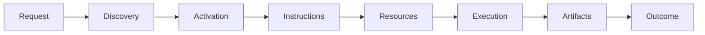
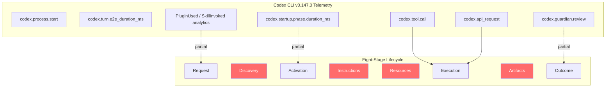

# Skill Lifecycle Observability and the Run Panorama: What Evidence-Calibrated Runtime Reconstruction Reveals About Codex CLI's Plugin Instrumentation Gap


---

## The Invisible Plugin Lifecycle

Codex CLI v0.147.0 ships Agent Plugins 1.0 with a four-tier federated catalogue (local, personal, workspace, remote), MCP 2026-07-28 protocol support, and built-in OpenTelemetry export [^1]. Dynatrace, Langfuse, and Coralogix already ingest Codex traces with zero code changes [^2]. From the outside, plugin observability looks solved.

It is not. A paper published on 9 August 2026 — *Evidence-Calibrated Runtime Reconstruction for Agent Skills Across Heterogeneous Coding Agents* (arXiv:2608.08793) — demonstrates that skill lifecycle boundaries are structurally invisible in current coding-agent telemetry, including Codex CLI's [^3]. Of the three agents evaluated (Codex v0.145.0, OpenCode v1.18.5, Qoder v1.1.10), Codex produced **zero reconstructable Skill runs** across all 42 oracle-validated executions despite emitting syntactically correct OTLP spans. The telemetry exists; the lifecycle semantics do not.

This article unpacks the paper's eight-stage lifecycle model and four-grade evidence taxonomy, maps both to Codex CLI v0.147.0's current instrumentation surface, identifies the specific boundaries missing, and provides a practical hookup strategy for teams that need plugin-level observability today.

---

## The Eight-Stage Skill Lifecycle

The paper formalises a skill's runtime path as eight ordered stages [^3]:



Each stage represents a **failure boundary** — a point where a skill can silently stop progressing without the harness reporting an error:

| Stage | What Happens | Failure Mode |
|-------|-------------|--------------|
| Request | User or agent invokes a skill | Skill name misspelt or absent from catalogue |
| Discovery | Harness locates the skill manifest | Catalogue tier precedence shadow |
| Activation | Runtime loads the skill into the session | Dependency conflict, sandbox restriction |
| Instructions | Skill's prompt or AGENTS.md fragment is injected | Context budget exceeded, truncation |
| Resources | Referenced files, MCP servers, or data are loaded | Missing resource, network block |
| Execution | Skill logic runs (tool calls, code generation) | Tool failure, model error |
| Artifacts | Outputs are produced (files, diffs, messages) | Partial write, corruption |
| Outcome | Result is verified against success criteria | No verifier, false-positive pass |

The critical insight is that **progressive loading** — the pattern where each stage gates the next — creates compound failure modes poorly captured by session-level or tool-level traces [^3]. A plugin can be discovered but never activated, activated without its instructions loaded, or executed without its outcome verified.

---

## The Run Panorama: Four Evidence Grades

Traditional observability treats all telemetry as equivalent. The paper introduces the **Run Panorama**, a four-grade evidence taxonomy that classifies every claim about a skill run by its epistemic foundation [^3]:

| Grade | Definition | Example |
|-------|-----------|---------|
| **Observed** | Directly present in source records or external verification | File hash, OTLP span timestamp |
| **Derived** | Deterministic transformation over observed records | Stage transition computed from ordered events |
| **Inferred** | Uncertain heuristic or model explanation | LLM-generated diagnosis of a failure cause |
| **Experimental** | Cross-run controlled-trial estimate | Success rate from fault-injection matrix |

The separation enforces a rule the paper calls **grade immutability**: an inferred diagnosis can never silently promote to an observed fact, and a model's explanation cannot overwrite a deterministic derivation [^3]. This matters because third-party observability tools (Langfuse, Dynatrace) currently mix these grades — a model's self-reported "success" sits alongside a verified file diff with no epistemic distinction.

---

## What the Evaluation Found

The study evaluated 126 executions across six frozen repository profiles (Go, Python, specification, and skill-catalogue projects), three coding agents, and seven conditions (one clean, six fault-injected: instruction failure, missing resource, execution failure, artifact corruption, unverified outcome, verifier conflict) [^3].

### Adapter Divergence

The three agents produced radically different measurement surfaces:

| Agent | Skill Runs Reconstructed | Failure Events in Fault Cells | False Events in Clean Cells |
|-------|------------------------|-----------------------------|-----------------------------|
| Codex v0.145.0 | 0/42 | N/A | N/A |
| OpenCode v1.18.5 | 42/42 | 0/24 | 0/6 |
| Qoder v1.1.10 | 42/42 | 24/24 | 6/6 |

Codex emitted OTLP spans for tool calls and API requests but **no skill-scoped lifecycle events** — the spans could not be grouped into skill-level boundaries [^3]. OpenCode achieved full reconstruction but reported zero failure-like events across all 24 fault-injected cells, meaning its lifecycle tracking had no diagnostic value. Qoder reported failure-like events in all cells, including the six clean ones, producing systematic false positives.

The paper's verdict: **"Event presence therefore cannot be interpreted as faithful boundary semantics"** [^3].

### Diagnostic Quality

Using Qwen3.6-35B-A3B as the diagnostic model:

- **Raw telemetry view**: 72/126 exact diagnoses, but 18/18 false-positive failure statuses on clean cases
- **Panorama view** (evidence-graded): 82/126 exact diagnoses, **0/18 false positives** on clean cases
- **Known-rule graph** (deterministic): 126/126 contract compliance
- **Graph + model** (hybrid): 125/126 exact, but only 89/126 with valid citation entailment [^3]

The Panorama view's elimination of all clean-case false positives demonstrates that evidence grading is not academic — it directly prevents misdiagnosis in production observability.

---

## Mapping to Codex CLI v0.147.0

Codex CLI's current telemetry surface, while mature for session-level observability, maps poorly to the eight-stage lifecycle:



### What Codex Tracks

- **`codex.tool.call`** and **`codex.api_request`** cover the Execution stage but conflate plugin-originated calls with user-originated ones [^1]
- **`PluginUsed`** and **`SkillInvoked`** analytics events capture Request intent but use deduplication logic that collapses repeated invocations [^1]
- **`codex.guardian.review`** partially covers Outcome but only for security-review decisions, not skill-defined success criteria [^1]
- **`codex.startup.phase.duration_ms`** captures Activation timing for the session, not per-plugin [^1]

### What Codex Does Not Track

1. **Discovery boundaries** — which catalogue tier resolved the plugin, whether shadowing occurred, whether deferred loading was used
2. **Instruction injection** — whether the skill's AGENTS.md fragment was loaded, whether `project_doc_max_bytes` truncated it, whether compaction evicted it mid-session
3. **Resource availability** — whether MCP servers declared by the plugin started successfully, whether referenced files were found
4. **Artifact integrity** — whether outputs matched the skill's declared artifact schema, whether partial writes occurred
5. **Evidence grades** — all telemetry is implicitly Observed-grade; there is no mechanism to distinguish deterministic facts from model assertions

The Langfuse observability plugin illustrates the downstream effect: it captures "one trace per turn" with tool inputs/outputs, token usage, and error flags, but has **no skill-scoped grouping** and truncates inputs/outputs to 20,000 characters by default [^4]. The lifecycle is invisible at every integration layer.

---

## The Deterministic Core, Probabilistic Edge

The paper argues for a specific architectural principle: **"deterministic core, probabilistic edge"** [^3]. Versioned rules own formalised relations (stage transitions, evidence grades, contract compliance). Models propose novel diagnostics and rank candidates. But reviewed patterns must graduate into versioned rules, not remain as model-generated explanations.

This principle maps directly to Codex CLI's existing hook architecture:

- **PostToolUse hooks** (deterministic core): can enforce stage-boundary assertions with exit code 2 to block progression [^1]
- **Guardian auto-review** (probabilistic edge): can assess whether a skill's outcome meets intent, but its verdict should be tagged as Inferred-grade, not Observed [^1]

The paper's known-rule graph achieved 126/126 contract compliance because its rules were versioned and deterministic [^3]. The hybrid graph+model approach achieved 125/126 exactness but only 89/126 citation entailment — meaning 36 model-generated explanations cited evidence that did not actually entail the conclusion [^3]. For production observability, this distinction matters: a Guardian review that reports "skill succeeded" is an Inferred claim unless corroborated by a deterministic PostToolUse assertion.

---

## Practical Instrumentation Strategy

Until Codex CLI ships native lifecycle spans, teams can approximate the eight-stage model using hooks and structured logging.

### Stage-Boundary Hooks in config.toml

```toml
[hooks.on_session_start]
command = "python3 ~/.codex/hooks/skill-lifecycle-tracker.py session-start"

[hooks.on_tool_use.post]
command = "python3 ~/.codex/hooks/skill-lifecycle-tracker.py post-tool $TOOL_NAME $EXIT_CODE"

[hooks.on_session_end]
command = "python3 ~/.codex/hooks/skill-lifecycle-tracker.py session-end"
```

### Evidence-Graded Structured Log Schema

```json
{
  "schema_version": "1.0.0",
  "skill_id": "lint-and-fix",
  "session_id": "abc-123",
  "stage": "Activation",
  "evidence_grade": "Observed",
  "timestamp": "2026-08-18T10:30:00Z",
  "payload": {
    "catalogue_tier": "workspace",
    "manifest_hash": "sha256:9f86d08...",
    "shadowed_by": null
  }
}
```

### Discovery Boundary via Plugin Search Wrapper

A PostToolUse hook on MCP tool search can capture which catalogue tier resolved a plugin and whether shadowing occurred:

```bash
#!/bin/bash
# hooks/discovery-boundary.sh
# PostToolUse hook for plugin discovery tracking

TOOL_NAME="$1"
if [[ "$TOOL_NAME" == "codex_plugin_search" ]]; then
  jq -n \
    --arg stage "Discovery" \
    --arg grade "Observed" \
    --arg tier "$(cat /tmp/last-plugin-tier 2>/dev/null || echo 'unknown')" \
    '{stage: $stage, evidence_grade: $grade, catalogue_tier: $tier}' \
    >> ~/.codex/skill-lifecycle.jsonl
fi
```

### Outcome Verification Gate

```bash
#!/bin/bash
# hooks/outcome-verifier.sh
# PostToolUse hook that checks skill-declared success criteria

SKILL_MANIFEST=".codex/plugins/$SKILL_ID/manifest.json"
if [[ -f "$SKILL_MANIFEST" ]]; then
  EXPECTED_ARTIFACTS=$(jq -r '.artifacts[]' "$SKILL_MANIFEST")
  MISSING=0
  for artifact in $EXPECTED_ARTIFACTS; do
    [[ -f "$artifact" ]] || MISSING=$((MISSING + 1))
  done

  if [[ $MISSING -gt 0 ]]; then
    echo "Outcome verification failed: $MISSING artifacts missing" >&2
    exit 2  # Block progression
  fi
fi
```

---

## Gap Analysis

| Capability | Run Panorama | Codex CLI v0.147.0 | Gap |
|-----------|-------------|-------------------|-----|
| Eight-stage lifecycle tracking | Full | Execution stage only | No Discovery, Instructions, Resources, Artifacts boundaries |
| Evidence grades | Four-tier taxonomy | Implicit Observed only | No grade metadata on spans or analytics |
| Per-skill span grouping | Skill-run scoped | Turn-scoped | Cannot attribute tool calls to specific plugins |
| Failure boundary detection | Six fault types validated | Exit code propagation only | No typed boundary classification |
| Deterministic rule graph | Versioned, 126/126 compliance | N/A | No rule-based lifecycle contract |
| Cross-agent portability | Three adapters tested | Single-agent telemetry | OTLP spans not interoperable at lifecycle level |

---

## Recommendations

1. **Tag plugin-originated spans**: Codex CLI should propagate a `skill.id` attribute through all OTLP spans triggered during plugin execution, enabling per-skill trace grouping without schema changes
2. **Emit lifecycle stage events**: At minimum, Discovery, Activation, and Outcome should be discrete span events, giving observability backends the boundaries they need
3. **Add evidence-grade metadata**: A `evidence.grade` attribute on spans and analytics events would let backends distinguish Observed facts from Guardian-inferred verdicts
4. **Publish a lifecycle contract**: A versioned schema (akin to Agent Plugins 1.0's manifest specification) defining which stages a harness must emit, making cross-tool observability interoperable
5. **Hook-based interim instrumentation**: Teams needing lifecycle visibility today should deploy PostToolUse hooks that emit structured JSONL with stage and grade metadata, bridging the gap until native support arrives

---

## Citations

[^1]: OpenAI, "Codex CLI v0.147.0 Release — Portable Agent Plugins, Multi-Catalog Federation, and the --approve-for-me Flag," *Codex CLI Changelog*, 7 August 2026. [https://developers.openai.com/codex/changelog](https://developers.openai.com/codex/changelog)

[^2]: Dynatrace, "Dynatrace expands AI Coding Agent monitoring for Claude Code, Google Gemini CLI, Codex CLI, OpenCode, and GitHub Copilot SDK," *Dynatrace Blog*, May 2026. [https://www.dynatrace.com/news/blog/dynatrace-expands-ai-coding-agent-monitoring/](https://www.dynatrace.com/news/blog/dynatrace-expands-ai-coding-agent-monitoring/)

[^3]: X. Gao, "Evidence-Calibrated Runtime Reconstruction for Agent Skills Across Heterogeneous Coding Agents," *arXiv:2608.08793*, 9 August 2026. [https://arxiv.org/abs/2608.08793](https://arxiv.org/abs/2608.08793)

[^4]: Langfuse, "codex-observability-plugin — OpenAI Codex plugin that traces agent turns, tool calls, and subagents to Langfuse," *GitHub*, 2026. [https://github.com/langfuse/codex-observability-plugin](https://github.com/langfuse/codex-observability-plugin)

