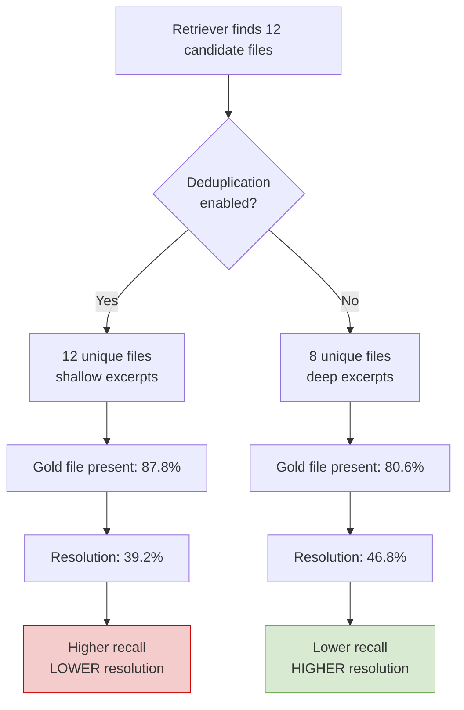

# The Recall Trap: Why Maximising Retrieval Recall Hurts Your Codex CLI Issue Resolution Rate


---

More files in context should mean better results. That intuition drives most retrieval configurations for coding agents: crank up recall, surface every potentially relevant file, and let the model sort it out. A controlled study on SWE-bench Verified demonstrates that this intuition is wrong — and the implications reach directly into how you configure Codex CLI's context management stack.

## The Counterintuitive Finding

Adkins and Trapaidze's "The Recall Trap" (arXiv:2608.14838, August 2026) isolates the effect of a single retrieval parameter — a deduplication flag — on downstream issue resolution [^1]. The experimental design is deliberately minimal: toggle one flag, keep everything else fixed, and measure what happens to actual task success rather than retrieval metrics.

The setup uses a fixed 12-slot context pack with no search tools, ensuring the model receives exactly what the retriever provides. Two configurations are compared:

- **Deduplication enabled (high recall):** The retriever surfaces more unique files, achieving 0.878 gold file presence — meaning the correct file appears in the context pack 87.8% of the time.
- **Deduplication disabled (high depth):** Fewer unique files, but more within-file context for each. Gold file presence drops to 0.806.

The results on GPT-5.6 are striking: disabling deduplication — the configuration with *lower* retrieval recall — raised single-shot resolution by **+7.6 percentage points** (39.2% to 46.8%, n=500, McNemar p=0.0003) [^1]. Qwen3.6-27B replicated the direction at +3.6pp (n=499, p=0.0133).

## Why Breadth Kills Depth

The mechanism is what the authors call **anchor dose** — the density of contextually useful lines surrounding the actual edit location within each retrieved file. When deduplication packs more files into a fixed budget, each file gets fewer lines. The model sees the right file but lacks sufficient surrounding context to understand the local code structure, variable scope, and calling conventions needed to produce a correct patch.



This is not a universal law. The paper finds the effect **reverses on BM25 retrieval** (-3.2pp), where the sparse retriever's keyword matching benefits from broader file coverage [^1]. The lesson is not "depth always wins" — it is that retrieval policy must be validated against task outcomes, not retrieval metrics.

## The Context Budget Problem in Codex CLI

Codex CLI v0.147.0 operates under hard context budgets that make the recall trap directly relevant [^2]. The GPT-5.6 family provides a 272K context window; GPT-5.5 offers 400K in Codex and 1M via the API [^3]. Two configuration parameters control how that budget is consumed:

```toml
# config.toml — context budget controls
model_auto_compact_token_limit = 217600   # 80% of 272K for GPT-5.6
tool_output_token_limit = 12000            # per-tool-call output cap
```

`model_auto_compact_token_limit` triggers automatic compaction — a summarisation pass — when context usage exceeds the threshold [^4]. `tool_output_token_limit` caps the tokens stored from each individual tool call [^4]. Both parameters create a fixed budget analogous to the 12-slot context pack in the Recall Trap study.

When Codex CLI's MCP tool search (introduced in v0.142.2) discovers files or when the agent reads repository contents, each file consumes part of that budget [^2]. The recall trap predicts that reading more files shallowly will underperform reading fewer files deeply — and practitioners have observed exactly this pattern in long-session degradation.

## Three Retrieval Anti-Patterns

The Recall Trap paper, combined with related work on context benchmarks, identifies three anti-patterns common in coding agent configurations:

### 1. The Breadth-First Sweep

Encouraging the agent to scan broadly — "read all files in this directory" — maximises recall at the expense of per-file depth. ContextBench (arXiv:2602.05892) confirms that high recall with low precision indicates **over-retrieval**, where excessive irrelevant context dilutes the signal [^5].

### 2. The Metric-Optimised Retriever

Tuning retrieval components (embeddings, rerankers, chunk sizes) against recall@k or MRR without measuring downstream task success. SWE Context Bench (arXiv:2602.08316) shows that raw context logs are often too verbose and noisy; agents benefit from compact representations that capture key insights [^6].

### 3. The Unbudgeted Tool Chain

Chaining multiple MCP servers without considering cumulative context consumption. The Codex CLI documentation warns against context pollution: connecting too many MCP servers forces the model to spend tokens scanning irrelevant tool lists rather than solving the task [^4].

## A Depth-First Configuration for Codex CLI

The Recall Trap's findings suggest a specific configuration strategy for Codex CLI that prioritises within-file depth over cross-file breadth.

### AGENTS.md Retrieval Directives

Pin retrieval behaviour in your project's `AGENTS.md`:

```markdown
## Context Retrieval Policy

- When investigating an issue, read the FULL file containing the suspected fault
  before reading adjacent files.
- Never read more than 5 files in a single turn without first producing a hypothesis.
- When reading a file, include at least 100 lines of surrounding context around
  the region of interest.
- Prefer `grep` to locate specific symbols, then read the containing file in full,
  rather than scanning directory listings.
```

These directives encode the depth-over-breadth principle directly into the agent's instruction set.

### Token Budget Tuning

Adjust the per-tool output limit to favour depth:

```toml
# Raise per-tool limit to allow full-file reads
tool_output_token_limit = 24000

# Lower compaction threshold to preserve headroom
model_auto_compact_token_limit = 190000
```

A higher `tool_output_token_limit` prevents truncation of individual file reads, preserving the anchor dose that the Recall Trap study identifies as critical. A lower compaction threshold triggers summarisation earlier, reclaiming budget before the agent accumulates shallow reads.

### PostToolUse Validation Hook

A PostToolUse hook can enforce depth-first retrieval by tracking how many files the agent has read versus how deeply:

```bash
#!/usr/bin/env bash
# hooks/post-file-read.sh — warn on shallow breadth-first patterns
# Exit code 2 = send feedback to agent without blocking

FILE_COUNT=$(grep -c '"tool":"read_file"' /tmp/codex-session-trace.jsonl 2>/dev/null || echo 0)
AVG_LINES=$(grep '"tool":"read_file"' /tmp/codex-session-trace.jsonl 2>/dev/null | \
  jq -r '.output_lines' | awk '{s+=$1; n++} END {print (n>0)?s/n:0}')

if [ "$FILE_COUNT" -gt 8 ] && [ "$(echo "$AVG_LINES < 50" | bc)" -eq 1 ]; then
  echo "WARNING: You have read $FILE_COUNT files with an average of $AVG_LINES lines each."
  echo "Consider reading fewer files more deeply. Focus on the most likely fault location."
  exit 2
fi

exit 0
```

The hook uses exit code 2 to inject feedback into the conversation without blocking execution — steering the agent away from breadth-first exploration without hard-stopping it [^2].

### Named Profiles for Retrieval Strategies

Codex CLI's named profiles allow encoding different retrieval strategies for different task types:

```toml
# profiles/debug.toml — depth-first for bug investigation
tool_output_token_limit = 32000
model_auto_compact_token_limit = 180000

# profiles/review.toml — broader for code review
tool_output_token_limit = 16000
model_auto_compact_token_limit = 210000
```

Bug investigation benefits most from depth (matching the paper's SWE-bench task structure), whilst code review legitimately needs broader coverage.

## The BM25 Exception and When Breadth Wins

The Recall Trap paper's BM25 reversal (-3.2pp when disabling deduplication) is instructive [^1]. Sparse keyword retrievers produce fundamentally different context packs: their matches are already anchored on specific terms, providing implicit depth. Removing deduplication with BM25 causes *redundant* depth — the same keyword context repeated across overlapping chunks — rather than the complementary depth that dense retrieval provides.

This has a practical implication for Codex CLI's `grep`-based file discovery. When the agent uses shell `grep` or `ripgrep` to locate code, the results are inherently keyword-anchored (similar to BM25). In this mode, broader file coverage may actually help. The AGENTS.md directives should distinguish between discovery modes:

```markdown
## Retrieval Mode Switching

- After using `grep` to locate matches: read surrounding context in each
  matched file (breadth is acceptable as matches are already anchored).
- After using directory listings or MCP discovery: commit to the single most
  promising file before expanding (depth-first).
```

## What This Means for Model Selection

The paper tested across GPT-5.6 and Qwen3.6-27B, finding the depth advantage in both but at different magnitudes (+7.6pp vs +3.6pp) [^1]. Larger models may extract more value from deeper context because they can better exploit long-range dependencies within a single file.

This reinforces the case for Codex CLI's tiered model routing:

- **GPT-5.6 Sol** (highest capability): benefits most from depth-first retrieval; pair with aggressive `tool_output_token_limit` increases
- **GPT-5.6 Terra** (everyday work): moderate depth; default configuration is reasonable
- **GPT-5.6 Luna** (high-volume): constrained budget makes the recall trap especially dangerous; reduce file count aggressively

## Gaps and Open Questions

The Recall Trap study operates on a fixed 12-slot context pack without search tools — a setup that differs from Codex CLI's interactive, tool-using agent loop. Several questions remain:

1. **Does interactive retrieval mitigate the trap?** When the agent can iteratively request more context, the initial retrieval breadth may matter less. However, each additional read consumes budget, and the compaction summarisation step introduces its own information loss.

2. **How does compaction interact with anchor dose?** Codex CLI's automatic compaction summarises earlier context to make room for new content. If the agent read a file deeply early in the session, compaction may destroy the very anchor context that made the deep read valuable.

3. **Cross-language effects.** The paper tested primarily on Python (SWE-bench Verified) with non-significant results on multilingual benchmarks (+2.6pp, p=0.056) [^1]. Repository-scale tasks in compiled languages with stricter type systems may respond differently to the breadth/depth trade-off.

## Practical Takeaway

Stop optimising your retrieval pipeline for recall. Instead:

1. **Measure resolution, not retrieval metrics.** Run your actual agent loop on a representative evalset and track task success, not file-presence rates.
2. **Configure for depth.** Raise `tool_output_token_limit`, lower `model_auto_compact_token_limit`, and pin depth-first directives in AGENTS.md.
3. **Differentiate by task type.** Use named profiles to encode retrieval strategies appropriate to bug investigation (depth) versus code review (breadth).
4. **Validate against your retrieval method.** If your pipeline relies on keyword search (BM25-like), breadth may still win. If it uses semantic/dense retrieval, depth almost certainly wins.

The recall trap is a specific instance of a broader principle: optimising intermediate metrics in an agentic pipeline can actively harm end-to-end outcomes. Every configuration decision — from retrieval policy to token budgets to compaction thresholds — deserves validation against the metric that actually matters: did the agent solve the problem?

## Citations

[^1]: Adkins, A. & Trapaidze, T. (2026). "The Recall Trap: A Recall-Maximizing Retriever Configuration Reduces Issue Resolution." arXiv:2608.14838. [https://arxiv.org/abs/2608.14838](https://arxiv.org/abs/2608.14838)

[^2]: OpenAI. (2026). "Codex CLI v0.147.0 Release Notes." GitHub. [https://github.com/openai/codex/releases/tag/rust-v0.147.0](https://github.com/openai/codex/releases/tag/rust-v0.147.0)

[^3]: OpenAI. (2026). "ChatGPT & Codex Changelog." [https://learn.chatgpt.com/docs/changelog](https://learn.chatgpt.com/docs/changelog)

[^4]: Vaughan, D. (2026). "Codex CLI Performance Optimisation: Token Overhead, Hidden Costs and Tuning Tactics." Codex Knowledge Base. [https://codex.danielvaughan.com/2026/04/08/codex-cli-performance-optimization/](https://codex.danielvaughan.com/2026/04/08/codex-cli-performance-optimization/)

[^5]: ContextBench Authors. (2026). "ContextBench: A Benchmark for Context Retrieval in Coding Agents." arXiv:2602.05892. [https://arxiv.org/abs/2602.05892](https://arxiv.org/abs/2602.05892)

[^6]: SWE Context Bench Authors. (2026). "SWE Context Bench: A Benchmark for Context Learning in Coding." arXiv:2602.08316. [https://arxiv.org/abs/2602.08316](https://arxiv.org/abs/2602.08316)
