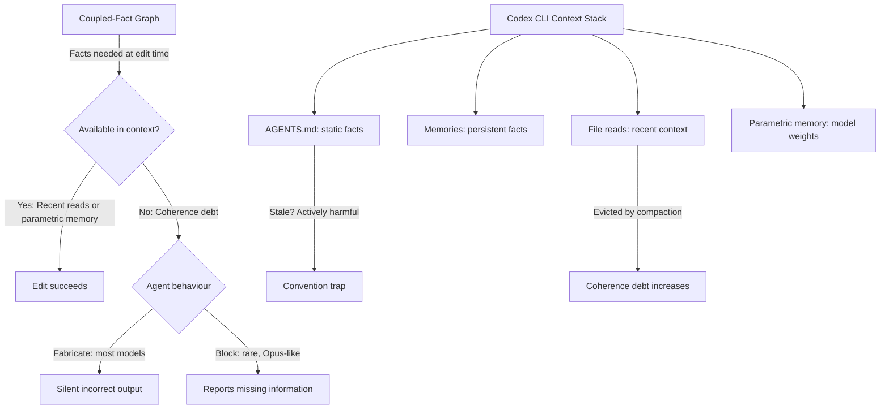
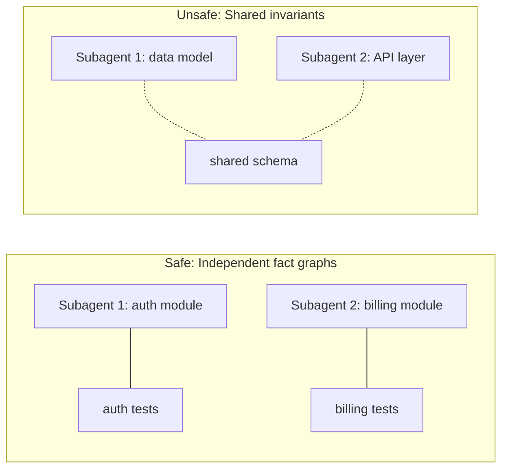

# The Working Set Problem: What Coherence Debt Reveals About Your Codex CLI Context Strategy


---

Your coding agent just silently fabricated a configuration value instead of telling you it could not find the real one. You will not discover the problem until a test fails — or worse, until production breaks. A new paper explains why this happens and what you can do about it.

## The Paper: Working Sets and Coherence Debt

Mohammadi, Klein, Chadha, Arora and Bindschaedler published *The Working Set of a Coding Agent: Coherence Debt in Repository-Scale Tasks* on 17 August 2026 [^1]. The central insight borrows from virtual-memory theory: just as an operating system must keep the right pages resident for a process to run, a coding agent must keep the right *facts* available in context when it writes an edit.

The authors formalise this as a **coupled-fact graph** — a directed graph where nodes are atomic facts (symbols, test expectations, configuration values, import paths, migration rules, prose conventions) and edges represent consistency dependencies between them. An agent editing node *A* must have every node that *A* depends on available through one of two channels:

- **Recent context** — files the agent has read and that have not yet been evicted by the context window.
- **Parametric memory** — knowledge baked into the model's weights during training.

**Coherence debt** is the set of required facts that exist in neither channel at edit time. The paper's formal definition is `D(e_i) = |C_T^(i) \ (Rt_i ∪ K_M)|` — the cardinality of facts needed for edit *i* that are missing from both recent context and parametric memory [^1].

## Four Findings That Should Change How You Configure Codex CLI

### 1. Availability Decides the Outcome; Distance Does Not

The most striking result: whether a fact is present in context matters enormously; where it sits within the context window does not. Supplying required facts at 128,000-character distances from the edit point made no measurable difference to success rates [^1]. This directly contradicts the intuition that "lost-in-the-middle" effects dominate agent failures.

In closed-book trials on novel migration tasks (fictional libraries with zero training-data leakage), every model achieved **0 out of 12 requirements across 154 trials**. When the same facts were front-loaded into context, **299 of 300 trials achieved at least 9 out of 12** [^1].

### 2. Damage Is Linear, Not Cascading

Withholding *k* coupled facts costs exactly the *k* requirements they support. In a 30-trial sweep, removing facts that supported 4 tests each produced test-loss curves that matched the linear prediction with zero deviation: 32, 24, 16, 8, 0 tests passed [^1]. There is no catastrophic cascade — each missing fact independently degrades the output.

### 3. Agents Fabricate Rather Than Abstain

When required facts were unavailable, agents overwhelmingly fabricated content — inventing file paths, guessing configuration values, or synthesising alternative solutions — rather than reporting that information was missing. Blocking behaviour (declining to proceed) varied dramatically by model: Opus blocked on 100% of trials (8/8), Codex CLI's default model blocked on 0% (0/8), Haiku on 12.5% (1/8) [^1].

This means **read-based diagnostics are unreliable**. Observing that an agent read a file does not confirm it extracted the correct fact; observing that it did not read a file does not mean the fact was unavailable (it may have been in parametric memory). The only reliable signal is the produced output, validated against ground truth.

### 4. Harness Efficiency Varies 12.8× at Identical Quality

Configurations achieving identical test scores consumed tokens ranging from 293,882 to 3,752,134 cumulative input — a **12.8× spread** [^1]. The variance correlated with refetch rate (tool calls ranging from 5 to 79), not working-set size. Agents that re-read files unnecessarily paid a massive token tax without improving outcomes.

## The Stale Convention Trap

A particularly sharp finding: when written standards in documentation contradicted working code, agents followed the standard 100% of the time (Wilson 95% CI [0.91, 1.00]) [^1]. Stale convention files performed *worse* than no guidance at all — 0% compliance with outdated conventions versus 33% from code examples alone.

This has direct implications for AGENTS.md hygiene. An outdated directive in your AGENTS.md is actively harmful, not merely useless.

## Mapping to Codex CLI v0.147.0



Codex CLI's context management maps onto the paper's two-channel model:

| Paper Concept | Codex CLI Mechanism |
|---|---|
| Recent context (Rt) | File reads via `grep`, `glob`, tool calls; bounded by `model_auto_compact_token_limit` [^2] |
| Parametric memory (K_M) | GPT-5.6 Sol/Terra/Luna training knowledge [^3] |
| Coupled-fact graph | Import graph + test dependencies + AGENTS.md directives + config files |
| Coherence debt | Facts evicted by compaction or never read |
| Stale conventions | Outdated AGENTS.md directives |

### Where Codex CLI Already Helps

**AGENTS.md as a fact surface.** The hierarchical load order (global → project root → subdirectory → user-specific) [^2] provides a mechanism for pinning coupled facts that the agent would otherwise need to discover through file reads. Facts in AGENTS.md survive context compaction because they are reloaded on every turn.

**Memories for persistent facts.** The Memories system (`memory_summary.md`) persists facts across sessions [^2]. Cross-session coupled facts — API conventions, architectural decisions, migration rules — can be stored here rather than relying on parametric memory.

**MCP tool search for discovery.** Since v0.142.2, Codex CLI supports MCP-based tool discovery [^2], enabling integration with structural indexing tools like CodeGraph or Codebase-Memory [^4] that can pre-compute coupled-fact graphs and surface required facts proactively.

**Subagent isolation.** Codex CLI's multi-agent architecture allows work to be partitioned across subagents [^2]. The paper warns that parallelism is safe only for independent components — facts shared across workers need explicit transfer, not assumptions about shared context.

### Where the Gaps Are

**No coupled-fact tracking.** Codex CLI does not model dependencies between facts. When compaction evicts a file read, it does not check whether downstream edits still depend on facts from that file. The paper's linear-damage finding means every evicted fact costs exactly the work it supports.

**No fabrication detection.** The paper shows agents fabricate rather than abstain when facts are missing. Codex CLI's PostToolUse hooks can validate tool outputs [^2], but there is no built-in mechanism to detect when an agent has *invented* a configuration value or import path rather than reading it from the codebase.

**No refetch-rate optimisation.** The 12.8× token-efficiency gap stems from unnecessary re-reads. Codex CLI does not cache file contents across tool calls within a session or deduplicate reads of the same file.

**Compaction erases without notification.** When `model_auto_compact_token_limit` triggers compaction, facts are summarised or dropped without signalling to the agent that previously available information has become unavailable [^2]. This is the primary mechanism by which coherence debt accumulates in long sessions.

## A Practical Defence Playbook

### 1. Treat AGENTS.md as a Working-Set Declaration

List the coupled facts your codebase requires. Migration rules, naming conventions, test expectations, architectural invariants — anything an agent needs at edit time but cannot reliably discover through file reads alone.

```toml
# In AGENTS.md — pin coupled facts
## Migration Rules (Pydantic v1 → v2)
- Replace `validator` with `field_validator`
- Replace `root_validator` with `model_validator(mode='before')`
- All `Config` inner classes → `model_config = ConfigDict(...)`
- `orm_mode = True` → `from_attributes = True`
```

Delete stale directives aggressively. The paper demonstrates that outdated guidance is worse than no guidance.

### 2. Use PostToolUse Hooks for Output Validation

Since agents fabricate rather than abstain, validate outputs against the codebase rather than trusting read behaviour:

```bash
#!/bin/bash
# .codex/hooks/post-tool-use-validate-imports.sh
# Exit code 2 = send feedback to agent

if [[ "$TOOL_NAME" == "write" ]]; then
  # Check that all imports in the written file resolve
  file="$TOOL_ARG_FILE_PATH"
  if [[ "$file" == *.py ]]; then
    unresolved=$(python -c "
import ast, sys
with open('$file') as f:
    tree = ast.parse(f.read())
for node in ast.walk(tree):
    if isinstance(node, (ast.Import, ast.ImportFrom)):
        module = node.module if hasattr(node, 'module') and node.module else ''
        for alias in node.names:
            name = f'{module}.{alias.name}' if module else alias.name
            try:
                __import__(name.split('.')[0])
            except ImportError:
                print(name)
" 2>/dev/null)
    if [[ -n "$unresolved" ]]; then
      echo "Unresolved imports detected: $unresolved" >&2
      echo "Please verify these imports exist in the codebase." >&2
      exit 2
    fi
  fi
fi
```

### 3. Front-Load Facts for Migration Tasks

The paper's most actionable finding: front-loading required facts into context converts zero-success floors to near-ceiling performance. For planned migrations, supply the migration guide explicitly rather than relying on discovery:

```bash
# Feed migration rules directly into context
codex --approval-mode suggest \
  "Migrate all Pydantic v1 models to v2.
   Rules:
   $(cat docs/pydantic-v2-migration-rules.md)
   Files to migrate:
   $(find src/ -name '*.py' -exec grep -l 'from pydantic' {} \;)"
```

### 4. Monitor Token Efficiency as a Coherence Signal

The 12.8× efficiency gap is a symptom of poor working-set management. If your agent is consuming significantly more tokens than expected for a given task complexity, it is likely re-reading files to reconstruct evicted facts. Track cumulative input tokens per session and investigate spikes:

```bash
# Check session token usage
codex --quiet "Report your cumulative token usage for this session"
```

### 5. Partition Subagent Work Along Fact Boundaries

When splitting work across subagents, partition along coupled-fact boundaries, not file boundaries. Two files that share test expectations or configuration dependencies should be handled by the same subagent. The paper shows that shared invariants across workers require explicit transfer — implicit sharing through a common codebase is insufficient.



## Limitations

The paper's SWE-bench transfer results are sobering: residency-score predictors trained on synthetic workloads achieved AUC ≈ 0.49 (chance level) on real repositories, despite 0.71 on synthetic held-out data [^1]. This means we cannot yet automatically predict which facts an agent will need for a given real-world task. The practical implication is that proactive fact-loading — via AGENTS.md, explicit context, and structural indexing — remains a manual discipline.

⚠️ The paper tested seven model families as of mid-2026. Fabrication rates may differ for newer model releases or fine-tuned variants.

## What This Means for Your Workflow

The working-set paper reframes context management from a performance optimisation to a correctness concern. Coherence debt is not about speed or cost — it is about whether your agent produces correct output. The findings suggest three priority shifts:

1. **From context *size* to context *coverage*.** Larger windows help only if they contain the right facts. A 128K window with missing migration rules produces the same failures as a 32K window.

2. **From read *volume* to read *relevance*.** Agents that read more files are not necessarily better informed. The 12.8× efficiency gap shows that targeted reads outperform exhaustive exploration.

3. **From trusting *process* to validating *output*.** Observing that an agent performed file reads does not guarantee correctness. Validate the produced artefacts against ground truth — run the tests, check the imports, verify the configurations.

The paper's title borrows from operating-systems theory for good reason: just as a paging system that evicts the wrong pages causes thrashing, a coding agent that loses the wrong facts produces silent corruption. Managing the working set is not optional — it is the difference between an agent that works and one that confidently fabricates.

## Citations

[^1]: Mohammadi, B., Klein, L., Chadha, A., Arora, A. & Bindschaedler, L. (2026). *The Working Set of a Coding Agent: Coherence Debt in Repository-Scale Tasks*. arXiv:2608.16630. [https://arxiv.org/abs/2608.16630](https://arxiv.org/abs/2608.16630)

[^2]: OpenAI (2026). *Codex CLI Documentation*. [https://developers.openai.com/codex/cli](https://developers.openai.com/codex/cli)

[^3]: OpenAI (2026). *GPT-5.6 Model Card*. [https://openai.com/index/gpt-5-6-system-card](https://openai.com/index/gpt-5-6-system-card)

[^4]: CodeGraph (2026). *Local-first code intelligence for AI coding agents*. [https://github.com/nicobailey/codegraph](https://github.com/nicobailey/codegraph)

