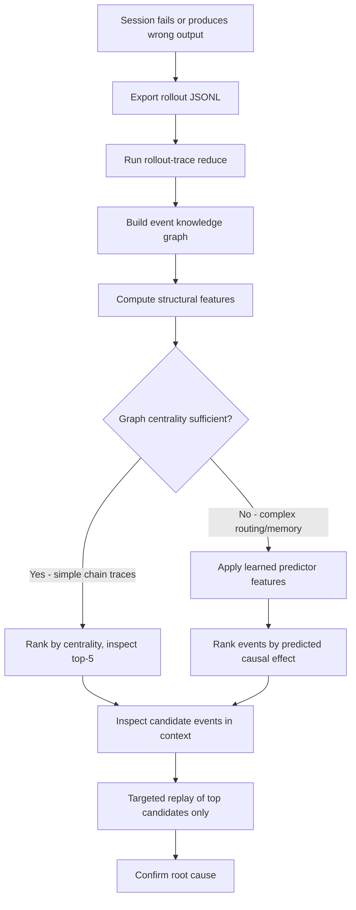

# Zero-Replay Debugging and the Event Knowledge Graph: What BranchPoint-Latent Means for Your Codex CLI Rollout Traces


---

When a Codex CLI session goes wrong — an agent edits the wrong file, hallucinates a dependency, or silently drops a constraint — you face a debugging problem that scales badly. The rollout JSONL captures every turn, but finding the *causally decisive* event in a 200-turn trace means either reading the whole log or performing expensive counterfactual replays: rewind to event *n*, edit it, re-run the suffix, and measure the effect. Repeat for every candidate event, and costs grow linearly.

A June 2026 paper by Kang, Cha and Weon — *Knowledge-Based Zero-Replay Debugging of Multi-Agent LLM Traces* — reframes the problem entirely [^1]. Instead of replaying, they compile each trace into a structured **event knowledge graph** and train a lightweight predictor to identify high-impact events *without any replay at all*. The results are striking: Branch Recall@5 jumps from 0.73 to 0.93 on held-out trace families, at zero oracle-replay cost [^1].

This article examines what that approach means for Codex CLI's rollout trace infrastructure, where the gaps lie, and how you can move towards structured trace debugging today.

## The Cost Problem with Counterfactual Replay

The standard debugging workflow for agentic traces follows a counterfactual pattern: identify a candidate event, rewind the trace to that point, modify or remove the event, and re-execute the remaining trajectory. The delta between the original and modified outcomes tells you the event's causal contribution.

This is sound in theory but ruinous in practice. For a trace with *T* events and a feature vector of size *|F|*, the cost is *O(T·|F|)* oracle calls [^1]. A typical Codex CLI session running `o3` at current API rates makes this prohibitively expensive for routine debugging — and that is before you account for the non-determinism of LLM completions, which means each replay may produce a different trajectory anyway.

## The Event Knowledge Graph

The paper's core contribution is a structured intermediate representation: an event knowledge graph *G=(V,E,A)* where nodes are trace events (messages, routes, memory writes, tool calls, decision points), edges capture routing and causal adjacency, and typed attributes encode five evidence categories [^1]:

| Category | What It Captures |
|----------|-----------------|
| **Routing** | Agent communication patterns, route-graph position, routing bottlenecks |
| **Memory** | State persistence, memory writes, RAG retrieval operations |
| **Tool-use** | External function invocations, tool-call metadata, return values |
| **Uncertainty** | Prediction confidence, disagreement signals between agents |
| **Latent evidence** | Hidden-state indicators, proxy signals not directly observable |

Every downstream component — from the predictor to the debugging interface — operates on *G* rather than raw text. This makes the evidence used for each decision explicit and auditable, a property that matters enormously when you need to explain *why* you believe a particular event caused the failure.

## BranchPoint-Latent: Learning to Rank Without Replay

The predictor, BranchPoint-Latent, is a gradient-boosted learning-to-rank model over 13 features derived from the knowledge graph: graph centrality, routing bottleneck scores, disagreement measures, memory/RAG persistence, novelty indicators, uncertainty proxies, and latent transition features [^1].

Training uses a learning-to-rank objective targeting within-trace ranking of oracle effect scores. The production configuration uses depth-3 trees, 400 estimators, a learning rate of 0.08, ℓ₂ regularisation of 1, and a minimum leaf size of 50 [^1].

The experimental evaluation spans 37 trace families across six public datasets adapted as replayable traces, totalling 163,815 events [^1]:

| Metric | Linear Scorer | GBM (BranchPoint-Latent) |
|--------|--------------|--------------------------|
| Branch Recall@5 (held-out) | 0.730 | 0.926 |
| NDCG@5 (held-out) | 0.828 | 0.923 |
| Spearman ρ (held-out) | 0.586 | 0.701 |
| AUPRC | 0.61 | 0.77 |

The key finding for practitioners: at zero replay budget, the GBM predictor recovers 93% of causally decisive events in the top-5 ranking — compared to active replay's 91% at 11.8 oracle calls per trace [^1]. The predictor's value concentrates in the low-budget regime; at high replay budgets, active replay strictly dominates.

## Codex CLI's Rollout Trace Infrastructure

Codex CLI v0.147.0 already captures rich trace data. Every session produces a rollout JSONL file stored under `~/.codex/sessions/YYYY/MM/DD/rollout-TIMESTAMP-UUID.jsonl`, where each line wraps a `RolloutItem` in a timestamped `RolloutLine` [^2]. The item types cover the full event taxonomy:

- **`ResponseItem`** — model responses and tool calls with role, content, and outputs
- **`EventMsg`** — protocol events (`UserMessage`, `TokenCount`, `ThreadGoalUpdated`)
- **`SessionMeta`** — session-level metadata (model provider, CLI version, working directory)
- **`TurnContext`** — per-turn snapshots (model, approval policy, sandbox policy)
- **`InterAgentCommunication`** — multi-agent message relay for subagent sessions
- **`WorldState`** — environment snapshots

Cold rollout files are compressed with Zstandard and transparently decompressed on resume [^2]. A SQLite index (`state_5.sqlite`) provides fast metadata queries, and the `RolloutRecorder` uses background async writes to avoid blocking the agent loop [^2].

The `rollout-trace` crate, added in a five-part PR stack, provides diagnostic bundle generation and a debug trace reduction command [^3]. It records tool boundaries, code-mode transitions, session spans, and multi-agent edges — giving you a structured view of how events relate.

```bash
# Export a rollout trace diagnostic bundle
codex --rollout-trace export --session <session-id> --output trace-bundle/

# Reduce a trace to its structural skeleton
codex --rollout-trace reduce --input rollout-2026-08-18-abc123.jsonl
```

Additionally, Codex CLI ships built-in OpenTelemetry support, exporting OTLP spans covering API request latency, tool execution duration, approval wait time, and compaction events to any compatible backend — Grafana, SigNoz, Coralogix, or similar [^4].

## The Gap: From Flat Logs to Knowledge Graphs

Despite this rich trace infrastructure, Codex CLI's rollout files remain *flat event streams*. The paper's event knowledge graph requires three capabilities that do not yet exist in the rollout format:

### 1. Typed Causal Edges

The rollout JSONL records events in temporal order but does not encode *why* event B follows event A. Was it a routing decision? A tool-call dependency? A memory-write that informed the next prompt? The knowledge graph's edge types — routing adjacency, memory-read-after-write, tool-call-triggers-decision — are not represented.

**Practical mitigation:** Use the `rollout-trace reduce` command to extract structural boundaries (tool spans, code-mode transitions, agent edges), then post-process the reduced trace to infer causal edges from temporal proximity and type co-occurrence.

### 2. Uncertainty and Latent Evidence Attributes

BranchPoint-Latent's 13 features include uncertainty proxies and latent transition indicators. Codex CLI's rollout items carry token counts and model metadata but not per-event confidence scores, disagreement measures, or hidden-state proxies. The OTLP spans similarly lack uncertainty-grade attributes.

**Practical mitigation:** Instrument `PostToolUse` hooks to log tool-call confidence annotations. For model uncertainty, the `TokenCount` events provide a crude proxy — sudden spikes in token consumption often correlate with uncertain reasoning — but this is a weak signal compared to the paper's calibrated uncertainty features.

### 3. Graph-Aware Querying

The rollout system's query layer is SQLite metadata plus sequential JSONL scanning. There is no graph database, no centrality computation, and no way to run the kind of structural queries that BranchPoint-Latent requires (routing bottleneck detection, memory persistence scoring, latent transition counting).

**Practical mitigation:** Export rollout traces to a graph database (Neo4j, or even an in-memory NetworkX graph) via a post-processing script:

```python
import json
import networkx as nx

def build_trace_graph(rollout_path: str) -> nx.DiGraph:
    """Build a directed graph from a Codex CLI rollout JSONL file."""
    G = nx.DiGraph()
    prev_node = None

    with open(rollout_path) as f:
        for i, line in enumerate(f):
            item = json.loads(line)
            node_id = f"event_{i}"
            item_type = _classify_item(item)

            G.add_node(node_id, **{
                "type": item_type,
                "timestamp": item.get("timestamp"),
                "routing": _extract_routing(item),
                "memory": _extract_memory(item),
                "tool_use": _extract_tool_metadata(item),
            })

            if prev_node is not None:
                edge_type = _infer_edge_type(
                    G.nodes[prev_node], G.nodes[node_id]
                )
                G.add_edge(prev_node, node_id, relation=edge_type)

            prev_node = node_id

    return G
```

Once in graph form, you can compute centrality metrics, identify routing bottlenecks, and run the same structural features that BranchPoint-Latent uses — enabling zero-replay debugging of your own sessions.

## A Practical Debugging Workflow

Combining Codex CLI's existing infrastructure with the paper's insights, here is a workflow you can adopt today:



The critical insight from the paper is that *graph centrality alone* works well for simple chain-structured traces (arithmetic reasoning, linear tool sequences) where Spearman ρ reaches 0.68 [^1]. For traces with complex routing, memory dependencies, or latent state — which describes most real Codex CLI sessions — the learned predictor provides substantial lift (ρ from 0.29 to 0.55 on model-authored traces) [^1].

## Limitations and Honest Caveats

The paper's evaluation uses public QA and code datasets adapted as replayable traces, not native multi-agent coding benchmarks [^1]. The 37 trace families, while covering 163,815 events, derive from HotpotQA, StrategyQA, GSM8K, ARC, XSum, and MBPP — domains where trace structure is more regular than in production Codex CLI sessions working across heterogeneous codebases.

The deterministic replay assumption is also significant: real LLM agent traces are stochastic, and the same intervention can produce different trajectories on re-execution [^1]. The paper acknowledges this and positions its contribution explicitly on the cost-accuracy frontier rather than claiming universal superiority.

⚠️ The Who&When benchmark comparison (the GBM matching RL-fine-tuned AgenTracer-8B at Acc@1 of 0.365 vs 0.373) is encouraging but comes from a different evaluation setting [^1]. Direct applicability to Codex CLI rollout traces has not been independently validated.

## What Codex CLI Would Need

For first-class zero-replay debugging, three additions to the rollout system would close the gap:

1. **Edge-typed rollout events** — extend `RolloutItem` variants to carry a `causal_relation` field linking each event to its predecessor(s) with a typed edge (routing, memory-read, tool-dependency, approval-gate).

2. **Uncertainty metadata** — add per-completion confidence or entropy estimates to `ResponseItem`, enabling the uncertainty feature channel without post-hoc approximation.

3. **A graph export command** — extend `rollout-trace` to emit a graph-format output (GraphML, JSON-LD, or direct Neo4j Cypher) alongside the existing JSONL reduction, making structural analysis a first-class operation rather than a post-processing step.

Until these ship, the post-processing approach — export, build graph, compute features, rank — gives you most of the benefit at the cost of a scripting step. The BranchPoint-Latent model itself is lightweight enough (depth-3 trees, 400 estimators) to run locally on any developer machine.

## Citations

[^1]: Kang, D.H., Cha, H. & Weon, D. (2026). "Knowledge-Based Zero-Replay Debugging of Multi-Agent LLM Traces." arXiv:2606.14805. [https://arxiv.org/abs/2606.14805](https://arxiv.org/abs/2606.14805)

[^2]: OpenAI. (2026). "Rollout Persistence and Replay — openai/codex." DeepWiki. [https://deepwiki.com/openai/codex/3.5.2-rollout-persistence-and-replay](https://deepwiki.com/openai/codex/3.5.2-rollout-persistence-and-replay)

[^3]: cassirer-openai. (2026). "[rollout_trace] Add debug trace reduction command." Pull Request #18880, openai/codex. [https://github.com/openai/codex/pull/18880](https://github.com/openai/codex/pull/18880)

[^4]: OpenAI. (2026). "Observability and Telemetry — openai/codex." DeepWiki. [https://deepwiki.com/openai/codex/9.4-observability-and-telemetry](https://deepwiki.com/openai/codex/9.4-observability-and-telemetry)

[^5]: Codex Knowledge Base. (2026). "Codex CLI Log Files and Debug Tracing: The Complete Diagnostic Toolkit." [https://codex.danielvaughan.com/2026/05/21/codex-cli-log-files-debug-tracing-diagnostic-toolkit-troubleshooting/](https://codex.danielvaughan.com/2026/05/21/codex-cli-log-files-debug-tracing-diagnostic-toolkit-troubleshooting/)

[^6]: Codex Knowledge Base. (2026). "Codex CLI Observability: OpenTelemetry Traces, Metrics, and Production Monitoring." [https://codex.danielvaughan.com/2026/04/20/codex-cli-observability-opentelemetry-traces-metrics-production-monitoring/](https://codex.danielvaughan.com/2026/04/20/codex-cli-observability-opentelemetry-traces-metrics-production-monitoring/)
