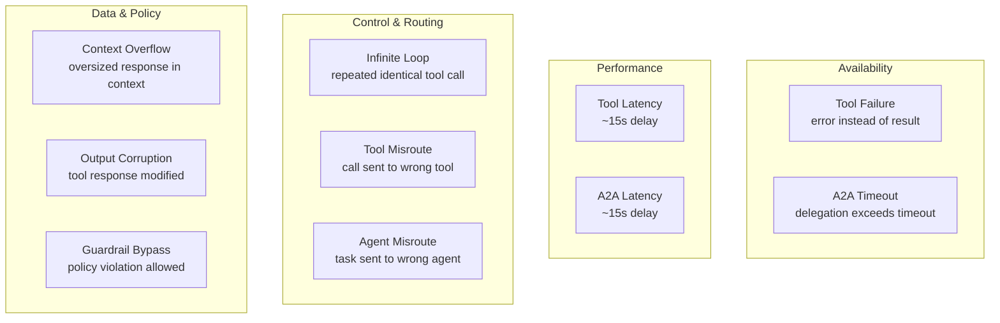
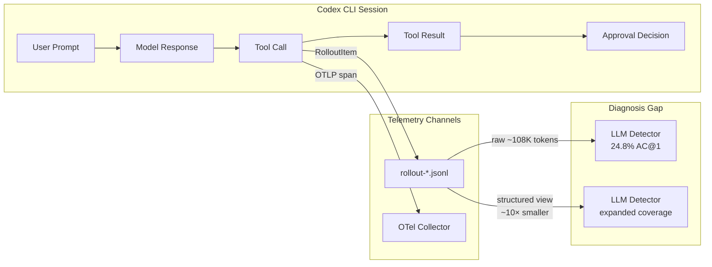

# AgentChaosBench: Why Runtime Fault Detection from Telemetry Remains Unsolved — and What It Means for Your Codex CLI Observability Stack


---

When an agentic session fails, how quickly can you determine *what* failed and *where*? If you rely on task-outcome checks alone — did the tests pass, did the PR get created — you learn nothing about the fault's origin. Zhang et al.'s AgentChaosBench (arXiv:2608.14680, August 2026) [^1] offers the first controlled answer: even frontier models correctly classify fault type from execution telemetry barely a quarter of the time. The implications for anyone running Codex CLI sessions at scale are immediate.

## The benchmark

AgentChaosBench constructs five heterogeneous multi-agent applications — an SQL assistant, a book writer, a social media manager, a landing-page generator, and a recruitment assistant — each coordinating agents over the Agent-to-Agent (A2A) protocol and calling tools through MCP [^1]. Into these systems the authors inject ten fault types across four categories:



The resulting dataset comprises 275 sanitised execution traces — 250 faulty and 25 no-fault controls — each paired with a corresponding fault-free execution for reference comparison [^1]. Crucially, injection markers and fault labels are stripped from the diagnosis input: detectors see only what an observability pipeline would expose.

## The headline numbers are sobering

Zero-shot LLM detectors were asked to classify both the fault type and the affected component from raw Langfuse JSON traces. Results [^1]:

| Detector | Fault-Type AC@1 | Fault-Type AC@3 | Joint (Type+Location) AC@1 |
|---|---|---|---|
| Qwen3-1.7B | 15.6% | 24.0% | 8% |
| Qwen3-4B | 13.6% | 31.2% | 9% |
| Qwen3.5-9B | 19.2% | 28.0% | 16% |
| Qwen3-14B | 17.2% | 35.2% | 15% |
| DeepSeek-v4-pro | 24.8% | 34.0% | 22% |

Random baseline sits at roughly 9%. The frontier model manages 24.8% top-1, meaning three quarters of faults are misclassified on the first attempt [^1].

Two findings stand out:

1. **Scale does not uniformly help.** Moving from 1.7B to 14B parameters barely shifts fault-type accuracy (15.6% → 17.2%), though no-fault recognition jumps from 4% to 96% [^1]. Larger models get better at knowing when nothing is wrong, but not at diagnosing what *is* wrong.

2. **Guardrail bypass remains near-unsolved.** Top-3 recall for guardrail bypass sits at 0–1 out of 25 traces, even with paired reference executions [^1]. The detector cannot distinguish a policy violation from normal operation because the violation is semantic, not structural.

## Structured trace representation matters

Raw Langfuse traces balloon to a median of ~108K tokens and a maximum of ~638K tokens [^1]. The authors introduce a *structured view* — one line per span containing span ID, kind, name, level, duration, output size, repeat count, and an output preview — that reduces the largest traces by roughly 10× [^1]. This compact representation enables smaller models (131K–262K context windows) to participate without truncation, reducing inference cost 8.6× while expanding coverage [^1].

For Codex CLI users, this structured-view concept maps directly to a practical question: are you diagnosing failures from raw rollout JSONL, or from a processed summary?

## Mapping to the Codex CLI telemetry stack

Codex CLI v0.148.0 ships two parallel telemetry channels:

1. **Rollout JSONL** — every session persists as `~/.codex/sessions/YYYY/MM/DD/rollout-<session-id>.jsonl`, containing the complete event stream: user prompts, model responses, tool calls, tool results, approval decisions, and token-usage counters [^2].

2. **OpenTelemetry spans** — every hook event (prompt submissions, tool calls, shell commands, MCP interactions, subagent orchestration) becomes an OTLP span exportable to Jaeger, Grafana, Datadog, Honeycomb, or any OTLP-compatible backend [^3]. Configuration uses `otel.exporter` for log events and `otel.trace_exporter` for traces.

Both channels record the raw materials AgentChaosBench expects: span kind, duration, tool identity, and output. But the benchmark exposes gaps in how Codex surfaces this data for fault diagnosis.



### Gap 1: No structured diagnostic view

Codex CLI's rollout JSONL stores flat, linked events — `function_call` followed by a matching `function_call_output` with the same `call_id` — interspersed with unpredictable token-count events [^4]. There is no built-in command to produce the kind of compact, one-line-per-span structured view that AgentChaosBench found essential for tractable diagnosis. The `codex doctor` diagnostic command (shipped in v0.131.0) covers API latency, tool execution duration, and compaction events [^2], but it operates at the session level, not at the per-span fault-localisation level the benchmark demands.

### Gap 2: No guardrail-decision telemetry

The benchmark's hardest fault category — guardrail bypass — requires the detector to reason about what a guardrail *should have blocked* versus what it *did block*. Codex CLI's Guardian auto-review system evaluates actions before execution, but its accept/reject decisions are not emitted as structured OTLP spans with the policy rule that triggered them [^3]. Without a `guardrail.decision` span kind carrying the applied rule, expected verdict, and actual verdict, detecting bypass from telemetry alone becomes the semantic reasoning task that even DeepSeek-v4-pro fails at.

### Gap 3: No fault-type vocabulary in rollout events

Codex CLI's `RolloutItem` typed events cover `user_message`, `assistant_message`, `function_call`, `function_call_output`, and `reasoning` [^2]. The vocabulary does not include fault-relevant event types such as `tool_timeout`, `delegation_timeout`, `context_overflow`, or `output_corruption_detected`. AgentChaosBench's finding that availability faults (tool failure, A2A timeout) are the easiest to detect [^1] suggests that even minimal fault-event vocabulary would dramatically improve automated diagnosis.

### Gap 4: No reference-trace comparison mechanism

The benchmark shows that pairing a faulty trace with a fault-free reference execution improves context-overflow recall by up to 55 percentage points [^1]. Codex CLI sessions are individually addressable by session ID, but there is no mechanism to designate a "golden" reference execution for a given task and automatically compare subsequent runs against it. The `/resume` and `/fork` features manage session branching, not differential diagnosis.

## A practical fault-diagnosis pipeline

Given these gaps, here is a workable approach using Codex CLI v0.148.0's existing capabilities:

### Step 1: Produce a structured view

Write a PostToolUse hook that, on session completion, parses the rollout JSONL into a compact one-line-per-event summary:

```toml
# .codex/config.toml
[[hooks]]
event = "stop"
command = "python3 .codex/scripts/structured-trace.py $CODEX_SESSION_ID"
timeout_ms = 30000
```

The script should emit span kind, tool name, duration, output byte count, and a truncated output preview — mirroring AgentChaosBench's structured view format.

### Step 2: Add guardrail-decision logging

Use an async PreToolUse hook to log every Guardian decision with the rule that triggered it:

```toml
[[hooks]]
event = "pre_tool_use"
command = "python3 .codex/scripts/log-guardrail-decision.py"
background = true
```

This creates an external guardrail-decision log that compensates for the missing `guardrail.decision` span kind in Codex's native OTLP output.

### Step 3: Maintain reference traces

For critical workflows, tag known-good session IDs in your AGENTS.md:

```md
## Reference Traces

| Workflow | Reference Session ID | Date |
|---|---|---|
| DB migration | sess_abc123 | 2026-08-18 |
| API endpoint scaffold | sess_def456 | 2026-08-15 |
```

A diagnosis script can then diff the structured views of a failed session against its reference, focusing detector attention on divergent spans.

### Step 4: Budget your detection effort

AgentChaosBench demonstrates that not all fault types are equally detectable [^1]. Allocate your detection investment accordingly:

| Fault Category | Detectability | Recommended Approach |
|---|---|---|
| Availability (tool failure, timeout) | High | Automated: duration thresholds + error-code matching |
| Performance (latency) | Medium | Automated: percentile-based alerts on span duration |
| Control & Routing (loop, misroute) | Medium | Semi-automated: repeat-count anomaly + tool-identity checks |
| Data & Policy (corruption, guardrail bypass) | Low | Manual: structured-view review + reference-trace comparison |

## What the benchmark tells us about observability maturity

AgentChaosBench quantifies something practitioners have suspected: the gap between *recording* telemetry and *diagnosing from* telemetry is enormous. Codex CLI's observability stack — rollout JSONL plus OTLP spans plus Langfuse/Coralogix integrations [^5] — captures comprehensive raw data. But raw data is not diagnosis. The benchmark shows that even a 638K-token trace fed to a frontier model produces correct joint fault-type-and-location classification only 22% of the time [^1].

The structured-view finding is the actionable takeaway: compressing traces 10× without computing anomalies already expands what smaller, cheaper models can process [^1]. For Codex CLI operators running `codex exec` in CI pipelines or multi-agent workflows via `multi_agent_v2`, building this structured-view layer over your existing rollout JSONL is the highest-leverage investment before reaching for more sophisticated diagnosis models.

The guardrail-bypass result is the cautionary one. If your trust model depends on Guardian auto-review catching policy violations, know that detecting those violations *after the fact* from telemetry is, as AgentChaosBench demonstrates, a near-unsolved problem. Prevention — via PreToolUse hooks, sandbox constraints, and AGENTS.md boundary rules — remains far more reliable than post-hoc detection [^6].

## Citations

[^1]: Zhang, C., Li, Y., Tian, Y., Bachras, M. & Jacobsen, H.-A. (2026). "When Agentic Executions Fail: Detecting and Localizing Runtime Faults from Telemetry." arXiv:2608.14680. [https://arxiv.org/abs/2608.14680](https://arxiv.org/abs/2608.14680)

[^2]: Codex CLI documentation — Log Files and Debug Tracing. Codex Knowledge Base, May 2026. [https://codex.danielvaughan.com/2026/05/21/codex-cli-log-files-debug-tracing-diagnostic-toolkit-troubleshooting/](https://codex.danielvaughan.com/2026/05/21/codex-cli-log-files-debug-tracing-diagnostic-toolkit-troubleshooting/)

[^3]: Codex CLI documentation — OpenTelemetry Traces, Metrics, and Production Monitoring. Codex Knowledge Base, April 2026. [https://codex.danielvaughan.com/2026/04/20/codex-cli-observability-opentelemetry-traces-metrics-production-monitoring/](https://codex.danielvaughan.com/2026/04/20/codex-cli-observability-opentelemetry-traces-metrics-production-monitoring/)

[^4]: "Reverse engineering Codex CLI rollout traces." DEV Community, 2026. [https://dev.to/milkoor/reverse-engineering-codex-cli-rollout-traces-3b9b](https://dev.to/milkoor/reverse-engineering-codex-cli-rollout-traces-3b9b)

[^5]: Coralogix — Codex CLI integration documentation. [https://coralogix.com/docs/integrations/ai-observability/codex-cli/](https://coralogix.com/docs/integrations/ai-observability/codex-cli/)

[^6]: OpenAI Codex CLI v0.148.0 release notes. [https://github.com/openai/codex/releases/tag/rust-v0.148.0](https://github.com/openai/codex/releases/tag/rust-v0.148.0)
