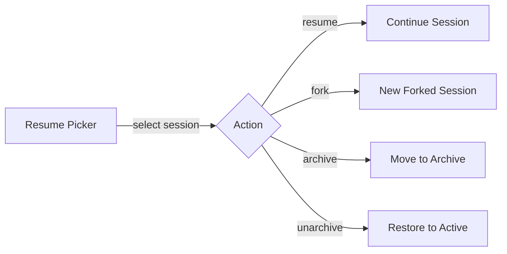
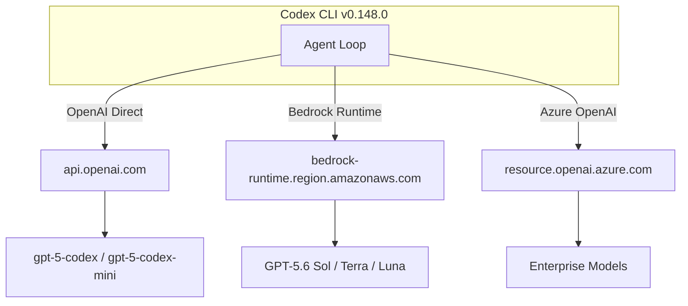
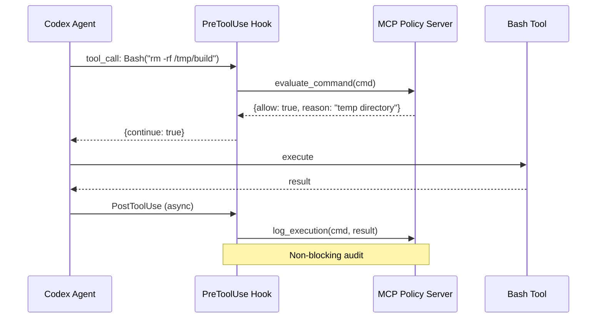

# Codex CLI v0.148.0: Markdown Export, Async Hooks, Cost Visibility, and Bedrock Runtime


---

Codex CLI v0.148.0 landed on 18 August 2026 with 393 changes — 25 features, 7 performance improvements, 64 bug fixes, and 3 security patches [^1]. Where v0.147.0 reshaped plugin distribution and approval governance, v0.148.0 closes three gaps that have frustrated production teams since the Rust rewrite: session portability, hook extensibility, and real-time cost transparency.

## Markdown Export with `/export`

Since launch, exporting a Codex CLI session required third-party tools like `codex-export` or manual JSONL parsing [^2]. v0.148.0 adds a first-party `/export` slash command that renders the complete TUI conversation to Markdown and writes it to either the system clipboard or a specified file [^1].

```bash
# Export current session to clipboard
/export

# Export to a specific file
/export ~/notes/refactor-session.md
```

The export includes user prompts, agent responses, tool calls with their outputs, and timestamps — everything needed to paste a session into a pull request description, a handoff document, or a fresh agent session on a different machine. Tool call blocks are fenced with language-tagged code blocks, making the output renderable in any Markdown viewer without post-processing.

For teams that already use `codex-export` for HTML reports or filtered conversation-only transcripts [^2], the built-in `/export` complements rather than replaces: it covers the common case of "get me a Markdown copy of this session, now" without installing anything extra.

## Session Forking and Archive Management

v0.148.0 formalises session forking as a CLI subcommand rather than a TUI-only operation:

```bash
# Fork from the end of a session
codex exec fork <SESSION_ID>

# Fork from a specific event index
codex exec fork <SESSION_ID> --at 42
```

The forked session is fully self-contained — events up to the fork point are copied into the child's `transcript.jsonl`, so the child can be resumed independently without referencing the parent [^3].

The release also integrates archive and restore directly into the resume picker. Previously, archiving required the `/archive` slash command inside a running session or `codex archive` from the shell [^3]. Now the resume picker presents archive and unarchive actions inline, reducing the friction of session housekeeping.



## Draft Prompts During Startup

A small but meaningful UX improvement: you can now type your prompt while the TUI initialises [^1]. Previously, keystrokes during startup were either buffered unpredictably or lost entirely. v0.148.0 shows resume and fork progress during startup and accepts prompt drafting in parallel, so by the time the agent is ready, your instruction is already queued.

## Cost Visibility in `/status`

Until v0.148.0, the `/status` command showed token counts and session limits but no dollar-equivalent cost [^4]. Teams that needed cost tracking had to run external tools like `ccusage` against local session logs [^4].

v0.148.0 adds estimated thread credits or cost to three surfaces:

1. **`/status` output** — shows cumulative estimated cost for the current thread
2. **Status line** — the persistent footer bar now includes a running cost indicator
3. **Terminal title** — eligible workspaces see cost in the terminal title bar

```bash
# Check cost mid-session
/status
# Output now includes:
# Thread cost: ~$0.47 (estimated)
# Tokens: 12,847 in / 8,231 out
```

This is an estimate based on the model's published pricing and the token counts observed in the session [^1]. For API-key-authenticated sessions it uses the API pricing table; for ChatGPT-authenticated sessions it maps to the plan's credit system. The feature is available for "eligible workspaces" — meaning organisations that have cost tracking enabled in their Codex configuration.

## Amazon Bedrock Runtime as Built-in Provider

v0.148.0 promotes Amazon Bedrock from a community-documented workaround to a first-class built-in provider [^1] [^5]. You can now route Codex CLI through Bedrock Runtime with native AWS profile and region support:

```toml
# ~/.codex/config.toml
[providers.bedrock]
profile = "dev-account"
region = "us-east-1"
model = "gpt-5.6-terra"
```

The integration supports the full GPT-5.6 family — Sol for frontier reasoning, Terra for daily development, and Luna for classification and routing tasks [^5]. Authentication follows the standard AWS SDK credential chain: if `AWS_BEARER_TOKEN_BEDROCK` is set, Codex uses it; otherwise it falls through to profile credentials, instance roles, or SSO [^5].



For enterprises already running GPT-5.6 on Bedrock through LiteLLM or custom proxies [^6], the built-in provider eliminates the proxy layer and its associated latency, configuration drift, and maintenance overhead.

## Async Hooks and MCP Tool Invocation

This is the headline change for teams building custom governance and observability pipelines. v0.148.0 makes two additions to the hook system [^1] [^7]:

### Asynchronous Hook Execution

Hooks can now run in the background by setting `"async": true` in the handler configuration [^7]:

```json
{
  "hooks": {
    "PostToolUse": [
      {
        "matcher": { "tool_name": ".*" },
        "handler": {
          "type": "command",
          "command": ["python3", "audit-logger.py"],
          "async": true
        }
      }
    ]
  }
}
```

Async hooks run without blocking the agent loop. Output from background hooks delivers at the next conversation checkpoint rather than inline. Up to eight concurrent background hooks can run per session [^7].

The constraint is that async hooks cannot block, approve, deny, or rewrite operations — they are fire-and-forget observers. This makes them ideal for audit logging, metrics collection, cost tracking, and notification pipelines where latency matters but intervention does not.

### MCP Tool Invocation from Hooks

Hook handlers can now invoke MCP tools directly, not just shell commands [^7]. This means a `PreToolUse` hook can call an MCP server — for example, a policy engine or a code-review service — before deciding whether to approve or deny a tool call:

```json
{
  "hooks": {
    "PreToolUse": [
      {
        "matcher": { "tool_name": "Bash" },
        "handler": {
          "type": "command",
          "command": ["codex-hook-mcp", "--server", "policy-engine", "--tool", "evaluate_command"],
          "timeout_ms": 3000
        }
      }
    ]
  }
}
```

Previously, hooks could only execute shell commands. If you wanted a hook to query an MCP server, you had to write a wrapper script that spoke the MCP protocol over stdio or HTTP. v0.148.0 removes that indirection [^1].



## Bug Fixes Worth Noting

Three categories of fixes in v0.148.0 deserve attention from production users [^1]:

**Model switching reliability.** Changing models or settings mid-session no longer corrupts active turns or leaves stale instructions from the previous model's system prompt. This was a recurring complaint in multi-model workflows where teams switch between Sol and Terra depending on task complexity.

**Session resume fidelity.** Resumed sessions now properly restore the working directory and approval policies. Previously, resuming a session could silently reset to the home directory or drop custom approval overrides — both dangerous in automated pipelines.

**Sandbox fail-closed behaviour.** Denied or unreadable path restrictions now consistently fail closed on both Linux and Windows [^1]. Earlier versions had edge cases where sandbox restrictions would silently succeed on certain path patterns, particularly on Windows with NTFS alternate data streams.

## Upgrade Path

```bash
# Update via npm
npm update -g @openai/codex

# Verify version
codex --version
# 0.148.0

# Check installation health
codex doctor
```

v0.148.0 has no breaking changes from v0.147.0 [^1]. The deprecated `codex exec --full-auto` flag was already removed in v0.147.0 — if you missed that migration, it remains absent here.

## What Is Still Missing

Despite the progress, several gaps remain:

- **PreToolUse coverage** still does not fire for all tool types. While MCP tool calls now have hook support, not every internal tool triggers the full hook lifecycle [^8].
- **Cost estimates** are just that — estimates. They do not account for cached input tokens, batch pricing, or negotiated enterprise rates.
- **Async hooks** cannot modify agent behaviour. If you need a hook to approve or deny based on an external service call, it must remain synchronous.
- **Bedrock Runtime** support does not yet include response-body inspection or Bedrock Guardrails integration.

## Citations

[^1]: OpenAI, "Codex CLI v0.148.0 Release Notes", GitHub Releases, 18 August 2026. [https://github.com/openai/codex/releases](https://github.com/openai/codex/releases)

[^2]: jinghan23, "codex-export: Export Codex CLI or Codex Desktop sessions to Markdown", GitHub, 2026. [https://github.com/jinghan23/codex-export](https://github.com/jinghan23/codex-export)

[^3]: OpenAI, "Codex CLI Session Lifecycle: Archive, Resume, Fork, and Compact", Codex Knowledge Base, June 2026. [https://codex.danielvaughan.com/2026/06/05/codex-cli-session-lifecycle-archive-resume-fork-compact-management/](https://codex.danielvaughan.com/2026/06/05/codex-cli-session-lifecycle-archive-resume-fork-compact-management/)

[^4]: Viberank, "How to Check Codex Usage: /status, Token Counts & Costs (2026)", 2026. [https://www.viberank.app/blog/codex-token-usage-leaderboard](https://www.viberank.app/blog/codex-token-usage-leaderboard)

[^5]: AWS, "Get started with OpenAI GPT-5.5, GPT-5.4 models, and Codex on Amazon Bedrock", AWS News Blog, 2026. [https://aws.amazon.com/blogs/aws/get-started-with-openai-gpt-5-5-gpt-5-4-models-and-codex-on-amazon-bedrock/](https://aws.amazon.com/blogs/aws/get-started-with-openai-gpt-5-5-gpt-5-4-models-and-codex-on-amazon-bedrock/)

[^6]: Gary A. Stafford, "Using OpenAI Codex CLI with LiteLLM AI Gateway and Amazon Bedrock Mantle", Medium, July 2026. [https://garystafford.medium.com/using-openai-codex-cli-with-litellm-and-amazon-bedrock-mantle-dca90a91db15](https://garystafford.medium.com/using-openai-codex-cli-with-litellm-and-amazon-bedrock-mantle-dca90a91db15)

[^7]: OpenAI, "Hooks — Codex CLI Documentation", ChatGPT Learn, 2026. [https://learn.chatgpt.com/docs/hooks](https://learn.chatgpt.com/docs/hooks)

[^8]: "Inconsistent PreToolUse hook coverage across tool handlers", GitHub Issue #20204, openai/codex, 2026. [https://github.com/openai/codex/issues/20204](https://github.com/openai/codex/issues/20204)
