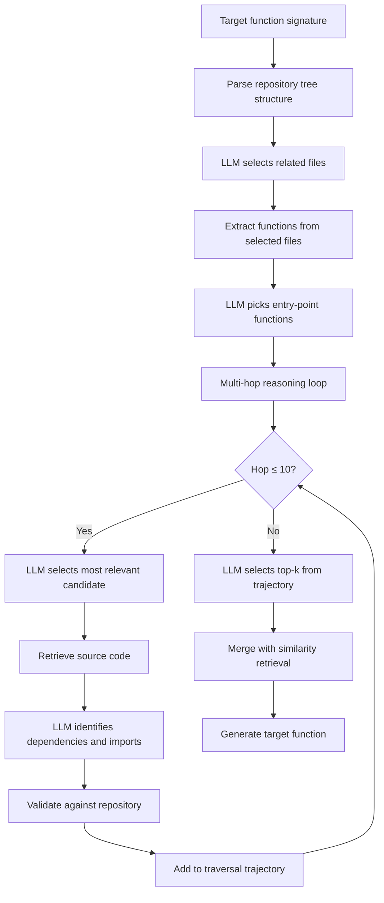
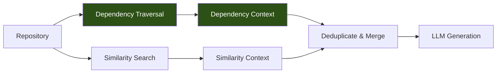

# DyCoder and Partial Dependency Graphs: What On-Demand Dependency Traversal Means for Your Codex CLI Context Strategy


---

When a coding agent generates a function inside a large repository, the quality of what it produces depends almost entirely on the quality of the context it retrieves. Feed it the wrong files and it hallucinates imports, invents APIs, or duplicates logic that already exists three directories away. Feed it too many files and the context window drowns in noise. The retrieval strategy is the bottleneck — not the model.

Liu et al.'s DyCoder (arXiv:2608.01927, accepted at ASE 2026) [^1] attacks this problem with a technique that should change how you think about Codex CLI's context budget: **partial dependency graphs built on demand, traversed by an LLM, then discarded**. No global index. No static analysis toolchain. No training. The results — a 25.63% relative Pass@1 improvement on CoderEval and 59.73% on DevEval, whilst running 7.4× faster than static-graph baselines — suggest that the retrieval strategies most coding agents use today are leaving substantial performance on the table [^1].

## The Problem with Similarity-Based Retrieval

Most repository-level RAG pipelines embed every function in the codebase, compute cosine similarity against the target function's signature, and retrieve the top-k nearest neighbours. This is fast and simple, but it systematically misses **dependency context** — the utility functions, base classes, and configuration objects the target function actually calls or imports [^1].

Consider generating a Django view that calls a custom permission class, a serialiser, and a queryset method defined in three different modules. Similarity search finds functions that *look like* the target; dependency traversal finds functions the target *needs*. These are frequently different sets.

DyCoder's ablation study quantifies this gap: removing the dependency retriever (DyRetriever) whilst keeping similarity retrieval drops Pass@1 by 45.2–51.1% on DevEval [^1]. Removing similarity retrieval whilst keeping DyRetriever drops it by only 6.5–23.8%. **Dependency context contributes more than similarity context**, though the combination is strongest.

## How DyRetriever Works

DyRetriever replaces static whole-repository graph construction with a two-stage, LLM-driven traversal:



### Stage 1: Entry-Point Selection

The repository is parsed into a tree structure. An LLM examines the target function's signature and selects potentially relevant files, then identifies entry-point functions within them — simulating how a human developer with repository familiarity would begin navigating the codebase [^1].

### Stage 2: Multi-Hop Reasoning

Starting from each entry point, the algorithm iterates through three operations per hop:

1. **Select** — the LLM chooses the most relevant unvisited candidate function
2. **Visit** — retrieves the full source code of the selected function
3. **Expand** — the LLM identifies function calls and lazy imports from the code and its import statements

Crucially, each identified dependency is validated against the repository: functions that do not exist in the codebase (hallucinations) or belong to the standard library are discarded [^1]. Manual inspection of 60 expand operations showed 93.22% accuracy in dependency identification — comparable to static analysis tools at 77.4–99.2% [^1].

The traversal continues for up to 10 hops, then the LLM selects the top-k most relevant functions from the entire trajectory.

### The "Partial" in Partial Dependency Graph

The key architectural insight is that the dependency graph is **never fully constructed**. DyRetriever builds only the subgraph relevant to the current generation target, then discards it. This eliminates the indexing cost that makes static-graph approaches impractical at scale: DyCoder spends 85.62 seconds on indexing versus RepoScope's 875.32 seconds — a 10× reduction [^1].

## Benchmark Results

DyCoder was evaluated with three LLMs across two benchmarks [^1]:

| Benchmark | Model | DyCoder Pass@1 | Best Baseline | Relative Gain |
|-----------|-------|---------------|---------------|---------------|
| CoderEval | Qwen3-Coder-30B | 51.04% | 38.70% (RepoScope) | +31.9% |
| CoderEval | GPT-4o-mini | 46.96% | 43.48% (RepoScope) | +8.0% |
| CoderEval | DeepSeek-v3.2 | 40.35% | 35.22% (RepoScope) | +14.6% |
| DevEval | Qwen3-Coder-30B | 47.25% | 36.35% (RepoScope) | +30.0% |
| DevEval | GPT-4o-mini | 40.84% | 38.01% (RepoScope) | +7.4% |
| DevEval | DeepSeek-v3.2 | 28.39% | 26.92% (RepoScope) | +5.5% |

Two patterns stand out. First, the improvement is **model-dependent**: Qwen3-Coder-30B shows 14.65–30.99% gains whilst GPT-4o-mini shows 7.5–9.0% [^1]. Stronger reasoning models extract more value from dependency context. Second, the combined retrieval (DyRetriever + similarity) consistently outperforms either method alone, confirming **strong complementarity** between the two retrieval strategies [^1].

The cost per function is approximately \$0.0039 in LLM API calls [^1], making the approach economically viable even for large repositories.

## What This Means for Codex CLI

Codex CLI v0.148.0 does not use partial dependency graphs internally, but its existing feature set provides the building blocks to approximate DyCoder's strategy.

### MCP Tool Search as the Dependency Discovery Layer

Codex CLI's MCP tool search [^2] already supports paginated discovery across local, personal, workspace, and remote catalogues. An MCP server that exposes repository dependency information — call graphs, import maps, or AST-derived relationships — would give the agent access to the same dependency traversal that DyRetriever performs.

Several existing MCP servers move in this direction. Context7 provides live library documentation lookups [^3], and Repomix aggregates repository context for LLM consumption [^3]. A purpose-built dependency-graph MCP server that accepts a function signature and returns its transitive dependency chain would close the gap.

### Context Budget Configuration

Codex CLI's `model_auto_compact_token_limit` and `tool_output_token_limit` settings control how much context the model sees [^4]. DyCoder's results suggest these budgets should be **dependency-weighted**: a smaller set of dependency-relevant functions outperforms a larger set of similarity-relevant functions.

In practice, this means preferring AGENTS.md directives that instruct the agent to trace imports and call chains before generating code, rather than relying on broad file search:

```toml
# config.toml — tighter context, dependency-first
[model]
model_auto_compact_token_limit = 120000

[tools]
tool_output_token_limit = 16000
```

### AGENTS.md Dependency-First Directives

You can encode DyCoder's retrieval strategy as AGENTS.md instructions:

```markdown
## Code Generation Protocol

When generating a new function:
1. Read the function signature and identify all imported modules
2. Trace each import to its source file — read that file
3. For each called function in those files, check if it calls further
   project-internal functions (max 3 hops)
4. Collect the dependency chain before writing any implementation
5. Prefer dependency context over similarity-matched files when
   the context budget is tight
```

This manually encodes the entry-point selection → multi-hop reasoning → generation pipeline that DyCoder automates.

### PostToolUse Hooks for Dependency Validation

DyRetriever's post-processing step — validating that identified dependencies actually exist in the repository — maps directly to Codex CLI's PostToolUse hooks [^4]. A hook that fires after file reads could verify that any function references in the agent's reasoning correspond to real symbols:

```bash
#!/usr/bin/env bash
# .codex/hooks/post-tool-use/validate-deps.sh
# Verify referenced functions exist in the codebase

if [ "$CODEX_TOOL_NAME" = "read_file" ]; then
  # Extract function names from agent's recent reasoning
  # and verify they exist in the repository
  grep -rn "def ${REFERENCED_FUNC}" src/ || \
    echo "WARNING: ${REFERENCED_FUNC} not found in repository"
fi
```

## The Deeper Lesson: Retrieval Strategy > Model Size

DyCoder's most striking result is not the absolute numbers but the **interaction between retrieval quality and model capability**. GPT-4o-mini with DyCoder (46.96% on CoderEval) outperforms DeepSeek-v3.2 without it (35.22%) [^1]. A smaller model with better context beats a larger model with worse context.

This inverts the common assumption that model upgrades are the primary lever for improving agent output. For Codex CLI users, the implication is clear: investing in your context engineering — AGENTS.md directives, MCP server configuration, retrieval strategy — yields larger returns than waiting for the next model release.



## Gaps and Limitations

Several limitations constrain direct application to Codex CLI workflows:

- **Python only**: DyCoder has been evaluated exclusively on Python repositories [^1]. Codex CLI operates across all languages, and dependency resolution varies significantly between ecosystems (Python imports vs. Go packages vs. Rust crate modules).
- **No built-in dependency MCP server**: Codex CLI ships no dependency-graph tool. Users must build or install one.
- **LLM cost at scale**: At \$0.0039 per function [^1], generating 1,000 functions costs roughly \$3.90 in retrieval alone — manageable, but not negligible for CI pipelines generating code at volume.
- **Hallucination in dependency identification**: Despite 93.22% accuracy [^1], the remaining ~7% of incorrectly identified dependencies could introduce misleading context. The post-processing validation step is essential but imperfect.

⚠️ The paper does not evaluate DyCoder with GPT-5.x models or within an agentic loop where the agent can iteratively refine its retrieval. Performance in a multi-turn Codex CLI session may differ from the single-shot evaluation reported.

## Practical Takeaways

1. **Trace dependencies before generating code** — encode this as an AGENTS.md directive
2. **Combine dependency and similarity retrieval** — neither alone is sufficient; the ablation shows 45–51% degradation from dropping either [^1]
3. **Build on-demand, not up-front** — partial graphs are 10× faster than global graphs and deliver better results
4. **Invest in context engineering over model upgrades** — retrieval quality amplifies model capability disproportionately
5. **Validate retrieved context** — use PostToolUse hooks to catch hallucinated function references before they pollute generation

## Citations

[^1]: Liu, Z., Jiang, Z., Ye, Z., Wang, H., Liu, J. & Ren, X. (2026). "Effective and Efficient Context Retrieval via Partial Dependency Graph for Repository-Level Code Generation." arXiv:2608.01927. Accepted at ASE 2026. [https://arxiv.org/abs/2608.01927](https://arxiv.org/abs/2608.01927)

[^2]: OpenAI. (2026). Codex CLI MCP Integration Documentation. [https://developers.openai.com/codex/remote-connections](https://developers.openai.com/codex/remote-connections)

[^3]: Vaughan, D. (2026). "Documentation MCP Servers for Codex CLI: Context7, Repomix, and Live Library Lookups." Codex Knowledge Base. [https://codex.danielvaughan.com/2026/04/30/codex-cli-documentation-mcp-servers-context7-live-library-lookups/](https://codex.danielvaughan.com/2026/04/30/codex-cli-documentation-mcp-servers-context7-live-library-lookups/)

[^4]: OpenAI. (2026). Codex CLI v0.148.0 Release. [https://github.com/openai/codex/releases](https://github.com/openai/codex/releases)

[^5]: Crosley, B. (2026). "Codex CLI Guide 2026: Setup, Sandbox, AGENTS.md & MCP." [https://blakecrosley.com/guides/codex](https://blakecrosley.com/guides/codex)

[^6]: CodeGateway. (2026). "OpenAI Codex CLI Complete Reference 2026." [https://www.codegateway.dev/en/blog/openai-codex-cli-complete-guide-2026](https://www.codegateway.dev/en/blog/openai-codex-cli-complete-guide-2026)
