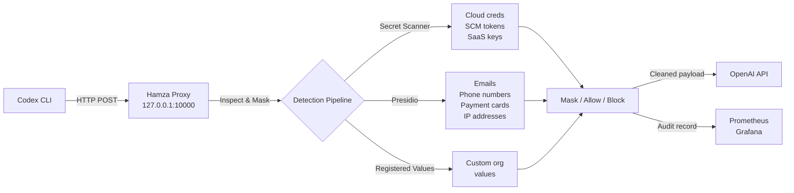
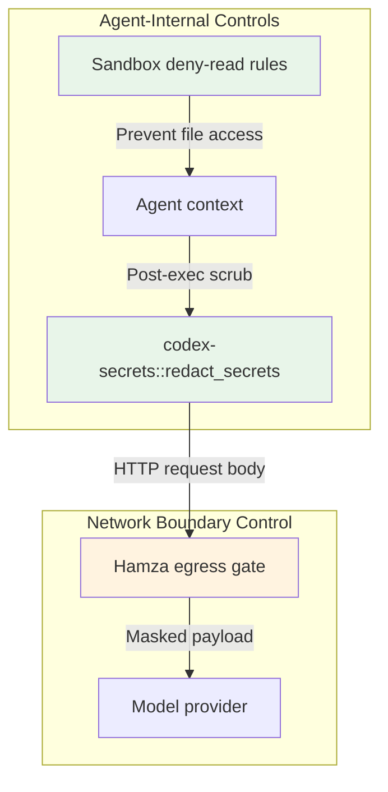

# Egress Gates and the Prompt Data Boundary: How Hamza Closes the Gap Codex CLI's Built-In Redaction Cannot


---

Codex CLI v0.147.0 shipped meaningful secrets redaction — stripping bearer tokens from displayed commands, adding deny-read sandbox entries for `.env*`, private keys, `.aws/credentials`, and a dozen other sensitive paths [^1]. That is welcome, but it solves only half the problem. The deny-read rules prevent the agent from *reading* secret files; `codex-secrets::redact_secrets` scrubs values from *output* shown to the model [^2]. Neither mechanism inspects what actually leaves your machine in the HTTP request body. If a secret appears in a code comment the agent already ingested, or a customer email address sits in a fixture the agent legitimately read, that data travels to OpenAI verbatim.

This is the **prompt data boundary** problem: the perimeter where assembled prompt content exits your network. Existing security tooling — secret scanners in CI, endpoint DLP, web security gateways — cannot see inside the JSON payloads that coding agents construct at runtime [^3]. Hamza, an open-source egress gate released by Softcane in mid-2026, sits on that boundary and masks secrets and personal data before they reach the model provider [^4].

## Why Built-In Redaction Is Necessary but Insufficient

Codex CLI's redaction operates in two places:

1. **Sandbox deny-read rules** block the agent from opening files matching sensitive globs (`.env*`, `*.pem`, `.npmrc`, `.pypirc`, `.netrc`, `secrets/**`) [^1].
2. **Post-exec output redaction** via `codex-secrets::redact_secrets` strips AWS secret assignments, GitHub tokens, JWTs, private key blocks, and common `TOKEN=`/`SECRET=` patterns from tool output before it enters the conversation history [^2].

Both are *agent-internal* controls. They rely on the agent's own runtime to enforce policy. Three classes of sensitive data slip through:

- **Pre-ingested content.** If the agent read a file *before* a deny-read rule was added, the secret is already in the conversation context.
- **Inline credentials.** A hardcoded API key inside application source code that the agent legitimately needs to read passes through unredacted because it is not tool *output* — it is tool *input*.
- **Personal data.** Customer names, email addresses, payment identifiers in test fixtures or database seeds are not secrets in the cryptographic sense, so `redact_secrets` ignores them.

An egress gate addresses all three because it inspects the *assembled request body* — the final payload — regardless of how the content entered the conversation.

## Hamza's Architecture

Hamza is a Java 25 reverse proxy that interposes between coding agents and their upstream API endpoints [^4]. It supports both Codex CLI and Claude Code.



Three detection engines run in sequence on every request body [^4]:

| Engine | What it finds | Configuration |
|--------|--------------|---------------|
| **Secret scanner** | Cloud credentials, source-control tokens, package-registry keys, SaaS credentials | Built-in rules |
| **Presidio** | Emails, phone numbers, payment cards, IP addresses, configurable PII entity types | `detector/presidio/approved-profile.json` |
| **Registered-value detector** | Organisation-specific customer values you explicitly register | Custom dictionary |

Each finding triggers one of three actions: **mask** (replace with a deterministic placeholder), **allow** (let it through), or **block** (reject the entire request). The masked placeholders — `<SECRET_1>`, `<EMAIL_482191>` — are consistent within a request, so the model can still follow references without accessing the original value [^4].

Critically, audit records contain the action, detector type, and byte counts, but *never* the matched values themselves [^4]. This means the audit trail is safe to ship to a central SIEM without creating a secondary secrets store.

## Configuring Codex CLI to Route Through Hamza

### Starting Hamza

Hamza ships as a Docker Compose stack [^4]:

```bash
HAMZA_POSTURE=MASK docker compose up -d --build
```

This starts three services:

- **Proxy** on `http://127.0.0.1:10000`
- **Grafana** dashboard on `http://127.0.0.1:3000`
- **Prometheus** metrics on `http://127.0.0.1:8080/actuator/prometheus`

Presidio loads on first start (allow a minute for model initialisation). To disable PII detection entirely, set `HAMZA_PRESIDIO_ENABLED=false`.

### Pointing Codex CLI at the Proxy

Add a provider block to `~/.codex/config.toml` that routes through Hamza [^4] [^5]:

```toml
[provider]
base_url = "http://127.0.0.1:10000/backend-api/codex"
wire_api = "responses"
```

Codex CLI resolves the API key from the `env_key` setting as usual — the key travels through Hamza to reach OpenAI, but Hamza does not log or store it [^4].

For Claude Code, the equivalent configuration is:

```bash
export ANTHROPIC_BASE_URL=http://127.0.0.1:10000
```

### Verifying the Pipeline

Run a quick test that deliberately includes a dummy secret:

```bash
echo 'AWS_SECRET_ACCESS_KEY=wJalrXUtnFEMI/K7MDENG/bPxRfiCYEXAMPLEKEY' > /tmp/test-secret.txt
codex "read /tmp/test-secret.txt and tell me what it contains"
```

In the Grafana dashboard, you should see a masked finding with detector type `SECRET_SCANNER` and action `MASK`. The model receives `<SECRET_1>` instead of the key value.

## Defence in Depth: Layering Hamza with Codex CLI's Controls

The two systems complement rather than compete:



| Layer | What it stops | Limitation |
|-------|--------------|------------|
| **Deny-read sandbox** | Agent reading `.env`, `*.pem`, `credentials` | Only covers known file patterns; does not catch inline secrets in source code |
| **`redact_secrets`** | Secrets in tool output before they enter conversation history | Pattern-based; misses PII and custom org values |
| **Hamza egress gate** | Secrets and PII in the final HTTP payload | Adds ~5–15 ms latency per request; requires Docker |

For enterprise deployments, you want all three layers active. The sandbox is the cheapest control (zero latency, prevents reads entirely). Output redaction catches secrets that bypass the sandbox. The egress gate is the final safety net that catches everything the first two layers missed.

## The Audit Trail Gap

One underappreciated benefit of an egress gate is the audit trail it produces. Codex CLI's built-in redaction is silent — it strips values without logging what it found or where [^2]. In a regulated environment, "we redacted something" is not sufficient; you need evidence of *what category* of data was detected and *how often*.

Hamza's Prometheus metrics expose counters per detector type and action [^4]:

```
hamza_findings_total{detector="SECRET_SCANNER",action="MASK"} 47
hamza_findings_total{detector="PRESIDIO",action="MASK"} 12
hamza_findings_total{detector="REGISTERED_VALUE",action="BLOCK"} 3
```

These counters feed compliance dashboards without exposing the underlying sensitive data. For SOC 2 and ISO 27001 evidence collection, this is the difference between "we have controls" and "we can prove our controls work."

## Known Limitations

Hamza is young (seven commits on `main` as of August 2026) and carries the expected caveats [^4]:

- **Java 25 dependency.** The proxy requires a current JDK, which may conflict with enterprise Java standardisation on LTS releases.
- **Single-host deployment.** The Docker Compose stack runs on localhost. A team-wide deployment needs a shared proxy endpoint, TLS termination, and auth — none of which Hamza provides out of the box.
- **No response inspection.** Hamza inspects *requests* (prompts going to the model) but not *responses* (model output coming back). A model that hallucinates a realistic-looking API key in its response is not caught.
- **Presidio accuracy.** Named-entity recognition for PII has inherent false-positive and false-negative rates. Aggressive thresholds mask variable names that look like email addresses; conservative thresholds miss edge-case PII formats.

## Practical Recommendations

1. **Start with `HAMZA_POSTURE=MASK`** and monitor the Grafana dashboard for a week before tightening to `BLOCK` on specific detector categories.
2. **Register organisation-specific values** (customer account IDs, internal hostnames, project codenames) in the registered-value detector. These are the data points that generic scanners will always miss.
3. **Keep Codex CLI's deny-read rules active.** The egress gate is a safety net, not a replacement for preventing file access in the first place.
4. **Pin your Presidio entity list.** Edit `approved-profile.json` to enable only the entity types relevant to your data classification policy. Fewer active detectors means fewer false positives and lower latency.
5. **Export Prometheus metrics to your SIEM.** The audit trail is only useful if someone reviews it.

## Conclusion

Codex CLI v0.147.0's secrets redaction is a solid agent-internal control, but it cannot inspect the final payload that leaves your machine. Hamza fills that gap as a transparent egress proxy with three detection engines, deterministic masking, and a privacy-safe audit trail. For any team running coding agents against production codebases — where secrets and customer data inevitably appear in source files — an egress gate is no longer optional. It is the control that makes the difference between hoping your agent does not leak data and proving it does not.

---

## Citations

[^1]: OpenAI, "Release 0.147.0," GitHub, August 2026. [https://github.com/openai/codex/releases/tag/rust-v0.147.0](https://github.com/openai/codex/releases/tag/rust-v0.147.0)

[^2]: OpenAI, "Redact secrets from app-server command execution items," Pull Request #36893, GitHub, August 2026. [https://github.com/openai/codex/pull/36893](https://github.com/openai/codex/pull/36893)

[^3]: FutureAGI, "Enterprise Controls for All CLI Coding Agents: A 2026 Gateway Field Guide," 2026. [https://futureagi.com/blog/enterprise-controls-cli-coding-agents-gateway-field-guide-2026/](https://futureagi.com/blog/enterprise-controls-cli-coding-agents-gateway-field-guide-2026/)

[^4]: Softcane, "Hamza: An egress gate for CLI coding agents," GitHub, 2026. [https://github.com/softcane/hamza](https://github.com/softcane/hamza)

[^5]: Codex CLI documentation, "Custom Model Providers: config.toml Configuration," 2026. [https://codex.danielvaughan.com/2026/04/23/codex-cli-custom-model-providers-configuration-guide/](https://codex.danielvaughan.com/2026/04/23/codex-cli-custom-model-providers-configuration-guide/)
