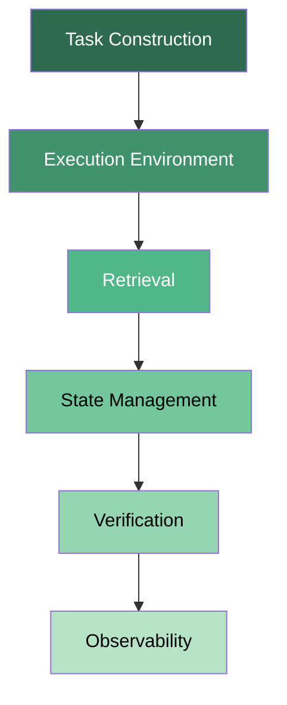
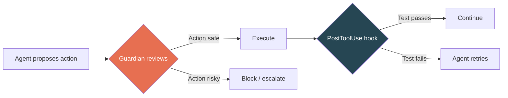

# Engineering Reliable Coding Agents: What 206 Gated Practices Reveal About the System Around Your Model


---

Stephanie Jarmak's 314-page monograph *Engineering Reliable Coding Agents: Evaluating and Operating the System Around the Model* (arXiv:2608.13867, August 2026) lands a single thesis that ought to unsettle every team running Codex CLI in production: **many apparent model failures originate elsewhere in the system** [^1]. The paper synthesises 164 scholarly works, 100 practitioner records, 29 benchmark records and 17 author-system case records into a versioned catalogue of 206 reliability records — 193 gated practices (56 developed in depth) plus 13 research leads [^1]. This article maps Jarmak's dependency-chain framework to Codex CLI's current architecture, identifies where the harness already covers a gated practice, and flags the gaps that remain.

## The Dependency Chain

Jarmak frames coding-agent reliability as a six-layer dependency chain. A weakness at any layer can invalidate everything downstream, and — critically — improvements at one layer frequently fail to propagate to end-to-end outcomes without systemic alignment [^1]. The layers are:



Each layer has its own failure modes, its own repair primitives and — the key insight — its own **repair asymmetry**: fixing a retrieval bug does not fix a verification gap, even if the symptom looked identical [^1].

## Repair Asymmetry in Practice

The monograph's companion data exposes a pattern familiar to anyone who has debugged a Codex CLI session: a practitioner audited their release gate's decision inputs and discovered that four of ten inputs were "self-reports from the component being gated" [^2]. The agent was, in effect, grading its own homework. Swapping the model for a stronger one would not have helped — the infrastructure was the fault.

This is the repair asymmetry that Jarmak formalises: **the layer where you observe the failure is rarely the layer where the fix belongs** [^1].

## Mapping the Six Layers to Codex CLI

### Layer 1: Task Construction

Task construction determines what the agent is asked to do and under what constraints. In Codex CLI, this layer is served by three mechanisms:

- **AGENTS.md** — project-level instructions loaded at session start, scoping the agent's behaviour, coding standards, file boundaries and tool preferences [^3].
- **Named profiles** — `config.toml` profile sections (`[profiles.ci]`, `[profiles.dev]`) that bundle model, sandbox, approval and MCP overrides into a single activation unit [^3].
- **Goal mode** — persistent, long-horizon objectives with pause/resume semantics, giving the agent a structured task scope rather than an open-ended prompt [^3].

Jarmak's gated practices for task construction emphasise explicit constraint specification and scope boundaries [^1]. AGENTS.md covers this well for interactive sessions, but **headless `codex exec` runs receive no interactive clarification** — if the task prompt is ambiguous, the agent proceeds regardless. Teams running `codex exec` in CI should treat the prompt as a contract: specify file scope, expected outputs, and exit conditions.

### Layer 2: Execution Environment

The execution environment is the sandbox in which the agent's tool calls execute. Codex CLI ships three sandbox implementations:

| Platform | Sandbox | Mechanism |
|----------|---------|-----------|
| macOS | Seatbelt | `sandbox-exec` profile restricting filesystem, network, IPC |
| Linux | Landlock | Kernel-level filesystem access control (v0.147.0+) |
| Windows | Restricted tokens | Process-level privilege restriction |

The sandbox **fails closed** on Linux and Windows as of v0.148.0 [^4] — if the sandbox cannot be established, the agent refuses to execute rather than running unrestricted. This aligns with Jarmak's gated practice of treating environment setup failures as hard stops rather than degraded-mode operations [^1].

However, the monograph identifies Docker-based environment setup as "highly failure-prone" across the industry [^1]. Codex CLI does not manage its own container lifecycle; teams using containerised workflows must ensure the image provides all build dependencies before the agent starts. A `PreToolUse` hook that validates toolchain availability at session start would cover this gap:

```bash
#!/usr/bin/env bash
# hooks/pre-session-check.sh — validate build environment
command -v cargo >/dev/null 2>&1 || { echo "cargo not found"; exit 1; }
command -v node >/dev/null 2>&1 || { echo "node not found"; exit 1; }
```

### Layer 3: Retrieval

Retrieval covers how the agent locates relevant code and documentation. Codex CLI's retrieval stack includes:

- **MCP tool search** — the default discovery mechanism for MCP-served tools and resources, including paginated discovery under the MCP 2026-07-28 protocol [^5].
- **File reading** — direct `cat_file`, `read_file` and `list_dir` tool calls within the sandbox.
- **Context7 and documentation MCP servers** — live library documentation lookups via third-party MCP servers [^3].

Jarmak highlights that retrieval quality is not just about recall — it is about **anchor dose**, the within-file context density that correlates with task success [^1]. Recent research by Adkins & Trapaidze (arXiv:2608.14838) confirms this for Codex CLI specifically: disabling deduplication in 12-slot context packs improved GPT-5.6 resolution by 7.6 percentage points (39.2% → 46.8%, p=0.0003) by increasing file depth at the cost of recall [^6].

The practical implication: configure `tool_output_token_limit` in `config.toml` to preserve depth rather than breadth when working on focused refactoring tasks.

### Layer 4: State Management

State management governs how the agent maintains context across turns. Codex CLI provides:

- **Memories** — a two-phase pipeline (extraction → consolidation) that persists project-level facts across sessions [^3].
- **Session persistence** — SQLite-backed session state with archive, resume, fork and compact operations [^3].
- **Conversation sections** — persistent, manually ordered groupings introduced in v0.147.0 for navigating long transcripts [^5].
- **Auto-compaction** — `model_auto_compact_token_limit` triggers automatic context summarisation when the token budget is exhausted [^3].

Jarmak's framework identifies a critical gap that Codex CLI shares with most coding agents: **compaction destroys verification evidence** [^1]. When the context window fills and auto-compaction fires, the summarised context may drop the specific assertions, file paths and test outputs that a later verification step would need. There is no compaction notification event, and no mechanism to mark certain context segments as non-compactable.

A defensive pattern is to pin critical facts in AGENTS.md (which is loaded outside the compaction window) or to use Memories to persist verification checkpoints that survive compaction:

```toml
# config.toml — give compaction more headroom
model_auto_compact_token_limit = 180000
```

### Layer 5: Verification

Verification is the layer where the agent's outputs are checked before they reach the user or the codebase. Codex CLI offers:

- **Guardian auto-review** — a separate reviewer subagent (using the `codex-auto-review` model) that adjudicates shell execution, file writes, network access and MCP tool invocations [^3].
- **`--approve-for-me` flag** — turns interactive approval prompts into Guardian-adjudicated decisions (v0.147.0+) [^5].
- **`PostToolUse` hooks** — user-defined scripts that run after every tool call, enabling custom validation, linting or test execution [^3].
- **`PreToolUse` hooks** — gating hooks that can block a tool call before execution [^3].

The audit-your-own-gate anti-pattern that Jarmak surfaces [^2] maps directly to Guardian's current architecture: Guardian reviews **actions** (shell commands, file writes), not **factual claims**. If the agent writes a function that compiles and passes the linter but contains a logic error, Guardian approves it. The verification is scoped to the wrong abstraction level.



The gap is between Guardian (action-level review) and what Jarmak calls **claim-level verification** [^1]. A `PostToolUse` hook that runs targeted tests against the changed files partially closes this gap, but it requires the team to write and maintain those hooks.

### Layer 6: Observability

Observability tells you what actually happened. Codex CLI's observability stack includes:

- **Rollout JSONL** — typed event records (`RolloutItem`) persisted for every session, capturing tool calls, model responses and metadata [^3].
- **OTLP spans** — OpenTelemetry traces exportable to any OTLP-compatible backend [^3].
- **Langfuse plugin** — a stop-hook pipeline that reads rollout JSONL and pushes structured traces to Langfuse dashboards [^7].
- **`/status` command** — real-time session metrics including estimated cost (v0.148.0+) [^4].
- **`codex doctor`** — diagnostic command reporting environment, Git, terminal, app-server and thread inventory state [^3].

Jarmak's observability practices emphasise **evidence grading** — distinguishing between observed facts, derived inferences, and experimental claims in trace data [^1]. Codex CLI's rollout format captures raw events but does not attach evidence grades or causal edges. The practical consequence is that post-hoc debugging of a failed session requires manual reconstruction of the causal chain.

## The Five Practices That Matter Most

From Jarmak's 56 in-depth gated practices, five map most directly to Codex CLI workflows:

1. **Treat environment setup failures as hard stops, not degraded mode** — Codex CLI's fail-closed sandbox (v0.148.0) already implements this for the sandbox layer. Extend it to build-tool availability with `PreToolUse` hooks.

2. **Separate the reviewer from the reviewed** — Guardian reviews agent actions, but the gating inputs should not come solely from the agent's own reports. Wire `PostToolUse` hooks to external test runners, linters and type checkers.

3. **Pin verification evidence outside the compaction window** — Use AGENTS.md and Memories to preserve critical assertions that auto-compaction would otherwise drop.

4. **Grade your trace evidence** — When reviewing rollout JSONL, distinguish between tool outputs (observed), agent reasoning (derived) and agent claims about code behaviour (inferred). The rollout format does not do this for you.

5. **Audit the dependency chain, not just the model** — Before upgrading from GPT-5.6 Terra to Sol, check whether your retrieval, state management and verification layers can handle the increased output volume without introducing new failure modes.

## What Codex CLI Still Lacks

Mapping Jarmak's framework against Codex CLI v0.148.0 reveals several structural gaps:

| Jarmak Practice | Codex CLI Status | Gap |
|----------------|------------------|-----|
| Compaction notification event | Missing | No hook fires when auto-compaction triggers |
| Non-compactable context segments | Missing | Cannot mark specific context as preservation-critical |
| Claim-level verification | Partial | Guardian reviews actions, not factual claims |
| Evidence-graded trace format | Missing | Rollout JSONL has no evidence-grade metadata |
| Causal edge tracking in traces | Missing | No typed causal relationships between rollout events |
| Environment readiness gate | Manual | Requires user-written `PreToolUse` hooks |

These gaps are not model limitations — they are harness limitations. Fixing them would not require a better model; it would require richer hook events, a compaction-aware context API and an extended rollout schema.

## A Practical Reliability Audit Checklist

For teams running Codex CLI in production, Jarmak's framework suggests a six-point audit:

1. **Task layer** — Does your AGENTS.md specify file scope, output format and exit conditions? For `codex exec` runs, is the prompt a contract or a wish?

2. **Environment layer** — Does the sandbox fail closed? Are build dependencies validated before the agent starts?

3. **Retrieval layer** — Is `tool_output_token_limit` configured for depth over breadth on focused tasks? Are MCP servers returning paginated results under the 2026-07-28 protocol?

4. **State layer** — Is `model_auto_compact_token_limit` set high enough to preserve verification context? Are critical facts pinned in AGENTS.md or Memories?

5. **Verification layer** — Do `PostToolUse` hooks run external validators, or is the agent grading its own homework? Is Guardian's action-level scope sufficient for your risk profile?

6. **Observability layer** — Are rollout JSONL files being retained and analysed? Is OTLP export configured? Can you reconstruct the causal chain of a failed session?

## Conclusion

Jarmak's monograph is the most comprehensive treatment of coding-agent reliability published to date, and its central claim — that the system around the model matters as much as the model itself — is directly actionable for Codex CLI users. The dependency-chain framework provides a structured way to audit your harness, the 206 gated practices offer a checklist for hardening it, and the repair-asymmetry principle explains why upgrading the model alone rarely fixes production failures.

The next time a Codex CLI session produces incorrect output, resist the urge to blame the model. Walk the dependency chain. The fix is almost certainly in a different layer.

---

## Citations

[^1]: Jarmak, S. (2026). "Engineering Reliable Coding Agents: Evaluating and Operating the System Around the Model." arXiv:2608.13867. [https://arxiv.org/abs/2608.13867](https://arxiv.org/abs/2608.13867)

[^2]: Jarmak, S. [@sgjarmak]. (August 2026). Thread on Engineering Reliable Coding Agents companion materials and practitioner audit examples. X (formerly Twitter). [https://x.com/sgjarmak/status/2089454647857869136](https://x.com/sgjarmak/status/2089454647857869136)

[^3]: OpenAI. (2026). "Codex CLI Documentation." ChatGPT Learn / OpenAI Developers. [https://developers.openai.com/codex/cli/features](https://developers.openai.com/codex/cli/features)

[^4]: OpenAI. (2026). "Release 0.148.0." GitHub openai/codex releases. [https://github.com/openai/codex/releases](https://github.com/openai/codex/releases)

[^5]: OpenAI. (2026). "Release 0.147.0." GitHub openai/codex releases. [https://github.com/openai/codex/releases/tag/rust-v0.147.0](https://github.com/openai/codex/releases/tag/rust-v0.147.0)

[^6]: Adkins, C. & Trapaidze, G. (2026). "The Recall Trap: A Recall-Maximizing Retriever Configuration Reduces Issue Resolution." arXiv:2608.14838. [https://arxiv.org/abs/2608.14838](https://arxiv.org/abs/2608.14838)

[^7]: Langfuse. (2026). "codex-observability-plugin." GitHub langfuse/codex-observability-plugin. [https://github.com/langfuse/codex-observability-plugin](https://github.com/langfuse/codex-observability-plugin)
