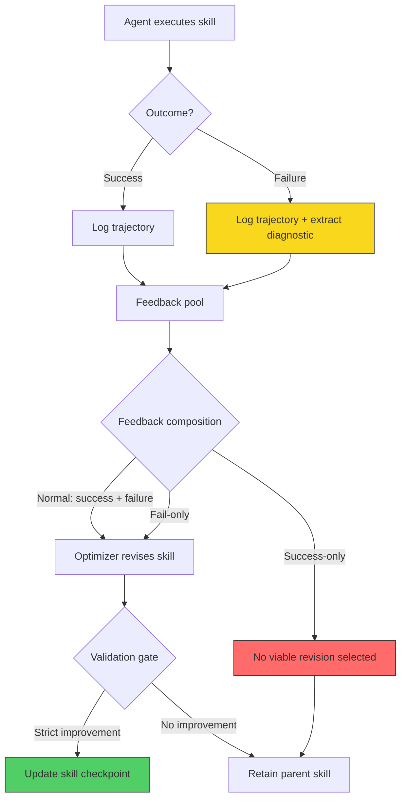

# Feedback Dynamics in Self-Evolving Agent Skills: Why Failures Matter More Than Successes for Your Codex CLI Memories Pipeline


---

A common assumption in agent skill evolution is that more rounds of feedback produce steadily better skills. Liu et al.'s "Rethinking Self-Evolving Agent Skills: Feedback Dynamics over Multiple Rounds" (arXiv:2608.02636, July 2026) dismantles that assumption with controlled evidence across five benchmarks and eight models [^1]. The findings reshape how you should think about Codex CLI's Memories pipeline, PostToolUse hook feedback, and Agent Plugin skill distribution.

## The Core Finding: Evolution Is Sparse, Not Steady

The paper's headline result is sobering. Of 388 candidate skill revisions generated across 14 model–benchmark settings, only 55 (14.2%) established byte-distinct validation improvements [^1]. Skill evolution is not a gradient descent towards better performance — it is a sparse, validation-filtered search where most candidates fail to improve on the parent skill.

This matters for Codex CLI users because the Memories pipeline in v0.148.0 operates on a similar principle: execution feedback from sessions accumulates into persistent memory entries that shape future behaviour [^2]. If evolution is sparse, blindly accumulating every session outcome into Memories wastes context budget without proportionate gains.

## Why Failed Trajectories Beat Successful Ones

The paper's most striking result concerns feedback composition. Three conditions were tested: Normal (successes + failures), Fail-only (failures exclusively), and Success-only (successes exclusively). The outcome was unambiguous:

- **11 of 14** settings selected an evolved skill over the parent
- **All 11** selections came from feedback conditions that included failed trajectories
- **Success-only feedback produced zero selections** — despite improving trajectories in 6 of 14 settings [^1]

This is not a marginal effect. Success-only feedback, whilst producing locally better trajectories, never translated into a skill revision that outperformed the parent on held-out validation. The implication for Codex CLI workflows is direct: your PostToolUse hooks should capture and route failure signals with higher priority than success confirmations.



## Quantitative Gains by Benchmark

The magnitude of skill evolution gains varied dramatically by task type. SpreadsheetBench showed the largest and most consistent improvements across all three primary models:

| Benchmark | GPT-5.5 | Gemini 3.1 Pro | DeepSeek V4-Pro |
|-----------|---------|----------------|-----------------|
| SpreadsheetBench | +35.6 | +37.7 | +28.8 |
| SearchQA | +2.3 | −0.4 | +0.9 |
| LiveMath | −6.6 | +22.6 | +10.4 |
| OfficeQA | +6.8 | parent retained | parent retained |
| DocVQA | parent retained | +6.7 | +5.2 |

The SpreadsheetBench results are particularly telling: all three models converged on the same operational pattern — examining workbooks, executing self-contained scripts, materialising values, and verifying target cells [^1]. This convergence across independently evolved skills suggests that certain task domains contain discoverable procedural recipes that feedback-driven search can reliably find.

## Test-Time Compute Cannot Substitute for Persistent Evolution

A natural question is whether you could skip skill evolution entirely and simply throw more inference compute at the problem. The paper tests this directly using GPT-5.5 with oracle Parallel Sampling and Sequential Refinement as test-time scaling baselines [^1].

On SearchQA, Parallel Sampling came within 0.43 points of the evolved skill (77.50% vs 77.93%). But on SpreadsheetBench, the gap was 30.96 points (54.80% vs 85.77%). Sequential Refinement recovered neither gain [^1].

The implication is clear: for procedurally complex tasks — the kind that dominate real software engineering workflows — persistent skill evolution captures workflow knowledge that response-level diversity cannot replicate. This validates Codex CLI's investment in persistent Memories over single-session inference scaling.

## Mapping to Codex CLI v0.148.0

Codex CLI v0.148.0 ships several primitives that map directly to the paper's evolution pipeline [^2][^3]:

### Memories as the Skill Store

The Memories pipeline persists session-derived learnings across invocations. The paper's finding that only 14.2% of candidates produce genuine improvements suggests a validation gate is essential. Currently, Memories entries accumulate without strict quality filtering — every insight that passes the two-phase pipeline (extraction → deduplication) persists [^2].

**Gap identified:** Codex CLI lacks a validation gate that tests whether a new Memory entry actually improves downstream task performance before committing it. The paper's framework suggests that memories should be treated as candidates subject to held-out validation, not unconditional additions.

### PostToolUse Hooks as Feedback Capture

PostToolUse hooks (exit code 0 for success, exit code 2 for steering feedback) provide the mechanism to capture the failure trajectories that the paper identifies as essential [^3]. A practical hook configuration for feedback-aware skill evolution:

```toml
# hooks.toml — failure-prioritised feedback capture
[[hooks]]
event = "PostToolUse"
command = "python3 feedback-capture.py"

[hooks.environment]
FEEDBACK_MODE = "fail-priority"     # weight failures 3:1 over successes
VALIDATION_GATE = "true"            # require held-out validation before commit
MAX_CANDIDATES_PER_ROUND = "4"      # match paper's revision budget
```

The hook script would log tool call outcomes, extract diagnostic information from failures, and feed them into a skill revision pipeline — mirroring the paper's optimizer component.

### AGENTS.md as Evolved Skill Artefact

The paper's evolved skills are procedural recipes that encode discovered patterns. In Codex CLI, AGENTS.md serves as the analogous artefact — a version-controlled set of directives that shape agent behaviour [^3]. The paper's finding that independently evolved skills converge on benchmark-specific patterns (e.g., SpreadsheetBench's examine-execute-materialise-verify pattern) suggests that AGENTS.md directives should encode these discovered procedures explicitly rather than relying on the model to rediscover them each session.

```markdown
<!-- AGENTS.md — evolved directive from failure feedback -->
## Spreadsheet Manipulation Protocol
When modifying spreadsheets:
1. Examine the full workbook structure before making changes
2. Write self-contained scripts — never rely on prior cell state
3. Materialise all computed values before verification
4. Verify target cells against the original instruction
```

### Named Profiles for Model-Dependent Evolution

The paper demonstrates that evolution dynamics are model-dependent: Normal feedback was selected 9 times vs Fail-only 2 times, but the optimal condition varied by model–benchmark pairing [^1]. Codex CLI's named profiles allow encoding model-specific evolution strategies:

```toml
# profiles/evolution-gpt56.toml
model = "gpt-5.6-terra"
feedback_priority = "normal"        # GPT models benefit from mixed feedback

# profiles/evolution-deepseek.toml
model = "deepseek-v4-pro"
feedback_priority = "fail-only"     # DeepSeek shows stronger fail-only response
```

### Async Hooks for Non-Blocking Evolution

Codex CLI v0.148.0 introduces async hooks that run commands in the background without blocking the agent loop [^2]. This is precisely what a skill evolution pipeline requires — the optimizer can evaluate candidates and update validation checkpoints asynchronously while the agent continues executing with the current best skill.

## The Round Budget Question

The paper's data on round-wise yield has direct implications for how long you should let a Codex CLI session accumulate feedback before consolidating:

- **Rounds 1–4:** 69.1% of new validation bests discovered (38 of 55)
- **Rounds 6–9:** 30.9% of new bests (17 of 55)
- But **6 of 11 final selections** appeared in rounds 6–9 [^1]

This creates a tension: early rounds are more productive per round, but the final winning skill often emerges late. For Codex CLI session strategy, this suggests running PostToolUse feedback capture across at least 6–9 tool invocations before triggering a memory consolidation pass, rather than updating memories after every tool call.

## The Validation–Test Misalignment Warning

Perhaps the paper's most cautionary finding is validation–test misalignment. In the GPT-5.5–LiveMath setting, the evolved skill improved validation by +5.7 points but decreased released-test performance by −6.6 points [^1]. The validation gate selected a skill that overfitted to the validation distribution.

For Codex CLI, this means that internal metrics (did the tests pass? did the linter succeed?) may not predict downstream quality. A PostToolUse hook that only checks exit codes is a necessary but insufficient validation gate. The paper's recommendation to report "search trajectories, skill identity, downstream generalisation, and explicit test-time-compute controls" maps to a need for richer Memories metadata — not just "this worked" but "this worked on this class of task with these constraints" [^1].

## The Broader Eight-Model Picture

The expanded SearchQA analysis across eight models reinforces the sparsity finding. Validation-selected skills improved released-test performance in 7 of 8 models, with Grok 4.5 showing the largest improvement (+15.07 points) and Gemini 3.1 Pro the sole decline (−0.36 points) [^1]. The consistency across architecturally diverse models — from Claude Opus to Qwen3.5-Plus — suggests these dynamics are not model-specific quirks but structural properties of feedback-driven skill search.

## Identified Gaps in Codex CLI

| Paper Capability | Codex CLI Status | Gap |
|-----------------|-----------------|-----|
| Validation-gated skill updates | Memories pipeline has no held-out validation | No quality gate on memory persistence |
| Feedback composition control | PostToolUse captures success/failure | No configurable weighting of failure vs success feedback |
| Byte-distinct candidate tracking | No deduplication beyond text matching | No structural diff of evolved directives |
| Round-budget-aware consolidation | Memories update continuously | No batch consolidation with round awareness |
| Cross-task transfer validation | Per-session memories | No cross-session transfer testing of learned skills |

## Practical Takeaways

1. **Prioritise failure feedback.** Configure PostToolUse hooks to capture diagnostic detail on failures, not just exit codes. Success-only feedback produces zero viable skill evolution.

2. **Gate your Memories.** Treat new memory entries as candidates, not commitments. Hold a small validation set of representative tasks and test whether the memory actually helps before persisting it.

3. **Expect sparsity.** Only ~14% of skill revision attempts yield genuine improvement. Do not tune your evolution pipeline for throughput — tune it for precision.

4. **Batch, do not stream.** Accumulate 6–9 rounds of feedback before consolidating, rather than updating after every tool call. Late-round discoveries are disproportionately likely to be the final selection.

5. **Model-specific strategies.** Use named profiles to encode model-dependent feedback preferences. What works for GPT-5.6 may not work for DeepSeek.

---

## Citations

[^1]: Liu, Y., Su, Z., Zhang, Y., Guo, J., Xie, Z., Jing, H., Xie, L., Zong, Q., Yim, Y., Zhang, Z., Li, H. & Song, Y. (2026). "Rethinking Self-Evolving Agent Skills: Feedback Dynamics over Multiple Rounds." arXiv:2608.02636. [https://arxiv.org/abs/2608.02636](https://arxiv.org/abs/2608.02636)

[^2]: OpenAI. (2026). "Codex CLI v0.148.0 Release Notes." GitHub Releases. [https://github.com/openai/codex/releases/tag/rust-v0.148.0](https://github.com/openai/codex/releases/tag/rust-v0.148.0)

[^3]: OpenAI. (2026). "Codex CLI Documentation: Hooks, AGENTS.md, and Named Profiles." [https://developers.openai.com/codex/cli](https://developers.openai.com/codex/cli)