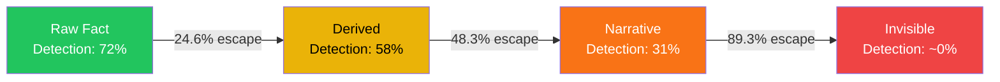
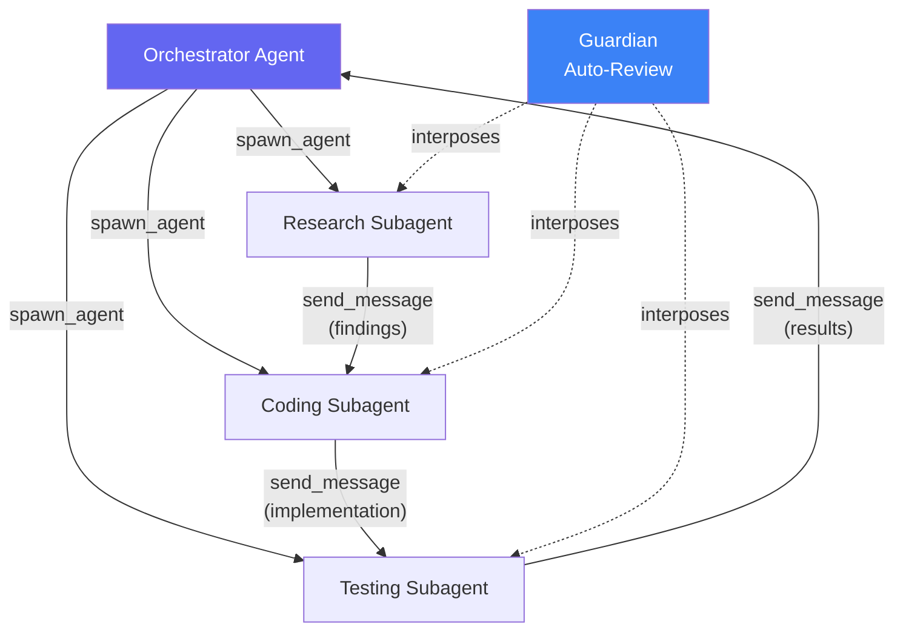
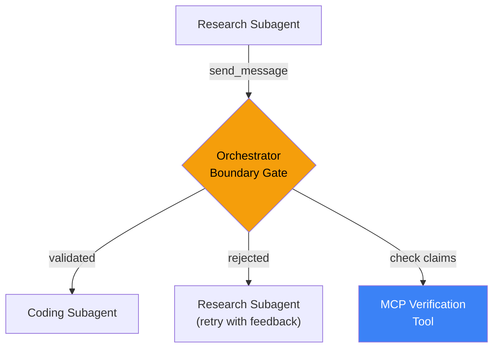

# The Hallucination Snowball: What Multi-Agent Error Propagation Means for Your Codex CLI Subagent Pipelines


---

Multi-agent orchestration is the default architecture for non-trivial Codex CLI tasks. You spawn a research subagent, a coding subagent, and a testing subagent; each hands its output to the next. The question nobody asks until production is: what happens when Stage 1 hallucinates a function signature that doesn't exist, and Stages 2 through 4 treat it as ground truth?

Two recent papers — "The Hallucination Snowball" (Singh & Pawar, ICML FAGEN 2026) [^1] and "Hallucination Cascade" (Jamshidi et al., 2026) [^2] — formalise this failure mode and measure it empirically. The findings map directly onto Codex CLI's `multi_agent_v2` architecture, and they upend the intuition that end-of-pipeline verification is "good enough."

## The Snowball Model

Singh and Pawar inject 346 hallucinations into a four-agent financial analysis pipeline built on FinanceBench and track each through four transformation states [^1]:

1. **Raw Fact** — the original hallucinated claim
2. **Derived** — the claim enters a computation
3. **Narrative** — the computation is woven into prose
4. **Invisible** — the claim can no longer be detected by any judge

The escape probabilities between states are stark: 24.6% at the Raw→Derived boundary, rising to 48.3% at Derived→Narrative, and reaching 89.3% at Narrative→Invisible [^1]. Once a hallucination survives two transformations, it is effectively undetectable.



GPT-4o detection drops from 72.0% at Stage 1 to 50.9% at Stage 4 [^1]. The strongest judge tested, Qwen3.5-397B-A17B, starts at 87.0% but still projects to 60–65% by the final stage [^1]. 23.7% of injected hallucinations survive the entire pipeline completely undetected [^1].

## The Cascade Complement

Jamshidi et al. approach the same problem from the opposite direction, tracking 500 cascade experiments across 10 knowledge domains using GPT-5.3, DeepSeek-V3, and LLaMA-3-70B [^2]. Their normalised hallucination score drops from 0.422 at the first agent to 0.272 at the final agent in three-agent chains — each refinement step reduces hallucination by approximately 0.072 on average [^2]. But factual accuracy simultaneously declines from 0.789 to 0.769 [^2], revealing a troubling trade-off: downstream agents suppress the *form* of hallucination whilst quietly degrading the *substance* of correct claims.

The two papers are complementary. The Snowball paper shows that **undetected** hallucinations become structurally invisible. The Cascade paper shows that even **detected** refinement comes at a factual accuracy cost. Together, they establish that multi-agent pipelines have a verification budget problem: early intervention is cheap and effective; late intervention is expensive and unreliable.

## Mapping to Codex CLI's Multi-Agent Architecture

Codex CLI's `multi_agent_v2` system [^3] mirrors the sequential pipeline topology studied in both papers. A typical orchestration looks like this:



The six core orchestration tools — `spawn_agent`, `send_message`, `followup_task`, `wait_agent`, `list_agents`, and `close_agent` — provide the plumbing [^3]. What they do not provide is any verification of the *content* flowing through `send_message`. The message payload is opaque: a string passed from one agent's context to another's.

This is precisely where the snowball forms. When a research subagent hallucinates an API endpoint, the coding subagent receives it as authoritative context. When the coding subagent produces code that calls the non-existent endpoint, the testing subagent receives an import error — but attributes it to a code bug, not a factual hallucination two hops upstream.

### Where Codex CLI's Existing Defences Sit

Codex CLI v0.147.0 has three relevant verification mechanisms [^4] [^5]:

| Mechanism | Scope | Snowball Stage |
|-----------|-------|----------------|
| **Guardian auto-review** | Every boundary-crossing action (shell, file write, MCP call) | Stage 1 (Raw Fact) — reviews the *action*, not the *claim* |
| **PostToolUse hooks** | Exit code and stdout of each tool invocation | Stage 2 (Derived) — can validate tool *output* |
| **AGENTS.md directives** | Prompt-level constraints on agent behaviour | Stage 0 (Pre-generation) — reduces hallucination probability |

The critical gap is between Stages 2 and 3. Once a subagent has incorporated a hallucinated fact into its reasoning and sent it via `send_message`, no hook fires. The message is a string, not a tool call. Guardian does not review inter-agent messages — it reviews actions against the sandbox policy [^4]. PostToolUse hooks fire on tool completions, not on message passing [^5].

## The Boundary Verification Principle

The Snowball paper's headline finding is that **when you verify matters more than whether you verify** (Cohen's h = −0.911, p < 0.000001) [^1]. Boundary verification at the Stage 1→2 transition reduces hallucination survival from 58.4% to 16.2% [^1]. End-of-pipeline checking alone provides only a 2.3 percentage point improvement [^1].

Translated to Codex CLI: verifying the research subagent's output *before* the coding subagent consumes it is worth roughly 25× more than verifying the final test results.

## A Practical Boundary Verification Strategy

Codex CLI v0.148.0 introduced asynchronous hook execution and MCP tool invocation from hooks [^6], which opens new verification pathways. Here is a boundary verification pattern that addresses the snowball gap.

### 1. AGENTS.md Claim-Sourcing Directive

Reduce hallucination probability at Stage 0 by requiring subagents to cite their sources:

```toml
# In your project's AGENTS.md or codex.toml
[agents.research]
instructions = """
Every factual claim MUST include a source reference.
Format: [CLAIM: <statement>] [SOURCE: <url|file|tool_output>]
Do NOT invent API endpoints, function signatures, or version numbers.
If uncertain, state uncertainty explicitly.
"""
```

### 2. PostToolUse Verification Hook

Validate research subagent output before it reaches downstream consumers:

```bash
#!/usr/bin/env bash
# hooks/verify-subagent-claims.sh
# Triggered as a PostToolUse hook on send_message tool calls

# Extract claims from the message payload
claims=$(echo "$CODEX_TOOL_OUTPUT" | grep -oP '\[CLAIM: [^\]]+\]')

if [ -z "$claims" ]; then
  echo "WARNING: No structured claims found in subagent output"
  exit 1  # Block propagation
fi

# Verify each claim has a corresponding source
unsourced=$(echo "$CODEX_TOOL_OUTPUT" | \
  grep -oP '\[CLAIM: [^\]]+\]' | \
  while read claim; do
    source=$(echo "$CODEX_TOOL_OUTPUT" | grep -A1 "$claim" | grep '\[SOURCE:')
    [ -z "$source" ] && echo "$claim"
  done)

if [ -n "$unsourced" ]; then
  echo "BLOCKED: Unsourced claims detected:"
  echo "$unsourced"
  exit 1
fi

exit 0
```

### 3. Orchestrator-Level Boundary Gate

Use the orchestrator agent to validate inter-subagent messages before forwarding:



Rather than spawning subagents with direct `send_message` connections, route all inter-agent communication through the orchestrator. The orchestrator acts as the Stage 1→2 boundary verifier:

```toml
# codex.toml — orchestrator routing pattern
[agents]
max_threads = 6
max_depth = 2

[agents.orchestrator]
instructions = """
You are a verification-routing orchestrator.
When receiving output from the research subagent:
1. Check all factual claims have sources
2. Cross-reference API endpoints against project documentation
3. Flag version numbers that don't match known dependencies
4. Only forward VERIFIED content to the coding subagent
"""
```

### 4. Optimal Verification Budget Allocation

Following the Snowball paper's resource allocation guidance [^1], concentrate verification spend at the earliest boundary:

| Boundary | Verification Investment | Expected Catch Rate |
|----------|------------------------|---------------------|
| Research → Coding | 60% of verification budget | 75.4% of hallucinations still catchable |
| Coding → Testing | 30% of verification budget | ~40% catch rate for surviving errors |
| Testing → Orchestrator | 10% of verification budget | 2.3pp marginal improvement |

## Known Gaps in Codex CLI v0.147.0

The Snowball findings expose four structural gaps in Codex CLI's current architecture:

1. **No `send_message` hook event.** PostToolUse fires for tool calls, but `send_message` between subagents does not trigger hooks [^5]. Boundary verification requires routing through the orchestrator as a workaround.

2. **Guardian reviews actions, not claims.** The Guardian auto-review subagent evaluates whether a shell command or file write is safe, not whether the factual premise behind the command is correct [^4]. A `curl` to a hallucinated endpoint passes Guardian review if the URL structure is valid.

3. **No hallucination state metadata.** The rollout JSONL format records tool calls, outputs, and agent messages, but does not tag claims with confidence levels or source provenance [^5]. Post-hoc analysis cannot reconstruct the snowball trajectory without manual annotation.

4. **Compaction destroys verification evidence.** When `model_auto_compact_token_limit` triggers, the conversation summary may preserve a hallucinated claim as established fact whilst discarding the evidence chain that would have enabled detection [^5].

⚠️ The `send_message` hook gap is the most critical. Until Codex CLI exposes inter-agent message events to the hook system, boundary verification requires architectural workarounds rather than direct hook integration.

## What the Research Means for Your Workflow

The practical takeaway is counterintuitive but empirically robust: **front-load your verification budget**. The natural instinct — run tests at the end, review the final PR — catches at most 2.3 percentage points of additional hallucinations [^1]. The unnatural but effective approach is to verify the *first* agent's output before anything downstream consumes it.

For Codex CLI teams running multi-agent workflows:

- **Instrument the research subagent**, not the testing subagent. Require structured claims with sources in AGENTS.md.
- **Route through the orchestrator.** Do not allow direct subagent-to-subagent messaging for fact-bearing communications.
- **Treat compaction as a verification boundary.** When auto-compact fires, the orchestrator should re-verify any claims that survived into the summary.
- **Audit rollout JSONL for snowball patterns.** Look for claims that appear in research output, propagate unchanged through coding output, and surface as test failures — the signature of a Stage 3→4 transition.

The hallucination snowball is not a theoretical concern. It is a measured phenomenon with a 23.7% undetected survival rate across four-stage pipelines [^1]. In a Codex CLI multi-agent workflow processing dozens of tasks daily, that translates to roughly one in four hallucinations surviving to the final output. The fix is architectural: verify early, verify at boundaries, and treat inter-agent messages as untrusted input.

## Citations

[^1]: Singh, P. & Pawar, B. (2026). "The Hallucination Snowball: Modeling Error Propagation as State Transitions in Multi-Agent LLM Pipelines." *FAGEN Workshop (Failure Modes in Agentic AI), ICML 2026.* arXiv:2608.14588. [https://arxiv.org/abs/2608.14588](https://arxiv.org/abs/2608.14588)

[^2]: Jamshidi, S., Moradi Dakhel, A., Wazed Nafi, K. & Khomh, F. (2026). "Hallucination Cascade: Analyzing Error Propagation in Multi-Agent LLM Systems." arXiv:2606.07937. [https://arxiv.org/abs/2606.07937](https://arxiv.org/abs/2606.07937)

[^3]: OpenAI. (2026). "Codex CLI Multi-Agent Orchestration v2." Codex CLI Documentation. [https://learn.chatgpt.com/docs/cli/multi-agent](https://learn.chatgpt.com/docs/cli/multi-agent)

[^4]: OpenAI. (2026). "Guardian Auto-Review." Codex CLI Documentation. [https://learn.chatgpt.com/docs/cli/auto-review](https://learn.chatgpt.com/docs/cli/auto-review)

[^5]: OpenAI. (2026). "Codex CLI Hooks Reference — PreToolUse & PostToolUse." Codex CLI Documentation. [https://learn.chatgpt.com/docs/cli/hooks](https://learn.chatgpt.com/docs/cli/hooks)

[^6]: OpenAI. (2026). "ChatGPT & Codex Changelog — v0.148.0." [https://learn.chatgpt.com/docs/changelog](https://learn.chatgpt.com/docs/changelog)
