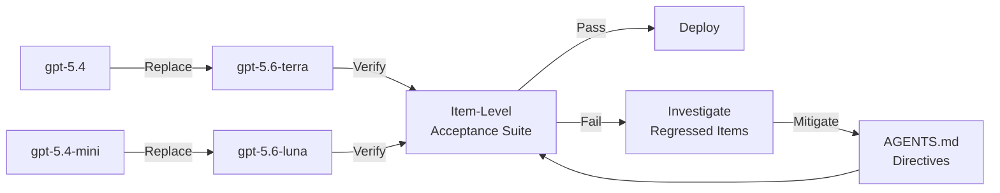
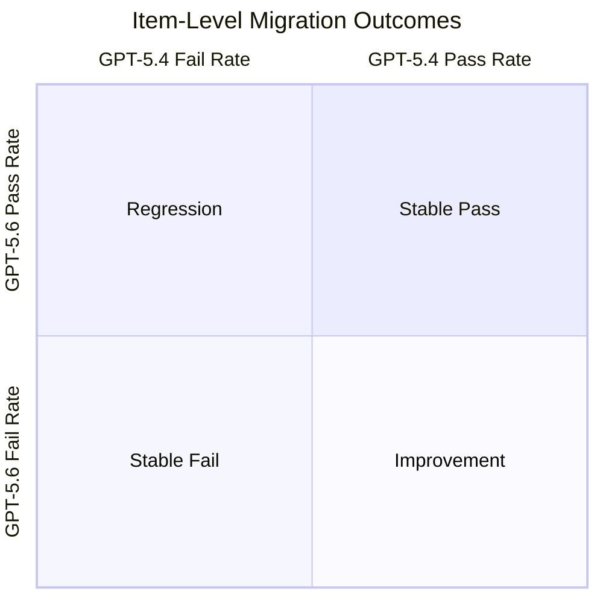

# What Aggregate Scores Miss: How Item-Level Regressions in LLM API Migrations Affect Your Codex CLI Model Switch


---

GPT-5.4 leaves ChatGPT-signed-in Codex on 31 August 2026 [^1]. If you are still running `model = "gpt-5.4"` in your `config.toml`, you have twelve days to migrate. Most teams will glance at an aggregate benchmark table, see a net gain, and swap the string. Xu and Wu's new measurement study, published on 18 August 2026, demonstrates precisely why that approach is dangerous [^2].

## The Aggregate Illusion

The paper — *What Aggregate Scores Miss: Measuring Item-Level Regressions in Commercial LLM API Migrations* — examined the GPT-5.4 → GPT-5.5 → GPT-5.6 Sol migration path across 900 public benchmark items spanning graduate knowledge (SuperGPQA, 500 items), olympiad mathematics (Omni-MATH hard, 100 items), and instruction following (IFBench, 300 prompts) [^2]. Each item received 50 independent single-turn calls per model — a total of 135,000 API calls — with item-level judgements calibrated via Fisher exact tests, Benjamini–Hochberg false discovery rate control at 5%, and a practical-significance threshold of 20 percentage points [^2].

The headline finding: **aggregate gains of up to 7.3 percentage points concealed up to 8.3% reliably regressed items**. Conversely, aggregate losses of 3.9–4.1 points still contained 6.7–9.0% reliably improved items [^2]. Total reliable-change rates ranged from 12.0% to 24.0% across the nine migration–benchmark cells [^2].

This is not noise. Permutation-null 95th percentiles were consistently 0.0%, confirming that the observed changes exceeded what sampling imprecision alone could produce [^2].

## Why Single-Shot Evaluation Fails

A supplementary analysis in the paper found that using a single draw per model recovered **zero of 457 reliably changed items** [^2]. This aligns with Cacioli's earlier finding that greedy single-shot evaluation missed 42% of reliably changed items whilst falsely flagging 25% of unchanged ones [^3].

If you are evaluating your GPT-5.4 → GPT-5.6 migration by running your test suite once per model and comparing pass rates, you are operating below the measurement floor. You literally cannot detect the regressions you need to find.

## The Scoring Rubric Trap

The instruction-following results are particularly alarming for Codex CLI users. On the GPT-5.5 → GPT-5.6 Sol edge, the strict–loose verification gap widened by 3.9 percentage points [^2]. The same migration showed a **3.9-point regression under strict scoring but only a 0.04-point difference under loose scoring** [^2].

For coding agents, this matters because Codex CLI's PostToolUse hooks, linter checks, and test assertions are strict verifiers. If your model switch passes a loose "does the output look right" check but fails a deterministic assertion, you have a production regression hiding behind a positive aggregate.

## Mapping to the GPT-5.4 Deprecation

The 31 August deadline applies specifically to ChatGPT-signed-in Codex users; API-key authenticated sessions retain access [^1]. The recommended replacement path is `gpt-5.4` → `gpt-5.6-terra` and `gpt-5.4-mini` → `gpt-5.6-luna` [^1].



GPT-5.6's three-tier structure (Sol, Terra, Luna) [^4] gives you model-routing flexibility that GPT-5.4 never had. But that flexibility is useless without an item-level acceptance protocol to validate each tier against your workload.

## Building an Item-Level Migration Protocol for Codex CLI

Xu and Wu recommend that organisations design acceptance tests referencing their reported reliable-change rates as benchmarks for their own workloads [^2]. Here is how to implement that with Codex CLI's existing configuration surface.

### Step 1: Define Your Item Set

Identify the 50–100 representative tasks your Codex CLI workflows handle most frequently. These are your migration items — not a generic benchmark, but your actual workload. Store them as executable test cases.

```bash
# Structure: one directory per item, each with input, expected output, and strict verifier
migration-items/
├── 001-typescript-refactor/
│   ├── prompt.md
│   ├── expected-diff.patch
│   └── verify.sh
├── 002-python-test-gen/
│   ├── prompt.md
│   ├── expected-tests.py
│   └── verify.sh
└── ...
```

### Step 2: Create a Migration Profile

Use Codex CLI's named profile system to isolate the migration evaluation from production work.

```toml
# ~/.codex/migration-eval.config.toml
model = "gpt-5.6-terra"
model_reasoning_effort = "high"
approval_policy = "unless-allow-listed"
```

### Step 3: Run Multi-Shot Evaluation

The critical insight from the paper: you need multiple runs per item. A minimum of 10 repetitions per item gives reasonable statistical power; 50 is ideal [^2].

```bash
#!/bin/bash
# run-migration-eval.sh
PROFILE="migration-eval"
RUNS=10
RESULTS_DIR="migration-results/$(date +%Y%m%d)"

for item_dir in migration-items/*/; do
    item=$(basename "$item_dir")
    for run in $(seq 1 $RUNS); do
        codex --profile "$PROFILE" \
              --quiet \
              -f "$item_dir/prompt.md" \
              > "$RESULTS_DIR/$item/run-$run.txt" 2>&1
        # Run strict verifier
        bash "$item_dir/verify.sh" "$RESULTS_DIR/$item/run-$run.txt"
        echo "$item,$run,$?" >> "$RESULTS_DIR/scores.csv"
    done
done
```

### Step 4: Detect Reliable Changes

Compare per-item pass rates between your current model and the target. Items with a change exceeding the practical-significance threshold warrant investigation.

```bash
# Compare baseline (gpt-5.4) vs candidate (gpt-5.6-terra) scores
python3 compare_migration.py \
    --baseline migration-results/gpt54/scores.csv \
    --candidate migration-results/gpt56-terra/scores.csv \
    --threshold 0.20 \
    --fdr 0.05
```

### Step 5: Mitigate Regressed Items via AGENTS.md

For items that reliably regress, encode compensating directives in your `AGENTS.md`:

```markdown
## Model Migration Compensations (GPT-5.6-terra)

### TypeScript Refactoring
- Always run `tsc --noEmit` after refactoring before claiming completion
- Prefer explicit type annotations over inferred types in refactored code

### Python Test Generation
- Generate at minimum 3 test cases per function, not 1
- Include edge cases for None/empty inputs — GPT-5.6-terra under-generates these
```

## PostToolUse Hooks as Strict Verifiers

The scoring-rubric gap the paper identifies — strict vs. loose scoring producing contradictory migration signals — maps directly to the difference between a PostToolUse hook that runs `tsc --noEmit` (strict) and one that greps for syntax errors in output (loose).

```toml
# codex.toml — strict PostToolUse verification
[[hooks]]
event = "PostToolUse"
command = "bash .codex/hooks/strict-verify.sh"
timeout_ms = 30000
```

```bash
#!/bin/bash
# .codex/hooks/strict-verify.sh
# Exit code 1 = block and retry, exit code 2 = inform but continue

# Type check
if ! tsc --noEmit 2>/dev/null; then
    echo "REGRESSION: TypeScript type errors detected"
    exit 1
fi

# Lint
if ! eslint --max-warnings 0 src/ 2>/dev/null; then
    echo "REGRESSION: Lint violations detected"
    exit 1
fi

exit 0
```

The paper's finding that 12–24% of items change reliably across migrations [^2] means your hook pipeline must be strict enough to catch the items that regress whilst not blocking the items that improve. This is the bidirectional change problem: you want the 6.7–9.0% improvements without the 5.0–8.3% regressions.

## The Churn Rate Metric

Cacioli introduced the concept of reporting **churn rate alongside aggregate accuracy** [^3]. For Codex CLI migrations, churn rate is the percentage of your workload items whose pass/fail status changes across the model switch, regardless of direction.



A healthy migration has high stable-pass, low regression, some improvement, and low stable-fail. If your churn rate exceeds the 12–24% range the paper reports, your workload is more sensitive to the migration than the benchmarked domains — and you should delay or mitigate before switching.

## What Codex CLI Cannot Do Yet

The paper exposes several gaps in Codex CLI's current migration tooling:

| Gap | Impact | Workaround |
|-----|--------|------------|
| No built-in multi-shot evaluation mode | Cannot detect item-level regressions from a single run | Script repeated `codex` invocations externally |
| No model A/B comparison primitive | Must manually orchestrate baseline vs. candidate runs | Use named profiles with separate result directories |
| No churn-rate reporting in `/status` or rollout JSONL | Migration risk invisible in session telemetry | Compute churn externally from scored CSV |
| Hooks verify current-model output, not cross-model delta | Cannot express "this item worked on GPT-5.4 but fails on GPT-5.6" | Maintain a baseline expectation set in the verifier |
| `model_auto_compact_token_limit` may interact with model change | Compaction behaviour differs across models, confounding migration signals | Fix compaction settings across evaluation runs |

## Practical Recommendations

1. **Never migrate on aggregates alone.** The 7.3-point gain hiding 8.3% regressions is the paper's core warning [^2].

2. **Run at least 10 repetitions per item.** Single-shot evaluation is statistically blind to reliable change [^2] [^3].

3. **Use strict verifiers, not loose ones.** The 3.9-point gap between strict and loose scoring on instruction-following tasks [^2] means loose checks will hide your regressions.

4. **Compute churn rate.** If it exceeds 20%, investigate before deploying.

5. **Encode mitigations in AGENTS.md.** Regressed items often respond to more specific directives — the model can do it, it just needs telling.

6. **Keep GPT-5.4 access via API key as a fallback.** The deprecation only affects ChatGPT-signed-in sessions [^1]; API-key access continues.

7. **Test Terra and Luna separately.** They are different models with different regression profiles — do not assume Terra results predict Luna behaviour.

---

## Citations

[^1]: OpenAI, "ChatGPT & Codex changelog — GPT-5.4 deprecation notice," August 2026. [https://learn.chatgpt.com/docs/changelog](https://learn.chatgpt.com/docs/changelog)

[^2]: X. Xu and W. Wu, "What Aggregate Scores Miss: Measuring Item-Level Regressions in Commercial LLM API Migrations," arXiv:2608.17719, August 18, 2026. [https://arxiv.org/abs/2608.17719](https://arxiv.org/abs/2608.17719)

[^3]: J.-P. Cacioli, "Beyond the Mean: Within-Model Reliable Change Detection for LLM Evaluation," arXiv:2604.27405, April 30, 2026. [https://arxiv.org/abs/2604.27405](https://arxiv.org/abs/2604.27405)

[^4]: OpenAI, "GPT-5.6 Sol, Terra, and Luna model family — Models documentation," 2026. [https://developers.openai.com/codex/models](https://developers.openai.com/codex/models)

[^5]: OpenAI, "Codex CLI Advanced Configuration — Named Profiles," 2026. [https://learn.chatgpt.com/docs/config-file/config-advanced](https://learn.chatgpt.com/docs/config-file/config-advanced)

[^6]: OpenAI, "Codex CLI Config Basics — Model Selection," 2026. [https://learn.chatgpt.com/docs/config-file/config-basic](https://learn.chatgpt.com/docs/config-file/config-basic)
