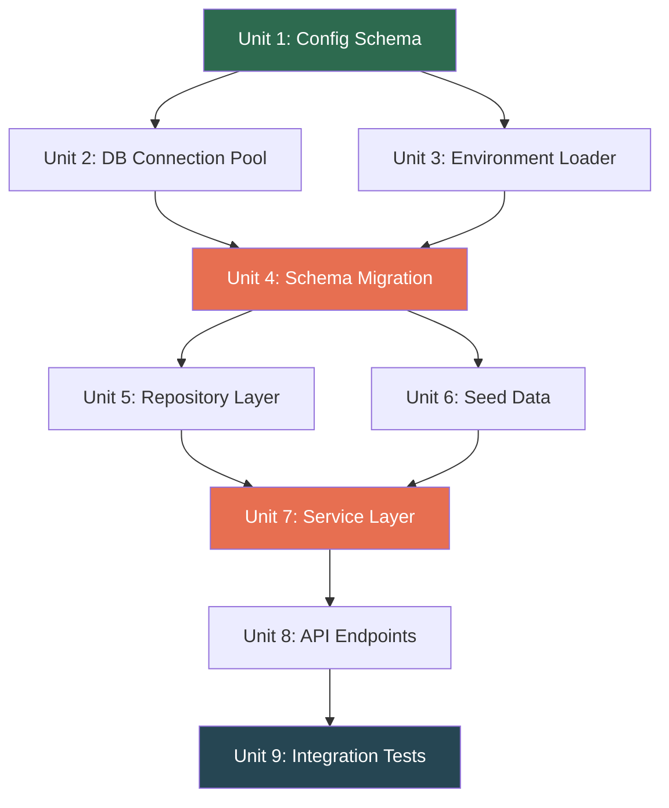
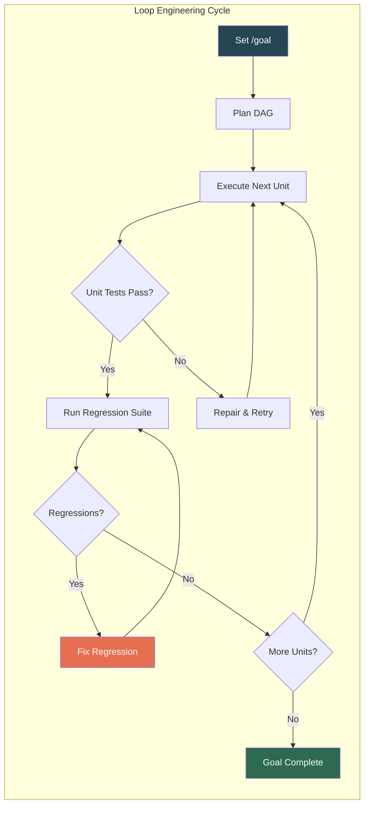

# LoopsBench and Loop Engineering: What Long-Horizon Benchmarks Reveal About Your Codex CLI Goal Mode Workflows


---

## The Shift From Harness Engineering to Loop Engineering

Most coding agent benchmarks measure whether an agent can fix a single bug or generate a self-contained function. That is harness engineering — building task-specific infrastructure around an isolated problem. But the way teams actually use Codex CLI looks nothing like SWE-bench: a developer types `/goal "migrate the payments module to the new API"`, walks away, and expects the agent to sustain coherent progress across dozens of dependent changes over hours [^1].

LoopsBench, published by a Microsoft Research team on 31 July 2026, formalises the gap between these two worlds [^2]. It introduces **loop engineering** as the discipline of managing objective persistence, residual routing, context renewal, and regression pressure across sustained coding agent execution. The benchmark's 112 tasks, spanning 8 programming languages and 9 domains, expose precisely where today's coding agents — including Codex CLI — break down on long-horizon work.

## How LoopsBench Works

Each LoopsBench task is modelled as a **dependency DAG** over separately testable development units. A PR chain migrating a database layer, for instance, might decompose into 15 units where unit 7 (the schema migration) must pass before unit 8 (the repository layer) can even be tested.



The runtime uses a **ready frontier** formula: at each checkpoint, it releases tests only for nodes whose prerequisites have already passed. Completed nodes become **regression obligations** — they must keep passing as the agent progresses deeper into the DAG. This mirrors how real codebases work: changing the schema migration must not break the connection pool tests [^2].

The benchmark draws tasks from three authentic source categories:

| Source Type | Tasks | Characteristics |
|---|---|---|
| PR Sequences | 29 | Merged commit chains from production repositories |
| Course Labs | 57 | Structured assignments with layered dependencies |
| Research Evolutions | 26 | Multi-stage research implementations |

The largest tasks are substantial — the ClickHouse task spans 817 development units across 34 dependency layers and 511k lines of code [^2].

## What the Results Show

### No Agent Handles Long Horizons Well

The strongest configuration — Opus-4.7 with Claude Code and outer continuation — resolves just **25.00%** of tasks. Codex CLI with GPT-5.5 manages **20.54%**. Performance drops precipitously with less capable models: Qwen2.5-72B scores 0.00% [^2].

### The Loop Implementation Matters More Than You Think

When the researchers fixed the model (GPT-5.4) and varied only the loop implementation, clear differences emerged:

| Loop | Resolve Rate | Test Pass Rate | Normalised Depth |
|---|---|---|---|
| Codex CLI | 18.75% | 49.06% | 0.49 |
| Claude Code | 17.86% | 48.21% | 0.42 |
| GitHub Copilot | 15.18% | 45.46% | 0.38 |
| OpenHands | 9.82% | 39.30% | 0.20 |
| SWE-agent | 8.93% | 38.11% | 0.16 |

Codex CLI leads in all three metrics with the same underlying model, suggesting that its loop infrastructure — goal mode persistence, session resume, and context management — provides a genuine advantage on sustained tasks [^2].

### Plans Miss the Dependency Graph

The planning fidelity analysis is sobering. Even the best performers reconstruct only a fraction of the true prerequisite DAG:

| Loop | Edge F1 | Layer Correlation | Regression Rate |
|---|---|---|---|
| Claude Code | 0.71 | 0.65 | 7.11% |
| Codex CLI | 0.67 | 0.61 | 4.83% |
| OpenHands | 0.39 | 0.33 | 2.46% |

Claude Code and Codex CLI plan better (higher Edge F1) but introduce more regressions as a consequence — they attempt deeper changes and occasionally break earlier work. OpenHands regresses less but barely penetrates the DAG [^2].

### Regression Is Inescapable

Across all four loop profiles studied — dynamic workflows, Codex goal mode, Claude Code goal mode, and the Ralph loop — regression events remained visible. Dynamic workflows achieved the highest resolve rate (24.11%) but also logged 0.36 regression events per run. Codex goal mode scored 20.59% with 0.34 regression events [^2].

## What This Means for Your Codex CLI Workflow

### Loop Engineering Is a Configuration Problem

LoopsBench reveals that the difference between 7.84% and 24.11% resolve rates comes not from the model but from the loop configuration. For Codex CLI, four configuration surfaces govern loop behaviour:

**Context renewal** controls how aggressively the agent refreshes its working context. Codex CLI's `model_auto_compact_token_limit` in `codex.toml` sets the threshold at which context compaction fires [^3]. On LoopsBench, configurations using more context-budget rounds per run (dynamic workflows averaged 97.96 rounds versus 32.76 for Codex goal mode) achieved higher resolve rates [^2].

```toml
# codex.toml — tune for long-horizon tasks
[model]
model_auto_compact_token_limit = 180000   # delay compaction for deeper context
tool_output_token_limit = 32000           # retain more tool output per step
```

**Objective persistence** is handled by the `/goal` command, which instructs Codex to maintain a stated objective across context boundaries [^4]. However, a known limitation exists: when mid-turn compaction triggers, the goal continuation prompt can be stripped, causing the agent to interpret passing tests as completion and close prematurely [^4]. ⚠️ This directly maps to LoopsBench's finding that plans "recover only part of the source-recovered prerequisite DAG."

**Regression detection** remains a gap. Codex CLI's PostToolUse hooks can validate individual tool outputs, but there is no built-in mechanism to re-run previously passing tests after subsequent changes [^3]. LoopsBench's regression obligation pattern — where completed nodes must keep passing — has no direct equivalent in Codex CLI's current architecture.

**Continuation strategy** determines what happens when the agent hits a context limit. Codex CLI supports session resume via `/resume` and the `codex exec fork` subcommand (added in v0.148.0) for session forking [^5]. Outer continuation — restarting the agent with accumulated state — yielded the largest gains in LoopsBench, boosting Opus-4.7 from 16.96% to 25.00% [^2].

### The Depth-First AGENTS.md Pattern

LoopsBench tasks with deeper DAGs reward agents that recognise prerequisite ordering. You can encode this in your project's `AGENTS.md`:

```markdown
## Long-Horizon Task Protocol

When working on multi-file changes:
1. Identify the dependency order — which files must change first
2. Complete and test each layer before moving deeper
3. After each change, verify that previously passing tests still pass
4. If a regression is detected, fix it before proceeding
5. Do not declare completion until all dependency layers pass

## Regression Obligation

After completing any unit of work:
- Re-run tests for all previously completed units
- If any previously passing test now fails, that regression
  takes priority over forward progress
```

### The Patch Inflation Problem

LoopsBench found that patches generated by agents are significantly longer than reference solutions. Claude Code produced patches 1.58× the reference length; open-source implementations ran 2.31–2.54× [^2]. Larger patches mean more opportunities for regression and faster context consumption. Codex CLI's `tool_output_token_limit` can constrain how much output each tool call contributes to context, but there is no equivalent control for the agent's own patch size.



### Monitoring Loop Health

LoopsBench's four loop-health metrics provide a useful framework for monitoring your own Codex CLI sessions:

1. **Test Pass Rate (TPR)** — what proportion of ready-frontier tests pass at each checkpoint
2. **Normalised Dependency Depth** — how deep into the DAG the agent reaches
3. **Regression Rate** — how often previously passing tests break
4. **Context-Budget Rounds** — how many interaction rounds fit within the context window

For Codex CLI, the first three can be approximated by PostToolUse hooks that invoke test runners, and the fourth is observable via `/status` cost and token reporting (added in v0.148.0) [^5].

## Current Gaps in Codex CLI

LoopsBench highlights several architectural gaps that Codex CLI does not yet address:

| Gap | LoopsBench Finding | Codex CLI Status |
|---|---|---|
| Regression obligations | Completed nodes must keep passing | No automatic re-test of previous units |
| DAG-aware planning | Tasks structured as prerequisite DAGs | No dependency graph representation |
| Compaction-safe goals | Goals must survive context renewal | Goal prompt can be stripped during compaction [^4] |
| Patch size control | Agents inflate patches 1.5–2.5× | No agent-side patch length constraint |
| Loop state telemetry | Four metrics per checkpoint | Rollout JSONL captures events but not loop-level metrics [^3] |

These gaps do not make Codex CLI unusable for long-horizon work — it already leads the field on LoopsBench's loop comparison — but they represent the difference between 18.75% and what a fully loop-engineered harness might achieve.

## Practical Recommendations

For teams pushing Codex CLI into sustained, multi-hour workflows:

1. **Structure work as explicit dependency layers.** Before invoking `/goal`, decompose the task into ordered units in your prompt. The agent plans better when prerequisites are stated, not discovered.

2. **Use outer continuation.** When a goal stalls or context compacts, use `codex exec fork` to restart with accumulated state rather than resuming into a degraded context.

3. **Add regression hooks.** Write a PostToolUse hook that re-runs a curated regression suite after each significant change. The overhead is small compared to the cost of silent regressions compounding.

4. **Delay compaction.** Set `model_auto_compact_token_limit` high enough to retain full context through your expected task depth. On LoopsBench, more context rounds correlated directly with higher resolve rates.

5. **Monitor patch inflation.** If your agent's diffs are 2× the size you would write manually, that is a signal the loop is accumulating unnecessary state.

## Citations

[^1]: OpenAI, "Codex CLI `/goal` command documentation," *Codex CLI Docs*, 2026. Available: [https://openai.com/codex/docs](https://openai.com/codex/docs)

[^2]: H. Li, Z. Fang, R. Feng, Y. Zhao, J. Liu, P. Gao, H. Ye, D. Lin, Q. Lin, S. Rajmohan, and D. Zhang, "LoopsBench: From Harness Engineering to Loop Engineering in Benchmarking Coding Agent," *arXiv:2608.00267v2*, August 2026. Available: [https://arxiv.org/abs/2608.00267](https://arxiv.org/abs/2608.00267)

[^3]: OpenAI, "Codex CLI configuration reference — `codex.toml`," *GitHub openai/codex*, 2026. Available: [https://github.com/openai/codex](https://github.com/openai/codex)

[^4]: D. Vaughan, "Goal Mode in Codex CLI: Persistent Objectives, Token Budgets, and the Shift to Agentic Loops," *Codex Knowledge Base*, May 2026. Available: [https://codex.danielvaughan.com/2026/05/03/codex-cli-goal-mode-persistent-objectives-token-budgets-agentic-loops/](https://codex.danielvaughan.com/2026/05/03/codex-cli-goal-mode-persistent-objectives-token-budgets-agentic-loops/)

[^5]: D. Vaughan, "Codex CLI v0.148.0: Markdown Export, Async Hooks, Cost Visibility, and Bedrock Runtime," *Codex Knowledge Base*, August 2026. Available: [https://codex.danielvaughan.com/2026/08/19/codex-cli-v0148-release/](https://codex.danielvaughan.com/2026/08/19/codex-cli-v0148-release/)

[^6]: "Loop Engineering Emerges as Developers Put AI Coding Agents on Repeat," *ADTmag*, July 2026. Available: [https://adtmag.com/articles/2026/07/01/loop-engineering-emerges-as-developers-put-ai-coding-agents-on-repeat.aspx](https://adtmag.com/articles/2026/07/01/loop-engineering-emerges-as-developers-put-ai-coding-agents-on-repeat.aspx)
