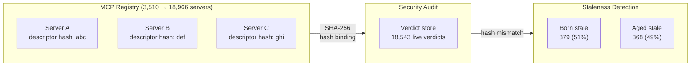
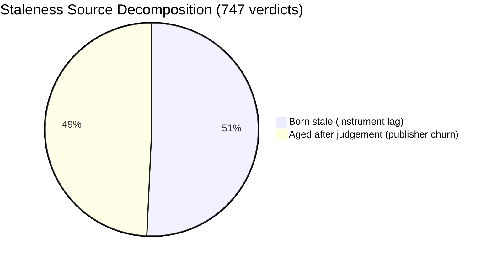
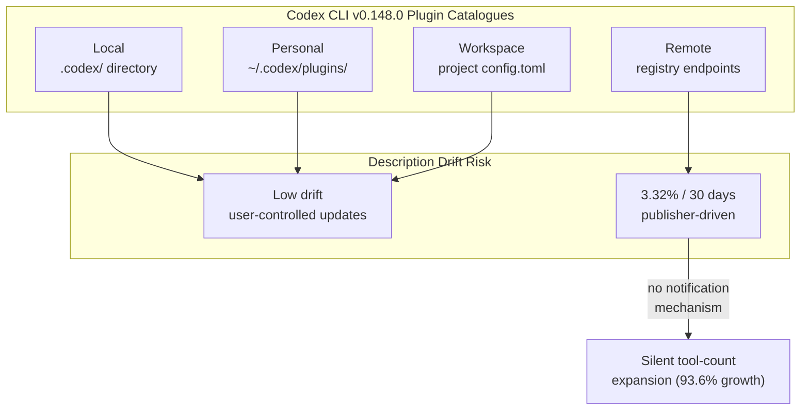

# MCP Registry Description Drift: What an 89-Day Measurement Study Means for Your Codex CLI Tool Search Trust Model


---

When Codex CLI's MCP tool search selects a server, it reasons over registry descriptions — short text blurbs that promise what a tool does. But how long do those descriptions stay accurate after someone audits them? Gautam Bharti's measurement study, "Registry Descriptions Go Stale Unevenly" [^1], tracked 19,099 distinct MCP servers across 88.6 days and found that staleness is not merely a publisher problem: 51% of stale audit verdicts were *born stale* — evaluated after the judged text had already changed. The paper's findings challenge any trust model that treats registry descriptions as stable ground truth, and they map directly onto the way Codex CLI v0.148.0 discovers and selects MCP tools [^2].

---

## The Measurement Setup

Bharti reconstructed 120 observations of the official MCP registry between 30 April and 28 July 2026, capturing every delta as the corpus grew from 3,510 to 18,966 servers [^1]. Each observation recorded SHA-256 hashes of server descriptors (all metadata fields) and description text alone (the ≤100-character blurb that agents and auditors parse). The panel is pseudonymised and released under CC-BY-4.0 via Zenodo [^1].

Two measurement surfaces matter:

1. **Any-field descriptor changes** — version bumps, URL rewrites, metadata updates.
2. **Description-text-only changes** — the revalidation surface that security audits actually bind to.



---

## How Fast Do Descriptions Actually Drift?

The headline numbers are reassuringly low — until you look at the population:

| Metric | Any-Field Descriptor | Description Text Only |
|--------|---------------------:|----------------------:|
| 30-day cohort survival (changed) | 11.87% | 3.32% |
| 60-day | 16.30% | 5.52% |
| 89-day | 19.11% | 6.85% |
| Daily event load (trailing 30d) | — | 38.7 mismatches/day |

Three non-overlapping 30-day cohorts showed remarkable consistency: 11.4%, 11.9%, and 12.3% descriptor change rates [^1]. Of 18,748 servers observed across ten or more intervals, 75.2% recorded zero descriptor changes — the registry is dominated by a long, stable tail.

But a naive daily-rate projection vastly overestimates churn. The compounding-error diagnostic showed a 3.0× overestimate at 30 days and 3.8× at 89 days [^1]. This matters because threat models built on per-day rates systematically overstate the staleness risk.

### The Concentration Problem

Tool-count changes skewed heavily towards growth: 248 increases versus 17 decreases (93.6% growth) [^1]. Median magnitude was 1.11×, but tail observations reached 4.7× — a server that advertised five tools could silently grow to twenty-three. For Codex CLI users relying on tool search, a server's capability surface can expand without any description-level signal.

---

## Born Stale: The Scanner's Own Blind Spot

The most actionable finding is the *born stale* decomposition. Of 747 stale verdicts in the deployed scanner's store (4.03% of 18,543 live verdicts):

- **379 (51%)** were born stale — the scanner evaluated a description snapshot that had already been superseded by the time the verdict was minted [^1].
- **368 (49%)** aged after judgement — the publisher changed the description after the audit.
- Only 13 overlapped with wall-clock expiry, confirming that content-binding and time-based expiry are "nearly disjoint signals" [^1].

This 51/49 split was absent from prior MCP threat models. It means that half the staleness problem is *instrument lag* — the auditor's own input pipeline — not publisher churn.



---

## Why Drift-Ranked Re-Auditing Fails

The intuitive strategy — re-audit the servers that drifted most — hits a ceiling quickly. Servers that drifted in the first half of the observation window were 7.1× more likely to drift again (31.2% vs 4.4% baseline) [^1]. But at a practical top-5% re-audit budget:

- **Rankable coverage:** 26.0% of previously-seen descriptor changers caught (5.2× lift).
- **All-changer coverage:** only 12.8%, because 43–51% of changers are new arrivals invisible to history ranking [^1].
- **Description-surface coverage:** worse still at 19.3% rankable, ~9–12% all-changers.

The signal exhausts itself: only 5.0% of servers carried any prior description-change history, so a top-5% budget consumed the entire rankable pool [^1]. Slots beyond 5% filled by tie-break order, not drift signals.

---

## Mapping to Codex CLI v0.148.0

Codex CLI's MCP tool search discovers servers from local, personal, workspace, and remote plugin catalogues [^2]. The v0.148.0 release added portable Agent Plugins with federated catalogue search [^3]. Each catalogue tier has different drift characteristics:

### Local and workspace servers: low drift, high trust

Servers pinned in your `config.toml` or `.codex/` directory change only when you update them. Registry drift does not apply here — but *your own staleness* does if you pin a version and never update.

### Remote registry servers: drift applies directly

When Codex CLI searches remote MCP registries (or when MCP tool search queries a catalogue endpoint), the description text that the agent reasons over is subject to the exact drift rates measured by Bharti. A 3.32% 30-day description-change rate means roughly one in thirty remote servers will have a stale description relative to any point-in-time audit [^1].

### The tool-count expansion gap

Codex CLI's `PreToolUse` hooks can gate individual tool invocations, but there is no mechanism to detect when a previously-audited server silently adds new tools [^2]. The paper's finding that 93.6% of tool-count changes are increases [^1] means the attack surface grows without notification.



---

## A Practical Revalidation Playbook for Codex CLI Users

The paper's three production changes [^1] translate into defensive patterns for Codex CLI configurations.

### 1. Content-bind your plugin catalogue

Pin MCP server versions with SHA-256 hashes in your `config.toml` rather than floating references:

```toml
[mcp_servers.my-database-server]
command = "npx"
args = ["-y", "@company/db-mcp-server@2.1.3"]
# Revalidate when description or tool list changes
```

When the upstream description moves, you want to know — not silently consume the new version.

### 2. Add a PreToolUse freshness gate

Use Codex CLI's hook system to verify tool metadata at invocation time:

```toml
[hooks.pre_tool_use]
command = "bash"
args = ["-c", "scripts/verify-mcp-tool-hash.sh $TOOL_NAME $SERVER_ID"]
timeout_ms = 3000
```

This mirrors the paper's "read-time content-binding" — check the hash at the moment of use, not at audit time [^1].

### 3. Declare revalidation cadence in AGENTS.md

```markdown
## MCP Server Trust Policy

- Remote registry servers: revalidate tool lists weekly
- Workspace servers: revalidate on dependency update
- Never trust a registry description older than 7 days for security-sensitive operations
- Log tool-count changes via PostToolUse hooks
```

### 4. Monitor for tool-count expansion

A `PostToolUse` hook can track the number of tools a server exposes and alert when it grows:

```bash
#!/bin/bash
# post-tool-use-tool-count-monitor.sh
CURRENT_COUNT=$(codex mcp list-tools "$SERVER_ID" 2>/dev/null | wc -l)
CACHED_COUNT=$(cat ".codex/tool-counts/$SERVER_ID" 2>/dev/null || echo "0")
if [ "$CURRENT_COUNT" -gt "$CACHED_COUNT" ]; then
    echo "WARNING: $SERVER_ID tool count changed: $CACHED_COUNT → $CURRENT_COUNT" >&2
fi
echo "$CURRENT_COUNT" > ".codex/tool-counts/$SERVER_ID"
```

---

## What Codex CLI Does Not Yet Provide

The paper exposes several gaps in Codex CLI's current MCP trust model:

| Gap | Paper Evidence | Codex CLI v0.148.0 Status |
|-----|---------------|--------------------------|
| No description-hash binding on tool search results | 51% born-stale rate from instrument lag [^1] | Tool search reasons over live descriptions without hash verification |
| No tool-count change notification | 93.6% of count changes are increases [^1] | No mechanism to detect server capability expansion |
| No revalidation cadence configuration | Drift-ranked re-auditing catches only 12.8% of changers [^1] | No built-in re-audit scheduling for remote servers |
| No staleness metadata in plugin catalogue | 747/18,543 verdicts stale at any given time [^1] | Plugin catalogue entries lack freshness timestamps |

---

## The Deeper Lesson: Description ≠ Behaviour

The paper explicitly scopes out *live tool lists* — the actual `tools/list` responses that servers return at runtime [^1]. Registry descriptions are a 100-character blurb; the real attack surface is the tool schemas and implementations behind them. Bharti's measurement covers the metadata layer that auditors and discovery systems reason over, not the behavioural layer that agents execute against.

For Codex CLI users, this means two distinct trust boundaries:

1. **Discovery trust** — is the description I found in the registry still accurate? (Bharti's measurement: ~3.3% drift per 30 days.)
2. **Execution trust** — does the server's live behaviour match its description? (Unmeasured, and likely worse.)

The paper recommends pairing content-binding with periodic full-catalogue sweeps: at weekly cadence, roughly 2,700 re-screens per day for a 19,000-server registry; at monthly cadence, roughly 630 per day [^1]. For individual Codex CLI users, the practical equivalent is pinning versions, hashing tool lists, and treating any remote MCP server as potentially stale after seven days.

---

## Citations

[^1]: Bharti, G. (2026). "Registry Descriptions Go Stale Unevenly: An 89-Day Measurement of Model Context Protocol Drift, and Why Drift-Ranked Re-Auditing Under-Covers It." arXiv:2608.00997v2. Dataset: Zenodo DOI 10.5281/zenodo.21709945 (CC-BY-4.0). [https://arxiv.org/abs/2608.00997](https://arxiv.org/abs/2608.00997)

[^2]: OpenAI. (2026). "Codex CLI v0.148.0 Release Notes." GitHub. [https://github.com/openai/codex/releases/tag/rust-v0.148.0](https://github.com/openai/codex/releases/tag/rust-v0.148.0)

[^3]: OpenAI. (2026). "Codex CLI v0.147.0 — Agent Plugins, Persistent Sections, Automated Approvals." GitHub. [https://github.com/openai/codex/releases/tag/rust-v0.147.0](https://github.com/openai/codex/releases/tag/rust-v0.147.0)

[^4]: Anthropic. (2025). "Model Context Protocol Specification — Tool Discovery." [https://spec.modelcontextprotocol.io/](https://spec.modelcontextprotocol.io/)

[^5]: Bharti, G. (2026). MCP Registry Drift Panel v1 — Pseudonymized Dataset. Zenodo. [https://doi.org/10.5281/zenodo.21709945](https://doi.org/10.5281/zenodo.21709945)

[^6]: OpenAI. (2026). "Unrolling the Codex Agent Loop." OpenAI Blog. [https://openai.com/index/unrolling-the-codex-agent-loop/](https://openai.com/index/unrolling-the-codex-agent-loop/)
