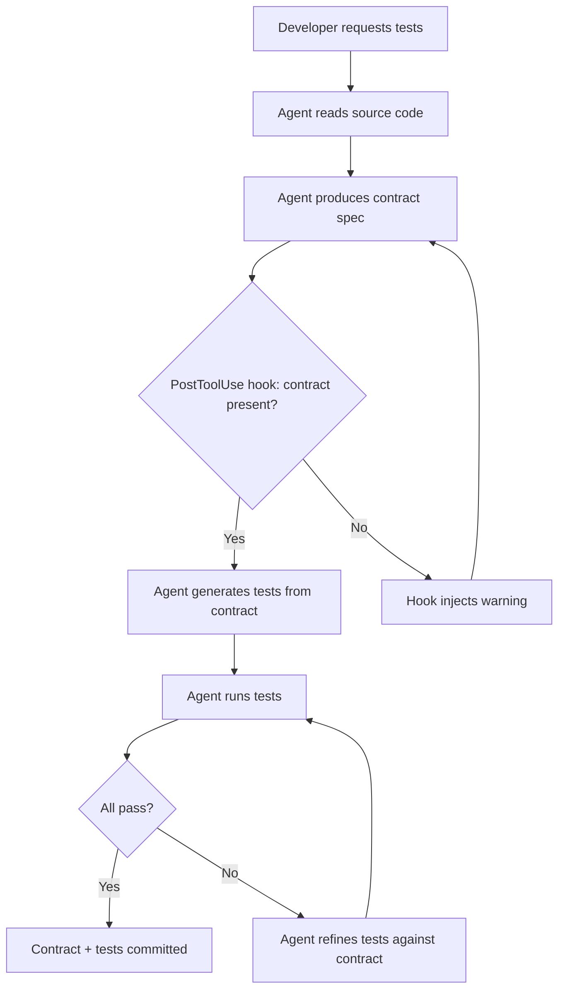

# Spec-Driven Test Generation: What Contract Reasoning Reveals About Your Codex CLI Test Workflow


---

## The Problem with Generate-Then-Verify

Most developers using Codex CLI for test generation follow a familiar pattern: describe what the function does, ask the agent to write tests, then manually review whether the tests are any good. The agent generates syntactically correct tests that pass — but those tests frequently miss the edge cases and boundary conditions that matter in production.

New research from Meta quantifies why. Tufano et al. published "Grounding AI Agents in Contracts: Spec-Driven Test Generation" (arXiv:2608.17177, 17 August 2026), demonstrating that LLM-based agents produce measurably better tests when they first reason about — and explicitly document — code pre-conditions, post-conditions, and undefined behaviours before generating any test code [^1]. The improvement is not marginal: a 9.8 percentage point increase in bug detection and 2.5 percentage point gain in branch coverage over standard generation baselines [^1].

The practical implication for Codex CLI users is clear: your AGENTS.md and prompt structure should enforce contract reasoning as a mandatory intermediate step, not leave it to chance.

## What the Research Shows

The Tufano et al. study evaluates a pipeline where an LLM agent is given a function under test and, before writing any test code, must produce a structured specification document containing:

1. **Pre-conditions** — what must hold true before the function executes
2. **Post-conditions** — what the function guarantees upon completion
3. **Undefined behaviours** — inputs or states where the function's behaviour is unspecified or implementation-dependent

This intermediate specification then serves as scaffolding for the subsequent test generation step. The agent uses its own specification document as context when writing tests, rather than working solely from the source code [^1].

The results across Meta's internal codebase are striking:

| Metric | Baseline | Spec-Driven | Delta |
|--------|----------|-------------|-------|
| Bug detection rate | — | +9.8pp | Significant |
| Branch coverage | — | +2.5pp | Significant |
| LLM-judged quality vs baseline | — | 77.8% wins | — |
| LLM-judged quality vs human tests | — | 56.7% wins | — |

The generated tests showed improvements in readability, adherence to testing best practices, and — critically — edge-case identification [^1]. The specification step forces the agent to reason about boundary conditions before it starts writing assertions, rather than generating tests that merely exercise the happy path.

## Why This Matters for Codex CLI

Codex CLI v0.148.0 [^2] provides the infrastructure to implement spec-driven test generation as a structured workflow, but most teams do not use it. The typical Codex CLI test generation prompt is something like:

```
Write unit tests for src/auth/token_validator.ts
```

This produces tests. They pass. They cover the obvious cases. They miss the edge where an expired token with a valid signature should be rejected, or where a clock-skewed timestamp falls within the grace window. The agent had no reason to consider these cases because nothing in its context demanded contract reasoning.

The fix is to encode contract reasoning as a mandatory step in your AGENTS.md, hook pipeline, and prompt workflow.

## Implementing Contract-First Test Generation

### Step 1: AGENTS.md Contract Directives

Your repository's AGENTS.md should include explicit instructions that force the agent to produce specifications before tests. Place this in your root AGENTS.md:

```markdown
## Test Generation Protocol

When generating or updating tests for any function, module, or class:

1. **Contract specification first.** Before writing any test code, produce a
   contract document in a fenced `spec` block containing:
   - Pre-conditions: all input constraints, type invariants, and required state
   - Post-conditions: all guaranteed outputs, state changes, and side effects
   - Undefined behaviours: inputs or states where behaviour is unspecified
   - Boundary values: the exact edges where behaviour changes

2. **Derive tests from the contract.** Each pre-condition, post-condition, and
   boundary value must have at least one corresponding test case. Each undefined
   behaviour must have a test verifying the function's actual handling.

3. **Never skip the contract step.** Do not generate test code without first
   producing and reviewing the contract document.
```

This directive costs tokens — roughly 200–400 extra per test generation task — but the Tufano et al. results show it pays for itself in defect detection [^1].

### Step 2: A Practical Contract-to-Test Workflow

Here is the concrete workflow, using a TypeScript token validator as an example:

```markdown
## Contract: validateToken(token: string, options?: ValidationOptions)

### Pre-conditions
- `token` is a non-empty string in JWT format (three base64url segments separated by dots)
- If `options.clockSkew` is provided, it is a non-negative integer (seconds)
- If `options.issuer` is provided, it is a non-empty string

### Post-conditions
- Returns `{ valid: true, claims: DecodedClaims }` when signature, expiry, and issuer match
- Returns `{ valid: false, reason: string }` when any check fails
- Never throws; all failures are expressed in the return value
- `claims.exp` is compared against `Date.now()` ± `clockSkew`

### Undefined behaviours
- Token with valid structure but unsupported algorithm (e.g., `none`)
- Token where `nbf` (not-before) is in the future but within clockSkew
- Token with duplicate claims in the payload

### Boundary values
- Expiry exactly at current timestamp (no skew)
- Expiry at current timestamp ± 1 second with clockSkew = 1
- Empty string token
- Token with exactly two segments (missing signature)
```

The agent then generates tests derived from each line of the contract, producing targeted assertions rather than generic smoke tests.

### Step 3: PostToolUse Hook for Contract Verification

Codex CLI's PostToolUse hooks [^3] can enforce the contract-first pattern automatically. When the agent writes a test file, a hook script can verify that a corresponding contract block exists:

```toml
[[hooks.PostToolUse]]
matcher = "apply_patch"

[[hooks.PostToolUse.hooks]]
type = "command"
command = "python3 ~/.codex/hooks/verify_contract_block.py"
timeout = 30
```

The verification script checks whether any newly written test file has a corresponding contract specification:

```python
#!/usr/bin/env python3
"""Verify that test files have corresponding contract specifications."""
import json
import sys
import re

payload = json.load(sys.stdin)
tool_input = payload.get("tool_input", "")

# Check if a test file was written
if not re.search(r'(test_|_test\.|\.spec\.|\.test\.)', tool_input):
    # Not a test file, allow
    json.dump({"additionalContext": ""}, sys.stdout)
    sys.exit(0)

# Check for contract block in the patch content
if "### Pre-conditions" not in tool_input and "### Post-conditions" not in tool_input:
    json.dump({
        "additionalContext": (
            "WARNING: Test file written without a contract specification. "
            "Per AGENTS.md, generate a contract document with pre-conditions, "
            "post-conditions, and undefined behaviours before writing tests."
        )
    }, sys.stdout)
    sys.exit(0)

json.dump({"additionalContext": ""}, sys.stdout)
```

This does not block the agent — exit code 0 allows the operation — but injects a warning into the conversation context, nudging the agent back to the contract-first workflow [^3].

### Step 4: Named Profiles for Spec-Driven Testing

Codex CLI's named profiles [^4] let you configure a dedicated testing profile that sets higher reasoning effort for the specification step:

```toml
[profile.spec-test]
model = "gpt-5.6-terra"
model_reasoning_effort = "high"
sandbox_permissions = "workspace-write"

[profile.spec-test.instructions]
additional = "Always produce a contract specification before generating tests. Follow the Test Generation Protocol in AGENTS.md."
```

Invoke it with:

```bash
codex --profile spec-test "Generate contract-driven tests for src/auth/"
```

The higher reasoning effort is justified here: the specification step requires the agent to reason about invariants and edge cases, which benefits from deeper model reasoning [^5]. For routine test maintenance, a lower-effort profile remains appropriate.

## The Contract Reasoning Pipeline

The full workflow integrates contract reasoning into the standard Codex CLI session:



The critical insight from Tufano et al. is that this is not merely a process overhead. The specification step changes what the agent generates because it forces attention to boundary conditions and undefined behaviours that the agent would otherwise ignore [^1]. The 9.8 percentage point bug detection improvement comes precisely from this forced reasoning about what the code should and should not do.

## Async Hooks for Background Contract Analysis

Codex CLI v0.148.0 introduces async hooks that run in the background while the agent continues working [^2]. This enables a non-blocking contract quality check:

```toml
[[hooks.PostToolUse]]
matcher = "apply_patch"

[[hooks.PostToolUse.hooks]]
type = "command"
command = "python3 ~/.codex/hooks/contract_coverage_check.py"
async = true
timeout = 120
```

The background hook can perform more expensive analysis — counting assertion-to-contract-line coverage ratios, checking for missing boundary tests, validating that undefined behaviours are addressed — without blocking the agent's flow. Codex runs up to eight background hooks concurrently per session [^3], so this integrates cleanly with existing hook pipelines.

## When Contract Reasoning Does Not Help

The Tufano et al. results show 77.8% superiority over baselines but not 100%. Contract reasoning is less effective when:

- **The function is trivially simple** — a getter with no invariants gains nothing from formal specification
- **The contract cannot be derived from source alone** — when behaviour depends on external state not visible in the function signature, the agent may produce an incorrect specification
- **Integration tests are the goal** — contract reasoning works best at the unit level where pre-conditions and post-conditions can be precisely stated

For integration and end-to-end testing, Codex CLI's Playwright integration [^6] and MCP-based test frameworks remain more appropriate than contract-driven unit test generation.

## Gaps and Limitations

The current Codex CLI infrastructure supports this workflow but does not enforce it natively:

| Gap | Impact | Workaround |
|-----|--------|------------|
| No built-in contract specification format | Agent may produce inconsistent spec structure | Enforce format via AGENTS.md directive |
| PostToolUse hooks cannot block operations | Hook can warn but not prevent contract-free tests | Use exit code 2 for soft blocking ⚠️ |
| Contract specs are not persisted separately | Specifications live only in conversation context | Write specs to `contracts/` directory via AGENTS.md directive |
| No contract-to-test coverage metric | Cannot verify all contract lines have tests | Custom hook script required |

⚠️ Exit code 2 from a PostToolUse hook provides "soft blocking" — the agent receives the feedback and typically adjusts, but is not technically prevented from continuing. This is a known architectural constraint of the hook system [^3].

## Practical Takeaway

The research evidence is clear: making your coding agent reason about contracts before writing tests catches meaningfully more bugs. The implementation cost is modest — an AGENTS.md directive, one PostToolUse hook, and a named profile. The return is a 9.8 percentage point improvement in bug detection that compounds across every test generation task in your codebase.

Start with your AGENTS.md. Add the contract specification protocol. Let the agent do the reasoning it was not doing before.

---

## Citations

[^1]: Tufano, M., McClure, J., Cambronero, J., Cheng, R., Shi, S.Y., Wei, R., Chen, D., Ivančić, F., Dalloro, L. & Rondon, P. (2026). "Grounding AI Agents in Contracts: Spec-Driven Test Generation." arXiv:2608.17177. Submitted 17 August 2026. [https://arxiv.org/abs/2608.17177](https://arxiv.org/abs/2608.17177)

[^2]: OpenAI. (2026). "Codex CLI v0.148.0 Release Notes." Released 18 August 2026. [https://github.com/openai/codex/releases/tag/rust-v0.148.0](https://github.com/openai/codex/releases/tag/rust-v0.148.0)

[^3]: OpenAI. (2026). "Hooks — Codex CLI Documentation." [https://learn.chatgpt.com/docs/hooks](https://learn.chatgpt.com/docs/hooks)

[^4]: OpenAI. (2026). "Codex CLI Configuration Reference." [https://learn.chatgpt.com/docs/cli](https://learn.chatgpt.com/docs/cli)

[^5]: OpenAI. (2026). "Codex CLI v0.147.0 Release Notes." Released 7 August 2026. [https://github.com/openai/codex/releases/tag/rust-v0.147.0](https://github.com/openai/codex/releases/tag/rust-v0.147.0)

[^6]: OpenAI. (2026). "End-to-End Testing with Codex CLI and Playwright." Codex Knowledge Base. [https://codex.danielvaughan.com/2026/04/20/codex-cli-playwright-e2e-testing-agent-driven-test-generation/](https://codex.danielvaughan.com/2026/04/20/codex-cli-playwright-e2e-testing-agent-driven-test-generation/)
