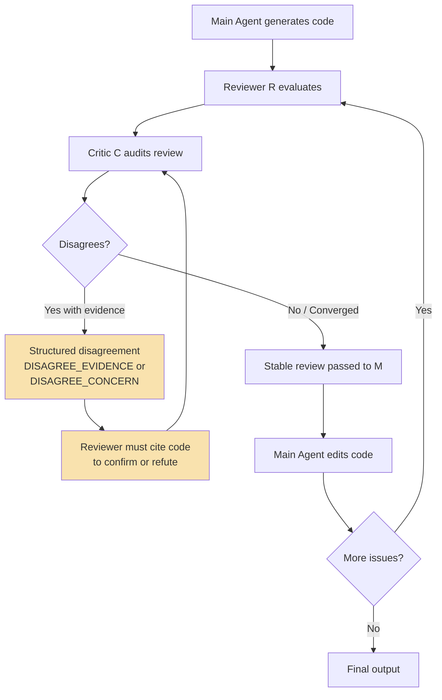

# Adversarial Review: Why Structured Disagreement Beats Consensus in Your Codex CLI Code Review Pipeline


---

When two LLM agents are asked to agree on a joint output, they tend to agree with each other. They do not always find the truth. That sentence, from Qiu and Gill's ICML 2026 DL4C workshop paper *Adversarial Review: Structured Disagreement for Grounded Agentic Code Review*, should unsettle anyone running multi-agent code review pipelines — including those relying on Codex CLI's Guardian auto-review [^1].

The paper introduces a three-agent protocol called Adversarial Review (AR) that achieves an 87% pass rate on LiveCodeBench using only three agents, outperforming MARS's 82% with five [^1]. The mechanism is not more agents or more rounds — it is *structured disagreement*. This article unpacks what AR reveals about the false-consensus failure mode, why it matters for Codex CLI workflows, and how to approximate its structured disagreement protocol using the tools you already have.

## The False-Consensus Failure Mode

The core finding is deceptively simple: when reviewer agents converge on a shared output, they optimise for agreement rather than correctness. Qiu and Gill document two specific failure patterns on SWE-PRBench [^1]:

**Over-decomposition.** A reviewer flags one genuine bug plus two or three hedged concerns. The critic confirms all and adds speculation. Result: three of five comments are fabricated, yielding an F1 of 0.250.

**Capitulation.** A reviewer proposes approval. The critic raises a legitimate concern. The reviewer rebuts weakly without citing code. The critic yields. The real bug drops from the final review, producing an F1 of 0.286 compared to MARS's 0.667 on the same task.

This is not a minor edge case. Okawa's concurrent work at ICML 2026 on biased consensus in multi-agent LLM debates demonstrates that conformity pressure drives a *phase transition* to collective bias once it surpasses a critical threshold — and that agent heterogeneity smooths but does not eliminate the transition [^2]. The implication is structural: any multi-agent review pipeline that rewards convergence is susceptible.

## The Adversarial Review Protocol

AR's architecture is minimal: a main coding agent (M), a reviewer (R), and a critic (C). The protocol operates in two loops:



**Inner loop (review stabilisation).** The artefact is frozen. R generates review comments; C audits them. The loop continues until convergence, capped at five rounds [^1]. Critically, no edits occur during this exchange — the disagreement is purely about the *quality of the review itself*.

**Outer loop (editing).** Only after the review stabilises does M receive it and make edits. This separation prevents the review from being retroactively justified by code changes.

### The Text Constraint That Changes Everything

Naive AR actually produces the *lowest* F1 on SWE-PRBench (0.457) because unconstrained disagreement degenerates into the same consensus-seeking behaviour [^1]. The fix is a structured verdict taxonomy forcing C to choose exactly one of three responses:

| Verdict | Meaning | Obligation |
|---------|---------|------------|
| `AGREE` | Accept the reviewer's finding unchanged | None |
| `DISAGREE_EVIDENCE` | Cite specific code that contradicts the flag | Reviewer must address cited code |
| `DISAGREE_CONCERN` | Flag a concern without contradicting code | Reviewer must cite code confirming or refuting |

With this constraint, AR achieves the highest F1 on SWE-PRBench (0.533), surpassing two-reviewer (0.503), MARS (0.501), and single-reviewer (0.495) configurations [^1]. The discretisation forces disagreement to be explicit, evidence-grounded, and non-negotiable.

## Benchmark Results at a Glance

| Method | Agents | LCB Pass Rate | SWE-PRBench F1 | Token Cost (vs Zero-shot) |
|--------|--------|---------------|----------------|---------------------------|
| Zero-shot | 1 | 77% | — | 1× |
| Self-Refine | 1 | 77% | — | ~1.5× |
| Single-reviewer | 2 | 77% | 0.495 | ~2× |
| Two-reviewers | 3 | 75% | 0.503 | ~3× |
| MARS | 5 | 82% | 0.501 | ~5× |
| **AR** | **3** | **87%** | 0.457 | ~4.5× |
| **AR + text constraint** | **3** | — | **0.533** | ~4.5× |

The cost-quality tradeoff is notable: AR uses approximately 4.5× the tokens of zero-shot but achieves 10 percentage points higher pass rate with fewer agents than MARS [^1].

## What This Means for Codex CLI

Codex CLI v0.148.0 ships with two mechanisms that perform code review: Guardian auto-review and the multi-agent v2 orchestration system [^3][^4]. Both are susceptible to the false-consensus failure mode AR identifies.

### Guardian's Structural Limitation

Guardian operates as a single reviewer subagent that evaluates tool-call requests against a risk-based decision framework [^3]. It is not a multi-agent system — it is a single-reviewer configuration, which AR benchmarks at 77% pass rate and 0.495 F1. Guardian's design explicitly trades review depth for latency: it must return a verdict before the agent can proceed.

More fundamentally, Guardian reviews *actions* (shell commands, file writes, MCP invocations), not *code quality*. It answers "is this operation safe?" rather than "is this code correct?" [^3]. AR targets the latter question.

### Multi-Agent v2's Consensus Risk

When you use Codex CLI's `multi_agent_v2` to spawn reviewer subagents, the default interaction pattern is *parallel independent review* — each subagent produces findings, and the orchestrator merges them [^4]. This mirrors the "two-reviewers" configuration in AR's benchmarks (F1 = 0.503). Without a structured disagreement protocol, merging independent reviews risks the same false-consensus failure mode: agents that happen to agree on incorrect findings reinforce each other.

## Approximating AR in Your Codex CLI Workflow

AR's protocol is deliberately portable — the authors note it functions as a "pure-text SKILL.md" deployable without orchestration changes [^1]. Here is how to approximate it with Codex CLI's existing primitives.

### Step 1: AGENTS.md as the Review Specification

Add a structured review protocol to your project's `AGENTS.md`:

```markdown
## Code Review Protocol

When reviewing code changes, follow the Adversarial Review protocol:

1. REVIEWER PHASE: Generate review comments citing specific line numbers and code
2. CRITIC PHASE: For each comment, respond with exactly one verdict:
   - AGREE: Accept the finding unchanged
   - DISAGREE_EVIDENCE: Quote specific code that contradicts the finding
   - DISAGREE_CONCERN: Raise a concern — reviewer must then cite code confirming or refuting
3. STABILISATION: Continue reviewer-critic exchange until convergence (max 5 rounds)
4. EDIT PHASE: Only after review stabilises, apply agreed changes
5. Never edit code during the review stabilisation phase
```

### Step 2: PostToolUse Hook as a Review Gate

Create a PostToolUse hook that triggers the review protocol after file writes:

```toml
# config.toml
[hooks.post_tool_use.adversarial_review]
command = "python3 scripts/adversarial-review-gate.py"
match_tools = ["write_file", "apply_patch"]
exit_code_2_blocks = true
```

The gate script can enforce that the agent has completed the inner-loop stabilisation before proceeding — checking for the presence of `AGREE`/`DISAGREE_EVIDENCE`/`DISAGREE_CONCERN` verdicts in the session context.

### Step 3: Named Profiles for Phase Separation

Use named profiles to enforce the frozen-artefact constraint during the inner loop:

```toml
# profiles/review-stabilise.toml
[sandbox]
permissions = "workspace-read"  # No writes during review

[model]
name = "gpt-5.6-terra"
```

```toml
# profiles/review-edit.toml
[sandbox]
permissions = "workspace-write"  # Writes only after stabilisation

[model]
name = "gpt-5.6-sol"
```

### Step 4: Structured Disagreement in Subagent Prompts

When spawning reviewer and critic subagents via `multi_agent_v2`, encode the verdict taxonomy directly in the subagent's system prompt:

```markdown
You are a code review CRITIC. For each reviewer finding, respond with exactly
one of these verdicts:

AGREE — Accept the finding. No further action.
DISAGREE_EVIDENCE — Quote the specific code (with line numbers) that
contradicts this finding. The reviewer must address your cited code.
DISAGREE_CONCERN — Raise a concern without contradicting code. The reviewer
must cite code confirming or refuting your concern.

Never hedge. Never add speculative concerns. One verdict per finding.
```

## Gap Analysis: Where Codex CLI Falls Short

| AR Requirement | Codex CLI Status | Gap |
|----------------|-----------------|-----|
| Inner loop (frozen artefact) | Named profiles can enforce read-only | No built-in phase-switching within a session |
| Structured verdict taxonomy | Prompt-encodable in AGENTS.md | No schema enforcement — agent may ignore constraints [^1] |
| Review-then-edit sequencing | PostToolUse hooks can gate writes | No native "review stabilisation" state machine |
| Critic independence | Separate subagent via multi_agent_v2 | Subagents share the same model by default — heterogeneity requires explicit config [^2] |
| Evidence grounding | No built-in code-citation format | Critic cannot programmatically verify code references |
| Adaptive activation | Not supported | No mechanism to activate review only for high-risk changes |

The most significant gap is the absence of a native *state machine* for review phases. AR's inner loop requires the system to distinguish "reviewing" from "editing" states and prevent transitions until convergence criteria are met. Codex CLI's hook system can approximate this through exit codes, but the logic lives in external scripts rather than the agent runtime [^5].

## When to Use This Pattern

AR's 4.5× token overhead is not justified for every change. The paper's own authors note that "future work should control when reviewer-critic loops activate" [^1]. A practical heuristic:

- **Security-sensitive code** (auth, crypto, input validation): Always activate AR
- **Public API surface changes**: Activate AR — false consensus here causes breaking changes
- **Internal refactoring with passing tests**: Skip AR — the test suite provides a stronger signal than review
- **Generated boilerplate**: Skip AR — the cost-quality tradeoff is unfavourable

You can encode this in a PreToolUse hook that checks the file path against a pattern list before activating the review protocol.

## The Deeper Lesson

AR's central insight — that truth emerges from structured disagreement, not consensus — challenges the default assumption baked into most multi-agent systems [^1]. Codex CLI's Guardian is designed to *approve or deny*, not to *disagree constructively*. Multi-agent v2's orchestration tools are designed to *coordinate*, not to *challenge*.

The false-consensus failure mode is not a bug in any specific system. It is a structural property of LLM-to-LLM interaction under conformity pressure [^2]. Addressing it requires making disagreement a first-class primitive — not something agents are merely permitted to do, but something they are *structurally required* to do.

Until Codex CLI ships native support for review phase machines and verdict taxonomies, the AGENTS.md + PostToolUse + named-profile approximation described above is your best option. It is imperfect — agents can ignore prompt-encoded constraints as context windows fill [^1] — but it is materially better than the unconstrained consensus that most multi-agent pipelines produce today.

---

## Citations

[^1]: Qiu, E. S. & Gill, J. (2026). *Adversarial Review: Structured Disagreement for Grounded Agentic Code Review*. ICML 2026 Workshop on DL4C. arXiv:2608.18167. [https://arxiv.org/abs/2608.18167](https://arxiv.org/abs/2608.18167)

[^2]: Okawa, M. (2026). *Emergence of Biased Consensus in Multi-Agent LLM Debates*. ICML 2026. arXiv:2608.02827. [https://arxiv.org/abs/2608.02827](https://arxiv.org/abs/2608.02827)

[^3]: OpenAI. (2026). *Codex CLI Guardian Approval: Configuring Auto-Review Policies*. Codex CLI Documentation. [https://developers.openai.com/codex/remote-connections](https://developers.openai.com/codex/remote-connections)

[^4]: OpenAI. (2026). *Codex CLI Multi-Agent Orchestration v2*. Codex CLI Documentation. [https://developers.openai.com/codex/models](https://developers.openai.com/codex/models)

[^5]: OpenAI. (2026). *Codex CLI v0.148.0 Changelog*. GitHub Releases. [https://github.com/openai/codex/releases](https://github.com/openai/codex/releases)
