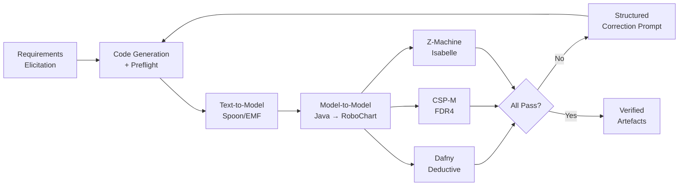

# Formal-Method-Guided Vibe Coding: What the Forge Verification Loop Means for Safety-Critical Work in Codex CLI


---

Vibe coding works until it matters. For consumer applications, a passing test suite is usually enough. For systems governed by DO-178C, IEC 61508, or ISO 26262, it is not — regulators require machine-checkable correctness evidence that no test suite can provide [^1]. A recent paper by Wei et al. introduces *Forge*, a closed-loop pipeline that wraps LLM code generation in three independent formal verifiers, achieving full verification on 15 of 15 runs with a median of just two iterations [^1]. The results expose a structural gap in every mainstream coding agent, Codex CLI included: the hook pipeline can enforce tool-level gates, but it has no native concept of a formal verification loop.

This article unpacks the Forge pipeline, maps its architecture onto Codex CLI v0.148.0's hook and configuration surface, and identifies what is missing for teams building safety-critical software with agentic assistance.

## The Problem: Verification-Level Defects, Not Structural Ones

Wei et al. ran a cold baseline — 30 code-generation attempts across three robotic-systems case studies without any verifier feedback [^1]. The result: zero convergence. Every run compiled (mostly), but none passed formal verification. The defects were not syntax errors or missing imports; they were contract violations, deadlock conditions, and invariant failures — the kind of bugs that tests can miss entirely.

The three case studies ranged in complexity:

| Case Study | Requirements | Java LoC | State Transitions |
|---|---|---|---|
| SRanger (ground robot) | 23 across 9 categories | ~220 across 10 files | 7 |
| LRE (AUV safety governor) | 51 across 12 categories | 613 across 12 files | 13 |
| Chemical Detector (multi-controller) | 81 across 11 categories | 618 total | Multi-modal |

When the full pipeline ran with structured correction prompts from verification failures, all 15 runs achieved full verification in 2–3 iterations, with wall-clock times between 1.8 and 11.6 minutes [^1].

## The Forge Pipeline: Seven Phases, Three Verifiers



The pipeline enforces strict Java coding constraints — single `step(InputEvent)` methods, two-level if-else, named boolean predicates, sealed interface event types. Lambdas, streams, and ternary conditionals are forbidden [^1]. These constraints exist because the Model-Driven Engineering transformations (phases 3–5) need predictable syntax to extract formal artefacts reliably.

Each verifier catches a distinct class of defect:

- **Dafny** (deductive verification): contract violations, bounds failures, termination proof failures
- **FDR4** (CSP refinement): behavioural deadlock, divergence, refinement failures
- **Isabelle** (Z-Machines theorem proving): structural deadlock, invariant violations, terminal mode handling defects

Across all 15 convergence runs, the MDE transformation phases never failed — the defects were always verification-level [^1]. This is a significant finding: the bottleneck is not the toolchain but the LLM's inability to reason about formal properties without feedback.

## Complementary Evidence: The Vericoding Landscape

Forge is not alone. The Vericoding benchmark (POPL 2026) establishes 12,504 formal specification tasks across Dafny, Verus, and Lean, showing that off-the-shelf LLMs achieve 82.2% success on Dafny tasks but only 27% on Lean [^2]. VeriContest adds 946 competitive-programming problems with Verus specifications, expert-validated proofs, and positive/negative test suites [^3].

The pattern across all three bodies of work is consistent: LLMs can generate formally verifiable code, but only when the verification tool provides structured feedback. Without that feedback loop, success rates collapse.

## Mapping Forge to Codex CLI v0.148.0

Codex CLI does not ship a formal verification pipeline, but its hook system, AGENTS.md directives, and named profiles provide the architectural primitives to approximate one.

### PostToolUse Hooks as Verification Gates

The Forge pipeline's core mechanism — run verifiers, feed failures back as correction prompts — maps directly onto PostToolUse hooks with exit code 2 semantics [^4].

```toml
# ~/.codex/config.toml — formal verification gate
[hooks.PostToolUse.safety-verify]
match_tools = ["write_file", "apply_patch"]
match_globs = ["src/**/*.java"]
type = "command"
command = "./scripts/forge-verify.sh"
timeout = 120
statusMessage = "Running Dafny + FDR4 + Isabelle verification..."
```

The verification script would:

1. Run the Spoon/EMF text-to-model transformation
2. Execute Dafny, FDR4, and Isabelle in parallel
3. If any verifier fails, exit with code 2 and write structured failure diagnostics to stderr
4. If all pass, exit 0

When a PostToolUse hook returns exit code 2, Codex replaces the tool result with the hook's stderr output and continues the model from that feedback [^4] — precisely the correction-prompt mechanism that drives Forge's convergence.

### AGENTS.md as a Constraint Surface

Forge enforces strict Java coding constraints to ensure reliable MDE transformation. In Codex CLI, these constraints belong in AGENTS.md:

```markdown
## Formal Verification Constraints

All Java source in `src/controllers/` MUST follow these rules:

1. Each controller class has exactly ONE `step(InputEvent)` method
2. Use two-level if-else for state transitions — no switch expressions
3. All guard conditions must be named boolean predicates
4. Event types must use sealed interfaces with record subtypes
5. FORBIDDEN: lambdas, streams, pattern-matching instanceof, ternary conditionals
6. Every state transition must include a postcondition comment: `// POST: mode == X`
```

These directives constrain the LLM's output space to the subset that the verification toolchain can process — exactly what AGENTS.md is designed for.

### Named Profiles for Phase Separation

Forge separates code generation from verification. Codex CLI's named profiles can enforce this:

```toml
# ~/.codex/profiles/safety-critical.toml
model = "gpt-5.6-sol"
approval_policy = "on-failure-or-edit"
sandbox = "workspace-write"
project_doc_fallback_filenames = ["AGENTS.md", "SAFETY.md"]

[hooks.PostToolUse.formal-verify]
match_tools = ["write_file", "apply_patch"]
match_globs = ["src/**/*.java"]
type = "command"
command = "./scripts/forge-verify.sh"
timeout = 300
```

Invoke with `codex --profile safety-critical`, isolating the formal verification workflow from everyday development sessions.

### Async Hooks for Non-Blocking Verification

For longer-running formal proofs (Isabelle lemma proving can take minutes on complex specifications), v0.148.0's async hooks allow verification to run in the background:

```toml
[hooks.PostToolUse.isabelle-background]
match_tools = ["write_file"]
match_globs = ["src/**/*.java"]
type = "command"
command = "./scripts/isabelle-prove.sh"
async = true
timeout = 600
statusMessage = "Proving Isabelle lemmas (background)..."
```

Background hook results are delivered at the next safe conversation point [^4]. This means Dafny and FDR4 (which complete in seconds) can run synchronously as blocking gates, whilst Isabelle runs asynchronously.

## What Is Missing

The mapping is instructive but incomplete. Several structural gaps remain:

| Gap | Impact | Forge Has It |
|---|---|---|
| No MDE transformation toolchain | Cannot extract formal artefacts from generated Java | Yes — Spoon/EMF → RoboChart |
| No structured correction prompt format | Hook stderr is free text, not verifier-specific diagnostics | Yes — per-requirement fix directives |
| No iteration budget control | No way to limit verification-correction cycles | Yes — configurable K iterations |
| No traceability chain | Cannot map requirements → code → formal artefacts | Yes — bidirectional coverage check |
| No vacuity audit | Cannot detect vacuously true proofs | Yes — Phase 6d |
| PostToolUse cannot undo writes | Verification failure leaves incorrect code on disc | Forge regenerates from scratch |

The most significant gap is the lack of a structured correction prompt format. Forge's correction prompts include the specific verifier, the failing property, the requirement it maps to, and the exact code location [^1]. Codex CLI's PostToolUse hooks can only return free-text feedback via stderr — the model must parse the failure itself, which is fragile.

## A Practical Starting Point

For teams evaluating formal verification with Codex CLI today, a minimal viable pipeline would:

1. **Constrain output** via AGENTS.md (sealed interfaces, named predicates, no lambdas)
2. **Gate writes** with a synchronous PostToolUse hook running Dafny verification
3. **Log failures** to the rollout JSONL for audit purposes
4. **Use a named profile** to isolate safety-critical work from general development

This approximates Forge's Phase 2–6a loop. Adding FDR4 and Isabelle requires the MDE transformation chain, which is currently external to Codex CLI.

The 0/30 cold baseline versus 15/15 with feedback is the number that matters. Formal verification feedback transforms LLM code generation from unreliable to convergent — but only if the feedback loop is structurally enforced, not left to the developer's discipline.

## Citations

[^1]: Wei, R., Zhu, L., Wang, H., Woodcock, J., Yan, F., Foster, S. & Ji, X. (2026). "Formal-Method-Guided Vibe Coding: Closing the Verification Loop on AI-Generated Safety-Critical Software Through Model-Driven Engineering." arXiv:2606.22413v2. [https://arxiv.org/abs/2606.22413](https://arxiv.org/abs/2606.22413)

[^2]: Mugnier, C. et al. (2026). "A Benchmark for Vericoding: Formally Verified Program Synthesis." POPL 2026 / Dafny 2026 Workshop. arXiv:2509.22908. [https://arxiv.org/abs/2509.22908](https://arxiv.org/abs/2509.22908)

[^3]: Chen, Y. et al. (2026). "VeriContest: A Competitive-Programming Benchmark for Verifiable Code Generation." arXiv:2605.08553. [https://arxiv.org/abs/2605.08553](https://arxiv.org/abs/2605.08553)

[^4]: OpenAI. (2026). "Hooks — Codex CLI Documentation." [https://developers.openai.com/codex/hooks](https://developers.openai.com/codex/hooks)

[^5]: VeriCodeGen Workshop. (2026). "AI for Verifiable Coding — NeurIPS 2026 Workshop." [https://vericodegen.github.io/](https://vericodegen.github.io/)

[^6]: OpenAI. (2026). "ChatGPT & Codex Changelog — v0.148.0." [https://developers.openai.com/codex/changelog](https://developers.openai.com/codex/changelog)
