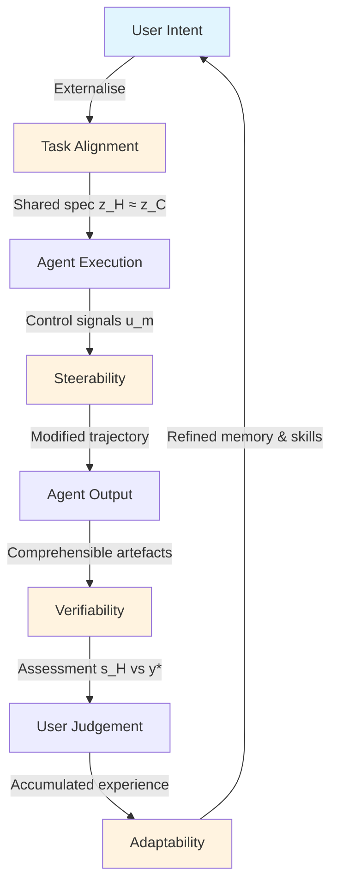

# Humans Are Missing from Coding Agent Research: What Four Interaction Dimensions Mean for Your Codex CLI Workflow


---

A position paper from Carnegie Mellon, Stanford, Princeton, and UIUC argues that the autonomous-first framing dominating coding agent research obscures the actual bottleneck: how developers communicate with, steer, verify, and trust their agents [^1]. The claim lands at a moment when the Stack Overflow 2026 Developer Survey reports 84% AI coding tool adoption but only 3% high trust [^2], and a 20,574-session observational study finds 91.49% of visible agent misalignment episodes still require explicit user correction [^3]. This article unpacks the four interaction dimensions the paper defines, maps each to concrete Codex CLI v0.148.0 mechanisms, and identifies where gaps remain.

## The Autonomous-First Fallacy

Benchmark-driven research optimises for unassisted task completion. SWE-bench scores climb, yet developers report that "almost right, but not quite" output is their biggest frustration — 66% cite it as their primary pain point [^2]. The paper frames this as a category error: measuring agents on autonomy when the deployment reality is collaboration. Patch bloat analysis on SWE-bench finds over 50% functional discrepancies in resolved patches, with verbose implementation appearing in roughly 60% and scope creep in 50-65% of bloated patches [^1]. Agents that pass the benchmark still burden the developer with review debt.

## The Four Dimensions

Wang et al. define four interaction-level dimensions that characterise the human-agent task-solving loop. Each captures a distinct failure mode that benchmarks miss.



### 1. Task Alignment

The distance between the user's intended specification (z_H) and the agent's inferred specification (z_C). Misalignment manifests as the "clarification spiral" — agents launch implementation without surfacing unstated constraints. The paper notes a critical data gap: there is almost no open conversation data between humans and AI coding systems, making it difficult to study alignment empirically [^1].

**Codex CLI mapping:** The `AGENTS.md` file serves as a persistent specification artefact, narrowing the z_H–z_C gap by encoding project conventions, architectural constraints, and domain rules that the agent reads before every turn [^4]. Approval modes (`suggest`, `auto-edit`, `full-auto`) let teams calibrate how much specification they externalise versus delegate.

**Gap:** `AGENTS.md` is static. It cannot model the user's current intent for a specific task, nor does it adapt based on correction patterns. The clarification spiral remains possible whenever the prompt underspecifies intent relative to the project's conventions.

### 2. Steerability

The agent's responsiveness to human control signals during execution. The paper formalises this as measuring how well modified trajectories match the developer's intended changes after intervention at control points [^1].

**Codex CLI mapping:** Codex CLI v0.148.0 provides several steerability surfaces:

- **Approval mode selection** — `suggest` mode exposes every tool call for approval, maximising control points; `auto-edit` permits file writes but gates destructive commands; `full-auto` minimises interruption [^4].
- **PreToolUse hooks** — intercept tool calls before execution. Exit code 2 vetoes the action; exit code 0 with `updatedInput` rewrites the command. This is the primary programmatic steerability mechanism [^4].
- **Session forking** — `codex exec fork` (new in v0.148.0) creates a branch from any conversation point, letting developers explore alternatives without losing the main trajectory [^5].
- **`/status` cost visibility** — estimated thread credits or cost displayed in status lines and terminal titles, enabling informed decisions about whether to continue or redirect [^5].

**Gap:** Steerability remains reactive. The agent does not proactively identify decision points or surface trade-offs. There is no mechanism for the agent to say "I see two approaches; which do you prefer?" unless explicitly instructed in `AGENTS.md`.

### 3. Verifiability

The user's ability to assess correctness — presupposing comprehensible code artefacts and execution traces. The paper's most striking statistic: of the 84% of developers using AI coding tools, nearly half do not trust outputs, while two-thirds report that half-baked solutions create heavier debugging burdens [^1][^2].

**Codex CLI mapping:**

- **PostToolUse hooks** — run after every tool invocation. A verification hook can execute tests, linters, or static analysis and return exit code 2 to block further progress until issues are addressed [^4].
- **Guardian auto-review** — applies model-based review to agent-generated changes, catching obvious errors before the developer sees them [^4].
- **Markdown export** — `/export` (v0.148.0) dumps the full conversation to Markdown, creating an auditable trace of every decision and tool call [^5].
- **Rollout JSONL and OTLP spans** — structured telemetry for post-hoc analysis of agent behaviour [^4].

**Gap:** Guardian reviews actions, not claims. If the agent asserts "this handles the edge case where X" but the code does not, Guardian will not catch the semantic mismatch. The paper argues that verification requires task-aware artefacts — summaries, visual previews, proactive self-checking — not just test results [^1].

### 4. Adaptability

The agent's ability to improve across sessions using accumulated experience. The paper quantifies this as improvement over k sessions: A(C^k) = E[Perf(C^k) - Perf(C^0)], and identifies "prompt fatigue" — users re-establishing context repeatedly — as a key failure mode [^1].

**Codex CLI mapping:**

- **Memories pipeline** — Codex CLI stores and retrieves project-specific memories across sessions, reducing context re-establishment overhead [^4].
- **Named profiles** — `config.toml` profiles allow different configurations (model, approval mode, hooks) for different task types, encoding learned preferences [^4].
- **`model_auto_compact_token_limit`** — automatic context compaction prevents context window exhaustion during long sessions [^4].

**Gap:** The Memories pipeline has no validation gate — stored memories are not verified for correctness or relevance. Compaction destroys explanatory context, working against both verifiability and adaptability. There is no mechanism for the agent to learn from correction patterns (e.g., "the developer always rejects my test naming convention").

## The Misalignment Evidence

The interaction-dimension framework gains empirical weight from a complementary study analysing 20,574 real-world coding agent sessions across 1,639 repositories [^3]. The researchers identified seven recurring forms of misalignment spanning how agents read projects, interpret intent, follow rules, bound their actions, implement code, and report progress. The key finding: 90.50% of misalignment episodes impose effort and trust costs rather than irreversible system damage, yet 91.49% still require explicit user correction [^3]. This is precisely the verification and steerability gap the position paper describes — the agent does not cause catastrophic failures, but it silently accumulates review debt.

## Practical Configuration: A Human-Centred Codex CLI Setup

The following `config.toml` profile encodes the paper's recommendations as Codex CLI configuration:

```toml
[profile.human-centred]
model = "o4-mini"
approval_mode = "auto-edit"      # Steerability: gate destructive actions
model_auto_compact_token_limit = 90000  # Adaptability: preserve context longer

[profile.human-centred.hooks.PreToolUse]
# Task alignment: enforce AGENTS.md conventions
command = "scripts/check-conventions.sh"

[profile.human-centred.hooks.PostToolUse]
# Verifiability: run tests after every tool call
command = "scripts/verify-output.sh"
timeout_ms = 30000
```

The verification hook (`verify-output.sh`) should go beyond test execution:

```bash
#!/usr/bin/env bash
# verify-output.sh — human-centred PostToolUse hook

# 1. Run tests
npm test --silent 2>/dev/null
TEST_EXIT=$?

# 2. Check for patch bloat (scope creep detection)
CHANGED_LINES=$(git diff --stat HEAD | tail -1 | grep -oP '\d+(?= insertion)')
if [ "${CHANGED_LINES:-0}" -gt 500 ]; then
    echo "⚠️ Large change detected (${CHANGED_LINES} insertions). Review for scope creep."
    exit 2  # Block and require human review
fi

# 3. Lint changed files
git diff --name-only HEAD | xargs eslint --quiet 2>/dev/null
LINT_EXIT=$?

[ $TEST_EXIT -ne 0 ] || [ $LINT_EXIT -ne 0 ] && exit 2
exit 0
```

## What Is Still Missing

The paper identifies three research directions that current Codex CLI architecture cannot address without upstream changes:

| Dimension | Gap | Required Change |
|-----------|-----|-----------------|
| Task alignment | No user modelling | Agent should learn developer preferences from correction history |
| Steerability | No proactive decision exposure | Agent should surface trade-offs at meaningful control points |
| Verifiability | No claim-level verification | Guardian should verify semantic claims, not just code actions |
| Adaptability | No correction-pattern learning | Memories should encode what the developer rejected, not just what succeeded |

The paper's strongest argument is that these are not feature requests — they represent a fundamental reorientation from "how well does the agent solve tasks alone?" to "how effectively does the human-agent pair solve tasks together?" [^1]. Until benchmarks measure interaction quality alongside task completion, the gap between adoption (84%) and trust (3%) will persist [^2].

## Citations

[^1]: Wang, Z.Z., Yang, J., Lieret, K., Tartaglini, A., Chen, V., Wei, Y., Wang, Z., Zhang, L., Narasimhan, K., Schmidt, L., Neubig, G., Fried, D. and Yang, D. (2026) 'Position: Humans are Missing from AI Coding Agent Research', arXiv:2608.12355. Available at: [https://arxiv.org/abs/2608.12355](https://arxiv.org/abs/2608.12355).

[^2]: Stack Overflow (2026) 'Developer Survey 2026'. Reported via BuildApps and ByteIota. Available at: [https://buildapps.co.uk/signals/ai-code-trust-gap-stack-overflow-2026/](https://buildapps.co.uk/signals/ai-code-trust-gap-stack-overflow-2026/) and [https://byteiota.com/stack-overflow-dev-survey-2026-ai-at-84-trust-at-3/](https://byteiota.com/stack-overflow-dev-survey-2026-ai-at-84-trust-at-3/).

[^3]: Anonymous (2026) 'How Coding Agents Fail Their Users: A Large-Scale Analysis of Developer-Agent Misalignment in 20,574 Real-World Sessions', arXiv:2605.29442. Available at: [https://arxiv.org/abs/2605.29442](https://arxiv.org/abs/2605.29442).

[^4]: OpenAI (2026) 'Codex CLI Documentation and Configuration Reference'. Available at: [https://github.com/openai/codex](https://github.com/openai/codex).

[^5]: OpenAI (2026) 'Codex CLI v0.148.0 Release Notes', 18 August 2026. Available at: [https://github.com/openai/codex/releases/tag/0.148.0](https://github.com/openai/codex/releases/tag/0.148.0).
