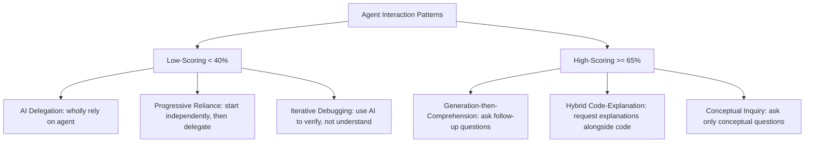
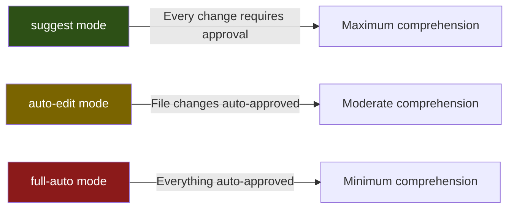

# (Im)Paired Programming: The Productivity-Understanding Gap and What It Means for Your Codex CLI Workflow


---

## The Uncomfortable Tradeoff Nobody Wants to Discuss

Three converging studies published in 2026 have forced a reckoning with a question most teams have been avoiding: **do coding agents make us faster at the cost of making us dumber?**

Balepur et al.'s "(Im)Paired Programming" study (July 2026) found that 54 students using a coding agent achieved a 35-percentage-point improvement in task correctness over a copilot baseline — yet scored measurably worse on comprehension questions about the code they had just produced [^1]. Anthropic's own study of 52 junior engineers learning a new library showed AI-assisted participants scoring 50% on post-task quizzes versus 67% for the hand-coding control — a 17-percentage-point gap amounting to nearly two letter grades (Cohen's d = 0.738, p = 0.01) [^2]. And the CHI 2026 "Code with Me or for Me?" study confirmed that agents deliver a 35% correctness increase at roughly 50% of the user effort, but 55% of participants preferred copilots for *understanding* what had been produced [^3].

The pattern is consistent: agents accelerate completion whilst degrading comprehension. This article maps those findings to Codex CLI's feature set and offers concrete configuration patterns that defend against the worst of the understanding gap.

## What the Research Actually Shows

### The Low-Effort Interaction Problem

The Anthropic study identified specific interaction patterns that predict poor comprehension [^2]:



The critical finding: **how** someone used the agent determined retention, not **whether** they used it. Participants who combined generation with active comprehension-building questions retained knowledge at levels comparable to manual coding [^2].

### The Extension Failure

Balepur et al. added a follow-up task: participants had to extend the code they had just produced, without agent assistance. The agent group struggled disproportionately [^1]. This mirrors a production failure mode that every senior developer has witnessed: code ships, the original contributor leaves, and the team inherits logic nobody truly understands.

### The Perception Gap

Perhaps the most troubling finding comes from separate productivity research showing developers using Cursor overestimated productivity gains by 20% whilst effective productivity actually *decreased* by 19% [^4]. We are not merely getting worse at understanding — we are getting worse at noticing that we are getting worse.

## Mapping the Gap to Codex CLI

Codex CLI's layered configuration system — AGENTS.md directives, PreToolUse and PostToolUse hooks, approval modes, and session management — provides hooks at precisely the points where comprehension degrades. The challenge is using them intentionally rather than treating them as mere automation.

### AGENTS.md: Forcing Explanation Before Acceptance

The simplest defence is an AGENTS.md directive that forces the agent to explain before proceeding:

```markdown
# AGENTS.md — comprehension-first directives

## Workflow Rules
- Before applying any file edit, explain in plain language:
  1. What the change does
  2. Why it is necessary
  3. What would break if it were removed
- After completing a task, summarise the architectural decision you made and any alternatives you rejected
- Never use "obvious" or "straightforward" — if something is obvious, explain why
```

This maps directly to the "generation-then-comprehension" interaction pattern that the Anthropic study identified as producing the highest retention scores [^2]. The directive costs a few hundred extra tokens per turn. The comprehension benefit is measurable.

### PostToolUse Hooks: Automated Comprehension Gates

A PostToolUse hook can enforce a lightweight comprehension check after file writes:

```bash
#!/bin/bash
# hooks/post-tool-use-comprehension.sh
# Fires after file_write, file_edit operations

EVENT_TYPE=$(echo "$1" | jq -r '.tool_name')

if [[ "$EVENT_TYPE" == "file_write" || "$EVENT_TYPE" == "file_edit" ]]; then
  FILE_PATH=$(echo "$1" | jq -r '.arguments.file_path // .arguments.path')

  # Exit code 2 = inject feedback, force agent to continue
  echo "COMPREHENSION GATE: You just modified $FILE_PATH."
  echo "Before proceeding, explain:"
  echo "1. The specific change you made and its purpose"
  echo "2. How this change interacts with the rest of the codebase"
  echo "3. Any edge cases or failure modes introduced"
  exit 2
fi

exit 0
```

Exit code 2 feeds the message back into the agent context and forces it to continue — creating an explanation loop that appears in the session transcript. When a developer reviews the session later, the explanations are there alongside the diffs [^5].

### Approval Mode as a Comprehension Checkpoint

Codex CLI's approval modes create natural pause points:



The research is unambiguous: the more effort a developer invests in reviewing agent output, the better their understanding [^1][^2][^3]. Running in `suggest` mode with manual approval is the equivalent of the "hybrid code-explanation" pattern. Running in `full-auto` mode mirrors the "AI delegation" pattern that produced the worst comprehension scores.

This does not mean `full-auto` is wrong — it means `full-auto` is appropriate for tasks where you already understand the domain and the changes are routine. The Anthropic study found that expert prompters triggered 12 actions and 3,200 words of output per prompt, versus 5 actions and 600 words for novices [^2]. Expertise determines whether automation helps or hurts.

A practical heuristic:

| Scenario | Recommended Mode | Rationale |
|----------|-----------------|-----------|
| Unfamiliar codebase or library | `suggest` | Forces line-by-line review |
| Familiar codebase, novel feature | `auto-edit` | Trust file ops, review approach |
| Routine refactoring or formatting | `full-auto` | Understanding already established |
| Learning a new framework | `suggest` + explanation AGENTS.md | Maximises retention |

### Session Transcripts as Learning Artefacts

Codex CLI's `/export` command (v0.148.0) produces Markdown session transcripts [^6]. When combined with comprehension-forcing AGENTS.md directives and PostToolUse explanation hooks, these transcripts become learning artefacts rather than mere audit logs.

A team workflow:

1. Developer runs a Codex CLI session with comprehension directives active
2. Session exported via `/export` to a shared docs directory
3. In code review, the PR includes both the diff and the session transcript
4. Reviewers assess not just *what* changed but *why the agent chose that approach*

This addresses the extension failure identified by Balepur et al. [^1]: when another developer inherits the code, the reasoning is preserved in the transcript rather than lost with the session.

## The Debugging Blindspot

The Anthropic study identified debugging as the skill area most affected by AI assistance [^2]. This aligns with the "(Im)Paired Programming" finding that agent users struggled to extend code without assistance [^1].

The mechanism is straightforward: when an agent handles debugging autonomously — running code, reading stack traces, applying fixes — the developer never builds the mental model of failure modes that experienced debugging requires. The CHI 2026 study confirmed this: in copilot workflows, users manually ran code and read output; in agent workflows, the agent ran code automatically and surfaced only the result [^3].

For Codex CLI, the mitigation is architectural:

```markdown
# AGENTS.md — debugging comprehension rules

## Debugging Protocol
- When encountering an error, first explain the error message in plain language
- Describe at least two possible root causes before attempting a fix
- After fixing a bug, explain what would have happened if the bug had remained
- Never suppress error output — show the full stack trace in your response
```

This forces the agent into the "conceptual inquiry" interaction pattern — the pattern the Anthropic study found was fastest among high-scorers [^2].

## Organisational Implications

### The Knowledge Transfer Problem

When 42% of committed code is AI-generated or AI-assisted [^4], and developers using that code score 17 percentage points lower on comprehension, organisations face a compound problem: institutional knowledge is being generated by agents and reviewed by developers who do not fully understand it.

Codex CLI's Memories system offers a partial defence. Memories persist across sessions, meaning an agent's understanding of project conventions, architectural decisions, and domain-specific rules accumulates over time [^6]. But Memories augment the *agent's* understanding, not the *developer's*. The distinction matters.

### The Seniority Inversion

The research implies a counterintuitive organisational risk: **senior developers benefit most from agents because they already understand the domain**, whilst **junior developers — the ones who most need to learn — are most harmed by delegation** [^2]. An organisation that deploys agents uniformly across seniority levels may accelerate its experienced engineers whilst silently deskilling its pipeline.

A Codex CLI configuration strategy for this:

- **Junior developers**: `suggest` mode, comprehension AGENTS.md, PostToolUse explanation hooks
- **Mid-level developers**: `auto-edit` mode, standard AGENTS.md, optional explanation hooks
- **Senior developers**: mode at discretion, architectural-decision AGENTS.md directives

Named profiles in Codex CLI's `config.toml` support per-project or per-role configurations, making this operationally straightforward.

## What Remains Unsolved

Several gaps in Codex CLI's current feature set limit how far tooling can address the comprehension problem:

1. **No built-in comprehension metrics**: Codex CLI tracks token costs and session durations but has no mechanism to measure whether the developer understood the output. The PostToolUse hook pattern above is a workaround, not a product feature.

2. **Compaction destroys explanations**: When `model_auto_compact_token_limit` triggers, the agent's earlier explanations may be summarised or dropped, removing precisely the context that supports comprehension [^6].

3. **No difficulty-adaptive approval mode**: The approval mode is static for the session. A mode that automatically tightened approval requirements when the agent encountered unfamiliar territory — detected via, say, imports of new libraries or modifications to files not previously touched — would directly address the research findings.

4. **Guardian reviews actions, not claims**: Codex CLI's Guardian auto-review system evaluates whether proposed *actions* are safe, not whether the agent's *explanations* are accurate. An agent could produce a plausible but misleading explanation, pass Guardian review, and reinforce a developer's misunderstanding.

## Practical Takeaways

The research does not argue against coding agents. It argues against *unexamined* use of coding agents. The three studies converge on a single recommendation: **invest interaction effort proportional to the novelty of the task**.

For Codex CLI users, this translates to:

1. **Use AGENTS.md to mandate explanations** — the single highest-ROI comprehension intervention
2. **Match approval mode to domain familiarity** — `suggest` for learning, `full-auto` for the routine
3. **Export and share session transcripts** — make agent reasoning reviewable
4. **Deploy PostToolUse hooks for comprehension gates** on critical codebases
5. **Differentiate configuration by seniority** — protect the learning pipeline

The productivity gains are real. The understanding costs are also real. The engineering challenge is capturing the former without paying the latter.

## Citations

[^1]: Balepur, N., Baumler, C., Chen, V., Choi, E., Rudinger, R., & Boyd-Graber, J. L. (2026). "(Im)Paired Programming: Coding Agents Improve Productivity but Harm Understanding." arXiv:2607.26375. [https://arxiv.org/abs/2607.26375](https://arxiv.org/abs/2607.26375)

[^2]: Anthropic. (2026). "How AI assistance impacts the formation of coding skills." [https://www.anthropic.com/research/AI-assistance-coding-skills](https://www.anthropic.com/research/AI-assistance-coding-skills)

[^3]: CHI 2026. "Code with Me or for Me? How Increasing AI Automation Transforms Developer Workflows." Proceedings of the 2026 CHI Conference on Human Factors in Computing Systems. arXiv:2507.08149. [https://arxiv.org/abs/2507.08149](https://arxiv.org/abs/2507.08149)

[^4]: AI Coding Tools Productivity Paradox research, 2026. Developer perception gap: 20% overestimation vs 19% actual decrease in effective productivity. [https://blog.exceeds.ai/ai-coding-agents-productivity-paradox/](https://blog.exceeds.ai/ai-coding-agents-productivity-paradox/)

[^5]: OpenAI. "Codex CLI Hooks Documentation." [https://developers.openai.com/codex/hooks](https://developers.openai.com/codex/hooks)

[^6]: OpenAI. "Codex CLI v0.148.0 Changelog." Features including /export, Memories, model_auto_compact_token_limit, and named profiles. [https://developers.openai.com/codex/changelog](https://developers.openai.com/codex/changelog)
