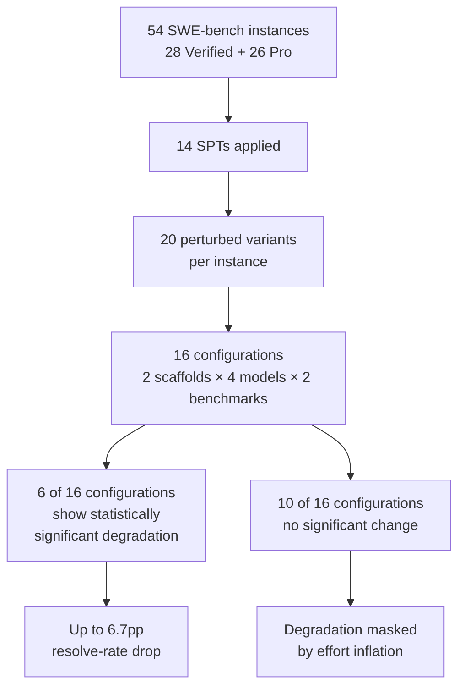
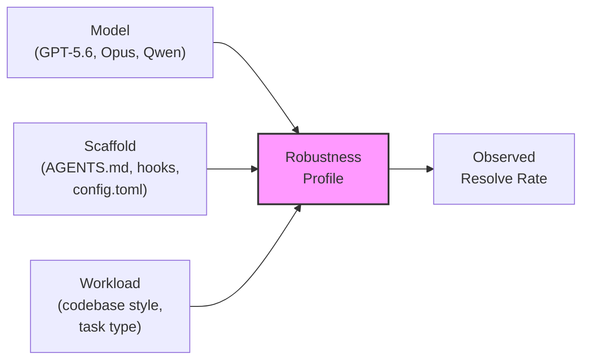

# The Jagged Frontier: Why Your Coding Agent's Robustness Depends on Scaffold and Model Together


---

You upgrade your model, your resolve rate climbs, and you declare victory. But rename a few variables, rewrite an `if-else` into a ternary, inject some dead code — semantically identical changes — and that same model under a different scaffold can lose nearly seven percentage points. Worse, the model that was most robust under one scaffold becomes the most brittle under another. This is the jagged frontier, and it means robustness is not a property of your model — it is a joint property of model, scaffold, and workload together.

## The Research: 14 Transformations, 16 Configurations, One Uncomfortable Finding

Mahmud et al. (August 2026) introduce a systematic evaluation of coding agent robustness to semantics-preserving transformations (SPTs) [^1]. The methodology is straightforward but revealing: take repository-level issue-resolution instances from SWE-bench Verified and SWE-bench Pro, apply 14 SPTs that change surface syntax without altering behaviour, then measure whether agents still resolve the issues.

### The Transformation Catalogue

The 14 SPTs fall into two categories:

**Rewrites** — surface-level restructuring that preserves semantics:
- If-else switcher (swap branches, negate condition)
- For-loop rewriting (e.g. `for` to `while`)
- And-condition splitter (flatten compound boolean)
- Comparison swapper (`a < b` → `b > a`)
- While-loop unrolling
- Double-negation injector
- Commutative operand permuter
- Local variable renamer
- String literal splitter

**Inert insertions** — dead code that should be invisible to correct reasoning:
- If-true wrapper
- Try-except injector
- Dead-code injector
- Dead-string assignment
- Dead-method injection

Each instance receives 20 perturbed variants, with transformations touching a median of 6.9–7.7% of lines [^1]. The transformations are deliberately mild — the kind of stylistic variation you encounter daily across any team's codebase.

### The Configurations

Two agentic scaffolds — mini-SWE agent (a minimal ReAct loop) and OpenCode (a richer multi-tool scaffold) — each paired with four frontier models: Claude Opus 4.5, Kimi K2.5, MiniMax M2.5, and Qwen 3.6-27B. Each configuration runs against both SWE-bench Verified and SWE-bench Pro, yielding 16 model-scaffold-dataset triples [^1].

### The Results



Six of 16 configurations show statistically significant resolve-rate degradation, with the worst case — mini-SWE agent with Opus on SWE-bench Pro — dropping 6.7 percentage points [^1]. But the critical finding is not the magnitude; it is the pattern.

## The Jagged Frontier: No Stable Model Ranking

The paper's central contribution is demonstrating that **robustness rankings do not transfer across scaffolds**:

| Model | mini-SWE (Verified) | OpenCode (Verified) |
|-------|:---:|:---:|
| Qwen 3.6-27B | **0.2pp** drop (most robust) | **5.5pp** drop (most brittle) |
| Claude Opus 4.5 | 1.8pp drop | ~1.0pp drop |

Qwen ranks among the most robust under mini-SWE agent on SWE-bench Verified (0.2pp degradation) yet becomes the most brittle under OpenCode (5.5pp) [^1]. This is not noise — the study uses fixed-population bootstrap inference with 20,000 resamples and 95% Newcombe intervals for per-instance significance [^1].

This confirms what Starace demonstrated independently on GAIA: scaffold choice alone moves measured accuracy by up to 28 percentage points within a single model [^2]. The implication is that published benchmark scores — typically measured under a single scaffold — tell you nothing about how your specific configuration will behave.

## Hidden Cost: Effort Inflation Without Outcome Change

Even when resolve rates hold steady, perturbations extract a tax. Across configurations, step counts rise by up to 9.9% and token costs by up to 22.9% [^1]. The agents wander more, consume more context per action, and cost more per step — all because of cosmetic code changes.

One configuration illustrates the dynamic particularly well: Opus under mini-SWE on Verified actually *reduces* step count by 19.8% under perturbation, but compensates by doubling output tokens per step, resulting in a net 4.0% cost increase through denser action sequences [^1]. The agent adapts its strategy rather than degrading its outcome — but you pay for that adaptation in tokens.

This has direct implications for cost budgeting. If your `config.toml` sets tight token limits, perturbation-induced effort inflation could push sessions into compaction earlier, potentially cascading into resolve-rate drops that the paper's controlled environment would not surface.

## Why Simpler Scaffolds Win

The simpler scaffold (mini-SWE agent) consistently degrades less than OpenCode: 1.34pp vs 1.88pp on Verified, and 1.88pp vs 3.65pp on Pro [^1]. This pattern holds despite mini-SWE agent having *lower* capability on one benchmark — it resolves fewer issues overall but loses fewer under perturbation.

The paper does not provide a mechanistic explanation, but the pattern aligns with the broader scaffold-effects literature. Starace's GAIA study found that the pre-registered hypothesis of more-capable models being less scaffold-sensitive was "rejected in direction" — scaffold effects vary significantly by model in every dataset slice [^2]. Richer scaffolds introduce more decision points where surface-level code changes can send the agent down a different reasoning path.

For Codex CLI practitioners, this suggests a counterintuitive principle: **a leaner AGENTS.md with fewer constraints may produce more robust behaviour than an exhaustive instruction set**, because each additional instruction is another surface the agent can misapply when code looks slightly different from what it expects.

## Degradation Is Concentrated, Not Diffuse

Of the 432 instance-configuration items evaluated, only 14 showed statistically significant degradation with 95% confidence [^1]. More strikingly, three instances account for roughly two-thirds of the 6.7pp mean degradation in the worst configuration [^1]. Brittleness attaches to particular instance-model-scaffold combinations, not uniformly across the workload.

This concentration pattern has a practical consequence: aggregate robustness metrics are misleading. Your agent may be perfectly robust on 95% of your codebase and catastrophically brittle on the remaining 5% — the instances where code style deviates most from training distribution norms.

## Mapping to Codex CLI: What You Can Control

Codex CLI's configuration stack — `config.toml`, AGENTS.md, hooks, named profiles, and sandbox policies — constitutes your scaffold. The jagged frontier means you cannot assume a model upgrade or configuration change that improves performance also improves robustness.

### Scaffold Simplicity via AGENTS.md

The robustness advantage of simpler scaffolds maps directly to AGENTS.md design. OpenAI's own best practices recommend keeping each AGENTS.md under 100 lines [^3]. Research from ICLR 2026 confirms that agents default to non-interactive behaviour without explicit encouragement [^3], but over-specification creates more surfaces for perturbation-induced misapplication.

A robustness-oriented AGENTS.md focuses on *verification obligations* rather than *implementation preferences*:

```toml
# config.toml — robustness-first named profile
[profiles.robust]
model = "gpt-5.6-sol"
approval_mode = "unless-allow-listed"
```

```markdown
<!-- AGENTS.md — minimal, verification-focused -->
# Coding Standards

- Run the full test suite before declaring any task complete
- Verify changes compile before committing
- Do not assume variable names, control flow structure, or formatting conventions — read the actual code

# Constraints

- Do not refactor code not directly related to the task
- Do not rename variables for "clarity" in files you did not create
```

### PostToolUse Hooks for Perturbation Detection

The paper's finding that effort inflation precedes outcome degradation suggests a monitoring opportunity. A PostToolUse hook can track step count and token consumption trends within a session:

```bash
#!/usr/bin/env bash
# .codex/hooks/post-tool-use-effort-monitor.sh
# Track effort metrics and warn on inflation

STEP_COUNT_FILE="/tmp/codex-step-count-$$"
if [ ! -f "$STEP_COUNT_FILE" ]; then
  echo "0" > "$STEP_COUNT_FILE"
fi

CURRENT=$(cat "$STEP_COUNT_FILE")
NEXT=$((CURRENT + 1))
echo "$NEXT" > "$STEP_COUNT_FILE"

# Warn after 30 steps — typical tasks resolve in fewer
if [ "$NEXT" -gt 30 ]; then
  echo "WARNING: Step count $NEXT exceeds baseline. Possible perturbation-induced effort inflation." >&2
fi

exit 0
```

### Named Profiles for Robustness Testing

The jagged frontier means you should test your critical workflows under multiple configurations. Named profiles make this practical:

```toml
# config.toml — robustness testing profiles
[profiles.robust-simple]
model = "gpt-5.6-sol"
approval_mode = "unless-allow-listed"

[profiles.robust-alt]
model = "gpt-5.6-terra"
approval_mode = "unless-allow-listed"
```

Running the same task under both profiles and comparing resolve rates, step counts, and token costs gives you a local estimate of your scaffold's robustness frontier.

### PreToolUse Hooks as Perturbation Guards

The paper's dead-code injection and variable renaming transformations mirror what happens naturally in multi-developer codebases. A PreToolUse hook can enforce scope discipline to prevent the agent itself from introducing perturbation-like changes:

```bash
#!/usr/bin/env bash
# .codex/hooks/pre-tool-use-scope-guard.sh
# Block bulk renames and dead-code-style insertions outside task scope

if echo "$CODEX_TOOL_INPUT" | grep -qiE '(rename.*variable|add.*comment|refactor.*style|cleanup)'; then
  echo "BLOCKED: Cosmetic changes outside task scope increase perturbation surface." >&2
  exit 2  # Exit code 2 = veto the action
fi

exit 0
```

## The Configuration Interaction Problem



The jagged frontier is fundamentally a **three-way interaction effect**. Model capability, scaffold design, and workload characteristics jointly determine robustness. Codex CLI v0.148.0 gives you control over the scaffold axis through AGENTS.md, hooks, named profiles, and approval modes [^4]. The model axis is governed by `config.toml` model selection and the upcoming GPT-5.4 retirement on 31 August [^5]. The workload axis — your actual codebase — is the one you cannot easily change.

### What Codex CLI Cannot Do Yet

The paper exposes several gaps in current tooling:

- **No perturbation-aware evaluation mode.** You cannot ask Codex CLI to test its own robustness by running variants of a task. ⚠️
- **No effort-inflation alerting.** The `/status` command shows estimated cost but does not track step-count trends or compare against baselines. ⚠️
- **No scaffold-comparison tooling.** Named profiles exist, but there is no built-in mechanism to run the same task under multiple profiles and compare outcomes. ⚠️
- **No codebase-style profiling.** The agent has no way to assess whether a codebase's style falls within or outside its robust operating envelope. ⚠️

## Practical Takeaways

1. **Do not assume model robustness transfers across configurations.** A model that is robust under one scaffold may be brittle under another. Test under your actual AGENTS.md and hook setup.

2. **Prefer leaner scaffolds for robustness.** Over-specified AGENTS.md files create more surfaces for perturbation-induced misapplication. Focus on verification obligations, not implementation preferences.

3. **Monitor effort, not just outcomes.** Step-count and token-cost inflation are early signals of perturbation sensitivity, detectable before resolve rates visibly drop.

4. **Expect concentrated brittleness.** Your agent will be robust on most tasks and brittle on a few. Identify high-variance instances through repeated runs and defend them with tighter hooks.

5. **Budget for the perturbation tax.** Even robust configurations cost up to 22.9% more tokens under perturbation. Factor this into `model_auto_compact_token_limit` settings and session cost projections.

---

## Citations

[^1]: Mahmud, H.N., Gupta, S., Chaudhary, I., Enis, N., Mangal, R., Singh, G. & Pasareanu, C. (2026). "A Jagged Frontier: Evaluating Robustness of Code Agents to Semantics-Preserving Transformations." arXiv:2608.18389. [https://arxiv.org/abs/2608.18389](https://arxiv.org/abs/2608.18389)

[^2]: Starace, J. (2026). "Scaffold Effects on GAIA: A Controlled Comparison." arXiv:2606.08529. [https://arxiv.org/abs/2606.08529](https://arxiv.org/abs/2606.08529)

[^3]: OpenAI. (2026). "Best Practices — Codex CLI." ChatGPT Learn. [https://developers.openai.com/codex/learn/best-practices](https://developers.openai.com/codex/learn/best-practices)

[^4]: OpenAI. (2026). "Codex CLI v0.148.0 Release Notes." GitHub. [https://github.com/openai/codex/releases/tag/rust-v0.148.0](https://github.com/openai/codex/releases/tag/rust-v0.148.0)

[^5]: OpenAI. (2026). "Models — Codex CLI." ChatGPT Learn. [https://developers.openai.com/codex/models](https://developers.openai.com/codex/models)

[^6]: Shipyard. (2026). "Codex CLI Cheatsheet: config, commands, AGENTS.md, + best practices." [https://shipyard.build/blog/codex-cli-cheat-sheet/](https://shipyard.build/blog/codex-cli-cheat-sheet/)
