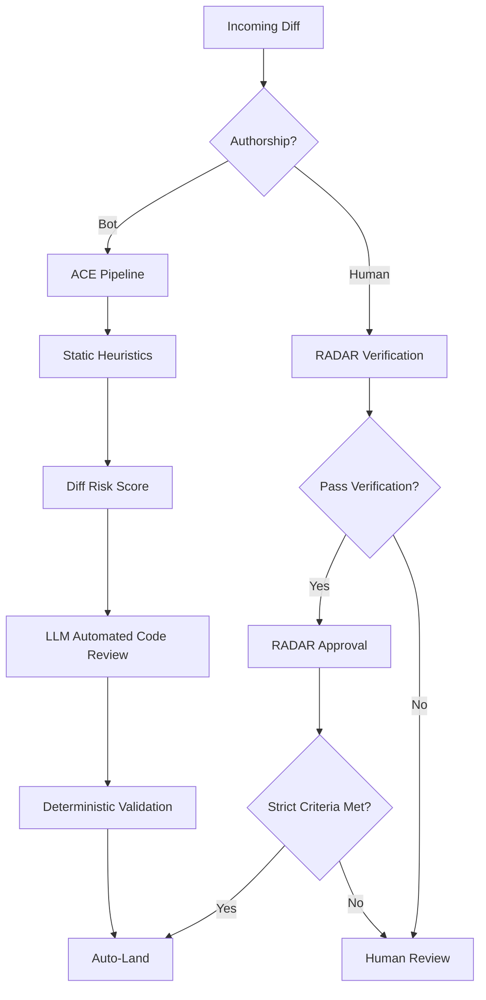
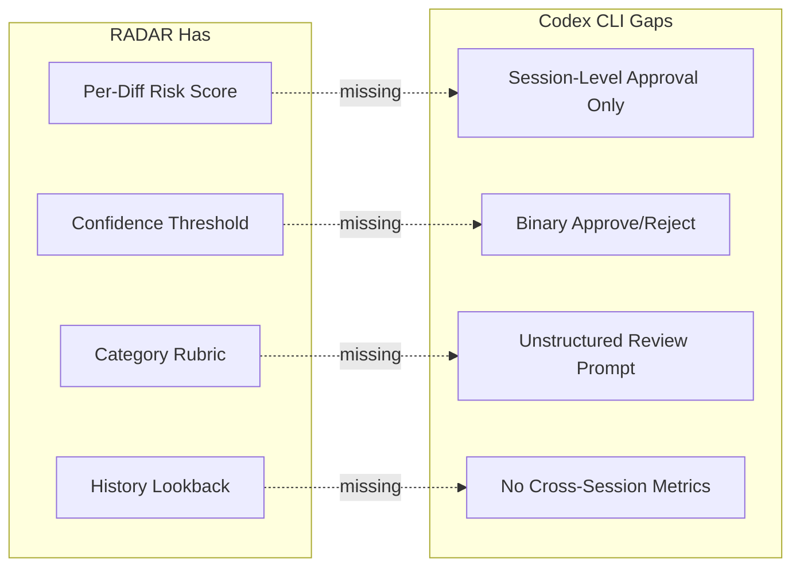

# RADAR at Meta: What Risk-Calibrated Auto-Review Means for Your Codex CLI Guardian Pipeline


---

AI-assisted coding at Meta increased lines of code per human-landed diff by 105.9% year-over-year, with agentic AI responsible for over 80% of that growth[^1]. The share of diffs receiving timely review declined in lockstep. Meta's answer — RADAR (Risk Aware Diff Auto Review) — reviewed 535,000+ diffs and landed 331,000+ with a production incident rate one-fiftieth that of human-reviewed code[^1]. If you run Codex CLI with Guardian auto-review as your sole quality gate, RADAR's architecture exposes both what that gate does well and where it falls short.

## The Review Bottleneck Is Real

The numbers are stark. Per-developer diff volume at Meta rose 51% while reviewer bandwidth stayed flat[^1]. This is the same pressure every team running Codex CLI in goal mode or with `--approve-for-me` faces: the agent produces changes faster than anyone can inspect them. Guardian auto-review catches obvious safety violations, but it operates as a single binary gate — approve or reject — with no risk stratification.

RADAR demonstrates that the solution is not faster reviewers or more permissive automation. It is *risk-calibrated routing*: send low-risk changes through automated approval, escalate high-risk changes to human reviewers, and instrument the boundary so you can adjust it with evidence.

## How RADAR Works

RADAR is a multi-stage funnel with distinct pipelines for bot-authored and human-authored diffs[^1].



### Diff Risk Score

A supervised ML model predicts production incident likelihood for each diff, expressed as a percentile (P5–P50)[^1]. Relaxing the threshold from P25 to P50 increased automation yield to 60.31% whilst maintaining safety guardrails[^1]. This calibration — adjusting the boundary between human and machine review based on observed outcomes — is the core insight.

### LLM-Based Automated Code Review

The LLM component classifies changes against predefined categories. Safe signals include refactoring without behavioural change, dead code removal, defensive programming additions, logging, formatting, documentation, import hygiene, test additions, and static resource updates[^1]. Risk signals include high complexity (score ≥4), structural changes, identified bugs, performance risks, and security vulnerabilities[^1]. Acceptance requires a confidence score of ≥8/10 across all changes; any risk signal disqualifies the diff entirely[^1].

### Eligibility Gates

Not every diff enters the funnel. Exclusions include open-source contributions, SOX-scoped regulatory code, work-in-progress diffs, previously rejected changes, and organisation-specific sensitive infrastructure[^1]. RACER runbooks (Meta's agentic refactoring system, generating ~3,000 diffs weekly) have additional per-runbook controls: a 60-day risk history lookback, daily volume limits of 2,000 diffs, and a permanent denylist for problematic runbooks[^1].

## The Results

| Metric | RADAR vs Non-RADAR |
|---|---|
| Revert rate | 1/3 (p < 1e-16) |
| Production incident rate | 1/50 (p < 1e-6) |
| Median time to close | >330% reduction |
| Median review wall time | 35% reduction |

The revert rate being *lower* than human-reviewed code is counterintuitive until you consider selection bias: RADAR only auto-approves changes it classifies as low-risk. The funnel filters out precisely the changes most likely to cause problems[^1].

## Mapping RADAR to Codex CLI

Codex CLI v0.148.0 has the primitives to approximate a risk-calibrated review pipeline, but they require assembly[^2][^3].

### Guardian as the LLM Review Stage

Guardian auto-review is conceptually equivalent to RADAR's LLM-based Automated Code Review stage. It analyses proposed tool calls and can approve or reject them[^2]. However, Guardian lacks:

- **Risk scoring**: no ML-based diff risk score. Every change is evaluated with the same scrutiny regardless of whether it touches a configuration file or a payment handler.
- **Confidence thresholds**: Guardian produces a binary approve/reject, not a confidence score that can be calibrated.
- **Category classification**: no structured vocabulary of safe vs. risk signals. Guardian's review prompt is a single system-level instruction, not a scored rubric.

### Approval Modes as Coarse Risk Tiers

Codex CLI's three approval modes — `suggest`, `auto-edit`, and the `--approve-for-me` flag[^3] — map loosely to RADAR's risk tiers:

```toml
# config.toml — approximating risk tiers with named profiles

[profile.low-risk]
# Formatting, docs, test additions — auto-approve
approval_mode = "auto-edit"
# approve_for_me = true  # if using v0.147+

[profile.standard]
# Feature work — agent edits, human approves commands
approval_mode = "auto-edit"

[profile.high-risk]
# Security-sensitive, regulatory, infrastructure
approval_mode = "suggest"
```

The gap: profile selection is manual. RADAR classifies *each diff* against a risk model. Codex CLI applies the same approval mode to an entire session. You cannot currently route individual tool calls through different approval thresholds based on what files they touch.

### PostToolUse Hooks as Deterministic Validation

RADAR's final stage before landing is deterministic validation — linting, type-checking, test execution. Codex CLI's `PostToolUse` hooks with exit code semantics (0 = proceed, 1 = inform, 2 = block) serve this role[^2]:

```bash
#!/bin/bash
# hooks/post-tool-risk-gate.sh
# Block changes to sensitive paths regardless of Guardian approval

SENSITIVE_PATHS="payments/ auth/ infrastructure/ migrations/"
CHANGED_FILES=$(git diff --name-only HEAD 2>/dev/null)

for path in $SENSITIVE_PATHS; do
    if echo "$CHANGED_FILES" | grep -q "^$path"; then
        echo "BLOCKED: Changes to $path require human review"
        exit 2  # Block the tool call
    fi
done

# Run standard validation
npm test --silent 2>/dev/null
exit $?
```

### PreToolUse Hooks as Eligibility Gates

RADAR's eligibility gates — filtering by authorship, scope, and history — can be partially approximated with `PreToolUse` hooks[^2]:

```bash
#!/bin/bash
# hooks/pre-tool-eligibility.sh
# Reject tool calls that would touch excluded scopes

TOOL_NAME="$1"
TOOL_INPUT="$2"

# SOX-equivalent: block writes to compliance-scoped directories
if echo "$TOOL_INPUT" | grep -q "compliance/\|regulatory/\|sox/"; then
    echo "ELIGIBILITY GATE: Compliance-scoped code requires manual review"
    exit 2
fi

exit 0
```

## What Codex CLI Would Need

RADAR reveals four architectural gaps in Codex CLI's review pipeline:



1. **Per-action risk scoring**. Guardian should emit a confidence score, not just a verdict. This would let users set thresholds: auto-approve above 0.9, escalate between 0.7–0.9, block below 0.7.

2. **File-path-aware approval routing**. Changes to `README.md` should not require the same approval flow as changes to `auth/token_validator.go`. RADAR's organisational configuration (OrgRADARPolicyConfig) lets each team define per-directory risk policies[^1].

3. **Structured review categories**. Guardian's review prompt should distinguish safe signals (formatting, dead code removal, test additions) from risk signals (structural changes, security-relevant modifications) using a scored rubric rather than free-text reasoning.

4. **Cross-session revert tracking**. RADAR's 60-day risk history lookback — zero production incidents, low reverts, minimum landed diffs — provides evidence for relaxing thresholds[^1]. Codex CLI's rollout JSONL captures session-level telemetry but has no mechanism to aggregate revert rates across sessions or correlate them with Guardian approval decisions.

## A Practical RADAR-Inspired AGENTS.md

Until Codex CLI grows native risk scoring, you can approximate RADAR's layered approach through AGENTS.md directives and hook composition:

```markdown
## Review Protocol

### Classification
Before modifying any file, classify the change:
- **LOW RISK**: Documentation, comments, formatting, test additions,
  dependency version bumps, dead code removal
- **STANDARD**: Feature implementation, refactoring with behavioural change,
  configuration changes
- **HIGH RISK**: Authentication, payment processing, database migrations,
  infrastructure, regulatory-scoped code

### Behaviour by Classification
- LOW RISK: Proceed without confirmation. Run linter and type-checker after.
- STANDARD: Explain the change rationale before proceeding. Run full test suite after.
- HIGH RISK: Stop and present the proposed change for human approval.
  Do not proceed until explicitly confirmed.

### Validation
Every change must pass:
1. Type checking (tsc --noEmit / mypy --strict)
2. Linting (eslint / ruff)
3. Affected test suites
```

This mirrors RADAR's three-tier approach: deterministic safe changes land automatically, standard changes get agent-level review, and high-risk changes require human judgement[^1].

## The Broader Lesson

RADAR's core insight is not that automation replaces review — it is that review is a *resource allocation problem*. When code supply outpaces reviewer bandwidth, the question is not "should we automate review?" but "which reviews should we automate?"[^4] The answer requires a risk model, calibrated thresholds, and instrumentation to verify that automation decisions remain safe over time.

Codex CLI's Guardian provides the LLM review layer. What it lacks is the risk-scoring infrastructure around it — the funnel that decides what Guardian should review, what should bypass review entirely, and what should escalate to a human. Building that funnel from hooks, AGENTS.md directives, and named profiles is possible today. Making it native would make Codex CLI's review story as rigorous as Meta's.

## Citations

[^1]: Adams, C., Banga, A.S. et al. "Automating Low-Risk Code Review at Meta: RADAR, Risk Calibration, and Review Efficiency." arXiv:2605.30208, May 2026. [https://arxiv.org/abs/2605.30208](https://arxiv.org/abs/2605.30208)

[^2]: OpenAI. "Codex CLI Documentation — Hooks, Guardian, and Sandbox." GitHub, 2026. [https://github.com/openai/codex](https://github.com/openai/codex)

[^3]: OpenAI. "Codex CLI v0.147.0 Release Notes — Agent Plugins, --approve-for-me." GitHub Releases, August 2026. [https://github.com/openai/codex/releases](https://github.com/openai/codex/releases)

[^4]: Sadowski, C. et al. "Modern Code Review: A Case Study at Google." ICSE-SEIP 2018. [https://dl.acm.org/doi/10.1145/3183519.3183525](https://dl.acm.org/doi/10.1145/3183519.3183525)

[^5]: Bai, L. et al. "How Do AI Agents Spend Your Money? Analyzing and Predicting Token Consumption in Agentic Coding Tasks." arXiv:2604.22750, April 2026. [https://arxiv.org/abs/2604.22750](https://arxiv.org/abs/2604.22750)
