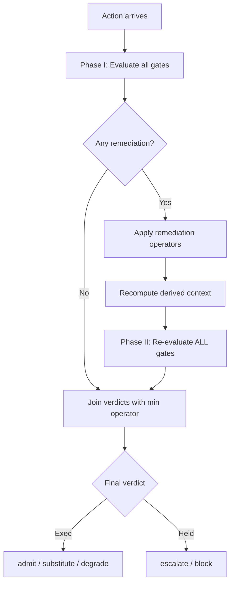

# One Gate Is Not Enough: Why Composing Pre-Action Controls Matters for Your Codex CLI Hook Pipeline


---

Most Codex CLI users layer multiple controls without thinking twice: a `PreToolUse` hook that blocks dangerous commands, Guardian auto-review that flags risky actions, sandbox policies that restrict filesystem access, and approval modes that gate destructive operations. Each control works in isolation. But what happens when one control *changes* the action another control already approved?

A new paper by Besanson — *One Gate Is Not Enough: Composing Stateful Pre-Action Controls for Agentic AI* [^1] — formalises exactly this problem. The core finding is uncomfortable: **remediation-induced control coupling** means that a control which modifies an action can silently invalidate the judgement of every other control that evaluated the pre-remediation version. The implication for Codex CLI's hook pipeline is immediate and practical.

## The Control Coupling Problem

Consider a concrete Codex CLI scenario. You have three layers:

1. **PreToolUse hook** — inspects the Bash command and rewrites `curl` calls to route through a corporate proxy
2. **Guardian auto-review** — evaluates whether the action is safe
3. **Sandbox policy** — restricts network egress to an allow-list

The PreToolUse hook fires first and rewrites the URL. Guardian evaluated the *original* URL and approved it. The sandbox evaluates the *rewritten* URL — which now points to a different endpoint. No single control is wrong; the composition is unsound.

Besanson calls this **remediation-induced control coupling**: one control's remediation alters the action, evidence, or context that another control has already evaluated [^1]. The paper identifies two specific remediation operators that fail to commute:

- **Evidence substitution** (ρ_sub) — replaces a corrupted input value with a governed one, changing derived costs
- **Resource downroute** (ρ_route) — scales parameters to fit within budgets

The artifact found **86 of 243 grid points** where applying these operators in different orders produced different outcomes [^1]. This is not a theoretical curiosity — it means remediation order is part of governance semantics, not an implementation detail.

## The Remediate-and-Regate Protocol

The paper's proposed solution is a **remediate-and-regate protocol** with two phases [^1]:



The critical insight is Phase II: after any remediation modifies the action, **every** gate — including those that triggered the remediation — must re-evaluate against the final remediated state. The verdicts are joined using a non-compensatory `min` operator, meaning any single gate can veto the action regardless of how favourably other gates scored it.

The paper proves formally that weighted-sum aggregation (where gate scores compensate each other) admits vetoed profiles whenever the threshold τ ≤ L*, the maximum achievable score with one gate blocking [^1]. In plain terms: if you use weighted scoring across independent veto authorities, a sufficiently high score from compliant gates can override a blocking gate. The `min` operator prevents this.

## Mapping to Codex CLI's Control Layers

Codex CLI v0.148.0 composes at least five control layers that execute in sequence [^2][^3]:

| Layer | Codex CLI mechanism | Can it remediate? |
|-------|-------------------|-------------------|
| **Permission profile** | `suggest` / `auto-edit` / `full-auto` | No — gates only |
| **PreToolUse hook** | `hooks.json` command handler | Yes — can rewrite `tool_input` via `updatedInput` |
| **Guardian auto-review** | Built-in safety classifier | No — approve/deny only |
| **Sandbox policy** | macOS Seatbelt / Linux Landlock | No — deny only |
| **PostToolUse hook** | `hooks.json` post-execution handler | Yes — can replace `tool_response` |

The remediation risk concentrates in PreToolUse hooks. When a PreToolUse hook returns `updatedInput`, it rewrites the action that Guardian and the sandbox will subsequently evaluate. But here is the gap: **Codex CLI evaluates Guardian and sandbox against the rewritten action, not the original** [^2]. This is actually the correct behaviour for a single-pass pipeline — each subsequent gate sees the latest version. The coupling risk emerges when multiple PreToolUse hooks are chained, or when a PreToolUse hook's rewrite changes the safety profile of the action in ways that earlier-evaluated hooks did not anticipate.

### Where Codex CLI Gets It Right

Codex CLI's hook pipeline has a natural advantage over the general case: hooks execute in declared order, and each subsequent hook sees the output of the previous one [^2]. This means a well-ordered hook chain approximates a single-pass pipeline where later gates evaluate the final action. The `min` semantics are enforced by exit code 2 — any hook returning exit code 2 blocks the action regardless of what other hooks decided [^3].

### Where the Gaps Remain

Three structural gaps map directly from Besanson's framework:

**1. No regate after remediation.** If a PreToolUse hook rewrites the command, earlier hooks in the chain are not re-evaluated against the rewritten version. A hook at position 1 that approved a `curl http://internal-api` command has no opportunity to re-evaluate when a hook at position 3 rewrites it to `curl http://external-proxy/internal-api`.

**2. Evidence buffer poisoning.** Besanson's artifact found **14.70 poisoned substitutions per seed** (95% CI [13.21, 16.19]) when governed buffers accepted writes from admitted but unchecked observations [^1]. In Codex CLI terms, this maps to the Memories pipeline: memories written during earlier sessions become trusted context for future hook evaluations, but there is no integrity verification on memory content. A session that writes a corrupted memory (e.g., "our proxy URL is http://attacker.example") can poison future PreToolUse substitutions.

**3. No composition metadata.** Codex CLI's rollout JSONL records individual hook outcomes but does not track remediation provenance — which hook rewrote which field, and whether downstream hooks evaluated the pre- or post-remediation version [^4].

## A Practical Regate Pattern for Codex CLI

You cannot modify Codex CLI's hook execution engine, but you can approximate the remediate-and-regate protocol using a two-layer hook architecture:

```toml
# config.toml — two-pass hook approximation

# Layer 1: Remediation hooks (rewrite commands)
[[hooks.PreToolUse]]
matcher = "Bash"
command = "/opt/hooks/proxy-rewriter.sh"

# Layer 2: Validation hooks (re-evaluate ALL policies against final command)
[[hooks.PreToolUse]]
matcher = "Bash"
command = "/opt/hooks/unified-policy-gate.sh"
```

The `unified-policy-gate.sh` script acts as the Phase II regate: it receives the fully-remediated command (after all prior hooks have rewritten it) and evaluates every policy — egress allow-list, secret detection, authority caps — against the final version:

```bash
#!/usr/bin/env bash
# unified-policy-gate.sh — Phase II regate
# Receives the final (post-remediation) command from stdin

INPUT=$(cat)
COMMAND=$(echo "$INPUT" | jq -r '.tool_input.command')

# Re-check egress allow-list against FINAL URL
if echo "$COMMAND" | grep -qE 'curl|wget|fetch'; then
  URL=$(echo "$COMMAND" | grep -oP 'https?://[^\s"]+')
  if ! grep -qF "$URL" /opt/hooks/egress-allowlist.txt; then
    echo "BLOCKED: egress to $URL not in allow-list (post-remediation check)" >&2
    exit 2
  fi
fi

# Re-check secret patterns against FINAL command
if echo "$COMMAND" | grep -qE '(ghp_|sk-|AKIA)'; then
  echo "BLOCKED: secret pattern detected in remediated command" >&2
  exit 2
fi

echo '{"continue": true}'
```

This pattern ensures the final gate evaluates the fully-remediated action. It is not a true regate (earlier hooks are not re-invoked), but it centralises policy evaluation at the terminal position where the action is in its final form.

## Non-Commutativity in Practice

The paper's non-commutativity finding has a direct operational consequence: **the order of PreToolUse hooks in your `hooks.json` changes your security posture** [^1]. Consider two hooks:

- **Hook A** — rewrites `pip install` to add `--index-url https://internal-pypi.corp/simple`
- **Hook B** — blocks any command containing URLs not in the corporate allow-list

If B runs before A, it evaluates the original `pip install numpy` (no URL, passes). A then adds the internal URL. The executed command is safe.

If A runs before B, B evaluates `pip install numpy --index-url https://internal-pypi.corp/simple`. If the internal PyPI URL is not in the allow-list, B blocks a legitimate command.

Neither ordering is universally correct — the right order depends on whether your allow-list includes internal infrastructure URLs. The paper's contribution is making this dependency explicit rather than leaving it as an undocumented configuration hazard.

## What Codex CLI Could Add

Three additions would close the composition gap:

1. **Remediation provenance in rollout events.** Each hook invocation should record whether it modified `tool_input` and what the pre/post values were. This makes control coupling auditable [^4].

2. **Regate directive.** A hook response field like `"regate": true` that triggers re-evaluation of all prior hooks against the modified action. This implements Phase II of the remediate-and-regate protocol without requiring external orchestration.

3. **Memory integrity predicates.** The Memories pipeline should support content-type validation — a memory tagged as a URL should be verified against known-good registries before being used in substitution contexts [^5].

## The Aggregation Question

Besanson's linear-family lemma raises an uncomfortable question for any team using weighted scoring across Codex CLI's control layers: can a sufficiently permissive Guardian verdict compensate for a blocking PreToolUse hook?

In current Codex CLI, the answer is no — exit code 2 from any hook is an absolute veto, implementing `min` semantics [^3]. But teams building external governance orchestrators that aggregate multiple signal sources (hook outcomes, Guardian verdicts, sandbox logs) into a composite trust score should note the formal result: **weighted aggregation admits vetoed profiles unless the threshold exceeds L***, the maximum score achievable with one gate blocking [^1].

The practical recommendation: keep `min` semantics for safety-critical controls. Reserve weighted aggregation for advisory signals where compensation across authorities is an intentional design choice, not an accidental vulnerability.

## Citations

[^1]: Besanson, G. (2026). "One Gate Is Not Enough: Composing Stateful Pre-Action Controls for Agentic AI." arXiv:2608.18360. [https://arxiv.org/abs/2608.18360](https://arxiv.org/abs/2608.18360)

[^2]: OpenAI. (2026). "Codex CLI Hooks Documentation." [https://learn.chatgpt.com/docs/hooks](https://learn.chatgpt.com/docs/hooks)

[^3]: OpenAI. (2026). "Codex CLI v0.148.0 Release Notes." [https://github.com/openai/codex/releases/tag/rust-v0.148.0](https://github.com/openai/codex/releases/tag/rust-v0.148.0)

[^4]: OpenAI. (2026). "Codex CLI Rollout Format." Rollout JSONL event schema in Codex CLI source. [https://github.com/openai/codex](https://github.com/openai/codex)

[^5]: Bharti, A. (2026). "Registry Descriptions Go Stale Unevenly: An 89-Day Measurement of Model Context Protocol Drift." arXiv:2608.00997v2. [https://arxiv.org/abs/2608.00997](https://arxiv.org/abs/2608.00997)

[^6]: Forbes Technology Council. (2026). "Why AI Gateways Are Not Enough To Secure Agentic Work." Forbes, 12 August 2026. [https://www.forbes.com/councils/forbestechcouncil/2026/08/12/why-ai-gateways-are-not-enough-to-secure-agentic-work/](https://www.forbes.com/councils/forbestechcouncil/2026/08/12/why-ai-gateways-are-not-enough-to-secure-agentic-work/)
