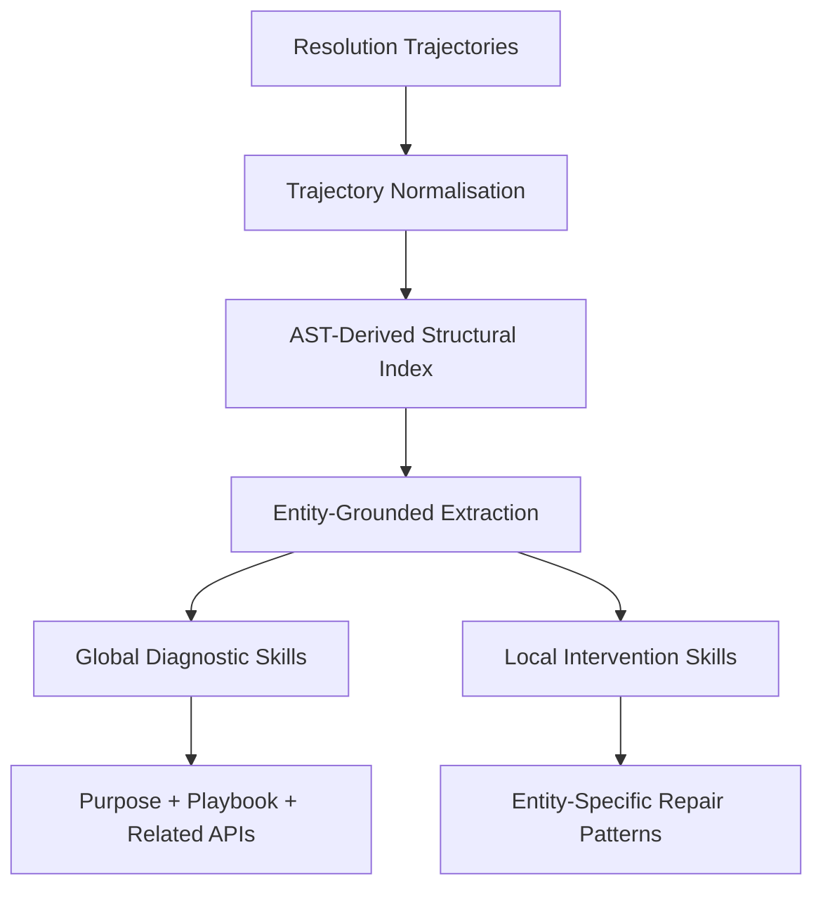
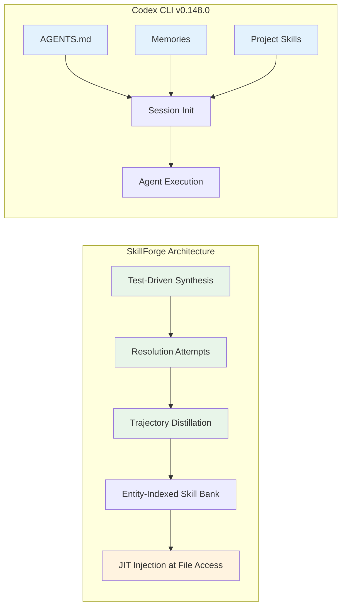

# SkillForge and Self-Distilling Project Knowledge: Why Your Codex CLI Agent Needs Repository Familiarity Before It Starts Working


---

Your coding agent knows how to write Python, parse ASTs, and run test suites. What it does not know is that your Django project's decimal formatting pipeline has three non-obvious invariants, that your Sphinx extension's build system silently swallows import errors, or that your scikit-learn estimator's `fit` method delegates validation through a chain of mixins that no docstring documents. That gap between general coding competence and repository-specific fluency is where most agent failures live — and a paper published on 19 August 2026 offers a systematic way to close it.

## The Problem: General Competence, Specific Ignorance

Chen et al.'s *SkillForge: Self-Distilling Agents for Project-Specific Issue Resolution* starts from a simple observation: LLM-based agents "often struggle to resolve issues in a specific repository because they lack project-specific knowledge" [^1]. The existing approaches to this problem fall into two camps, both with serious drawbacks.

**History-driven methods** (SWE-Exp, MemGovern, SAGE) mine resolved issues to build knowledge banks. They require a rich backlog of prior agent runs — a cold-start problem for any new project or team adopting an agent for the first time [^1].

**Online exploration methods** (SWE-Debate) run expensive per-issue discovery at inference time, multiplying token costs and latency for every ticket [^1].

SkillForge takes a third path: **proactive knowledge acquisition**. Before any real issue arrives, it synthesises artificial issues from the repository's own test suite, attempts to resolve them, and distils the resulting trajectories into reusable, entity-grounded skills.

## How SkillForge Works

The framework operates in three phases, each worth understanding for what it implies about agent-codebase interaction.

### Phase 1: Test-Driven Issue Synthesis

SkillForge runs the project's passing test suite under coverage instrumentation, identifies execution traces, and selects critical code segments that are most representative of test functionality [^1]. It then re-implements those segments under a "strict-mask" constraint — the model sees only surrounding lines, file location, and a test description, never the original implementation. This naturally induces realistic mistakes that expose the gap between general coding knowledge and repository-specific patterns [^1].

The result is a set of synthetic issues that are structurally similar to real bugs: they break real tests, they involve real architectural patterns, and they require repository-specific knowledge to resolve.

### Phase 2: Dual-Level Skill Distillation

After attempting to resolve synthetic issues, SkillForge distils two complementary skill types from the resolution trajectories:



**Global diagnostic skills** capture repository-level reasoning strategies: how to navigate the codebase, which APIs interact during issue resolution, and validated diagnostic playbooks [^1]. Each record contains three fields — *purpose* (functional role), *playbook* (reusable reasoning strategies), and *related APIs* (project-specific interactions observed during resolution).

**Local intervention skills** capture entity-specific modification guidance derived from both successful and failed trajectories, encoding concrete repair patterns and repository-specific pitfalls [^1]. Crucially, these are grounded in actual codebase entities (functions, classes, modules) via AST analysis, preventing the model from hallucinating non-existent APIs or patterns.

### Phase 3: Just-in-Time Skill Injection

During real issue resolution, skills are injected at two levels:

- **Macro-level**: A BM25 retriever matches the issue description against global diagnostic skills, prepending the top-k most relevant records to the agent's initial prompt [^1].
- **Micro-level**: As the agent executes commands accessing specific files, corresponding local intervention skills are dynamically appended — providing targeted guidance precisely when the agent touches the relevant code [^1].

## The Numbers

SkillForge's results on SWE-bench Verified (500 instances) are substantial:

| Method | DeepSeek-V3.2 | GPT-5-mini |
|--------|:---:|:---:|
| Mini-SWE-Agent (baseline) | 66.4% | 55.0% |
| MemGovern (history-driven) | 69.2% | 58.0% |
| SWE-Debate (online exploration) | 68.2% | 56.4% |
| **SkillForge** | **72.2%** | **60.6%** |

That is a +5.8pp improvement over the unenhanced baseline with DeepSeek-V3.2, and +5.6pp with GPT-5-mini [^1]. On SWE-bench Pro (731 multi-language instances), the gains hold: +5.8pp and +4.1pp respectively [^1].

Three findings from the ablation study are particularly instructive:

1. **Both skill types matter**: Removing global diagnostic skills costs 3.0–3.8pp; removing local intervention skills costs 3.4–4.4pp. Neither dominates [^1].
2. **Skills are model-specific**: GPT-5-mini using DeepSeek-distilled skills drops from 60.6% to 55.0% — back to baseline. Cross-backbone transfer erases the gains entirely [^1].
3. **Moderate retrieval outperforms exhaustive retrieval**: The optimal BM25 retrieval count is k=5; retrieving all available skills introduces redundancy that degrades performance [^1].

The model-specificity finding is the most consequential. It means you cannot distil skills with one model and deploy them with another — the knowledge representation is entangled with the model's reasoning patterns.

## What This Means for Codex CLI

Codex CLI v0.148.0 already provides three mechanisms that collectively approximate SkillForge's knowledge architecture — but with gaps that the research exposes.

### AGENTS.md as Static Diagnostic Knowledge

Your project-level `AGENTS.md` file is the closest analogue to SkillForge's global diagnostic skills. It encodes repository-wide conventions, architectural patterns, and coding constraints that persist across sessions [^2].

```markdown
# AGENTS.md (project root)

## Architecture
- All API endpoints delegate validation to `core/validators.py`
- Decimal formatting flows through `format_pipeline()` — never bypass
- Test fixtures in `conftest.py` use factory pattern, not raw constructors

## Debugging Playbook
- Import errors in extensions are swallowed; check `build/warnings.log`
- Flaky tests usually trace to connection pool exhaustion in `db/pool.py`
```

The limitation: AGENTS.md is manually authored. SkillForge's insight is that this knowledge can be *automatically extracted* from resolution trajectories. No one writes "decimal formatting flows through `format_pipeline()`" in their AGENTS.md until after an agent has already failed to understand that pipeline.

### Memories as Emergent Entity Knowledge

Codex CLI's Memories system extracts durable insights from completed sessions and injects them into future ones automatically [^3]. This maps to SkillForge's local intervention skills — entity-specific knowledge that emerges from actual interaction.

The key difference is granularity. Memories are session-level summaries capped at 5,000 tokens in the developer prompt [^3]. SkillForge's entity-grounded skills are indexed by specific codebase entities (functions, classes, modules) and injected precisely when the agent touches the relevant file. Memories cannot provide that just-in-time precision because they lack structural indexing.

### Project-Scoped Skills as Packaged Playbooks

Codex CLI's skill system (`.codex/skills/` at project level) allows packaging reusable workflows that activate on demand [^4]. A project-scoped skill could encode diagnostic procedures similar to SkillForge's playbooks:

```markdown
# .codex/skills/django-issue-triage.md

## Trigger
When resolving a Django ORM or template issue in this repository.

## Playbook
1. Check `core/validators.py` for relevant validation constraints
2. Trace the call chain from the failing test to the ORM query
3. Verify decimal formatting uses `format_pipeline()`, not raw `Decimal()`
4. Run `python -m pytest tests/unit/ -x --tb=short` before committing
```

This manually authored skill approximates what SkillForge generates automatically. The gap is the *synthesis pipeline* — Codex CLI has no mechanism to run the test suite under coverage, generate synthetic issues, resolve them, and extract skills from the resulting trajectories.

### The Composability Gap



The fundamental gap is that Codex CLI's knowledge mechanisms are all **session-initialisation-time** — AGENTS.md, Memories, and matched skills are loaded at the start. SkillForge's micro-level injection happens **during execution**, triggered by the agent's actual file access patterns. PostToolUse hooks could theoretically intercept file reads and inject relevant context, but the hook system was designed for governance (approve/deny/modify), not knowledge augmentation.

## A Practical Approximation

You can approximate SkillForge's proactive knowledge acquisition today using Codex CLI's existing primitives. The approach is manual but effective.

**Step 1: Run a codebase familiarisation session.** Start a dedicated Codex CLI session with a prompt like:

```bash
codex --approval-mode suggest \
  "Explore this repository's architecture by reading the test suite, \
   tracing key code paths, and documenting the patterns you discover. \
   Do not modify any files. Write your findings to AGENTS.md."
```

This generates the static diagnostic knowledge that SkillForge would distil automatically.

**Step 2: Create entity-specific skills from resolved issues.** After resolving a non-trivial issue, run a follow-up prompt:

```bash
codex --approval-mode suggest \
  "Review the changes just made and extract a reusable skill file \
   documenting the diagnostic steps and repair patterns used. \
   Save to .codex/skills/<component>-patterns.md"
```

**Step 3: Index skills by component.** Organise project skills by the codebase entities they relate to, mirroring SkillForge's entity-grounded indexing:

```
.codex/skills/
  orm-query-patterns.md
  template-rendering-patterns.md
  api-validation-patterns.md
  build-system-patterns.md
```

This is coarser than SkillForge's AST-level indexing but captures the same principle: knowledge should be organised by where it applies, not when it was learned.

## What Is Still Missing

SkillForge exposes four capabilities that Codex CLI lacks entirely:

1. **Automated issue synthesis from test coverage**: No built-in mechanism to generate training scenarios from the repository's test suite. A PostToolUse hook could trigger coverage analysis after test runs, but cannot orchestrate the full synthesis-and-resolution loop.

2. **Entity-level skill indexing**: Memories and skills are retrieved by text similarity (BM25 or semantic search), not by structural codebase position. When the agent opens `validators.py`, the system cannot automatically surface knowledge specifically about that module's patterns.

3. **Cross-model skill incompatibility detection**: SkillForge demonstrates that skills distilled with DeepSeek-V3.2 are useless for GPT-5-mini [^1]. Codex CLI's skill system has no concept of model-specific skill variants. If you switch models via `config.toml`, your project skills may silently become less effective.

4. **Moderate retrieval budgeting**: SkillForge's finding that k=5 retrieval outperforms exhaustive retrieval [^1] implies that flooding the context window with all available knowledge is counterproductive. Codex CLI's Memories system uses a fixed 5,000-token cap [^3], but project skills have no equivalent budgeting mechanism — a directory with 20 skill files could consume substantial context without any relevance filtering.

## The Broader Pattern

SkillForge is part of a wider convergence around proactive knowledge acquisition for coding agents. CODESKILL (May 2026) uses reinforcement learning to train a skill extraction policy from agent trajectories [^5]. The LOOP Skill Engine achieves 93.3% token savings on repeated tasks by compiling successful traces into compact recipes [^6]. All three approaches share the same core insight: the most valuable knowledge a coding agent can have is not general programming ability — it is intimate familiarity with the specific repository it is working in.

For Codex CLI users, the practical takeaway is straightforward: invest time in your AGENTS.md, create project-scoped skills from successful resolution sessions, and treat repository familiarisation as a first-class engineering task rather than something the agent should figure out on the fly. The research says that +5.8pp on SWE-bench Verified is the reward for doing so [^1].

---

## Citations

[^1]: Chen, S., Li, H., Gu, X., Shi, Y., & Guan, H. (2026). "SkillForge: Self-Distilling Agents for Project-Specific Issue Resolution." arXiv:2608.18933. [https://arxiv.org/abs/2608.18933](https://arxiv.org/abs/2608.18933)

[^2]: OpenAI. (2026). "Custom instructions with AGENTS.md." Codex CLI Documentation. [https://developers.openai.com/codex/guides/agents-md](https://developers.openai.com/codex/guides/agents-md)

[^3]: OpenAI. (2026). "Memories in Codex." GitHub Discussion #12567. [https://github.com/openai/codex/discussions/12567](https://github.com/openai/codex/discussions/12567)

[^4]: OpenAI. (2026). "Codex CLI v0.148.0 Release Notes." GitHub Releases. [https://github.com/openai/codex/releases/tag/rust-v0.148.0](https://github.com/openai/codex/releases/tag/rust-v0.148.0)

[^5]: Li, Y., Zhang, Y., Zhang, X., Liu, X., & Liu, Y. (2026). "CODESKILL: Learning Self-Evolving Skills for Coding Agents." arXiv:2605.25430. [https://arxiv.org/abs/2605.25430](https://arxiv.org/abs/2605.25430)

[^6]: Wang, D. et al. (2026). "LOOP Skill Engine: Compiling Agent Traces into Branch-Free Recipes." Cited in token efficiency surveys. [https://arxiv.org/abs/2605.25430](https://arxiv.org/abs/2605.25430)
