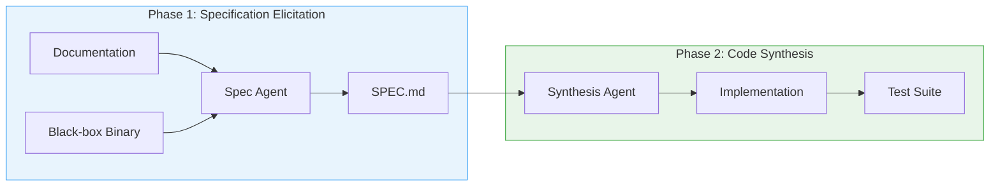

# SpecFirst and Behavioural Specification Elicitation: Why a Dedicated Discovery Phase Before Code Changes Your Codex CLI Outcomes


---

Program synthesis from scratch — building software from a natural-language description rather than patching an existing codebase — remains the hard frontier for coding agents. On ProgramBench, even frontier models solve fewer than 1% of instances when given only documentation and a black-box binary as a behavioural oracle[^1]. A new paper from Queen's University demonstrates that inserting a dedicated specification-elicitation phase before code synthesis lifts test pass rates by 6.9–21.3% across four models, with the largest gains on the hardest tasks[^1]. The implications for how you structure your Codex CLI workflows — particularly AGENTS.md directives and named profiles — are immediate and practical.

## The Problem: Conflated Discovery and Implementation

Single-loop coding agents interleave three activities in one pass: reading documentation, probing the target system, and writing code. Chen et al. identify three failure modes that arise from this conflation[^1]:

1. **Insufficient exploration.** Agents probe only enough to begin writing, missing edge cases and error paths that surface later as test failures.
2. **Specification loss.** As the context window fills with code, earlier behavioural observations are compacted or displaced, causing the agent to forget what it discovered.
3. **Uncorrected error propagation.** An early misinterpretation bakes incorrect assumptions into scaffolding code, and subsequent turns build on that faulty foundation rather than correcting it.

The SpecFirst framework addresses all three by enforcing a hard phase boundary: a spec agent explores first, producing a structured SPEC.md document; a synthesis agent then implements against that specification[^1].

## The SpecFirst Pipeline



### The Spec Agent's Probing Strategy

The spec agent employs four systematic probing patterns against the target binary[^1]:

- **Boundary probing** — empty inputs, maximum-length strings, special characters
- **Error-path elicitation** — triggering error conditions to record stderr messages and exit codes
- **Combinatorial flag testing** — exercising flag combinations for interaction effects
- **Output-format refinement** — comparing adjacent inputs to resolve formatting ambiguities

### The Specification Format

The spec agent produces a six-section SPEC.md document[^1]:

```markdown
# SPEC.md

## Overview
Brief programme purpose and primary behaviour.

## Flags
Each flag with its default, type, and interaction constraints.

## Input & stdin
Expected input formats, encoding, and streaming behaviour.

## Output format
Exact output structure, delimiters, and ordering.

## Error patterns
Error messages, exit codes, and triggering conditions.

## Edge cases
Boundary conditions and undocumented behaviours discovered through probing.
```

This lightweight structure outperformed both freeform specifications and formal OpenSpec (RFC 2119 + GIVEN/WHEN/THEN scenarios) in controlled comparisons — 62.6% vs 61.7% vs 60.7% pass rates respectively, all above the 55.9% no-spec baseline[^1].

## Results: Where the Gains Land

Evaluated across the full 200-instance ProgramBench suite (107 Rust, 46 Go, 45 C/C++ programmes; 248,853 test functions), SpecFirst produced statistically significant improvements (p<0.01) across all four evaluated models[^1]:

| Model | Baseline | SpecFirst | Relative Gain | Win/Loss/Tie |
|---|---|---|---|---|
| GPT-5.5-high | 59.02% | 65.14% | +10.4% | 150/38/12 |
| Qwen3.5-397B | 33.66% | 40.84% | +21.3% | 130/58/12 |
| GPT-5.4-mini | 39.09% | 41.78% | +6.9% | 119/69/12 |
| Qwen3.6-35B | 27.51% | 31.40% | +14.1% | 121/67/12 |

The pattern that matters for practitioners: **gains scale with difficulty**. On hard tasks, GPT-5.5-high jumped from 30.8% to 40.0% — a 29.9% relative improvement[^1]. At the upper tail, the proportion of programmes achieving ≥95% test pass rate rose from 1.5% to 6.5%, a fourfold increase[^1].

### Probing Coverage

The spec agent consistently achieved higher code coverage than direct-synthesis agents, with 9.4–18.5% improvement in binary exploration coverage and win rates of 63.5–77.2% across models[^1].

### Cost Trade-offs

The specification phase adds 48–130% to per-instance cost, depending on model[^1]. However, this is not redundant computation — GPT-5.4-mini actually showed a 17% decrease in synthesis-phase cost when given a prior specification, suggesting that clearer requirements reduce exploratory overhead during implementation[^1].

## The Failure Taxonomy

Manual analysis of 50 sampled failures revealed where the pipeline breaks[^1]:

| Category | Proportion | Description |
|---|---|---|
| F4: Execution fault | 52% | Spec correct, implementation diverges |
| F3: Inaccurate spec | 26% | Features documented insufficiently |
| F1: Spec omission | 10% | Tested features never documented |
| F5: Environment error | 8% | Infrastructure noise |
| F2: Wrong spec | 4% | Factually incorrect behavioural descriptions |

The dominant failure mode (F4) indicates that even perfect specifications cannot compensate for weak implementation reasoning. But the 40% attributable to specification quality (F1–F3) represents a concrete improvement surface — better probing strategies for under-documented features.

## Mapping SpecFirst to Codex CLI

The SpecFirst findings translate directly to Codex CLI v0.148.0 workflows. The key insight is structural: **separate your discovery and implementation phases using the tools Codex already provides**.

### AGENTS.md as Your Specification Contract

Your AGENTS.md file is the closest analogue to SpecFirst's SPEC.md — a structured document that constrains agent behaviour before implementation begins[^2]. The research suggests treating it not as a static configuration file but as the output of an explicit discovery phase:

```markdown
# AGENTS.md

## Specification Protocol
Before implementing any feature:
1. Read all relevant documentation files in docs/
2. Probe the existing API surface — list endpoints, test error paths, verify response formats
3. Write a SPEC.md in the working directory capturing: inputs, outputs, error patterns, edge cases
4. Only begin implementation after SPEC.md is complete and reviewed

## Output Constraints
- All error responses must include exit codes documented in SPEC.md
- Edge cases from SPEC.md § Edge Cases must have corresponding test cases
```

### Named Profiles for Phase Separation

Codex CLI's named permission profiles enable the hard phase boundary that SpecFirst requires[^3]. Create separate profiles that enforce the separation:

```toml
# config.toml

[permissions.spec-discovery]
sandbox_mode = "locked-down"
approval_policy = "on-tool-use"

[permissions.implement]
sandbox_mode = "workspace-write"
approval_policy = "on-failure"
```

Run the spec phase with `codex --profile spec-discovery`, where the locked-down sandbox prevents the agent from writing code prematurely. Switch to `codex --profile implement` for the synthesis phase, passing the SPEC.md as context.

### PostToolUse Hooks as Specification Gates

Codex CLI's PostToolUse hooks can enforce that a specification exists before implementation proceeds[^4]. A hook that checks for SPEC.md presence and completeness acts as the phase-transition gate:

```bash
#!/bin/bash
# hooks/require-spec.sh
# PostToolUse hook: block code writes until SPEC.md exists

if [[ "$CODEX_TOOL_NAME" == "write" ]] && [[ "$CODEX_TOOL_ARG_PATH" == *.rs || "$CODEX_TOOL_ARG_PATH" == *.go || "$CODEX_TOOL_ARG_PATH" == *.ts ]]; then
  if [[ ! -f "SPEC.md" ]]; then
    echo "ERROR: No SPEC.md found. Complete specification elicitation before writing code." >&2
    exit 2  # exit code 2 = veto the action
  fi
fi
```

### The Broader Spec-Driven Development Context

SpecFirst's findings arrive alongside a broader industry shift towards specification-driven development (SDD) with coding agents[^5]. The core workflow — Specify → Plan → Tasks → Implement, each with a human checkpoint — mirrors SpecFirst's two-phase architecture but extends it with planning and task decomposition intermediaries[^5].

The practical question is when to apply it. Not every task warrants a full specification phase. The heuristic from the SDD community is clear: if you would be annoyed to have the agent interpret requirements differently than you intended, write the spec first[^5].

### Specification-First at Scale

A complementary case study by Abenhaim demonstrates what specification-first convergence looks like on production codebases. Working on a 717,725-line TypeScript application, an AI agent completed a cross-cutting architectural refactoring across 189 files using 14 specification refinement cycles and 31 audit passes, identifying 201 defects before execution — with zero bugs observed in subsequent sessions[^6]. The total cost was USD \$2,430 over three days[^6]. The key enabler was not model capability but process structure: iterative specification refinement followed by systematic verification.

## Gaps in Codex CLI

The SpecFirst research exposes several gaps in Codex CLI's current architecture:

1. **No built-in specification phase.** There is no first-class `codex spec` command that enforces discovery before implementation. AGENTS.md directives can approximate this but rely on the model's compliance rather than architectural enforcement.

2. **No structured specification format.** AGENTS.md is freeform markdown. A standardised specification schema — analogous to SpecFirst's six-section SPEC.md — would enable programmatic validation of specification completeness.

3. **No cross-phase context handoff.** When switching between profiles, there is no mechanism to guarantee the synthesis agent receives the full specification context. The `/export` command and session forking (`codex exec fork`) provide partial solutions but require manual orchestration.

4. **No probing coverage metrics.** Codex CLI provides no instrumentation for measuring how thoroughly an agent has explored a codebase or API surface before beginning implementation. SpecFirst's coverage metric (proportion of executable lines hit during probing) offers a concrete model.

5. **Compaction erases specifications.** As documented in governance-decay research, context compaction can silently discard specification content that appeared early in a session[^4]. Pinning specification content — perhaps via the Memories feature — would mitigate this.

## Practical Takeaways

The SpecFirst evidence supports three concrete workflow changes for Codex CLI users:

**First**, add explicit specification directives to your AGENTS.md. Require the agent to produce a structured specification document before writing implementation code. The six-section format (overview, flags, input, output, errors, edge cases) is a reasonable starting template.

**Second**, use named profiles to enforce phase separation. A read-only discovery profile prevents premature implementation; a write-enabled implementation profile picks up where discovery left off.

**Third**, accept the cost. The 48–130% overhead is real, but it buys measurably better outcomes — particularly on hard tasks where baseline approaches founder. For GPT-5.4-mini, the specification phase actually reduced total synthesis cost by 17%, making it net-positive.

The broader lesson from SpecFirst is that coding agents fail not because they cannot write code, but because they start writing too soon. The fix is architectural, not algorithmic: enforce discovery before implementation, and give the specification its own phase, its own agent, and its own structured output.

## Citations

[^1]: Chen, Y., Chang, S., Lin, F., Chawa, K., Chen, B., Wang, S. & Hassan, A. E. (2026). "SpecFirst: Behavioral Specification Elicitation as a First-Class Step in Agent-Based Program Synthesis from Scratch." arXiv:2607.27167. [https://arxiv.org/abs/2607.27167](https://arxiv.org/abs/2607.27167)

[^2]: OpenAI. (2026). "Codex CLI AGENTS.md Documentation." [https://developers.openai.com/codex/agents-md](https://developers.openai.com/codex/agents-md)

[^3]: OpenAI. (2026). "Codex CLI v0.148.0 Changelog — Permission Profiles." [https://github.com/openai/codex/releases](https://github.com/openai/codex/releases)

[^4]: OpenAI. (2026). "Codex CLI Hooks Documentation — PreToolUse and PostToolUse." [https://developers.openai.com/codex/hooks](https://developers.openai.com/codex/hooks)

[^5]: Allegro Tech. (2026). "Spec-Driven Development (SDD) — Best Practices (So Far)." [https://blog.allegro.tech/2026/06/spec-driven-development-best-practices.html](https://blog.allegro.tech/2026/06/spec-driven-development-best-practices.html)

[^6]: Abenhaim, J. (2026). "Specification-first convergence with an AI coding agent: a case study of dismantling a core architectural invariant across 189 files in a 717k-line codebase with no test oracle and no human code review." arXiv:2608.12440. [https://arxiv.org/abs/2608.12440](https://arxiv.org/abs/2608.12440)
