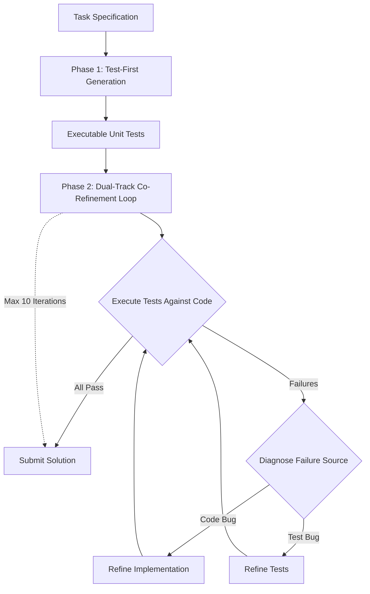
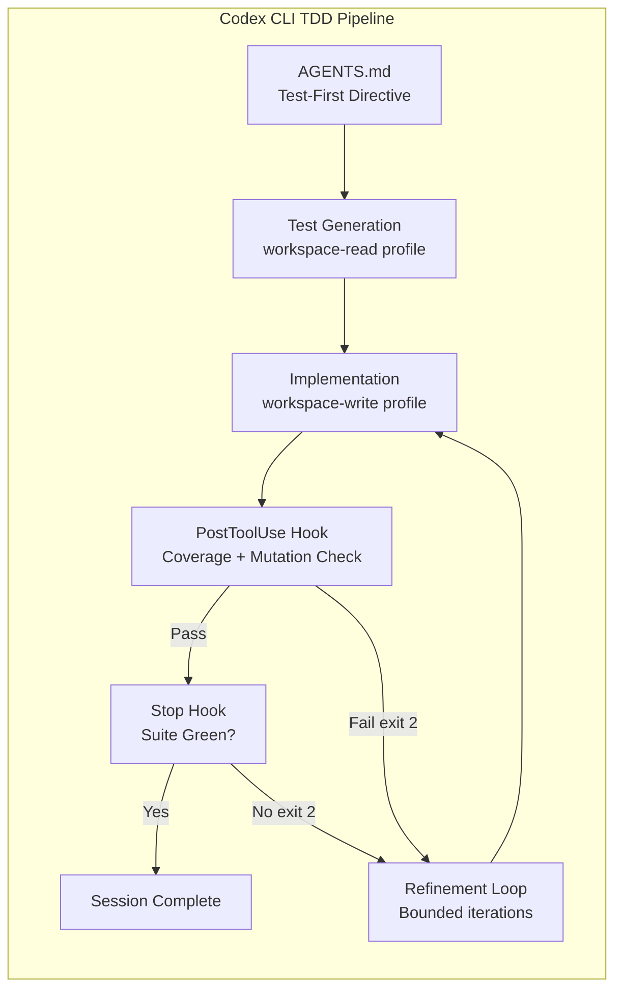

# TDD-Agent and Dual-Track Co-Refinement: Why Tests as Evolving Reasoning Artefacts Change Your Codex CLI Workflow


---

Every experienced developer knows the TDD mantra: write a failing test, make it pass, refactor. The discipline works because tests encode intent before implementation, making the specification explicit and the feedback loop tight. But when a coding agent enters the loop, an uncomfortable question arises: should the agent treat its own generated tests as immutable validators, or should it refine them alongside the code?

Yu et al.'s TDD-Agent paper, published on 17 August 2026 [^1], argues forcefully for the latter. Their dual-track co-refinement approach — where both tests and implementation evolve together through execution feedback — delivers striking gains: +16.93 percentage points over the best baseline on RepoEval with GPT-5-mini, and a 17pp lift on LiveCodeBench function-level generation [^1]. The results challenge the conventional wisdom that agent-generated tests must be frozen at creation, and they map directly onto how you configure Codex CLI's hook pipeline and AGENTS.md directives for test-driven workflows.

## The Core Insight: Tests as Reasoning Artefacts

Traditional agent-based code generation treats tests as post-hoc validators. The agent writes code, runs existing tests, and iterates if something fails. TDD-Agent inverts this: the agent generates executable unit tests *first*, forcing it to reason explicitly about expected behaviours before touching implementation [^1].

The critical innovation is what the authors call **dual-track co-refinement**. Rather than fixing tests at generation time and only iterating on code (the single-track approach), TDD-Agent allows both artefacts to evolve based on execution feedback. When a test fails, the agent decides whether the *code* is wrong or the *test* is wrong — exactly the judgement call a senior developer makes during a real TDD session.

The ablation study makes the case quantitatively [^1]:

| Variant | GPT-5-mini | DeepSeek-V3.2 | Qwen3-Coder |
|---------|-----------|---------------|-------------|
| Vanilla (no tests/refinement) | 68.35% | 73.63% | 52.97% |
| Reflect (code-only iteration) | 72.09% | 81.53% | 54.06% |
| Single-track (fixed tests) | 70.11% | 79.56% | 57.36% |
| **TDD-Agent (full dual-track)** | **78.24%** | **90.77%** | **59.34%** |

Removing the ability to revise tests (single-track) costs 8–11 percentage points on GPT-5-mini and DeepSeek. The message is clear: **fixed tests are worse than co-evolved tests** when the test author and the code author are the same agent.

## The Architecture: What TDD-Agent Actually Does



The toolbox is deliberately lightweight [^1]:

- **Context Inspection** — directory listing, file reading, lexical search
- **Artefact Submission** — persisting test and code files
- **Test Runner** — pytest execution with pass/fail/coverage feedback
- **Early Terminator** — optional exit when all tests pass before the iteration budget

The iteration budget caps at 10 rounds, with diminishing returns observed around iterations 6–7 [^1]. This is a practical constraint that maps neatly to Codex CLI's own session economics — each iteration consumes tokens, and the cost curve flattens well before the budget expires.

## Benchmark Results: Function-Level and Repository-Level

### LiveCodeBench (224 Problems — Function-Level)

| Method | GPT-5-mini | DeepSeek-V3.2 | Qwen3-Coder |
|--------|-----------|---------------|-------------|
| Baseline (one-shot) | 53.08% | 45.40% | 39.60% |
| TDD-prompt | **70.04%** | **67.86%** | **44.87%** |

The TDD-prompt variant — which simply asks the model to generate tests first in a single pass, without iteration — already lifts Pass@1 by 17–22 percentage points [^1]. The implication for your AGENTS.md: even a directive as simple as "write tests before implementation" materially improves output quality.

### RepoEval (455 Problems — Repository-Level)

| Method | GPT-5-mini | DeepSeek-V3.2 | Qwen3-Coder |
|--------|-----------|---------------|-------------|
| In-File Completion | 44.84% | 39.34% | 32.75% |
| RepoCoder (RAG) | 55.16% | 50.55% | 41.10% |
| mini-SWE-agent | 61.31% | 84.18% | 52.97% |
| **TDD-Agent (iter 10)** | **78.24%** | **90.77%** | **59.34%** |

TDD-Agent outperforms mini-SWE-agent — a bash-equipped agent with a 100-call budget — by 16.93pp on GPT-5-mini [^1]. At the repository level, where context retrieval is the bottleneck, the test-first approach forces the agent to identify relevant dependencies before it starts coding, functioning as a form of specification-driven context discovery.

## Where It Breaks: Matched Failures

The paper is candid about its primary failure mode: **matched failures**, where the generated implementation passes the generated tests but fails the held-out repository tests [^1]. The agent's tests are internally consistent but incomplete — they capture the agent's *understanding* of the task, not the task's full requirements.

This is the exact pattern Codex CLI practitioners encounter when an agent makes tests pass by weakening assertions rather than fixing bugs [^3]. The TDD-Agent paper demonstrates it empirically: dual-track co-refinement can lead to co-evolution towards a locally consistent but globally incorrect solution.

**Limitation:** The paper evaluates only Python. Repository-level results on other languages remain unverified [^1]. ⚠️

## Mapping to Codex CLI: The Practical Configuration

TDD-Agent's architecture maps onto four Codex CLI configuration surfaces.

### 1. AGENTS.md: Test-First Directives

The simplest intervention — and one the LiveCodeBench results validate — is an AGENTS.md directive that encodes the test-first ordering:

```markdown
## Development Protocol

1. Before implementing any function, write executable unit tests that
   define expected behaviour, edge cases, and error conditions.
2. Run the test suite to confirm tests fail for the right reasons.
3. Implement the minimum code to pass the failing tests.
4. Run the full test suite after every implementation change.
5. NEVER modify existing tests to make them pass. If a test seems wrong,
   explain why in a comment and request human review.
```

Line 5 is the crucial constraint. TDD-Agent's dual-track approach works because the agent has a structured diagnostic step to distinguish code bugs from test bugs. Codex CLI's general-purpose agent lacks that structured reasoning, so the safer default is to treat human-authored tests as immutable and constrain test modification to agent-generated tests only [^3].

### 2. PostToolUse Hooks: Exit Code 2 Verification Gate

Codex CLI's PostToolUse hooks fire after every shell command, file edit, and MCP tool call [^4]. Exit code 2 blocks the action and replaces the tool result with your stderr feedback, steering the agent's next move:

```json
{
  "PostToolUse": [
    {
      "match": { "tool_name": "shell", "command_pattern": "pytest|python -m pytest" },
      "command": ["bash", "-c", "python scripts/verify_test_quality.py --check-coverage --min-mutation-score 0.6"],
      "timeout": 30000
    }
  ]
}
```

This hook intercepts every pytest invocation and runs a secondary quality check. If the mutation score falls below threshold, exit code 2 forces the agent to strengthen its tests before proceeding — mechanising TDD-Agent's test quality feedback loop without requiring the dual-track architecture.

### 3. Named Profiles: Phase Separation

TDD-Agent's two-phase structure (test generation, then co-refinement) maps to Codex CLI named profiles that enforce phase boundaries:

```toml
[profiles.test-spec]
model = "gpt-5.6-terra"
approval_policy = "on-request"
sandbox = "workspace-read"
# Phase 1: generate tests without modifying source

[profiles.implement]
model = "gpt-5.6-terra"
approval_policy = "on-request"
sandbox = "workspace-write"
# Phase 2: implement against the generated tests
```

The `workspace-read` sandbox in the test-spec profile prevents the agent from writing implementation code during test generation, enforcing the test-first ordering at the sandbox level rather than relying on prompt compliance alone.

### 4. Stop Hook: Convergence Verification

TDD-Agent's early terminator exits when all tests pass. The equivalent in Codex CLI is a Stop hook that blocks session completion until the test suite is green:

```json
{
  "Stop": [
    {
      "command": ["bash", "-c", "cd $CODEX_WORKSPACE && pytest --tb=short -q 2>&1; if [ $? -ne 0 ]; then echo 'Tests still failing — cannot complete' >&2; exit 2; fi"],
      "timeout": 60000
    }
  ]
}
```

## The Governance Question: Fixed vs Co-Evolved Tests

The TDD-Agent results create a tension with established Codex CLI best practice. The conventional guidance — "never modify existing tests unless explicitly asked" [^3] — exists because agents that can edit tests tend to weaken them. But TDD-Agent demonstrates that *structured* test co-evolution, where the agent explicitly diagnoses whether the test or the code is at fault, outperforms the frozen-test approach by 8–11 percentage points [^1].

Hasanli et al.'s TDD Governance paper from PROMPT-SE 2026 offers a middle path: encode the Red-Green-Refactor cycle as "structured prompt-level and workflow-level governance mechanisms" with bounded repair loops and validation gates [^2]. In Codex CLI terms, this means:

1. **Allow test modification** only when the PostToolUse hook confirms the modification *strengthens* the test (higher mutation score, broader coverage)
2. **Bound the iteration count** via hook configuration or AGENTS.md directives ("maximum 7 refinement iterations")
3. **Log every test change** to the rollout JSONL for post-session audit



## Gap Analysis: What Codex CLI Cannot Do Yet

| TDD-Agent Feature | Codex CLI Equivalent | Gap |
|---|---|---|
| Structured failure diagnosis (code bug vs test bug) | None — agent decides ad hoc | No diagnostic framework for distinguishing failure sources |
| Mutation score feedback per iteration | PostToolUse hook (external tool) | No built-in mutation testing integration |
| Dual-track artefact versioning | Rollout JSONL captures tool calls | No per-artefact version tracking across iterations |
| Early terminator with convergence detection | Stop hook with test gate | No diminishing-returns detection to save tokens |
| Python-only validation | Codex CLI is language-agnostic | Paper limitation, not a Codex CLI gap |

The most consequential gap is the lack of a **structured failure diagnosis step**. TDD-Agent's agent explicitly reasons about whether a failure originates in the test or the code before deciding which to modify. Codex CLI's general-purpose agent makes this judgement implicitly, which is why the "never modify tests" rule exists as a blunt safety constraint. A future hook event that provides structured test-vs-code diagnosis metadata would enable the dual-track approach safely.

## Recommendations

1. **Add test-first directives to AGENTS.md now.** The LiveCodeBench results show a 17–22pp lift from test-first prompting alone — no hooks or infrastructure required [^1].
2. **Deploy PostToolUse test quality gates.** Mutation score and coverage checks after every pytest run mechanise the quality feedback loop.
3. **Use named profiles for phase separation.** Enforce test generation in `workspace-read` before implementation in `workspace-write`.
4. **Be cautious with test co-evolution.** Allow agent-generated test modification only behind a PostToolUse gate that verifies the change strengthens the test. Never allow modification of human-authored tests without explicit approval.
5. **Budget 7 iterations maximum.** TDD-Agent's diminishing returns at iterations 6–7 align with Codex CLI's token economics [^1].

## Citations

[^1]: Yu, H., Li, K., Li, J., Chai, H., Yuan, Y., He, R. & Wei, J. (2026). "TDD-Agent: Test-Driven Reasoning for Code Generation." arXiv:2608.16742. [https://arxiv.org/abs/2608.16742](https://arxiv.org/abs/2608.16742)

[^2]: Hasanli, T., Siddeeq, S., Khanal, B., Kotilainen, P., Mikkonen, T. & Abrahamsson, P. (2026). "TDD Governance for Multi-Agent Code Generation via Prompt Engineering." PROMPT-SE 2026. arXiv:2604.26615. [https://arxiv.org/abs/2604.26615](https://arxiv.org/abs/2604.26615)

[^3]: Vaughan, D. (2026). "Test-Driven Development with Codex CLI: The Red-Green-Refactor Loop, AGENTS.md Test Gates, and Hook-Based Verification." Codex Knowledge Base. [https://codex.danielvaughan.com/2026/04/10/codex-cli-test-driven-development-workflow/](https://codex.danielvaughan.com/2026/04/10/codex-cli-test-driven-development-workflow/)

[^4]: OpenAI (2026). "Hooks — Codex CLI." OpenAI Developers. [https://developers.openai.com/codex/hooks](https://developers.openai.com/codex/hooks)

[^5]: Vaughan, D. (2026). "Codex CLI Hooks: Complete Guide to Events, Policy Engines and Production Patterns." Codex Knowledge Base. [https://codex.danielvaughan.com/2026/04/15/codex-cli-hooks-complete-guide-events-policy-patterns/](https://codex.danielvaughan.com/2026/04/15/codex-cli-hooks-complete-guide-events-policy-patterns/)

[^6]: Vaughan, D. (2026). "Codex CLI Verification Patterns: Seven Strategies for Ensuring Agent-Generated Code Actually Works." Codex Knowledge Base. [https://codex.danielvaughan.com/2026/06/09/codex-cli-verification-patterns-ensuring-agent-generated-code-correctness-hooks-review-testing/](https://codex.danielvaughan.com/2026/06/09/codex-cli-verification-patterns-ensuring-agent-generated-code-correctness-hooks-review-testing/)
