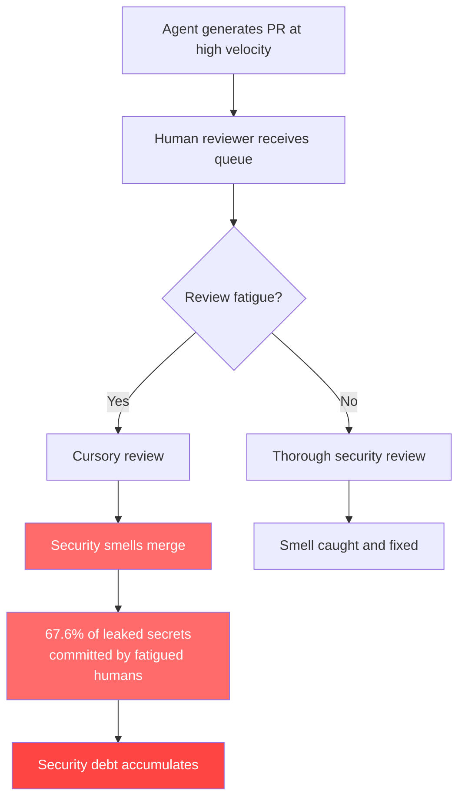

# Trust but Verify: What 4,022 Agent-Generated Pull Requests Reveal About Security Debt — and How to Defend Your Codex CLI Pipeline


---

Autonomous coding agents ship code fast. The uncomfortable question is whether they also ship secrets, over-privileged containers, and unpinned dependencies fast. A new empirical study accepted at the KDD 2026 Workshop on Agentic Software Engineering (AgenticSE) quantifies exactly how much security debt agent-generated pull requests accumulate — and the numbers should change how you configure your Codex CLI guardrails.[^1]

## The Study: 16,112 File Changes Under the Microscope

Sakib, Banik, and Jadliwala examined the AIDev dataset — 4,022 pull requests spanning 16,112 file changes produced by five autonomous coding agents, including OpenAI Codex and GitHub Copilot.[^1] They classified security smells into six categories using a validated LLM-as-judge framework (two open-source quantised models: Qwen3.6-35B-A3B and Gemma-4-26B-A4B) corroborated by independent double-blind manual coding with third-author adjudication. Their judge achieved 0.908 precision and 0.836 F1 against the human gold standard (Cohen's kappa 0.789).[^1]

The headline: **38.9% of agent-generated pull requests contained at least one security smell**.

## Where the Security Smells Hide

The distribution across the six categories is strikingly non-uniform:

| Category | Share of All Smells | Example |
|---|---|---|
| Supply chain integrity | 82.3% | Mutable Docker tags, unpinned `pip install` |
| Over-privilege execution | 9.6% | Root containers, broad CI token scopes |
| Secrets/identity | 3.4% | Hard-coded API keys, tokens |
| Misconfig hardening | 2.4% | Debug modes left enabled |
| Permissive network | 1.5% | Open interfaces, public access |
| Cleartext transport | 0.8% | Disabled TLS, weak ciphers |

Supply chain smells alone account for 7,160 instances — dwarfing every other category combined.[^1] This matters because supply chain issues are precisely the class of vulnerability that a sandbox cannot contain: an unpinned dependency fetched at build time can introduce arbitrary code long after the PR merges.

### The Credential Leakage Problem

Of 272 labelled secrets, 74 (27.2%) were genuine credentials. The critical finding: **81.1% of genuine leaked secrets bypassed both automated security bots and human review before integration**.[^1] Even more surprising, humans committed 67.6% of the genuine leaked secrets — not the agent. The authors attribute this to review fatigue: human reviewers overwhelmed by agent-generated velocity lose their security vigilance.

### Agent and Language Variations

Not all agents and languages carry equal risk:

- **Copilot** flagged at 45.5% of PRs; **OpenAI Codex** at 34.9%[^1]
- **JavaScript** repositories flagged at 55.3%; **Python** at 31.8%[^1]
- **GitHub Actions workflows** had a 36.3% dirty rate; **Dockerfiles** 36.4%; **application config** just 2.2%[^1]

The infrastructure-as-code surface — CI workflows, Dockerfiles, and deployment manifests — concentrates the risk. Application code is comparatively clean.

## Mapping to Codex CLI's Defence Stack

Codex CLI v0.148.0 provides several layers that directly address the six smell categories, though none covers the full surface alone.[^2][^3]

### Layer 1: Sandbox Filesystem Deny Rules

The sandbox `deny_read` and `deny_write` rules in `config.toml` prevent the agent from reading or writing sensitive files:

```toml
[sandbox]
deny_read = [".env", ".env.*", "*.pem", "*.key", "**/.aws/credentials"]
deny_write = [".github/workflows/**", "Dockerfile*", "docker-compose*"]
```

This addresses the secrets/identity category by making credential files structurally invisible. For the supply chain and over-privilege categories, write-denying infrastructure files forces the agent to propose changes through a human-reviewed channel rather than committing them directly.[^3]

### Layer 2: Secrets Redaction

Codex CLI's built-in `codex-secrets::redact_secrets` scrubs AWS secret assignments, GitHub tokens, JWTs, private key blocks, and common token assignment patterns from tool output before it reaches the model.[^2] This prevents the model from learning and propagating secrets it encounters during execution — a direct counter to the 99.6% of critical-severity issues that were hard-coded credentials.[^1]

### Layer 3: PostToolUse Hooks for Security Scanning

A PostToolUse hook can run a credential scanner after every file write, rejecting the action with exit code 2 if secrets are detected:

```toml
[[hooks]]
event = "PostToolUse"
command = "bash -c 'git diff --cached --name-only | xargs gitleaks detect --no-git --source /dev/stdin --exit-code 2 2>/dev/null'"
timeout_ms = 10000
```

For supply chain integrity, a parallel hook can enforce dependency pinning:

```toml
[[hooks]]
event = "PostToolUse"
command = "bash -c 'python3 scripts/check-pinned-deps.py --strict'"
timeout_ms = 15000
```

These hooks close the gap that the study exposed: automated security bots and human reviewers missed 81.1% of leaked credentials, but a deterministic PostToolUse gate catches them before the agent's next turn.[^1][^4]

### Layer 4: PreToolUse Hooks for Infrastructure-as-Code Scope Guards

Given the 36% dirty rate on CI workflows and Dockerfiles, a PreToolUse hook can require explicit approval before the agent touches infrastructure files:

```toml
[[hooks]]
event = "PreToolUse"
command = "bash -c 'echo \"$CODEX_TOOL_INPUT\" | jq -r .path | grep -qE \"\\.(ya?ml|Dockerfile|docker-compose)\" && exit 2 || exit 0'"
timeout_ms = 5000
```

Exit code 2 vetoes the action, forcing the agent to explain its intent before modifying high-risk file paths.[^4]

### Layer 5: AGENTS.md Security Constraints

The `AGENTS.md` file encodes repository-level security policy that persists across sessions:

```markdown
## Security Constraints

- NEVER hard-code credentials, API keys, tokens, or secrets in any file
- ALWAYS pin dependency versions exactly (no `latest` tags, no `>=` ranges)
- NEVER run containers as root unless the Dockerfile explicitly documents why
- ALWAYS use HTTPS endpoints; never disable TLS verification
- GitHub Actions workflows MUST pin actions to full commit SHAs, not tags
- Docker images MUST use digest-pinned base images
```

These constraints address all six smell categories at the prompt level. However, as compaction research has demonstrated, in-context constraints can be silently dropped during long sessions — a reason to pair AGENTS.md directives with deterministic hooks.[^5]

## The Review Fatigue Feedback Loop



The study's most counterintuitive finding is that humans, not agents, introduce the majority of genuine leaked secrets. The mechanism is review fatigue: when an agent produces pull requests faster than a human can thoughtfully review them, the human's security attention degrades. This is precisely why Codex CLI's `--approve-for-me` flag — which automates approval — demands careful scoping. Automated approval is appropriate for low-risk actions (reading files, running tests), but infrastructure and credential-adjacent changes should always require explicit human approval or deterministic hook verification.[^2][^6]

## A Defence-in-Depth Configuration

Combining all five layers into a practical `config.toml` profile:

```toml
[profiles.security-hardened]
model = "gpt-5.6-terra"
approval_mode = "approve-edits"

[profiles.security-hardened.sandbox]
deny_read = [".env", ".env.*", "*.pem", "*.key", "**/.aws/**"]
deny_write = [".github/workflows/**", "Dockerfile*", "docker-compose*", "*.tf"]

[[profiles.security-hardened.hooks]]
event = "PostToolUse"
command = "bash -c 'gitleaks detect --no-git --source . --exit-code 2 2>/dev/null'"
timeout_ms = 15000

[[profiles.security-hardened.hooks]]
event = "PostToolUse"
command = "bash -c 'python3 scripts/check-supply-chain.py --no-unpinned --no-mutable-tags'"
timeout_ms = 20000

[[profiles.security-hardened.hooks]]
event = "PreToolUse"
command = "bash -c 'echo \"$CODEX_TOOL_INPUT\" | jq -r .path 2>/dev/null | grep -qiE \"(workflow|dockerfile|docker-compose|\.tf)$\" && exit 2 || exit 0'"
timeout_ms = 5000
```

Activate it with `codex --profile security-hardened`.

## Gap Analysis: What Codex CLI Cannot Yet Do

The study exposes several gaps in Codex CLI's current defence surface:

1. **No file-path-aware approval routing.** The study shows infrastructure files carry 15x the risk of application config, yet Codex CLI's approval modes treat all file writes identically. A `deny_write` rule is binary — it blocks entirely rather than escalating to a higher approval tier.[^3]

2. **No structured security-smell vocabulary in rollout events.** Rollout JSONL captures tool calls and outputs but does not tag detected security smells with a category, making post-session audit difficult.[^2]

3. **No review-fatigue detection.** The study's finding that human-introduced secrets correlate with agent velocity suggests a need for approval-rate monitoring — flagging when a human approves too many actions in rapid succession.

4. **No cross-PR security-smell aggregation.** A single unpinned dependency might be acceptable; a pattern of 7,160 supply chain smells across a repository is a systemic problem. Codex CLI has no mechanism to track smell density across sessions.

5. **Guardian reviews actions, not provenance.** Guardian auto-review verifies what the agent did, not whether the resulting artefact (a Dockerfile, a CI workflow) meets a security baseline.

## Practical Takeaways

The 38.9% flagging rate is not a reason to distrust coding agents — it is a reason to configure them properly. The study's own data shows that the security-smell rate varies significantly across agents and configurations, which means the harness, not the model, is the primary control surface.

Three immediate actions for Codex CLI users:

1. **Write-deny infrastructure files** and handle them through a separate, human-reviewed workflow
2. **Deploy PostToolUse credential scanning** — gitleaks, trufflehog, or a custom regex scanner — with exit code 2 enforcement
3. **Pin AGENTS.md security constraints** and back them with deterministic hooks, because prompt-level constraints alone are insufficient for long sessions

The velocity that autonomous coding agents deliver is real. The security debt they accumulate is equally real. The difference between the two outcomes is configuration.

## Citations

[^1]: Sakib, A. H. M. N., Banik, D., & Jadliwala, M. (2026). "Trust but Verify? Uncovering the Security Debt of Autonomous Coding Agents." arXiv:2607.12428. Accepted at KDD 2026 Workshop on Agentic Software Engineering (AgenticSE). [https://arxiv.org/abs/2607.12428](https://arxiv.org/abs/2607.12428)

[^2]: OpenAI. (2026). "Codex CLI v0.148.0 Release Notes." [https://github.com/openai/codex/releases/tag/rust-v0.148.0](https://github.com/openai/codex/releases/tag/rust-v0.148.0)

[^3]: OpenAI. (2026). "Codex CLI Configuration Reference: Sandbox and Permission Profiles." [https://developers.openai.com/codex/docs/configuration](https://developers.openai.com/codex/docs/configuration)

[^4]: OpenAI. (2026). "Codex CLI Hooks Reference: PreToolUse and PostToolUse Events." [https://developers.openai.com/codex/docs/hooks](https://developers.openai.com/codex/docs/hooks)

[^5]: Governance Decay research. arXiv:2606.22528. "Governance Decay: How Context Compaction Silently Erases Safety Constraints in Long-Horizon LLM Agents." [https://arxiv.org/abs/2606.22528](https://arxiv.org/abs/2606.22528)

[^6]: Adams, C., Banga, A.S. et al. (2026). "Automating Low-Risk Code Review at Meta: RADAR, Risk Calibration, and Review Efficiency." arXiv:2605.30208. [https://arxiv.org/abs/2605.30208](https://arxiv.org/abs/2605.30208)
