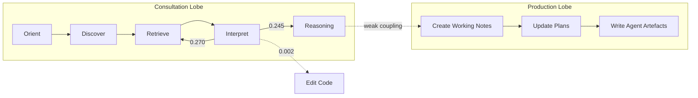

# Agent-Friendly Documentation: What 557 Coding Sessions Reveal About How Agents Actually Use Your Docs — and What It Means for AGENTS.md


---

Most teams write AGENTS.md the way they write onboarding guides for junior developers: comprehensive API references, detailed architecture diagrams, careful troubleshooting sections. A new empirical study from Peking University suggests that approach is almost entirely wrong. Gao and Chen analysed 557 coding sessions and 33,097 agentic pull requests to discover *how agents actually interact with documentation* — and the results should change the way you structure every instruction file in your Codex CLI workflow [^1].

## The Study: 94,813 Events, Two Datasets

The researchers drew on two complementary data sources. From SWE-chat, they extracted 557 parseable sessions containing 94,813 development events, of which 3,033 (3.2%) were documentation interactions. From AIDev, they analysed 33,097 agentic pull requests comprising 690,260 file-level change records, identifying 29,597 documentation file paths [^1].

Their classification system separated documents into 15 types across two tiers: deterministic path-based rules for unambiguous files, and language-model classification for 527 ambiguous paths (covering 98.4% of edge cases) [^1].

## Finding 1: Agents Ignore Your API Docs

The headline result: **agent-facing instruction files account for 60.5% of all documentation interactions**, versus 10.6% for classical technical documentation and just 1.3% for API references [^1].

Breaking that down:

| Document Type | Interactions | Share |
|---|---|---|
| Agent instructions (AGENTS.md, CLAUDE.md, SKILL.md) | 1,074 | 35.4% |
| Agent working notes (plans, thoughts, brainstorms) | 760 | 25.1% |
| Classical technical docs | 323 | 10.6% |
| API references | 40 | 1.3% |
| Troubleshooting guides | 11 | 0.4% |

That 27× ratio between instruction files and API references is the number that should reshape your documentation strategy. Agents do not browse your API reference the way a developer would. They read the file that tells them *how to behave* [^1].

## Finding 2: Agents Initiate Their Own Documentation Lookups

Contrary to the assumption that agents consult documentation in response to errors, **70.2% of documentation interactions are self-initiated** — either by the agent's own initiative (40.8%) or driven by implementation needs (29.4%). Only 7.2% are triggered by tool failures [^1].

This matters for Codex CLI configuration. If your agent reads AGENTS.md proactively rather than as a fallback, then the quality of that file directly shapes the agent's *initial approach*, not just its recovery from mistakes.

## Finding 3: Documentation Does Not Drive Code Changes

Perhaps the most counterintuitive finding: **the probability of an agent editing code immediately after reading documentation is 0.002** [^1]. After reading a document, the most likely next action is reading another document (0.270) or reasoning (0.245). The link between consultation and action is vanishingly weak.

The adjusted odds ratio for "edit code after reading docs" is 1.33, which is statistically significant but practically small — documentation influences direction, not execution. Agents use documentation to orient, not to act [^1].

## Finding 4: The Two-Lobed Cycle

The authors propose replacing the assumed linear documentation journey (discover → read → apply) with a **two-lobed cycle** [^1]:



The consultation lobe is internally recurrent — agents loop through documentation rather than making a single pass. The production lobe is where agents *write* documentation (plans, working notes, brainstorms), and the study found a near-unity production-to-consumption ratio of 0.87× (1,401 production events vs 1,615 consumption events) [^1]. Agents write almost as much documentation as they read.

## Finding 5: Agents Modify Their Own Instruction Files

Across the AIDev dataset, the most frequently modified files were precisely the ones that shape agent behaviour [^1]:

- **AGENTS.md:** 692 PRs
- **CLAUDE.md:** 362 PRs
- **copilot-instructions.md:** 287 PRs

The researchers note: "Agents modify files that shape agent behavior, closing a second loop — from agent output back to agent input" [^1]. This feedback loop is both powerful and dangerous: it means your AGENTS.md is not a static configuration but a living document that the agent itself may alter.

## Finding 6: Documentation Is Not a Failure-Recovery Strategy

When agents encounter tool failures, their recovery strategies tell a clear story [^1]:

1. Reading code: 31.0%
2. Retry directly: 19.9%
3. No action: 15.6%
4. Edit directly: 15.3%
5. **Reading documentation: 5.4%**

Documentation ranks fifth as a failure-recovery mechanism. Agents overwhelmingly prefer to read source code or retry rather than consult troubleshooting guides. This makes troubleshooting sections in AGENTS.md low-value real estate [^1].

## What This Means for Your Codex CLI Configuration

### Restructure AGENTS.md Around Behavioural Instructions

Codex CLI v0.148.0 loads AGENTS.md from three levels: `~/.codex/AGENTS.md` (global), repository root (project), and subdirectory files (scoped) [^2]. Given that instruction files receive 27× more interactions than API references, every byte of your 32 KiB budget should prioritise behavioural directives over reference material.

A restructured AGENTS.md following the study's findings:

```toml
# Codex CLI config.toml - instruction-first documentation strategy
[model]
model = "o4-mini"
model_reasoning_effort = "medium"

[sandbox]
sandbox_mode = "locked-down"
```

```markdown
<!-- AGENTS.md — prioritise behavioural instructions -->
# Build and Test
- Run `make test` before committing
- Run `make lint` to check formatting
- Never modify files in vendor/

# Coding Constraints
- Use British English in all user-facing strings
- All public functions require doc comments
- Error handling: return errors, never panic

# Commit Protocol
- Conventional commits: feat|fix|docs|refactor
- One logical change per commit
- Run the full test suite before pushing
```

Note what is *absent*: architecture overviews, API references, troubleshooting guides. The study shows agents do not use them [^1].

### Protect Against the Feedback Loop

Since agents modify their own instruction files, Codex CLI's PreToolUse hooks can enforce governance over AGENTS.md changes [^3]:

```bash
#!/bin/bash
# .codex/hooks/pre-tool-use-agents-md-guard.sh
# Prevent unreviewed AGENTS.md modifications

if echo "$CODEX_TOOL_INPUT" | grep -q "AGENTS.md"; then
    echo '{"decision": "deny", "reason": "AGENTS.md changes require human review"}'
    exit 0
fi
echo '{"decision": "approve"}'
```

This prevents the agent-to-instruction feedback loop from running unsupervised. Alternatively, use `suggest` approval mode for any session where AGENTS.md is in scope, forcing human review of instruction file changes [^3].

### Leverage Agent Working Notes via Memories

The finding that agents produce documentation at 0.87× their consumption rate maps directly to Codex CLI's Memories pipeline. When an agent discovers something worth recording, Memories captures it as a persistent note (up to 5 KiB per entry) that survives session boundaries [^2]. This is the production lobe of the two-lobed cycle made persistent.

However, the study reveals a gap: agent-authored working notes (plans, thoughts directories) accounted for 25.1% of all documentation interactions, but Codex CLI's Memories are flat key-value entries with no structure for plans or reasoning traces [^1] [^2]. A PostToolUse hook can bridge this by capturing structured reasoning:

```bash
#!/bin/bash
# .codex/hooks/post-tool-use-capture-reasoning.sh
# Log agent reasoning events for review

if [ "$CODEX_TOOL_NAME" = "shell" ]; then
    REASONING=$(echo "$CODEX_TOOL_OUTPUT" | head -50)
    echo "{\"status\": \"continue\", \"note\": \"Captured reasoning trace\"}"
fi
```

### Use --print-instructions to Audit What the Agent Sees

Codex CLI's `--print-instructions` flag dumps the merged AGENTS.md content loaded for the current session [^2]. Given the study's finding that agents interact with instruction files 27× more than API references, auditing exactly what your agent reads at startup is high-leverage:

```bash
codex --print-instructions
```

If the output contains architecture prose or API details that the agent will largely ignore, you are wasting context window budget.

### Cross-Agent Variation Is Real

The study found significant variation across agent families [^1]:

- **Gemini CLI:** 75.0% of sessions involve documentation
- **Claude Code:** 62.6%
- **Codex:** 37.2%
- **Cursor:** 0% (n=11, likely extraction artefact)

Codex CLI sessions show lower documentation interaction rates, which may reflect its stronger reliance on AGENTS.md being loaded at startup rather than discovered mid-session. This supports frontloading all critical instructions into AGENTS.md rather than scattering them across the repository [^1] [^4].

## Gaps in Codex CLI's Documentation Support

The study exposes several areas where Codex CLI's documentation handling could improve:

1. **No structured working-notes directory:** Agents produce plans and brainstorms at scale, but Codex CLI has no convention for where these artefacts live or how they persist across sessions [^1]
2. **Memories lack hierarchy:** The 5 KiB flat-entry format cannot represent the structured plans that account for 25.1% of documentation interactions [^2]
3. **No documentation-interaction telemetry:** Rollout JSONL does not distinguish documentation reads from code reads, making it impossible to audit the agent's documentation behaviour post-session [^2]
4. **No instruction-file integrity protection:** Beyond PreToolUse hooks, there is no built-in mechanism to detect or prevent the agent-to-instruction feedback loop [^3]
5. **Compaction erases instruction context:** When auto-compaction triggers, AGENTS.md content loaded at session start may be summarised away, breaking the orientation loop the study identifies as critical [^2]

## Practical Takeaways

The data supports five concrete actions for Codex CLI users:

1. **Cut API references and architecture prose from AGENTS.md.** Agents interact with instruction files 27× more than API references. Fill your 32 KiB budget with behavioural directives, build commands, and coding constraints.

2. **Add a PreToolUse hook guarding AGENTS.md.** Agents close the instruction-output feedback loop by modifying their own instruction files. Gate those modifications behind human review.

3. **Front-load instructions.** Codex CLI's lower documentation interaction rate (37.2% of sessions vs 62.6% for Claude Code) suggests it relies more heavily on startup-loaded instructions. Make the initial AGENTS.md load count.

4. **Do not invest in troubleshooting sections.** Only 5.4% of failure-recovery episodes use documentation. Agents prefer reading source code or retrying.

5. **Audit with --print-instructions.** Verify that what the agent actually loads matches your intended behavioural directives, not accumulated prose.

Documentation now has two audiences with measurably different behaviours [^1]. The newer audience writes almost as much as it reads, ignores your API references, and loops through instruction files rather than following a linear journey. Your AGENTS.md — which is evolving towards a cross-tool standard [^5] — should be written for *that* audience.

## Citations

[^1]: Gao, Z. and Chen, J. (2026) "From Agent Behaviour to Agent-Friendly Documentation: An Empirical Study of How Coding Agents Discover, Read, and Write Technical Documentation." arXiv:2608.20195. [https://arxiv.org/abs/2608.20195](https://arxiv.org/abs/2608.20195)

[^2]: OpenAI (2026) "Codex CLI v0.148.0 Release Notes." GitHub. [https://github.com/openai/codex/releases/tag/rust-v0.148.0](https://github.com/openai/codex/releases/tag/rust-v0.148.0)

[^3]: OpenAI (2026) "Codex CLI Hooks Documentation." [https://openai-codex.mintlify.app/cli/hooks](https://openai-codex.mintlify.app/cli/hooks)

[^4]: Vaughan, D. (2026) "Agent Instruction Files: AGENTS.md, CLAUDE.md, and Cross-Tool Portability with Codex CLI." Codex Knowledge Base. [https://codex.danielvaughan.com/2026/05/27/agent-instruction-files-agents-md-claude-md-cross-tool-portability-codex-cli/](https://codex.danielvaughan.com/2026/05/27/agent-instruction-files-agents-md-claude-md-cross-tool-portability-codex-cli/)

[^5]: Agentic AI Foundation / Linux Foundation (2026) "AGENTS.md Specification." [https://www.agents-md.org](https://www.agents-md.org)
