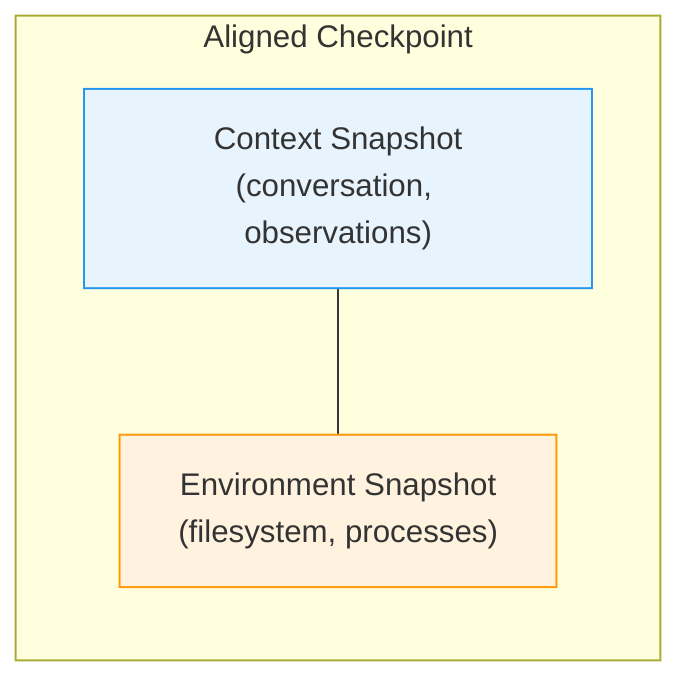
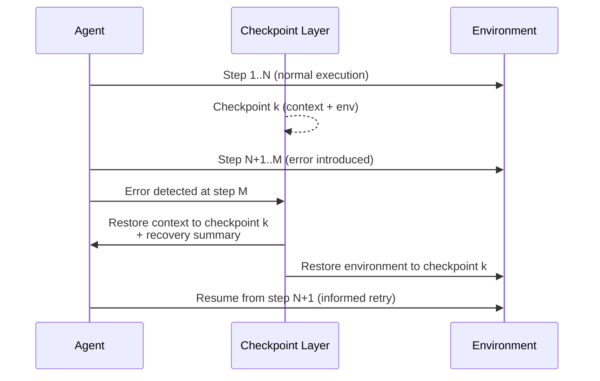
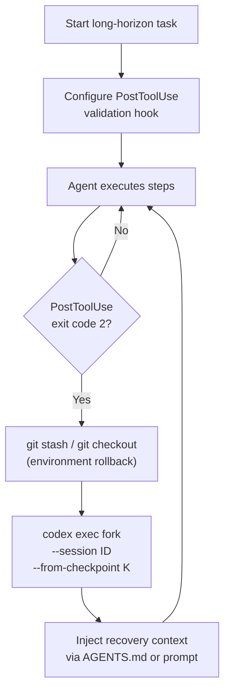

# AgentRewind and Recoverable Execution: Why Your Long-Horizon Coding Agent Needs Aligned Checkpoints — and How Codex CLI's Session Fork Gets You Halfway There


---

Long-horizon coding tasks — multi-file refactorings, feature branches that span dozens of tool calls, infrastructure migrations touching CI pipelines and deployment manifests — are where coding agents earn their keep and where they fail most expensively. An error at step 12 of a 40-step plan does not merely produce a wrong file; it poisons the agent's context window with misleading observations and leaves the environment in a state the agent's subsequent actions silently assume is correct. Existing defences — plan refinement, safety hooks, approval gates — focus on *preventing* errors. AgentRewind, introduced by Zhuang et al. in August 2026 [^1], tackles what happens *after* an error has already occurred: aligned checkpoint-and-rollback across both the agent context and the controlled environment.

This article unpacks AgentRewind's architecture, its MettleBench evaluation, and maps the framework's key ideas to Codex CLI v0.148.0's session management primitives — identifying where the CLI already supports recoverable execution and where meaningful gaps remain.

## The Dual-State Problem

Most retry and self-repair strategies treat the agent's context and the environment as independent concerns. A naive "undo the last file write" ignores that the agent's context window now contains observations, reasoning chains, and tool-call results predicated on the erroneous state. Conversely, rolling back context alone — by truncating the conversation — leaves environment artefacts (modified files, database rows, installed packages) that contradict the rewound conversation.

AgentRewind formalises this as the **dual-state alignment problem**: useful recovery requires atomically reverting both the agent's internal state (conversation history, accumulated observations, working memory) and the external environment (filesystem, running processes, network state) to a consistent earlier point [^1].



## How AgentRewind Works

The framework interposes a **checkpoint layer** between the agent harness and the execution environment. At configurable intervals — after each tool call, after each plan phase, or at user-defined boundaries — it captures:

1. **Context checkpoint**: a serialised snapshot of the agent's conversation history, including system prompt, tool-call/result pairs, and any accumulated working memory.
2. **Environment checkpoint**: a snapshot of the controlled environment's mutable state — filesystem deltas, process trees, and relevant external service state.

These two snapshots are *aligned* by a shared checkpoint identifier, guaranteeing that reverting to checkpoint *k* restores both halves to a mutually consistent state [^1].

### Recovery Strategy

When the agent detects an error (or an external monitor does), AgentRewind selects a checkpoint to revert to and resumes execution. Crucially, the resumed agent retains **information from the failed attempt** — a recovery summary injected into the restored context that describes what went wrong and why. This transforms rollback from a blind retry into an *informed* retry [^1].



## MettleBench: Measuring Partial Progress

Existing benchmarks like SWE-bench measure binary pass/fail — the patch either resolves the issue or it does not. This makes them unsuitable for evaluating recovery frameworks, where the question is not just *did the agent succeed* but *how much progress survived the error*.

AgentRewind introduces **MettleBench**, a benchmark of long-horizon engineering assignments where each task comprises a series of related requirements expressed as a checklist [^1]. Evaluation measures both:

- **Task success rate**: binary completion of all requirements.
- **Average checklist progress**: the fraction of individual requirements satisfied, capturing partial credit.

Experiments across multiple models, execution strategies, and agent harnesses demonstrate that AgentRewind improves both metrics over baselines that lack recovery capabilities [^1]. ⚠️ Specific percentage improvements are reported in the paper but were not extractable from public summaries at the time of writing; readers should consult the full paper for precise figures.

## Mapping to Codex CLI v0.148.0

Codex CLI v0.148.0 [^2] ships several primitives that partially address the recoverable-execution problem. Here is how they map to AgentRewind's architecture — and where they fall short.

### Session Checkpoints and Resume

Every Codex CLI session generates a JSONL transcript persisted under `~/.codex/sessions/`. The `codex session checkpoints` command lists available restoration points, and `codex --resume <session-id> --from-checkpoint <id>` resumes from a specific checkpoint [^3].

This gives you **context-side recovery**: the agent restarts with its conversation history truncated to the checkpoint boundary. However, it does *not* automatically revert the filesystem or any external environment state. If the agent wrote incorrect code between the checkpoint and the error, those files remain on disc after resume.

### Session Forking with `codex exec fork`

New in v0.148.0 [^2], `codex exec fork` creates a new session branching from an existing one. Combined with archive and restore in the TUI resume picker, this enables exploratory branching — try approach A in one fork, approach B in another, and keep whichever succeeds.

```bash
# Fork from an existing session at its current state
codex exec fork --session <session-id> --prompt "Try the alternative migration approach using alembic instead"
```

Forking is conceptually close to AgentRewind's checkpoint-and-resume, but it creates a *new* session rather than rolling back the original. It also does not capture or restore environment state.

### Sandbox Boundaries as Implicit Checkpoints

Codex CLI's sandbox (`sandbox: locked-down` or `sandbox: read-only-fs`) constrains environment mutations. In `locked-down` mode, file writes are restricted to the workspace and denied paths fail closed [^2]. Combined with git, this provides a manual recovery mechanism:

```toml
# config.toml — constrain the blast radius
[sandbox]
mode = "locked-down"
deny_read = ["/etc", "/var"]
deny_write = ["/usr", "/opt"]
```

A `git stash` or `git checkout -- .` after a failed attempt effectively restores the filesystem to the last committed state. But this requires manual intervention and does not align with context restoration.

### PostToolUse Hooks as Error Detectors

AgentRewind's recovery loop depends on detecting errors. Codex CLI's `PostToolUse` hooks [^4] can serve this role — running validation after each tool call and returning exit code 2 to halt execution when something goes wrong:

```json
{
  "hooks": [
    {
      "event": "PostToolUse",
      "command": "bash -c 'cd $CODEX_WORKSPACE && make check 2>/dev/null || exit 2'",
      "timeout_ms": 30000,
      "async": false
    }
  ]
}
```

When a `PostToolUse` hook exits with code 2, the agent stops. At that point, the developer can manually resume from a checkpoint. What is missing is the *automated* recovery loop — detecting the error, selecting the right checkpoint, generating a recovery summary, and resuming without human intervention.

## The Gap: What Codex CLI Cannot Do Yet

Mapping AgentRewind's architecture against Codex CLI's current capabilities reveals four structural gaps:

### 1. No Environment-State Snapshots

Codex CLI checkpoints capture conversation state but not filesystem state. An aligned checkpoint in the AgentRewind sense would need to bundle a filesystem snapshot (or at minimum a git commit hash) with the conversation checkpoint, guaranteeing atomic rollback of both.

### 2. No Automated Recovery Loop

There is no mechanism to automatically revert to a checkpoint when an error is detected. The PostToolUse hook can *halt* execution, but the subsequent steps — selecting a checkpoint, restoring state, injecting a recovery summary, and resuming — require manual orchestration.

### 3. No Recovery Summary Injection

When resuming from a checkpoint, Codex CLI replays the truncated conversation but does not inject information about *why* the previous attempt failed. AgentRewind's key insight is that informed retries outperform blind retries; without a recovery summary, a resumed session risks repeating the same mistake.

### 4. No Partial-Progress Metrics

Codex CLI's rollout JSONL and OpenTelemetry spans capture cost, duration, and tool-call sequences, but there is no built-in mechanism for tracking checklist-style partial progress across a long-horizon task. MettleBench's evaluation model suggests this is a valuable metric for teams running multi-step agentic workflows.

## A Practical Approximation

Until Codex CLI ships native aligned checkpointing, teams can approximate AgentRewind's workflow with a combination of existing primitives:



The key steps:

1. **Commit frequently**: configure your AGENTS.md to instruct the agent to commit after each logical phase, creating environment-side checkpoints.
2. **Detect errors with hooks**: PostToolUse hooks running tests, linters, or type-checkers catch regressions immediately.
3. **Rollback the environment**: `git checkout -- .` or `git reset --hard HEAD~1` restores the filesystem to the last clean commit.
4. **Fork with context**: use `codex exec fork` from the last good checkpoint, prepending the new session's prompt with a description of what failed and why.

```markdown
<!-- AGENTS.md excerpt for checkpoint-friendly workflows -->
## Commit Discipline

After completing each logical phase of a multi-step task, commit your changes
with a descriptive message. This creates environment checkpoints that can be
rolled back independently of session state.

## Error Recovery

If tests fail after a change, do NOT attempt to fix forward through multiple
iterations. Instead, revert the failing change and describe what went wrong
before trying an alternative approach.
```

## Relationship to DeltaBox

DeltaBox [^5], covered in a previous article, operates at a different level of the stack. Where AgentRewind manages *agent-level* checkpoint/rollback (conversation + workspace), DeltaBox provides *OS-level* sandbox checkpoint/rollback with millisecond latency (14ms checkpoint, 5ms rollback) using copy-on-write filesystem layers and incremental process dumps. The two are complementary: DeltaBox could serve as the environment-snapshot backend for an AgentRewind-style recovery framework, providing the fast, fine-grained state capture that makes frequent checkpointing practical.

## Implications for Teams

AgentRewind's contribution is not a tool but a design principle: **recovery-aware agent architecture**. The framework demonstrates that treating error recovery as a first-class concern — with aligned state snapshots, informed retries, and partial-progress measurement — yields measurably better outcomes on long-horizon tasks than relying solely on error prevention.

For Codex CLI users running complex multi-step workflows, the practical takeaway is to architect for recoverability now, using git commits as environment checkpoints, PostToolUse hooks as error detectors, and session forking as the recovery mechanism. The manual orchestration is imperfect, but it captures AgentRewind's core insight: rolling back context without rolling back environment, or vice versa, is worse than not rolling back at all.

---

## Citations

[^1]: Zhuang, Y., Chen, K., Duan, Y., Zheng, S., Li, J. & Zhang, X.-Y. (2026). "AgentRewind: Recoverable Execution for Long-Horizon LLM Agents." arXiv:2608.14380. [https://arxiv.org/abs/2608.14380](https://arxiv.org/abs/2608.14380)

[^2]: OpenAI. (2026). "Codex CLI v0.148.0 Release Notes." GitHub. [https://github.com/openai/codex/releases/tag/rust-v0.148.0](https://github.com/openai/codex/releases/tag/rust-v0.148.0)

[^3]: OpenAI. (2026). "Codex CLI Session Lifecycle: Archive, Resume, Fork, and Compact." Codex Knowledge Base. [https://codex.danielvaughan.com/2026/06/05/codex-cli-session-lifecycle-archive-resume-fork-compact-management/](https://codex.danielvaughan.com/2026/06/05/codex-cli-session-lifecycle-archive-resume-fork-compact-management/)

[^4]: OpenAI. (2026). "Codex CLI Hooks: Complete Guide." Codex CLI Documentation. [https://developers.openai.com/codex/hooks](https://developers.openai.com/codex/hooks)

[^5]: Chen, X. et al. (2026). "DeltaBox: Scaling Stateful AI Agents with Millisecond-Level Sandbox Checkpoint/Rollback." arXiv:2605.22781. [https://arxiv.org/abs/2605.22781](https://arxiv.org/abs/2605.22781)
