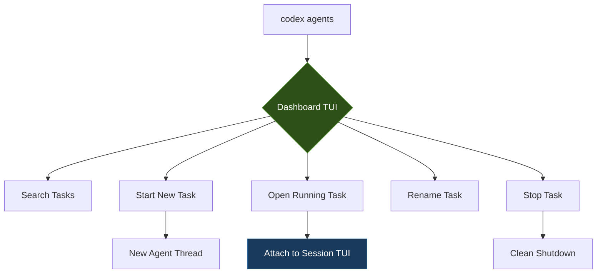
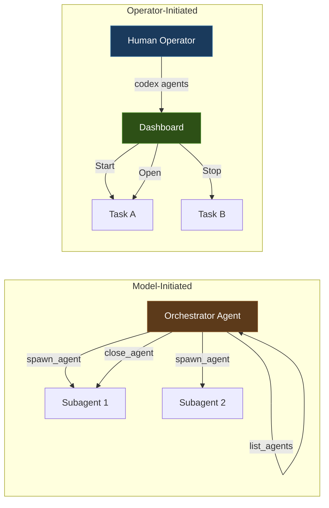

# The Codex Agents Dashboard: Interactive Task Management Arrives in v0.149.0


---

Codex CLI v0.149.0, released on 20 August 2026, ships a dedicated `codex agents` dashboard command — an interactive TUI for searching, starting, opening, renaming, and stopping agent tasks from a single pane [^1]. Until now, multi-agent orchestration in Codex CLI meant juggling `spawn_agent`, `list_agents`, and `close_agent` tool calls inside a running session, or switching between terminal tabs. The dashboard pulls that sprawl into one surface, and it lands alongside three other v0.149.0 changes that reshape how you manage sessions: the retirement of the `untrusted` approval policy, new `/cd`, `/pwd`, and `/cwd` slash commands, and `max`/`ultra` reasoning effort exposure in the SDK [^1].

This article covers what the dashboard does, how it fits into the existing multi-agent architecture, and what its arrival implies for production orchestration workflows.

## What the Dashboard Replaces

Before v0.149.0, multi-agent visibility relied on three mechanisms:

1. **The `/agent` slash command** inside a running TUI session, which listed spawned subagent threads but offered no interactive controls beyond thread selection [^2].
2. **`list_agents`**, one of six core orchestration tools (alongside `spawn_agent`, `send_message`, `followup_task`, `wait_agent`, and `close_agent`), callable only by the orchestrator model during its turn [^2].
3. **External tooling** — third-party dashboards like `agent-dashboard` (tmux-based) or `Claude-Code-Agent-Monitor` (WebSocket + React) that polled session state from outside [^3].

None of these gave the operator — the human at the keyboard — direct, interactive control over multiple agent tasks from a single entry point.

## Anatomy of the Dashboard

The `codex agents` command opens a full-screen TUI panel. Based on the release notes and early documentation, it supports five core operations [^1]:

| Operation | Description |
|-----------|-------------|
| **Search** | Filter across active, paused, and completed tasks by name or status |
| **Start** | Launch a new agent task directly from the dashboard |
| **Open** | Attach to a running task's TUI session |
| **Rename** | Relabel tasks for organisational clarity |
| **Stop** | Terminate a running task cleanly |

Keyboard shortcuts for each operation are configurable, following the same keybinding pattern Codex CLI uses for its main TUI (where `Shift+Down` cycles reasoning effort and `Ctrl+X` opens the command palette) [^1].



## How It Relates to Multi-Agent v2

The dashboard does not replace the programmatic multi-agent orchestration system. The six core tools (`spawn_agent`, `send_message`, `followup_task`, `wait_agent`, `list_agents`, `close_agent`) remain the model-facing primitives for agent-to-agent coordination [^2]. What the dashboard adds is an operator-facing control plane.

Think of it as the difference between an orchestrator agent deciding to spawn a subagent (model-initiated) and an operator deciding to start a new task or kill a stuck one (human-initiated). The dashboard serves the second case.



The concurrency limits still apply. `agents.max_threads` (default 6) caps spawned-agent threads across the session tree, and `agents.max_depth` (default 1) controls nesting [^2]. Tasks started from the dashboard count against these limits in the same way as programmatically spawned agents.

## Practical Workflow: Multi-Task Development

Consider a scenario where you are running three concurrent Codex tasks: a feature implementation, a test suite expansion, and a documentation update. Before v0.149.0, you would either:

- Run three separate terminal sessions, each with `codex "implement feature X"`, `codex "expand tests for module Y"`, and `codex "update docs for Z"`
- Use a single orchestrator session with `multi_agent_v2` spawning subagents

The dashboard offers a middle path. From `codex agents`, you start all three tasks, monitor their progress, rename them for clarity, and attach to whichever needs attention:

```bash
# Launch the dashboard
codex agents

# Inside the dashboard:
# - Press the configured 'Start' shortcut to create "Feature: auth refactor"
# - Start again for "Tests: auth module coverage"
# - Start again for "Docs: auth API reference"
# - Use Search to filter by "auth"
# - Open any task to interact with its session
# - Stop a completed or stuck task
```

This pattern is particularly useful when tasks are independent but you want a unified view — exactly the gap that external tools like `agent-dashboard` were filling [^3].

## The Untrusted Policy Retirement

The same release retires the `untrusted` approval policy [^1]. This is worth noting alongside the dashboard because it changes the default trust posture for new sessions.

The three approval policies were:

| Policy | Behaviour |
|--------|-----------|
| `untrusted` | Prompts before nearly every action (now retired) |
| `on-request` | Prompts only when the sandbox blocks an action |
| `never` | Fully autonomous, no approval prompts |

With `untrusted` gone, `on-request` becomes the most restrictive built-in policy. Teams that relied on `untrusted` for maximum oversight should migrate to `on-request` combined with tighter `sandbox_mode` constraints (`locked-down` or custom `deny_read`/`deny_write` rules) and `PreToolUse` hooks for granular control [^4].

For dashboard-launched tasks, the approval policy is inherited from the active named profile or `config.toml` defaults — the same inheritance model as any other session.

## Working Directory Commands

The `/cd`, `/pwd`, and `/cwd` slash commands round out the session management improvements [^1]. Previously, switching a session's working directory required the `--cd` or `-C` flag at launch time, or asking the agent to `cd` (which only affected the agent's shell, not Codex's file-resolution context).

```bash
# Inside a TUI session:
/pwd                    # Show current working directory
/cd ./packages/api      # Switch context to a subdirectory
/cwd                    # Confirm the new working directory
```

This matters for dashboard workflows because you can now open a task, repoint its working directory mid-session, and continue — without restarting.

## SDK Reasoning Effort: Max and Ultra

v0.149.0 also exposes `max` and `ultra` reasoning effort levels to SDK users [^1]. The distinction is significant:

- **Max** gives a single task deeper reasoning — more inference compute on one problem [^5].
- **Ultra** coordinates subagents in parallel; it is not simply another single-agent reasoning level but an orchestration mode [^5].

For TypeScript SDK consumers building custom tooling around the dashboard, this means you can now programmatically select `ultra` reasoning when launching tasks that should fan out to subagents:

```toml
# config.toml profile for dashboard-launched deep-analysis tasks
[profiles.deep-analysis]
model = "gpt-5.6-terra"
model_reasoning_effort = "max"

[profiles.parallel-sweep]
model = "gpt-5.6-sol"
model_reasoning_effort = "ultra"
```

## Configuration

The dashboard respects existing `config.toml` settings for agent behaviour:

```toml
[agents]
max_threads = 8              # Maximum concurrent agent threads
max_depth = 1                # Maximum nesting depth

[tui]
# Dashboard keyboard shortcuts follow the same binding format
# as the main TUI keybindings
```

Named profiles pair naturally with dashboard-launched tasks. You can maintain separate profiles for different task types and select the appropriate one when starting a task from the dashboard.

## What Is Still Missing

The dashboard is a v0.149.0 addition, and several gaps remain:

1. **No cross-machine visibility.** The dashboard shows tasks on the local machine. Combined with `codex queue` (also v0.149.0), you can send messages to remote sessions, but there is no unified view of local and remote tasks [^1].
2. **No task grouping or dependencies.** You can search and rename, but there is no way to express "Task B depends on Task A" or group tasks into projects.
3. **No persistent task history.** Completed tasks disappear from the dashboard. Session archiving (`codex resume --all`) preserves sessions, but the dashboard does not surface archived tasks.
4. **No resource monitoring.** Token consumption, cost, and elapsed time per task are not displayed in the dashboard — you still need external observability tooling or rollout JSONL analysis for that.
5. **CLI-only.** Like `multi_agent_v2` orchestration, the agents dashboard is terminal-only. The Codex web app and IDE extensions do not surface it [^2].

## When to Use the Dashboard vs. Multi-Agent v2

| Criterion | Dashboard (`codex agents`) | Multi-Agent v2 (`spawn_agent`) |
|-----------|---------------------------|-------------------------------|
| Initiator | Human operator | Orchestrator model |
| Coordination | Manual (human switches between tasks) | Automated (model routes messages) |
| Best for | Independent parallel tasks | Interdependent subtasks |
| Communication | Human reads each task's output | `send_message` / `followup_task` |
| Concurrency control | Same `max_threads` limit | Same `max_threads` limit |

For most senior developers, the dashboard will be the daily driver for managing two to four concurrent coding tasks. Multi-agent v2 remains the right choice when the orchestration logic itself needs to be automated — CI pipelines, multi-file refactors with cross-cutting dependencies, or coder-architect handoff patterns.

## Summary

The `codex agents` dashboard in v0.149.0 fills a genuine gap: operator-level visibility and control over multiple agent tasks without leaving the terminal. Paired with the retirement of `untrusted` (pushing teams toward more principled `on-request` + sandbox configurations), working directory commands (`/cd`, `/pwd`, `/cwd`), and SDK-level `max`/`ultra` reasoning effort, this release marks a shift from "agent as single session" to "agent as managed fleet."

The dashboard is not a replacement for programmatic multi-agent orchestration — it is its complement. One is for models coordinating with models; the other is for humans coordinating with models. Both share the same concurrency controls, the same session infrastructure, and the same config.toml governance.

---

## Citations

[^1]: OpenAI, "Release 0.149.0 · openai/codex," GitHub, 20 August 2026. [https://github.com/openai/codex/releases/tag/rust-v0.149.0](https://github.com/openai/codex/releases/tag/rust-v0.149.0)

[^2]: Daniel Vaughan, "Codex CLI Multi-Agent Orchestration v2: Complete Guide," Codex Knowledge Base, April 2026. [https://codex.danielvaughan.com/2026/04/11/codex-cli-multi-agent-orchestration-v2-complete-guide/](https://codex.danielvaughan.com/2026/04/11/codex-cli-multi-agent-orchestration-v2-complete-guide/)

[^3]: bjornjee, "agent-dashboard: Real-time tmux dashboard to monitor, manage, and orchestrate AI coding agents," GitHub, 2026. [https://github.com/bjornjee/agent-dashboard](https://github.com/bjornjee/agent-dashboard)

[^4]: SmartScope, "Codex CLI approval_policy: Legacy Patterns vs Official 2026 Approval Settings," 2026. [https://smartscope.blog/en/generative-ai/chatgpt/codex-cli-approval-policy-implementation/](https://smartscope.blog/en/generative-ai/chatgpt/codex-cli-approval-policy-implementation/)

[^5]: Kingy.ai, "Codex Reasoning Levels: Light to Ultra Explained," 2026. [https://kingy.ai/news/openai-codex-reasoning-levels-low-medium-high-extra-high/](https://kingy.ai/news/openai-codex-reasoning-levels-low-medium-high-extra-high/)
