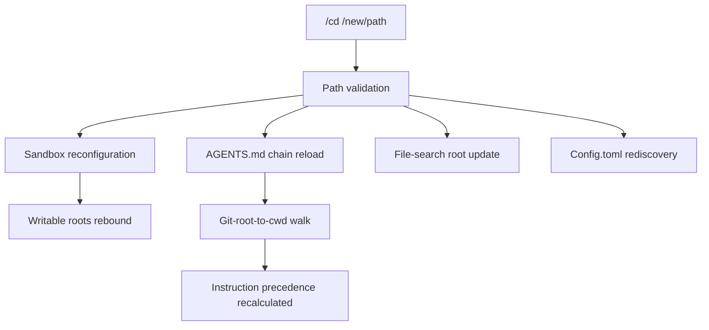

# Working Directory Commands in Codex CLI v0.149.0: /cd, /pwd, /cwd, and the End of Session Restarts


---

Before v0.149.0, changing your working directory inside a Codex CLI session was impossible. You had to quit, `cd` in your shell, and start (or resume) a fresh session — losing conversational context, re-approving sandbox policies, and paying the compaction tax all over again [^1]. That friction was the single most-upvoted missing feature across two long-running GitHub issues: #12464 (41 upvotes requesting `/cwd`) and #14025 (requesting mid-session directory switching for monorepos) [^2] [^3].

v0.149.0, released on 20 August 2026, ships three new slash commands — `/cd`, `/pwd`, and `/cwd` — that make this problem disappear [^4]. This article examines what they do, how they interact with the sandbox and AGENTS.md instruction chain, and the practical workflows they unlock.

## The Three Commands

### /pwd — Where Am I?

`/pwd` prints the session's current effective working directory. It returns the path that the agent sees as its workspace root — the directory from which all relative file references resolve and against which writable-root policies are evaluated.

```bash
> /pwd
/home/dev/services/api-gateway
```

This is not the same as the shell's `$PWD`. A resumed or forked session may carry a different working directory from the terminal that launched it. Before v0.149.0, the only way to discover this mismatch was `/status`, which buries the path among token counts and model metadata [^4].

### /cwd — Inspect and Confirm

`/cwd` is the read-only sibling of `/cd`. When called without arguments it behaves identically to `/pwd`, displaying the current directory. The distinction is semantic: `/cwd` exists to match the terminology used in issue #12464 and in the SDK's `OverrideTurnContext` operation [^2]. In practice, treat `/pwd` and bare `/cwd` as interchangeable.

### /cd — Change Working Directory

`/cd <path>` is the command that closes the feature gap. It atomically shifts the session's working directory to `<path>`, triggering a cascade of state updates:

```bash
> /cd /home/dev/services/payment-service
Working directory changed to /home/dev/services/payment-service
AGENTS.md reloaded (3 files in chain)
Writable roots updated: /home/dev/services/payment-service
```

The operation is non-trivial because the working directory is not merely a cosmetic label. It governs at least four runtime subsystems.

## What Changes When You /cd



### 1. Sandbox Writable Roots

Codex CLI's sandbox (Seatbelt on macOS, Bubblewrap on Linux, restricted tokens on Windows) limits the agent's write access to the workspace root plus any explicitly declared `writable_roots` [^5]. When `/cd` shifts the workspace root, the sandbox policy updates accordingly. The old path becomes read-only unless it was independently declared as a writable root in `config.toml` or via `--add-dir` at launch.

This is a security-critical state transition. Prior to v0.149.0, a historical vulnerability (CVE in v0.39.0) demonstrated what happens when model-generated working directories are treated as writable roots without validation [^5]. The `/cd` implementation avoids this by validating the target path against the session's permission profile before reconfiguring the sandbox.

### 2. AGENTS.md Instruction Chain

Codex builds its instruction chain by walking the directory tree from the git root to the current working directory, collecting every `AGENTS.md` file along the way [^6]. Closer files take higher precedence. When `/cd` moves you from `/repo/services/api-gateway` to `/repo/services/payment-service`, the agent drops the `api-gateway/AGENTS.md` instructions and picks up `payment-service/AGENTS.md` instead.

This means `/cd` is not just a navigation command — it is an instruction-context switch. The agent's behavioural constraints, coding conventions, and domain knowledge rotate with the directory.

### 3. File-Search and Reference Resolution

All relative paths in the conversation resolve against the working directory. After `/cd`, file mentions, `@`-mentions, and tool-output paths shift to the new root. The TUI's file-search index updates to prefer files under the new path.

### 4. Config.toml Discovery

Project-level `.codex/config.toml` files live relative to the git root, so a `/cd` within the same repository does not change the effective configuration. However, if `/cd` crosses a repository boundary (moving from one git root to another), config discovery runs fresh against the new root.

## Practical Workflows

### Monorepo Service Hopping

The canonical use case. A typical microservices monorepo has dozens of service directories, each with its own `AGENTS.md` and test configuration:

```bash
> /cd services/auth
# Agent now follows auth-service conventions, runs auth tests
> "Fix the token refresh race condition in refresh_handler.rs"
# ... agent works ...

> /cd services/billing
# Agent context-switches to billing conventions
> "Add the new invoice PDF endpoint"
```

Without `/cd`, this workflow required two separate sessions, sacrificing any shared conversational context about the broader system design.

### Git Worktree Navigation

Issue #12464 specifically called out git worktrees as a core use case [^2]. Developers who maintain parallel worktrees for feature branches can now jump between them:

```bash
> /cd ../feature-oauth-migration
# Agent picks up the worktree's branch state
> "Continue the OAuth migration — what's left?"
```

### Cross-Repository Exploration

Combined with `--add-dir` (which grants write access to additional directories), `/cd` enables genuine cross-repository workflows:

```bash
# Launch with access to both repos
codex --add-dir /home/dev/shared-protos

> /cd /home/dev/shared-protos
> "Add a new PaymentCompleted event to the proto definition"

> /cd /home/dev/services/billing
> "Regenerate the gRPC stubs and handle the new event"
```

## Interaction with Session Lifecycle

### Resume and Fork

v0.149.0 also fixes permission profile restoration when resuming or forking threads [^4]. Previously, resumed sessions fell back to default permissions even if the original session used a stricter profile. Combined with `/cd`, this means you can now fork a session, `/cd` into a different service directory, and continue working with the correct permission profile — all without restarting.

### codex exec (Non-Interactive)

The `/cd` command is a TUI slash command. In non-interactive `codex exec` mode, the equivalent is the `-C` / `--cd` launch flag, which has been available since much earlier versions [^7]. For scripted automation, `-C` remains the correct approach:

```bash
codex exec -C /path/to/service "Run all integration tests"
```

### Compaction Behaviour

When auto-compaction fires after a `/cd`, the compacted summary includes the current working directory at the time of compaction. This matters because compaction discards raw conversation turns — if the agent's instructions changed mid-session due to a `/cd`, the compacted summary may not faithfully represent the earlier instruction context. This is the same instruction-erasure risk documented in the HANDBOOK.md benchmark research [^8].

## What /cd Does Not Do

Understanding the boundaries is as important as the feature itself:

- **Environment inheritance.** `/cd` changes the *logical* working directory but does not materialise the target directory's development environment. If `/home/dev/services/payment-service` requires a specific Python virtualenv or Node version, the agent's shell commands still inherit the original session's environment unless you configure per-directory environment setup in hooks [^9].

- **Network policy changes.** Sandbox network rules (deny-list, allow-list) are set at session launch and do not change with `/cd`.

- **Multi-directory write access.** `/cd` moves the primary writable root; it does not *add* a writable root. To write in both the old and new directories simultaneously, use `--add-dir` at launch or configure `writable_roots` in your permission profile.

- **Desktop app parity.** The ChatGPT desktop app's multi-folder project feature (shipped 23 July 2026) designates a primary folder for Git operations while allowing read/write access to secondary folders [^10]. `/cd` in the CLI is a sequential operation — it switches context rather than spanning multiple roots simultaneously.

## Recommended Configuration

For monorepo teams, combine `/cd` with a permission profile that pre-declares your service directories as writable roots:

```toml
# .codex/config.toml
[profile.monorepo]
writable_roots = [
  "services/auth",
  "services/billing",
  "services/api-gateway",
  "shared/protos",
]
```

This way, `/cd` between these directories does not restrict write access to only the current target — all declared roots remain writable throughout the session.

## Conclusion

The `/cd`, `/pwd`, and `/cwd` commands are a small surface-area change with outsized workflow impact. They eliminate the most common reason developers restart Codex CLI sessions, preserve conversational context across directory boundaries, and bring the TUI closer to parity with the desktop app's multi-folder capabilities. The security implications — sandbox reconfiguration, instruction-chain reloading, permission profile interaction — deserve attention, but the defaults are sound: validate the path, rebind the writable root, reload the instruction chain, and carry on.

For monorepo teams and anyone working across multiple repositories, v0.149.0's directory commands are the release's most practically useful addition.

## Citations

[^1]: GitHub Issue #12464, "/cwd command to switch working directory without restarting session," OpenAI/Codex, 2026. [https://github.com/openai/codex/issues/12464](https://github.com/openai/codex/issues/12464)

[^2]: GitHub Issue #12464, "/cwd command to switch working directory without restarting session," OpenAI/Codex, 2026. Community discussion with 41 upvotes detailing the session-restart pain point. [https://github.com/openai/codex/issues/12464](https://github.com/openai/codex/issues/12464)

[^3]: GitHub Issue #14025, "Allow switching/adding working directories within a Codex CLI session," OpenAI/Codex, 2026. [https://github.com/openai/codex/issues/14025](https://github.com/openai/codex/issues/14025)

[^4]: OpenAI, "Release 0.149.0," GitHub, 20 August 2026. [https://github.com/openai/codex/releases/tag/rust-v0.149.0](https://github.com/openai/codex/releases/tag/rust-v0.149.0)

[^5]: OpenAI, "Agent approvals & security," Codex developer documentation, 2026. [https://learn.chatgpt.com/docs/agent-approvals-security](https://learn.chatgpt.com/docs/agent-approvals-security)

[^6]: Blake Crosley, "Codex CLI Guide 2026: Setup, Sandbox, AGENTS.md & MCP," 2026. Documents the AGENTS.md directory-traversal instruction chain. [https://blakecrosley.com/guides/codex](https://blakecrosley.com/guides/codex)

[^7]: Shipyard, "Codex CLI Cheatsheet: config, commands, AGENTS.md, + best practices," 2026. [https://shipyard.build/blog/codex-cli-cheat-sheet/](https://shipyard.build/blog/codex-cli-cheat-sheet/)

[^8]: Panavas et al., "HANDBOOK.md: A Benchmark for Long-Context Agentic Instruction Following," arXiv:2607.25398, July 2026. Documents instruction-erasure risk under auto-compaction.

[^9]: GitHub Discussion #26901, "Clarifying Codex command environment contracts," OpenAI/Codex, 2026. Documents the gap between cwd correctness and environment materialisation. [https://github.com/openai/codex/discussions/26901](https://github.com/openai/codex/discussions/26901)

[^10]: OpenAI Developers, "Keep work across multiple folders in one Codex project," X/Twitter, July 2026. [https://x.com/OpenAIDevs/status/2080390328880951299](https://x.com/OpenAIDevs/status/2080390328880951299)
