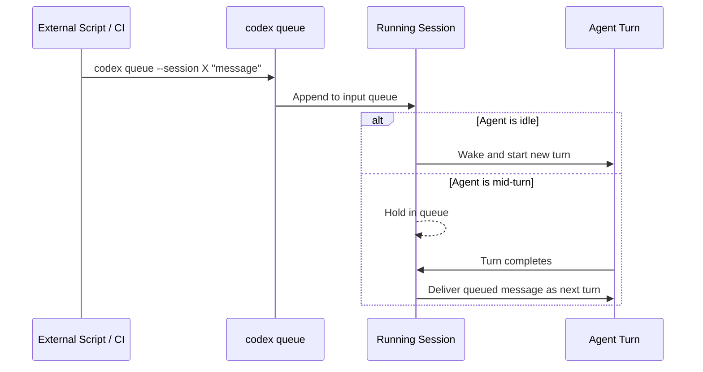
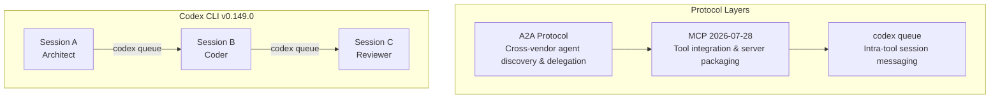

# codex queue and Inter-Session Messaging: What v0.149.0's New Primitive Means for Orchestration and Automation


---

## The Problem codex queue Solves

Before v0.149.0, Codex CLI sessions were islands. You could spawn subagents within a session using multi_agent_v2 [^1], and you could run headless tasks with `codex exec`, but there was no first-class way to send a message from one terminal, script, or CI job into an already-running session. The community workaround was to use the app-server's turn/steer WebSocket API directly — functional, but undocumented for CLI users and awkward to script [^2].

v0.149.0, released on 20 August 2026, ships `codex queue`: a CLI command that delivers a message to an existing local or remote session without interrupting the active turn [^3]. It is a small surface — one command, a handful of flags — but it changes the topology of what you can build.

## How codex queue Works

The basic invocation is straightforward:

```bash
# Send a message to a named session
codex queue --session my-refactor "The migration tests are green. Proceed with the schema change."

# Send from a file
codex queue --session my-refactor --text-file /tmp/ci-report.txt

# Target a remote session over WebSocket
codex queue --session my-refactor --remote wss://workstation.local:4040
```

The message is appended to the session's input queue. If the agent is idle, the queued message wakes it and triggers a new turn. If the agent is mid-turn, the message waits until the current turn completes, then appears as the next user turn [^3].

### Delivery Semantics

v0.149.0 fixes several reliability issues around queued message delivery [^3]:

- **Idle wake**: messages reliably activate sessions that have finished their last turn and are waiting for input.
- **Name collision**: when multiple sessions share a name (e.g. after forking), the queue command targets the most recently active session rather than failing silently.
- **Permission restoration**: resumed or forked sessions now correctly restore their permission profiles before processing queued messages.



## Patterns Unlocked

### 1. CI Failure Triage

The most immediate use case is injecting CI context into a running session. A GitHub Actions step can queue a failure summary directly into a Codex session that is already checked out on the right branch:


```bash
# In .github/workflows/ci.yml
- name: Triage failure
  if: failure()
  run: |
    codex queue --session "fix-${{ github.run_id }}" \
      --text "CI failed. Summary: $(cat test-results.txt | tail -50)"
```


This replaces the pattern of spawning a fresh `codex exec` for every failure, which loses the accumulated context of an ongoing debugging session.

### 2. Coder-Architect Handoff

Two long-lived sessions can collaborate by exchanging messages. An architect session designs a component, then queues the specification to a coder session:

```bash
# Architect session's AGENTS.md instructs it to:
# 1. Write the spec to /tmp/spec.md
# 2. Queue it to the coder session

codex queue --session coder-backend \
  --text-file /tmp/spec.md
```

This is looser coupling than multi_agent_v2 subagents (which share the parent's model and sandbox), and it lets each session run a different model or permission profile [^1].

### 3. Training Pipeline Notification

A long-running ML training job can notify a Codex session when checkpoints are ready, without the session needing to poll:

```bash
# At end of training script
codex queue --session eval-runner \
  "Training complete. Best checkpoint at epoch 47, val_loss 0.0312. \
   Run evaluation suite against /data/checkpoints/epoch-47/"
```

### 4. Scheduled Drip-Feed

Combined with `cron` or Codex Automations, `codex queue` enables drip-feeding context into a persistent session over time — injecting updated metrics, log tails, or deployment status at intervals:

```bash
# Every 5 minutes, send latest error rate
*/5 * * * * codex queue --session monitor \
  "Current error rate: $(curl -s metrics.internal/error-rate)"
```

## How This Relates to Agent-to-Agent Protocols

The broader agent ecosystem is converging on inter-agent communication standards. Google's Agent-to-Agent (A2A) protocol, now governed by the Linux Foundation, provides discovery and delegation between independent agents, with over 50 organisations participating in the AAIF working group as of 2026 [^4]. MCP handles tool-level integration. But `codex queue` operates at a different layer: it is intra-tool, session-to-session messaging within the Codex CLI runtime.



Research on multi-agent communication patterns reinforces the value of this layering. The PACT framework (Protocolized Action-state Communication and Transmission) demonstrates that treating inter-agent communication as a public state-update problem consistently improves the performance-cost trade-off across different multi-agent system topologies [^5]. `codex queue` provides the primitive; the orchestration pattern sits above it.

## Comparison with multi_agent_v2

It is worth understanding where `codex queue` fits relative to the existing multi_agent_v2 subagent system:

| Dimension | multi_agent_v2 | codex queue |
|-----------|---------------|-------------|
| **Coupling** | Tight — subagents share parent session | Loose — sessions are independent |
| **Model** | Subagents inherit parent's model | Each session can use a different model |
| **Sandbox** | Shared sandbox context | Independent sandbox per session |
| **Lifecycle** | Parent controls spawn/close | Sessions are independently managed |
| **Communication** | send_message within session tree | Cross-session, cross-terminal, cross-host |
| **Concurrency** | Up to 6 subagents [^1] | Unlimited independent sessions |
| **Use case** | Structured fan-out within one task | Loose coordination across tasks |

The two are complementary. A complex workflow might use `codex queue` to coordinate three independent sessions (frontend, backend, infrastructure), each of which internally uses multi_agent_v2 to parallelise subtasks.

## The Agents Dashboard

v0.149.0 also ships an interactive agents dashboard (`codex agents`) that provides a searchable interface for managing running sessions — start, stop, rename, and open tasks with configurable keyboard shortcuts [^3]. This is the companion UI for `codex queue`: you can see which sessions are running, what state they are in, and send messages to any of them.

## Security Considerations

`codex queue` inherits the session's existing permission profile. A message queued from outside cannot escalate permissions — if the target session runs in `locked-down` mode, the agent processes the queued message under the same sandbox constraints [^3]. For remote sessions accessed over WebSocket, the connection uses short-lived server tokens rather than long-lived ChatGPT access tokens, a hardening introduced in v0.148.0 [^6].

However, `codex queue` does introduce a new attack surface: any process with access to the local socket or remote WebSocket endpoint can inject arbitrary user turns into a running session. In shared environments, this means AGENTS.md should include explicit instructions about how the agent should handle unexpected or contradictory queued messages — treating them as untrusted input rather than trusted operator commands.

## Practical Setup

### Prerequisites

Update to v0.149.0:

```bash
npm install -g @openai/codex@latest
codex --version  # Should show 0.149.0+
```

### Starting a Named Session

```bash
codex --session-name my-task
```

### Queuing from Another Terminal

```bash
codex queue --session my-task "Add error handling to the payment module"
```

### Combining with codex exec fork

v0.148.0 introduced `codex exec fork` for branching sessions [^6]. Combined with `codex queue`, you can fork a session at a decision point and then send different instructions to each fork:

```bash
# Fork the current session
codex exec fork --session my-task --fork-name variant-a
codex exec fork --session my-task --fork-name variant-b

# Send different approaches to each fork
codex queue --session variant-a "Implement using the adapter pattern"
codex queue --session variant-b "Implement using the strategy pattern"
```

## What's Still Missing

`codex queue` is a fire-and-forget primitive. There is no built-in acknowledgement, no response channel, and no structured message schema. If you need the agent's response, you must arrange for it to write output to a file, push a commit, or call an MCP tool that reports back.

Future iterations might add:

- **Structured message types** — distinguishing instructions from context from queries.
- **Response channels** — allowing the sending process to block until the agent responds.
- **Priority levels** — enabling urgent messages to interrupt an active turn rather than waiting.
- **Message filtering in AGENTS.md** — letting the agent's instruction file specify which queued message patterns to accept or reject.

## Conclusion

`codex queue` is not a revolutionary feature — it is a plumbing primitive. But plumbing primitives are what turn a capable single-agent tool into an orchestration platform. With `codex queue`, `codex exec fork`, named sessions, and the new agents dashboard, Codex CLI v0.149.0 provides enough surface area for scripted multi-session workflows that previously required custom WebSocket clients or third-party orchestrators.

The pattern to watch is how teams combine `codex queue` with AGENTS.md governance. A session's instruction file defines what the agent should do; `codex queue` provides the channel for when external events should trigger it to do something new. The gap — and the opportunity — is in making that channel structured, authenticated, and auditable.

---

## Citations

[^1]: OpenAI, "Codex CLI Multi-Agent Orchestration v2," Codex CLI documentation, 2026. Available: [https://developers.openai.com/codex/cli/features](https://developers.openai.com/codex/cli/features)

[^2]: OpenAI/codex, "Add codex inject to send prompts to existing sessions (automation + orchestration)," GitHub Issue #11415, 2026. Available: [https://github.com/openai/codex/issues/11415](https://github.com/openai/codex/issues/11415)

[^3]: OpenAI, "Codex CLI v0.149.0 Release Notes," GitHub Releases, 20 August 2026. Available: [https://github.com/openai/codex/releases](https://github.com/openai/codex/releases)

[^4]: Google, "Agent-to-Agent (A2A) Protocol," Linux Foundation AAIF Working Group, 2025–2026. Available: [https://www.taskade.com/blog/inter-agent-communication-patterns](https://www.taskade.com/blog/inter-agent-communication-patterns)

[^5]: S. Yang et al., "What Should Agents Say? Action-state Communication for Efficient Multi-Agent Systems," arXiv:2606.05304, June 2026. Available: [https://arxiv.org/abs/2606.05304](https://arxiv.org/abs/2606.05304)

[^6]: OpenAI, "Codex CLI v0.148.0 Release Notes," GitHub Releases, 18 August 2026. Available: [https://github.com/openai/codex/releases](https://github.com/openai/codex/releases)
