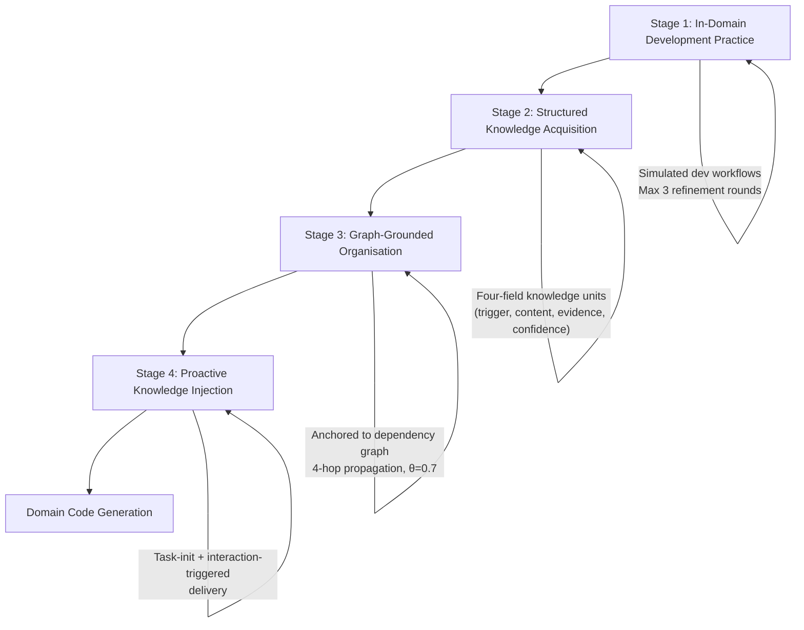
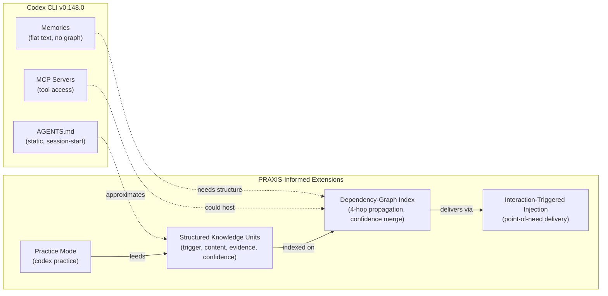

# PRAXIS and Graph-Grounded Tacit Knowledge: Why Your Domain Codebase Defeats General-Purpose Agents — and How to Close the Gap in Codex CLI


---

Your coding agent can fix a Django view or refactor a React component, but hand it a domain-specific codebase — numerical relativity solvers, quantitative trading engines, bespoke RAG pipelines — and performance craters. The culprit is not missing documentation. It is **tacit knowledge**: the business rules, interface contracts, error-handling conventions, and operational patterns that developers internalise through practice but never write down.

Jiang et al.'s PRAXIS framework (arXiv:2608.19784, August 2026) [^1] attacks this problem head-on with a three-stage pipeline that extracts tacit knowledge through simulated development practice, anchors it to code dependency graphs, and injects it proactively at the point of interaction. On KoCo-Bench, PRAXIS lifts Pass@1 from 19.08% (OpenHands baseline) to 32.06% — a 68% relative improvement — with gains concentrated on the hardest domain tasks [^1]. The results raise a pointed question for Codex CLI users: how much of your AGENTS.md and Memories configuration captures the tacit knowledge your agent actually needs?

## The Tacit Knowledge Problem

General-purpose coding agents fail on domain codebases because the knowledge they lack is not in README files or API docs. PRAXIS identifies four categories of tacit knowledge from a human evaluation of 75 sampled knowledge units [^1]:

| Category | Share | Example |
|---|---|---|
| Business rules | 34.7% | "Reward shaping functions must be normalised to [0,1] before passing to the replay buffer" |
| API usage patterns | 24.0% | "Always call `env.reset()` with `seed=` kwarg before episode collection" |
| Interface contracts | 22.7% | "The `forward()` method expects batched tensors with shape (B, C, H, W), never single samples" |
| Error-handling conventions | 14.7% | "Catch `ConnectionPoolExhausted` and retry with exponential backoff capped at 30s" |
| Stylistic preferences | 4.0% | "Use `logger.debug` for iteration counts, never `print`" |

These are precisely the patterns that cause silent failures rather than loud crashes. The agent produces syntactically valid code that passes linting but violates domain invariants — because nobody documented the invariants.

## How PRAXIS Works

The framework operates in four stages, each addressing a different aspect of the knowledge gap:



### Stage 1: Simulated Development Practice

Rather than mining static codebases, PRAXIS makes the agent *practise* — it generates functions, runs tests, and refines through up to three rounds per task [^1]. This mirrors how human developers build tacit knowledge: not by reading, but by doing and failing.

### Stage 2: Structured Knowledge Acquisition

From practice trajectories, PRAXIS extracts **knowledge units** — four-field tuples:

```toml
# Example PRAXIS knowledge unit (conceptual representation)
[knowledge_unit]
trigger = "Implementing reward function for PPO agent"
content = "Reward values must be clipped to [-10, 10] and normalised before buffer insertion"
evidence = "src/rl/reward.py::compute_reward, diff from practice round 2"
confidence = 0.85
```

Each unit captures *when* it applies (trigger), *what* the constraint is (content), *where* the evidence lives (evidence), and *how reliable* the extraction is (confidence ∈ [0,1]) [^1].

### Stage 3: Dependency-Graph Organisation

Knowledge units are anchored to their source code entities on a dependency graph, then **propagated bidirectionally** along call and data dependencies — up to 4 hops [^1]. When multiple units converge on the same entity, their confidences merge:

```
confidence(k_merged) = 1 − ∏(1 − confidence(k_i))
```

This ensures that a convention validated by multiple independent practice runs gains higher confidence than one observed once. A confidence threshold of θ = 0.7 gates injection — below that, the knowledge is stored but not surfaced [^1].

### Stage 4: Proactive Injection

At code-generation time, relevant knowledge units are surfaced through two triggers: **task initialisation** (when the agent first reads the task description) and **interaction-triggered** (when the agent touches a code entity with anchored knowledge) [^1]. This is the critical design choice — the agent receives domain constraints at the *point of need*, not as an upfront context dump.

## The Numbers

PRAXIS was evaluated on KoCo-Bench (25 real-world projects across 11 frameworks) and AInsteinBench (6 production scientific codebases across 5 disciplines) [^1]:

| Benchmark | PRAXIS | Best Baseline | Gain |
|---|---|---|---|
| KoCo-Bench Pass@1 | 32.06% | 19.08% (OpenHands) | +68% relative |
| KoCo-Bench AvgPassRatio | 56.01% | — | — |
| AInsteinBench (Hard) | +7.5pp | — | over baseline |
| AInsteinBench (Medium) | +4.1pp | — | over baseline |

The ablation study reveals which components matter most [^1]:

| Component Removed | Pass@1 Drop |
|---|---|
| Development practice (Stage 1) | −4.58pp |
| Proactive injection (Stage 4) | −3.82pp |
| Graph organisation (Stage 3) | −3.81pp |
| Procedural memory (Stage 2) | −3.05pp |

Every component contributes, but practice-based extraction and graph-grounded injection contribute most. Removing the practice stage and relying on static analysis alone costs the largest single drop [^1].

Human evaluators rated knowledge unit quality at 4.28/5 for content truthfulness, 4.24/5 for trigger accuracy, and 3.62/5 for evidence traceability (Spearman ρ = 0.75 between confidence scores and human quality judgements, p < 0.001) [^1]. Eighty-two per cent of sampled task trajectories actively used injected knowledge [^1].

## Mapping to Codex CLI

PRAXIS exposes three gaps in how Codex CLI v0.148.0 [^2] handles domain knowledge — and suggests practical mitigations within the current feature set.

### Gap 1: AGENTS.md Is Static, Not Practised

AGENTS.md provides project conventions as static markdown, read once at session start [^3]. It captures *declared* knowledge — what the team chooses to write down. PRAXIS shows that the most valuable domain knowledge (business rules at 34.7%) is precisely what teams *do not* write down.

**Practical mitigation:** After each Codex CLI session on a domain codebase, review the rollout for patterns the agent got wrong. Add them to AGENTS.md with explicit trigger conditions:

```markdown
## Domain Constraints: Reward Functions

When modifying any file in `src/rl/`:
- Reward values MUST be clipped to [-10, 10] before buffer insertion
- Always normalise rewards using `utils.normalise_reward()`, never inline division
- The replay buffer expects `(state, action, reward, next_state, done)` tuples — never omit `done`
```

This approximates PRAXIS's trigger-content structure within AGENTS.md's static format.

### Gap 2: Memories Are Flat, Not Graph-Structured

Codex CLI's Memories system captures durable insights between sessions [^4], but stores them as flat text in `MEMORY.md`. There is no dependency-graph organisation, no confidence scoring, and no propagation along code relationships. A memory about `reward.py` conventions has no mechanism to propagate to `buffer.py`, which calls it.

**Practical mitigation:** Structure Memories entries with explicit dependency references:

```markdown
## Memory: RL Reward Pipeline

**Applies to:** src/rl/reward.py, src/rl/buffer.py, src/rl/trainer.py
**Confidence:** High (validated across 5 sessions)
**Rule:** Reward clipping must happen in reward.py before buffer insertion.
Buffer.add() asserts reward ∈ [-10, 10] — violations cause silent NaN propagation in trainer.
```

### Gap 3: No Practice-Based Knowledge Extraction

PRAXIS's most distinctive contribution is that the agent *practises* on the codebase before working on real tasks. Codex CLI has no equivalent. There is no mechanism to run exploratory sessions that feed back into the knowledge layer.

**Practical mitigation:** Use `codex exec` with a practice prompt before real work:

```bash
# Practice session: explore the RL codebase
codex exec --sandbox workspace-read \
  "Explore src/rl/. For each module, identify: (1) the expected input/output contracts, \
   (2) any assertion guards or validation checks, (3) common patterns across modules. \
   Write findings to PRACTICE_NOTES.md"

# Then incorporate findings into AGENTS.md or Memories
```

This is manual and does not feed back automatically, but it captures the practice-then-extract cycle that drives PRAXIS's strongest ablation signal (−4.58pp when removed) [^1].

### Complementary Work: SkillForge

SkillForge (Chen et al., arXiv:2608.18933, August 2026) [^5] approaches a related problem — self-distilling project-specific knowledge for issue resolution — through proactive test-driven issue synthesis and dual-level entity-grounded skill distillation. Where PRAXIS extracts *constraints and conventions*, SkillForge extracts *diagnostic and intervention skills*. The two are complementary: PRAXIS prevents the agent from violating domain invariants; SkillForge helps it diagnose and fix domain-specific failures.

Both expose the same gap in Codex CLI: the Memories system is a single flat layer that conflates constraints, conventions, diagnostic patterns, and intervention recipes without structural differentiation [^4].

## What Codex CLI Would Need

For PRAXIS-style capabilities to work natively in Codex CLI, the following would be required:

1. **Structured knowledge units** — a schema beyond flat markdown, with trigger conditions, content, evidence references, and confidence scores
2. **Dependency-graph indexing** — anchoring knowledge to code entities and propagating along call/data dependencies, likely via an MCP server exposing a language-server-backed dependency graph
3. **Practice mode** — a `codex practice` command that runs exploratory sessions on a codebase and feeds extracted knowledge back into the Memories layer
4. **Confidence decay** — PRAXIS uses an update factor β = 0.8 for online evolution [^1]; Codex CLI Memories have no confidence or staleness mechanism
5. **Interaction-triggered injection** — surfacing knowledge when the agent touches a relevant code entity, not just at session start



## Practical Takeaway

If you are using Codex CLI on domain-specific codebases — anything beyond generic web development — you are almost certainly leaving performance on the table by relying on generic AGENTS.md directives. PRAXIS demonstrates a 68% relative improvement from structured tacit knowledge [^1], and its ablation shows that every stage of the pipeline contributes meaningfully.

The immediate action is to treat AGENTS.md not as a coding-standards document, but as a **tacit-knowledge repository**: business rules with trigger conditions, interface contracts with evidence, error-handling conventions with confidence levels. Structure entries as trigger-content pairs. Reference specific code entities. Update after every session where the agent misunderstood a domain convention.

The longer-term aspiration is a dependency-graph-aware knowledge layer that propagates constraints along code relationships and surfaces them at the point of interaction — not as an upfront context dump that wastes tokens and gets compacted away.

---

## Citations

[^1]: Jiang, X., Zhang, T., Wu, L., Wang, Z., Li, G., Sui, Y., Zhu, H., Jiao, W., Jin, Z. & Dong, Y. (2026). "PRAXIS: Graph-Grounded Tacit Knowledge for Domain Code Generation." arXiv:2608.19784. [https://arxiv.org/abs/2608.19784](https://arxiv.org/abs/2608.19784)

[^2]: OpenAI. (2026). "Codex CLI v0.148.0 Release Notes." GitHub Releases. [https://github.com/openai/codex/releases](https://github.com/openai/codex/releases)

[^3]: OpenAI. (2026). "AGENTS.md — Project-Level Agent Instructions." Codex CLI Documentation. [https://openai.com/codex/docs/agents-md](https://openai.com/codex/docs/agents-md)

[^4]: OpenAI. (2026). "Codex CLI Built-In Memory System." Codex CLI Documentation. [https://developers.openai.com/codex/memory](https://developers.openai.com/codex/memory)

[^5]: Chen, Y. et al. (2026). "SkillForge: Self-Distilling Agents for Project-Specific Issue Resolution." arXiv:2608.18933. [https://arxiv.org/abs/2608.18933](https://arxiv.org/abs/2608.18933)
