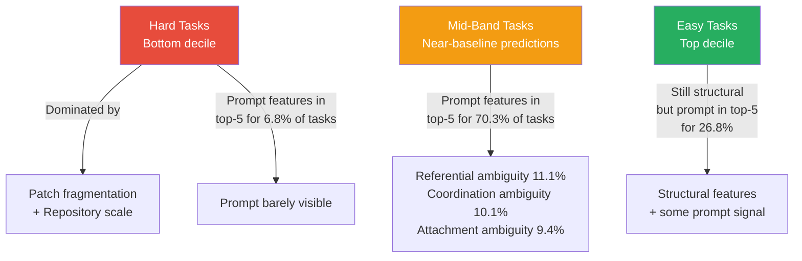

# What Makes Issue Resolution Difficult for Agents? Patch Fragmentation, Repository Scale, and What It Means for Your Codex CLI Workflow


---

Coding agents are getting better at resolving issues — but they are not getting better at all issues equally. A paper accepted at ESEM 2026 by Al-Haque and Johnson[^1] provides the first rigorous measurement framework for *what structural properties of a software task predict whether an agent will succeed or fail*. The answer, drawn from 258,000 trajectories across 51,000 tasks, is that difficulty is overwhelmingly encoded in two features: **patch fragmentation** and **repository scale**. Prompt clarity barely registers.

This article unpacks the findings, maps them to Codex CLI v0.148.0 workflows, and suggests concrete practices for routing tasks to agents more effectively.

## The Core Question

Benchmark scores for coding agents keep climbing — SWE-bench Verified pass rates now routinely exceed 60% for frontier models[^2] — yet practitioners still find agents unreliable on many real-world tickets. The problem is that aggregate scores hide enormous variance. An agent that aces compact, single-hunk patches in shallow repositories may collapse on multi-file changes in deep monorepos.

Al-Haque and Johnson formalise this intuition. They extract 54 static features from each task's patch, repository structure, and issue prompt, then train gradient-boosted ensemble classifiers to predict binary success (`any_success`) and continuous pass rate. The headline result: **AUC = 0.863** for predicting whether an agent will resolve a task, using features available *before the agent starts work*[^1].

## The Dataset: CoderForge-Preview

The study uses CoderForge-Preview, released by Together AI as the largest open dataset of coding agent trajectories[^3]. Key numbers:

| Metric | Value |
|--------|-------|
| Total trajectories | 258,134 |
| Unique tasks | 51,000+ |
| Repositories | 1,655 |
| Mean trajectories per task | 4.8 |
| Agent scaffold | OpenHands v0.52.1 |
| Model | Qwen3-Coder-480B |

The dataset draws from SWE-Smith (37,221 tasks) and SWE-Rebench (9,764 tasks). Outcome distribution reveals a bimodal landscape: 49.8% of tasks always pass, 32.5% always fail, and 17.7% show mixed outcomes across trajectories[^1].

## What Drives Difficulty

The top three SHAP features account for 29% of total attribution across all 54 features. Every one of them is structural, not linguistic:

| Rank | Feature | Mean \|SHAP\| | Direction |
|------|---------|---------------|-----------|
| 1 | `patch_lines_deleted` | 0.406 | More deletions → harder |
| 2 | `patch_num_hunks` | ~0.15 | More hunks → harder |
| 3 | `patch_hunk_gap_mean` | ~0.15 | Wider gaps → harder |
| 4 | `repo_top_level_dir_count` | 0.153 | Broader root → harder |

Patch and repository features together yield AUC = 0.861. Adding all 27 prompt features gains a negligible Δ AUC ≤ 0.002[^1]. In practical terms: **how you phrase the issue barely matters compared to how fragmented the fix is and how large the repository is.**

### The Three Difficulty Bands

The paper identifies a layered structure where different feature categories dominate at different difficulty levels:



For hard tasks, the fix is structurally complex and no amount of prompt clarity helps. For mid-band tasks — the tipping-point zone where agents might succeed or fail — prompt quality becomes a meaningful differentiator[^1].

## Mapping to Codex CLI Workflows

These findings have direct implications for how you structure Codex CLI work.

### 1. Pre-Hoc Difficulty Estimation Before `codex exec`

The paper's features are entirely deterministic — computable from `git diff --stat`, repository directory listings, and basic text metrics. You can estimate difficulty *before* committing to an agent run.

A practical PreToolUse hook could extract patch statistics from a proposed change:

```bash
#!/usr/bin/env bash
# hooks/pre-difficulty-check.sh
# Estimate difficulty of the current staged changes

HUNKS=$(git diff --cached --stat | grep -c 'files changed' || echo 0)
FILES_CHANGED=$(git diff --cached --numstat | wc -l)
LINES_DELETED=$(git diff --cached --numstat | awk '{sum+=$2} END{print sum+0}')
TOP_DIRS=$(find . -maxdepth 1 -type d | wc -l)

if [ "$HUNKS" -gt 8 ] && [ "$TOP_DIRS" -gt 15 ]; then
    echo "⚠️ High difficulty estimate: $HUNKS hunks across $FILES_CHANGED files in a $TOP_DIRS-directory repo"
    echo "Consider decomposing into smaller tasks"
    exit 2  # Signal to Codex CLI PostToolUse
fi
```

### 2. Task Decomposition by Fragmentation

The strongest difficulty signal is patch fragmentation — the number of hunks, the gap between them, and the number of files touched. This maps directly to a Codex CLI best practice: **decompose multi-file changes into sequential single-concern tasks**.

Rather than:

```bash
codex exec "Refactor the authentication module, update the API routes, and fix the database migration"
```

Break it into focused runs:

```bash
codex exec "Refactor the authentication module in src/auth/"
codex exec "Update API routes in src/routes/ to use the new auth interface"
codex exec "Fix the database migration in migrations/"
```

Each run produces a lower-fragmentation patch, shifting the task from the hard band into the mid or easy band where agents reliably succeed.

### 3. Repository Scale Mitigation with AGENTS.md

Repository scale — file count, directory depth, top-level breadth — is the second strongest predictor of failure. You cannot shrink your repository, but you can constrain the agent's view of it.

In `AGENTS.md`:

```markdown
## Repository Navigation

This is a monorepo with 2,400+ files. For authentication tasks:
- Source: `src/auth/` and `src/middleware/auth/`
- Tests: `tests/unit/auth/` and `tests/integration/auth/`
- Config: `config/auth.toml`
- Ignore: `src/billing/`, `src/analytics/`, `legacy/`

Do not navigate outside these directories unless the error trace explicitly references another path.
```

This effectively reduces the repository scale features that drive difficulty, without altering the codebase itself.

### 4. Prompt Engineering — When It Actually Matters

The mid-band finding is the most actionable for practitioners. For tasks where the structural difficulty is moderate — say 3–6 hunks across 2–4 files in a medium-sized repository — prompt quality becomes a genuine differentiator. The paper identifies three specific linguistic features that matter:

- **Referential ambiguity**: pronouns with unclear antecedents ("it should handle the case where it fails" — which "it"?)
- **Coordination ambiguity**: conjunctions that create parse ambiguity ("update the handler and validator response format" — one format or two?)
- **Attachment ambiguity**: prepositional phrases that could attach to multiple heads ("fix the error in the parser for JSON inputs" — error in the parser, or parser for JSON?)

For mid-difficulty tasks, replace ambiguous prompts with explicit ones:

```bash
# Ambiguous — three sources of referential ambiguity
codex exec "Fix the validation error when it processes the input and returns it"

# Explicit — zero referential ambiguity
codex exec "Fix the JSON schema validation error in src/validators/order.ts \
  where OrderValidator.validate() throws on nested array inputs \
  and should instead return a ValidationResult with field-level errors"
```

### 5. Model Reasoning Effort Calibration

The difficulty prediction framework naturally maps to Codex CLI's `model_reasoning_effort` setting. Hard tasks (high fragmentation, large repo) benefit from `high` or `xhigh` reasoning effort, whilst easy tasks waste tokens at those levels:

```toml
# config.toml — profile for structurally complex tasks
[profile.complex]
model = "o3"
model_reasoning_effort = "high"

# profile for simple, single-hunk fixes
[profile.simple]
model = "o4-mini"
model_reasoning_effort = "medium"
```

## Limitations Worth Noting

The study has constraints that practitioners should weigh:

1. **Single agent**: All trajectories use Qwen3-Coder-480B on OpenHands v0.52.1. Difficulty profiles may differ for other model-scaffold combinations — the jagged frontier applies here too[^4].

2. **Bug-fix skew**: CoderForge-Preview over-represents bug fixes relative to feature implementation, refactoring, or design tasks[^3]. The features may not transfer cleanly to greenfield work.

3. **Ground-truth leakage**: Patch features require knowing the correct patch, which is unavailable at inference time. The authors acknowledge this and position the framework for benchmark construction and post-hoc analysis rather than live routing[^1].

4. **No multi-agent comparison**: The paper explicitly flags the absence of per-agent difficulty profiles as future work. ⚠️ It remains unverified whether the same features predict difficulty for GPT-5.6-Terra, Claude Opus, or Codex CLI's default models.

## The Practical Takeaway

Task difficulty is not random. It is encoded in the structure of the change and the scale of the repository. The implication for Codex CLI practitioners is straightforward:

- **Decompose** multi-file, multi-hunk changes into focused single-concern tasks
- **Constrain** repository navigation via AGENTS.md to reduce effective scale
- **Invest** in prompt clarity only for mid-difficulty tasks where it moves the needle
- **Calibrate** reasoning effort to structural complexity rather than gut feel
- **Measure** your own task outcomes against these features to build project-specific difficulty profiles

The shift is from asking "how good is this agent?" to asking "how good is this agent *on tasks shaped like this one?*"[^1]

## Citations

[^1]: Al-Haque, E. and Johnson, B. (2026) 'What Makes Software Issue Resolution Tasks Difficult for Agents?', *ESEM 2026*. arXiv:2608.18280. Available at: [https://arxiv.org/abs/2608.18280](https://arxiv.org/abs/2608.18280)

[^2]: Together AI (2026) 'CoderForge-Preview: SOTA open dataset for training efficient coding agents'. Available at: [https://www.together.ai/blog/coderforge-preview](https://www.together.ai/blog/coderforge-preview) — Reports Qwen-3 32B fine-tuned on CoderForge-Preview achieving 59.4% on SWE-bench Verified.

[^3]: Together AI (2026) 'CoderForge-Preview Dataset', *Hugging Face*. Available at: [https://huggingface.co/datasets/togethercomputer/CoderForge-Preview](https://huggingface.co/datasets/togethercomputer/CoderForge-Preview) — 258K trajectories, 51K tasks, 1,655 repositories.

[^4]: Mahmud, S. et al. (2026) 'A Jagged Frontier: Evaluating Robustness of Code Agents to Semantics-Preserving Transformations', arXiv:2608.18389. Available at: [https://arxiv.org/abs/2608.18389](https://arxiv.org/abs/2608.18389) — Demonstrates that difficulty profiles differ dramatically across scaffold-model combinations.

[^5]: OpenAI (2026) 'Codex CLI v0.148.0 Release Notes'. Available at: [https://github.com/openai/codex/releases/tag/rust-v0.148.0](https://github.com/openai/codex/releases/tag/rust-v0.148.0)
