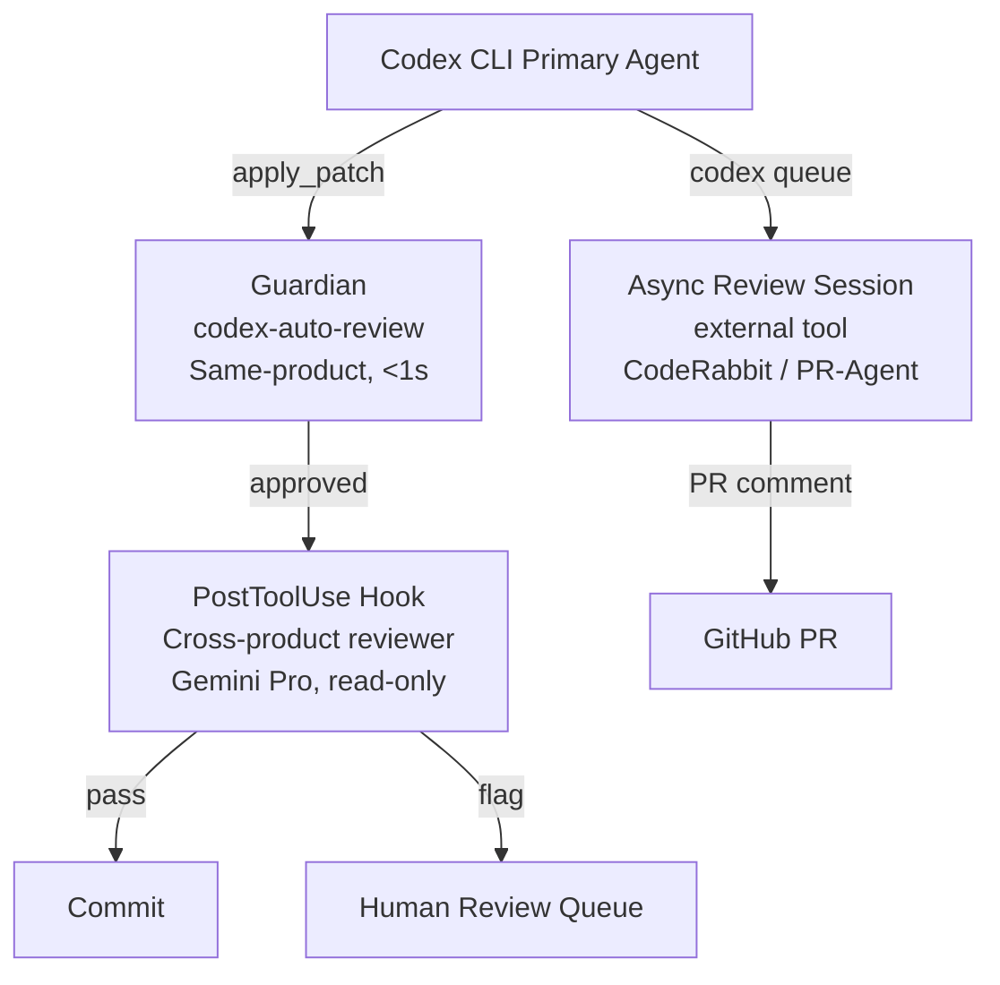

# AI Reviews AI: What 248,641 GitHub PRs Reveal About Cross-Product Review Bias — and How to Configure Codex CLI for Independent Coverage


---

A new empirical study by Selvanayagam and Ghaleb (arXiv:2608.21311) is the first large-scale measurement of AI agents reviewing other AI agents' pull requests on GitHub.[^1] Drawing on the CodAGE dataset — 2,830,284 agent-authored PRs collected between January 2024 and April 2026 — the paper quantifies a phenomenon that has grown from a curiosity to an everyday reality: one AI tool writing code while a different AI tool reviews it.

The numbers force a rethink of how you configure your Codex CLI review pipeline.

---

## The Dataset

CodAGE identifies agent-authored PRs through a combination of body signatures (conventional phrases such as "This PR was created by Codex") and bot-account logins, then quarantines any PR whose attribution relies solely on a matching branch name (38% of provisional candidates).[^1] The retained corpus is 2.83 million PRs across 10,345 repositories.

Of those, **248,641 PRs (8.8%) received at least one AI review**.[^1] The authors partition these into:

- **Cross-product reviews** — 45,269 PRs (1.6%): a PR authored by one AI product is reviewed by a different AI product.
- **Same-product reviews** — 208,145 PRs: the reviewing agent belongs to the same product family as the authoring agent.

Authoring agents tracked include OpenAI Codex, GitHub Copilot, Claude Code, Cursor, Devin, Google Jules, Amazon Q, Sweep AI, and Gemini Code Assist. On the reviewer side: CodeRabbit, Copilot, Gemini Code Assist, OpenAI Codex, Amazon Q, Devin, Claude Code, PR-Agent, Kiro, Cursor, and Aider.[^1]

---

## Growth: Two Orders of Magnitude in 18 Months

Cross-product AI review is no longer a curiosity. The temporal data tells a stark story:

```mermaid
xychart-beta
    title "Quarterly AI Review Volume (PR count)"
    x-axis ["2025-Q1", "2025-Q2", "2025-Q3"]
    y-axis "PR count" 0 --> 85000
    bar [57, 4200, 25492]
    bar [40, 18000, 57080]
```



Cross-product reviews grew from 57 PRs in 2025-Q1 to 25,492 in 2025-Q3 — a **greater than 400× increase** in six months.[^1] Same-product volume grew proportionately but from a higher base (40 → 57,080 PRs in the same period).

OpenAI Codex accounts for **69.8% of all cross-product authorship** (31,601 of 45,269 PRs), reflecting its dominant deployment volume; GitHub Copilot is the dominant reviewer at 44.5% of cross-product author-reviewer pairs.[^1] Claude Code and Cursor, lacking built-in PR-review features, show near-zero same-product review rates (0.5% and 0.0% respectively) — they depend entirely on third-party tools like CodeRabbit when reviews occur.

---

## Same-Product Bias: Reviewers Favour Their Own Code

The most operationally significant finding is that AI reviewers leave **significantly more comments when reviewing PRs from the same product family**:

| Reviewer | Cross-product mean comments | Same-product mean comments | Increase |
|---|---|---|---|
| Copilot | 1.49 | 2.35 | **+58%** |
| Devin | 1.09 | 1.80 | **+65%** |
| Amazon Q | 4.94 | 8.08 | **+64%** |

All differences are statistically significant (p < 10⁻⁶; Cliff's δ 0.14–0.27).[^1] The obvious interpretation: same-product reviewers have stronger contextual affinity with code generated by their sibling authoring agent. The less comfortable interpretation: a same-product reviewer may share the same blind spots — it may reproduce rather than catch the authoring agent's characteristic failure modes. Either way, a reviewer that generates 60% fewer comments on outside code warrants scrutiny before you trust it as an independent gate.

---

## Review Category Divergence: Claude Code Gets More Refactoring Feedback

CodeRabbit categorises its review comments into substantive labels: *Potential Issue*, *Refactor*, *Nitpick*, *Verification*, and *Analysis Chain*. The distribution varies sharply by authoring agent:[^1]

| Author | Potential Issue | Refactor | Nitpick |
|---|---|---|---|
| OpenAI Codex | 29.9% | 29.2% | 20.5% |
| Claude Code | 42.0% | **35.0%** | 7.8% |
| Cursor | 34.9% | 33.5% | 19.8% |
| Copilot | 49.0% | **10.5%** | 12.9% |
| Devin | 43.9% | 9.7% | 11.6% |

CodeRabbit labels **35.0% of comments on Claude Code PRs as refactoring suggestions versus 10.5% on Copilot PRs** — a 24.5 percentage-point gap (95% CI [23.1, 25.9]; χ² = 3177.5, p < 10⁻³⁰⁰; Cramér's V = 0.150).[^1]

The paper does not resolve whether this reflects genuine quality differences, stylistic differences in the code each tool produces, or bias in CodeRabbit's category heuristics. For practitioners, the pragmatic implication is clear: **the reviewer tool you choose shapes which categories of feedback appear in your PRs**, independent of actual code quality.

---

## Review Latency: Gemini is Fastest, Copilot is Slowest

Median time from PR creation to first AI review comment (among PRs with complete timestamps):

- **Cross-product pairs**: 1.2 min (IQR: 0.4–4.4)
- **Same-product pairs**: 4.7 min (IQR: 2.4–38.2)

By reviewer bot (pooled):

| Reviewer | Median latency |
|---|---|
| Gemini Code Assist | 0.5 min |
| Amazon Q | 1.2 min |
| OpenAI Codex | 2.6 min |
| CodeRabbit | 7.0 min |
| Copilot | 17.7 min |

Cross-product reviews are structurally faster because they are all triggered by webhooks to external services, while many same-product reviews are generated within an integrated pipeline that has queuing overhead.[^1]

---

## What This Means for Your Codex CLI Review Pipeline

### The Guardian Single-Reviewer Problem

Codex CLI's Guardian runs `codex-auto-review` as the approval model for eligible tool-call requests.[^2] This is a *same-product* review by design — the Guardian shares the same model family as the primary Codex agent. The CodAGE data suggests this configuration generates systematically fewer review comments than a cross-product alternative would, and may share blind spots with the primary agent.

This is not an argument against Guardian — its sub-second decision latency and deep tool-call context remain compelling. It is an argument for **supplementing** Guardian with a cross-product review layer for commits and PRs.

### Configuring Cross-Product Review with multi_agent_v2

Codex CLI's `multi_agent_v2` orchestration lets you spawn a reviewer subagent with an explicitly different model.[^3] Use a `PostToolUse` hook on `apply_patch` events to invoke a reviewer subagent:

```json
{
  "hooks": [
    {
      "event": "PostToolUse",
      "matcher": "apply_patch",
      "handler": {
        "type": "command",
        "command": "codex exec --profile reviewer_profile -- 'Review the patch in $CODEX_TOOL_OUTPUT for refactoring opportunities and potential issues. Output JSON: {\"verdict\": \"pass|flag\", \"findings\": []}'"
      }
    }
  ]
}
```

Define `reviewer_profile` in `config.toml` with a different provider to maximise cross-product divergence:[^3]

```toml
[profile.reviewer_profile]
model = "gemini-2.5-pro"
provider = "google"
model_reasoning_effort = "medium"
approval_policy = "never"          # reviewer never executes tools

[profile.reviewer_profile.sandbox]
network = "off"
```

With network off and approval_policy = "never", the reviewer subagent is read-only and cannot take any side-effecting actions — it can only produce text output that your hook reads and acts on.

### Routing PR Review by Author

The paper's author-reviewer crosstab shows that CodeRabbit gives the most *Potential Issue* comments on Copilot PRs (49.0%), but the most *Refactor* comments on Claude Code PRs (35.0%). If your Codex CLI agent is the PR author, bias your external review tool towards one that emphasises *Potential Issue* classification — CodeRabbit on Copilot PRs is a counter-example showing this is achievable at scale.

Document your review routing policy in AGENTS.md so the model understands the intent:

```markdown
## Review Policy
All apply_patch operations trigger a PostToolUse review hook using the
`reviewer_profile` (Gemini Pro, network-off). If the reviewer subagent
returns `{"verdict": "flag"}`, the session pauses and awaits human input.
Guardian handles per-tool-call approval; the reviewer hook handles commit-level review.
```

### Using codex queue to Notify an Async Reviewer

For longer review cycles (the paper shows CodeRabbit's P75 latency is 31.6 minutes), `codex queue` lets you fire-and-forget a notification to a review session and continue work:[^4]

```bash
codex queue --session review-agent "New patch ready: $(git rev-parse --short HEAD). Run /review."
```

The review session wakes on receipt and processes the review without blocking the primary coding session.

---

## Architectural Summary



Guardian provides low-latency per-action approval. The cross-product reviewer subagent provides commit-level review with independent model perspective. An async external reviewer (CodeRabbit, PR-Agent) provides PR-level coverage after push.

---

## Limitations and Open Questions

The CodAGE corpus spans up to April 2026, predating Codex CLI v0.148.0's async hook system and the `codex mcp-server` deprecation in v0.149.1.[^3] Same-product rates for Codex CLI may have shifted as more teams adopt the app server's `thread/fork` and `codex queue` primitives for reviewer orchestration.

The paper also does not control for repository characteristics — high-traffic repositories may attract disproportionate CodeRabbit coverage regardless of authoring agent, inflating the cross-product numbers.[^1]

The category divergence finding (35% refactor on Claude Code vs 10.5% on Copilot) requires caution: ⚠️ it is unknown whether CodeRabbit's category labels accurately reflect genuine code properties or reflect systematic training biases in the reviewer model itself.

---

## Citations

[^1]: Selvanayagam, N. and Ghaleb, T. A. (2026). *AI-to-AI Code Reviews of GitHub Pull Requests*. arXiv:2608.21311. <https://arxiv.org/abs/2608.21311>

[^2]: OpenAI. *Purpose-Built Agent Models: What codex-auto-review Tells Us About the Future of Specialised AI*. Codex Knowledge Base. <https://codex.danielvaughan.com/2026/04/17/purpose-built-agent-models-codex-auto-review/>

[^3]: OpenAI. *Codex CLI Releases — rust-v0.149.1, rust-v0.148.0*. GitHub. <https://github.com/openai/codex/releases>

[^4]: OpenAI. *codex queue and Inter-Session Messaging*. Codex CLI v0.149.0 Release Notes. <https://releasebot.io/updates/openai/codex>
