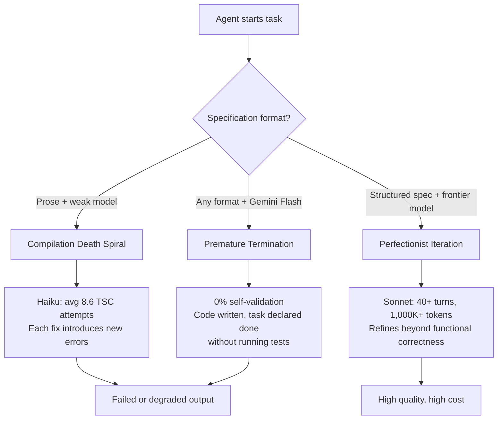
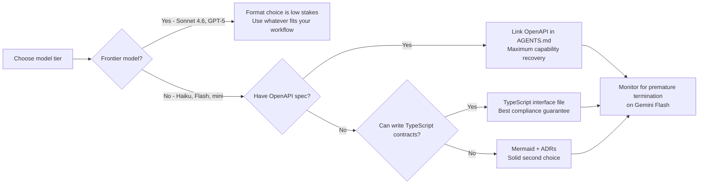

# Architecture as Capability Equalizer: How Specification Format Transforms Coding Agent Performance — and What It Means for Codex CLI


Most engineering decisions around coding agents focus on model choice: which frontier model, which tier, which reasoning effort level. A controlled experiment published on 22 August 2026 shifts that framing. Arquimedes Canedo's "Architecture as Capability Equalizer for Coding Agents" (arXiv:2608.21747)[^1] demonstrates that the *format* of the specification you hand the agent — not just the model — can triple API coverage on weaker models, collapse a 2.42-point quality gap, and determine whether your agent completes a task at all. For Codex CLI operators choosing AGENTS.md strategies, specification file formats, and model profiles, the implications are immediate and concrete.

## The Experiment

Canedo ran 90 multi-turn trials (5 formats × 6 models × 3 trials each) against a Task Management API with seven components and 25 HTTP routes.[^1] The six models spanned three vendor families:

- **Anthropic:** Claude Sonnet 4.6, Haiku 4.5
- **OpenAI:** GPT-5, GPT-5-mini
- **Google:** Gemini 2.5 Pro, Gemini 2.5 Flash

The five specification formats were *informationally equivalent* — the same requirements expressed differently:

1. **Informal prose** — natural-language description of the API
2. **Mermaid diagrams + constraints + ADRs** — visual architecture with decision records
3. **OpenAPI 3.1** — machine-readable HTTP contract
4. **C4/Structurizr DSL** — structured architecture model
5. **TypeScript interface contracts + ArchUnit-style rules** — code-proximate type system

A key methodological point: no information advantage existed between formats. Every format described the same 25 routes and seven components. Differences in output quality are attributable entirely to format, not content.

## The Core Finding: Format × Model Interaction

The headline result is a strong format × model interaction.[^1] On frontier models, format barely matters. On weaker models, it determines success or failure.

| Model tier | Quality spread across formats |
|---|---|
| Sonnet 4.6 | 0.17 points |
| GPT-5 | 0.92 points |
| Haiku 4.5 | 1.67 points |
| GPT-5-mini | 1.84 points |
| Gemini 2.5 Pro | 2.42 points |
| Gemini 2.5 Flash | 2.41 points |

Gemini 2.5 Pro showed the largest format sensitivity at 2.42 points — a swing equivalent to selecting a different model tier.[^1] Conversely, the format you choose for Sonnet 4.6 is nearly irrelevant to quality outcome.

The equalising effect is most visible in API route completeness. With informal prose, Gemini Flash covered only 33% of the 25 required routes. With TypeScript interface contracts, coverage rose to 100% — a tripling from format alone, without changing the model.[^1]

## Code-Proximate Formats Win for Weaker Models

The paper organises the five formats along an axis from human-oriented to code-proximate. OpenAPI and TypeScript contracts sit at the code-proximate end, closest to what the model has seen in training and nearest to the output it must produce. These two formats drove the largest capability recovery for weaker models.[^1]

Haiku 4.5 score breakdown illustrates the gradient:

```
Prose:               5.58
Mermaid + ADRs:      6.42
C4/Structurizr:      6.42
TypeScript contracts: 7.08
OpenAPI:             7.25  ← best for Haiku
```

For Gemini Flash, TypeScript contracts also achieved 100% compliance across all six models from all three vendor families — the only format to do so.[^1]

## Three Failure Modes

Trajectory analysis identified three distinct failure modes, each interacting differently with specification format.[^1]



**Compilation Death Spiral** — Weaker models enter extended fix loops where each correction introduces new errors. Haiku averaged 8.6 TypeScript compiler attempts versus Sonnet's 5.1. Structured formats (OpenAPI, TypeScript contracts) reduced rewrite rates: Gemini Flash dropped from 33% file rewrites with prose to 13% with OpenAPI.[^1]

**Premature Termination** — Gemini Flash wrote code and stopped without executing a single demo run across all trials (0% self-validation rate). Format did not cure this failure mode; it reflects a capability ceiling rather than a specification gap.[^1] Self-validation rates by model confirm the monotonic decline: Sonnet 100%, Haiku 80%, GPT-5 53%, GPT-5-mini 40%, Gemini Pro 20%, Gemini Flash 0%.

**Perfectionist Iteration** — Frontier models with structured specifications sometimes refined beyond functional correctness. Sonnet with Mermaid+constraints occasionally consumed over 40 turns and 1,000K+ tokens.[^1] This is a cost risk, not a quality risk, but it argues for token budgets in production pipelines.

## Inverted Cost Efficiency

The paper surfaces a counterintuitive cost result worth noting for Codex CLI deployments with cost tracking enabled.[^1]

| Model | Tokens (K) | Quality score | Efficiency (score/100K tokens) |
|---|---|---|---|
| Sonnet 4.6 | 640 | 8.42 | 1.32 |
| Haiku 4.5 | 735 | 6.50 | 0.88 |
| GPT-5-mini | 225 | 6.72 | 2.99 |
| Gemini Flash | 223 | 6.35 | 2.85 |

Haiku consumed *more* tokens than Sonnet while scoring significantly lower. The compilation death spiral drives token inflation: longer fix loops cost more than clean generation. The efficiency leaders are GPT-5-mini and Gemini Flash — but only when format is appropriate. Gemini Flash on prose wastes most of that token budget on incomplete output.

## The Specification Format–Model Pairing Decision

The experiment yields a practical decision rule for Codex CLI operators:



## Mapping to Codex CLI

### AGENTS.md: Specification Anchoring

The most direct application is in AGENTS.md. Rather than describing your API in prose, link to the machine-readable contract your codebase already maintains. For an existing OpenAPI project:

```markdown
## API Contract

The authoritative HTTP surface is defined in `openapi/task-api.yaml` (OpenAPI 3.1).
All agent-generated routes MUST match the paths, methods, request bodies,
and response schemas declared there. Run `npm run validate:openapi` to check conformance.

Do NOT create routes not present in the spec. Do NOT alter existing response schemas.
```

For TypeScript projects without an OpenAPI spec, a dedicated contract file achieves comparable coverage gains:

```typescript
// contracts/task-api.d.ts  — link from AGENTS.md
export interface Task {
  id: string;
  title: string;
  status: "pending" | "in_progress" | "done";
  assigneeId: string | null;
  dueAt: Date | null;
}

export interface CreateTaskRequest {
  title: string;
  assigneeId?: string;
  dueAt?: string;
}

// Route inventory: agent must implement all 25 routes
// GET    /tasks           → Task[]
// POST   /tasks           → Task
// GET    /tasks/:id       → Task
// PATCH  /tasks/:id       → Task
// DELETE /tasks/:id       → void
// ... (full list in contracts/routes.ts)
```

The paper's finding that TypeScript contracts achieved 100% constraint compliance across all vendor families[^1] means this format is a safe default when you want consistent results regardless of which model Codex CLI selects in a given session.

### Named Profiles: Tier-Aware Specification Strategy

Codex CLI's named profiles in `config.toml` let you pair model selection with AGENTS.md content strategy. Since format matters most for weaker models, you can encode this pairing explicitly:

```toml
[profiles.cost]
model = "gpt-5-mini"
model_reasoning_effort = "low"
# Pair with a task that has an explicit OpenAPI spec path in AGENTS.md

[profiles.quality]
model = "o3"
model_reasoning_effort = "high"
# Format choice less critical; prose or Mermaid acceptable

[profiles.default]
model = "o4-mini"
model_reasoning_effort = "medium"
```

When routing a task to the `cost` profile, ensure the relevant AGENTS.md (or workspace-level AGENTS.md) links the OpenAPI spec. When using the `quality` profile, prose AGENTS.md is unlikely to cost you the 2.42-point gap that prose would create for Gemini Pro.

### PostToolUse Hooks: Constraint Compliance Verification

The experiment's automated compliance check (ArchUnit-style rules, OpenAPI validation) maps directly to PostToolUse hooks. A hook triggered after `apply_patch` or `write_file` can run your static analysis gate:

```json
{
  "hooks": {
    "PostToolUse": [
      {
        "name": "openapi-conformance",
        "matcher": "apply_patch|write_file",
        "filter": "routes/|handlers/|controllers/",
        "command": "npm run validate:openapi && npm run test:contract",
        "on_failure": "block"
      }
    ]
  }
}
```

This mirrors the paper's finding that Mermaid+constraints and C4 produced 2 constraint violations each (Sonnet trials), while prose and TypeScript contracts had 0.[^1] A PostToolUse gate makes the compliance signal structural rather than hoping the model self-validates.

### Codex Doctor and Cost Visibility

The perfectionist iteration failure mode — frontier models consuming 40+ turns and 1,000K+ tokens on structured specs[^1] — is visible in Codex CLI's `/status` cost display (introduced in v0.148.0). If you see token consumption climbing unusually high on a structured-spec task with a frontier model, the agent may be over-refining. The `codex agents` dashboard lets you stop or steer such a session before it drains thread credits.

## Practical Recommendations

| Scenario | Format recommendation | Rationale |
|---|---|---|
| Frontier model (Sonnet, GPT-5), any task | Any format | 0.17–0.92 spread; format rarely decisive |
| Mid-tier or cheaper model, API work | OpenAPI 3.1, linked from AGENTS.md | Largest capability recovery for Haiku and GPT-5-mini |
| Cost-optimised, TypeScript codebase | TypeScript interface contracts | 100% compliance all vendors; best rewrite-rate reduction |
| Mixed model fleet | TypeScript contracts | Only format achieving 100% compliance universally |
| Gemini Flash or equivalent | Avoid even if format is structured — premature termination | Capability ceiling, not specification gap |
| Perfectionist risk (frontier + large spec) | Set `max_turns` budget in config.toml | Prevents runaway token consumption |

## Caveats

The experiment used a single task (Task Management API, 25 routes, 7 components) and three trials per format–model pair. Generalisation to larger systems, different domains, or non-TypeScript codebases is uncertain.[^1] The task was also synthetic rather than drawn from a production repository, which may understate the benefit of prose for teams with established conventions a model has seen in training.

Judge agreement was moderate (r = 0.47 between Sonnet 4.6 and GPT-5 judges)[^1], and GPT-5 showed a uniform +0.42-point leniency bias. Absolute scores should be treated as relative indicators rather than ground truth.

⚠️ The paper does not test Codex CLI specifically. The models — Sonnet 4.6, Haiku 4.5, GPT-5, GPT-5-mini, Gemini 2.5 Pro/Flash — are tested with a generic multi-turn agent harness, not the Codex scaffold. Results may differ under Codex CLI's specific prompting and tool-call patterns.

## Citations

[^1]: Canedo, A. (2026) 'Architecture as Capability Equalizer for Coding Agents', *arXiv:2608.21747*. Available at: [https://arxiv.org/abs/2608.21747](https://arxiv.org/abs/2608.21747) (Submitted: 22 August 2026)

[^2]: OpenAI (2026) 'AGENTS.md specification'. Available at: [https://agents.md/](https://agents.md/)

[^3]: OpenAI (2026) 'Codex CLI v0.148.0 release notes — /status cost visibility'. Available at: [https://github.com/openai/codex/releases/tag/rust-v0.148.0](https://github.com/openai/codex/releases/tag/rust-v0.148.0)

[^4]: Canedo, A. and Chethan, G. (2026) 'Self-Reflective APIs: Structure Beats Verbosity for AI Agent Recovery', *arXiv:2606.05037*. Available at: [https://arxiv.org/abs/2606.05037](https://arxiv.org/abs/2606.05037) (earlier related work by the same first author on format effects in agent error recovery)

[^5]: OpenAI (2026) 'Codex CLI configuration reference — named profiles', *Codex CLI Documentation*. Available at: [https://platform.openai.com/docs/codex](https://platform.openai.com/docs/codex)
