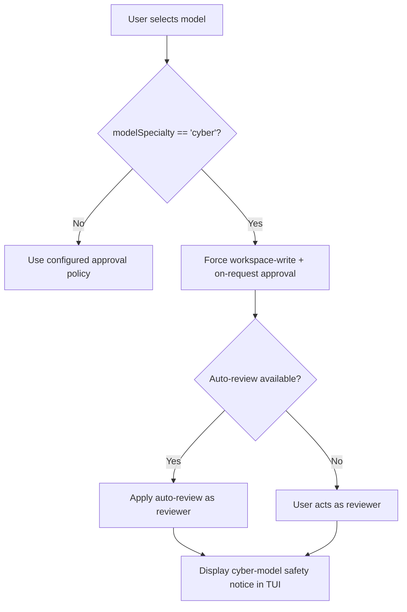

# Codex CLI's Cyber-Safety Model: Safer Auto-Review Defaults, Trusted Access Tiers, and Eliminating False Positives


Security engineers using Codex CLI have long encountered an occupational hazard: the cybersecurity classifier fires on perfectly legitimate defensive work. Reviewing secrets-management configuration, triaging a CVE in a dependency, writing a fuzz harness — all have triggered the "Your conversations have multiple flags for possible cybersecurity risk" banner, slowing responses and, in the worst cases, blocking goals entirely.[^1][^2] With v0.146.1 (August 5, 2026), OpenAI introduced a structural change to how cyber-capable models interact with the approval system, replacing ad-hoc classifier friction with an explicit tier model and principled defaults.[^3] This article maps the complete picture for developers who need to understand, configure, and operate Codex CLI within security workflows.

## The Two-Tier Daybreak Architecture

Codex CLI's cyber-capability surface is organised as two separately approved tiers under the **Daybreak** umbrella:[^4]

- **Daybreak Blue** covers authorised *defensive* security work: vulnerability discovery in owned codebases, secure code review, malware analysis, and incident response. It is available to individual practitioners who pass the Trusted Access for Cyber screening. Standard Pro/Team subscribers can apply; approval depends on identity verification and stated use case.
- **Daybreak Red** covers explicitly authorised *offensive* workflows: controlled vulnerability reproduction, penetration testing, and red-team exercises against systems you are authorised to test. Daybreak Blue approval does not confer Red access; the two tiers are independently gated.

Both require application via [chatgpt.com/cyber](https://chatgpt.com/cyber) (individual) or an enterprise intake coordinated through an OpenAI representative. The documentation is explicit: submitting an application does not guarantee approval.[^4] Enterprise deployments must also ensure that Trusted Access is not extended to external users, third-party customers, or systems outside the approved scope.

## What Changed in v0.146.1: Model Specialty and Automatic Defaults

The core of the v0.146.1 change (PR #37057, backported from #37055) was adding an optional `modelSpecialty` field throughout the model catalogue and the app-server `model/list` response.[^3] Models with `modelSpecialty: "cyber"` — currently the purpose-trained GPT-5.6 Cyber variant — receive a distinct permission profile when selected in an active thread:

| Condition | Resulting default |
|-----------|------------------|
| Cyber model selected in active thread | Workspace-write permissions, on-request approval |
| Auto-review available | Auto-review applied as reviewer |
| Auto-review unavailable | User remains reviewer |
| Managed profile restricts workspace | Permission-profile override decoupled from approval override |

The last row is important. An earlier version of the guard gated the safety override on workspace-profile availability, meaning managed-profile environments could bypass the safer defaults entirely. The fix in PR #37057 decoupled the two concerns, ensuring that approval-policy safeguards apply even when workspace selection is controlled via `requirements.toml`.[^3]

A notice now appears in the TUI when auto-review is applied to a cyber-model session, and warning messages for cyber models requesting full-disk access are significantly stronger.



## The False-Positive Problem: Root Causes and Mitigations

Despite the new structural defaults, false-positive classifier firings remain a live issue. Multiple GitHub issues (including #20234, #21568, #22988, #28015, #37161, and #37854) document identical patterns:[^1][^2]

- Keywords like `"secrets"`, `"token"`, `"sync"`, `"GCP Secret Manager"`, `"PAT"`, `"vulnerability"`, `"fuzz"`, or `"scan"` trigger the classifier regardless of intent.
- The flag persists across unrelated sessions within the same account — a single trigger can shadow subsequent benign conversations.
- Logging out and back in does not clear the flag.
- The Trusted Access verification flow itself has, at times, been blocked for the same accounts experiencing false positives, creating a catch-22.

### Structural Mitigations

**1. Apply for Trusted Access before you need it.** Waiting until a deadline or an active incident is the worst time to navigate the approval queue. Daybreak Blue approval typically takes several business days.

**2. Use named profiles with explicit approval policies.** A security-engineering profile that sets `approval = "on-request"` removes the ambiguity that causes the classifier to escalate:

```toml
# ~/.codex/security.config.toml
[model]
model = "openai.gpt-5.6-sol"

[sandbox]
net = false
writeable_roots = ["/workspaces/current-project"]

[approval]
approval = "on-request"
```

Starting Codex with `codex --profile security` ensures you always review proposed actions, making the safety classifier's escalation path redundant.

**3. Scope prompts to the codebase, not the threat.** The classifier is trained on intent signals in the prompt text. "Analyse the authentication module for credential-exposure risk" is far less likely to fire than "find secrets and tokens in the codebase". Frame tasks around the code, not the attack surface.

**4. Use `AGENTS.md` to declare the security context.** A brief statement of purpose anchors the classifier:

```markdown
## Security Context
This repository is a security-engineering workspace. All code analysis
tasks are defensive: vulnerability discovery in owned systems, secure
code review, and dependency auditing. No offensive tooling is produced.
```

**5. Report false positives promptly.** Each report (the classifier records a thread ID) contributes to classifier tuning. The OpenAI engineer response to issue #20234 confirmed that filed reports directly feed the training signal.[^2]

## Enterprise Governance

For teams deploying Codex CLI at scale under security-engineering mandates, `requirements.toml` enables policy enforcement:[^4]

```toml
[requirements]
min_approval = "on-request"         # No auto-approve for security work
model_specialties_allowed = ["cyber"] # Only cyber-capable models
mfa_required = true                  # Hardware MFA mandatory

[hooks.PostToolUse]
match = { tool = "apply_patch" }
command = ["./scripts/security-gate.sh"]
```

Hardware MFA is mandatory for cyber-permissive tier access — accounts without a hardware security key lose access to Daybreak models regardless of their approval status.[^4] Enforce this at the team level through your identity provider rather than relying on individual compliance.

The `requirements.toml` approach also future-proofs against the permission-profile bypass issue fixed in PR #37057: because profile constraints and approval constraints are now independently enforced, a managed profile can restrict file-system scope while still applying the mandatory on-request approval policy.

## Monitoring Cyber-Session Activity

The `rollout_path` JSONL stream captures all tool calls made during a session. For regulated environments, pipe it to a structured log aggregator and alert on any `apply_patch` or `shell` events that modify files outside the declared writable roots:

```bash
codex --rollout-path /var/log/codex/$(date +%Y%m%d)-session.jsonl \
      --profile security \
      "audit the payment module for injection vulnerabilities"
```

PostToolUse hooks can gate high-impact operations before they land, complementing the auto-review layer:

```json
{
  "hooks": {
    "PostToolUse": [{
      "match": { "tool": "shell" },
      "command": ["./scripts/cmd-audit.sh"]
    }]
  }
}
```

## What to Expect Next

The v0.150.0 alpha changelog notes a further round of "safer automatic-review defaults for cyber-capable models" with "clearer explanations of permission changes in the terminal interface."[^5] Based on the v0.146.1 architecture, this is likely to add richer in-TUI messaging when a cyber model escalates its default approval policy, reducing the confusion gap between what the classifier triggers and what the user sees.

The structural separation of model specialty from approval policy means the false-positive story is now primarily a classifier-accuracy problem rather than an architectural one. Each report filed against issues like #37854 moves the classifier's precision boundary. The right response to a false positive is to report it, configure an explicit approval policy as a local workaround, and apply for Trusted Access before you need it in anger.

## Citations

[^1]: GitHub Issue #28015 – "False positive cybersecurity safety check repeatedly blocks normal local repo maintenance in Codex CLI" — https://github.com/openai/codex/issues/28015
[^2]: GitHub Issue #20234 – "Codex CLI shows a cybersecurity risk warning for benign software development prompts" — https://github.com/openai/codex/issues/20234
[^3]: GitHub PR #37057 – "[0.146] Backport safer cyber-model auto-review defaults" — https://github.com/openai/codex/pull/37057
[^4]: OpenAI – "Models and Trusted Access" (Codex Cyber Safety docs) — https://learn.chatgpt.com/docs/cyber-safety
[^5]: OpenAI – Codex CLI v0.150.0 alpha release notes (August 2026) — https://github.com/openai/codex/releases
