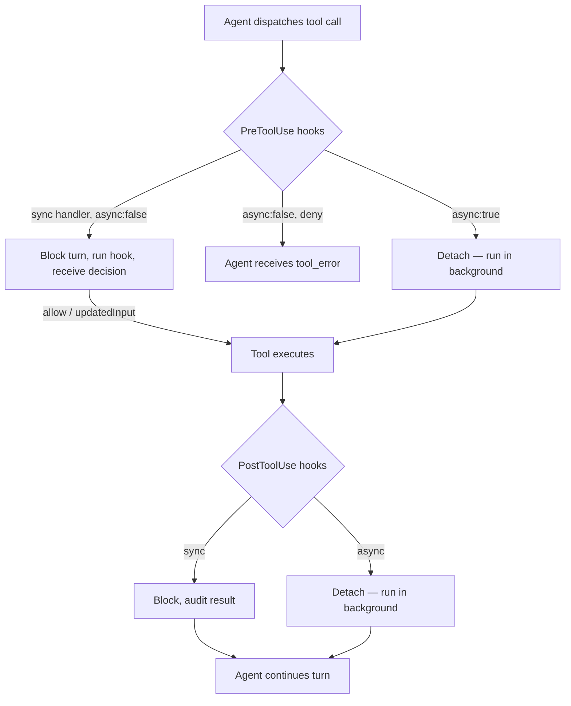
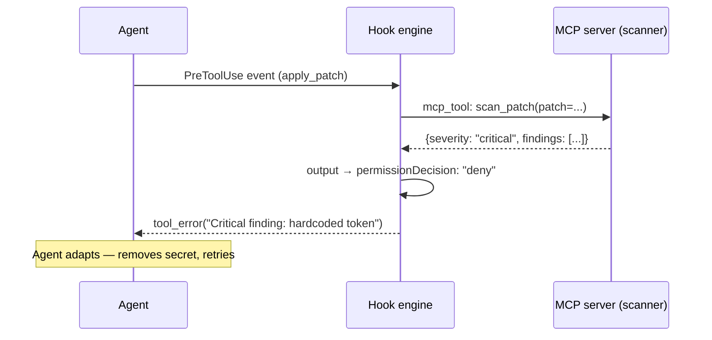

# Async Hooks and MCP Tool Hooks in Codex CLI v0.148.0: The Hook System Grows Up


Codex CLI's hook system has matured substantially since it shipped in experimental form in v0.114. For most of its life the system was capable but narrow: you could register shell commands that fired before or after Bash tool execution and either blocked the agent or let it continue. Useful, but limited to one tool type and strictly synchronous. Codex CLI v0.148.0 (August 17, 2026) changed both constraints in a single release.[^1] Hooks can now run asynchronously in the background, and a new `mcp_tool` handler type lets hooks invoke MCP server tools directly rather than shelling out to wrap them. The combination opens a design space — security scanning pipelines, telemetry ingestion, automated memory creation — that previously required workarounds or custom scaffolding.

## What Changed in v0.148.0

Two additions landed together:[^1]

1. **Async command hooks** — any `command` handler can now carry `"async": true`, which detaches it from the agent's critical path. The agent does not wait for the hook to complete before resuming the turn.
2. **`mcp_tool` handler type** — a first-class handler that dispatches a tool call to any connected MCP server, with template-variable expansion of event data into the tool's input fields.

Both work across all supported hook events: `PreToolUse`, `PostToolUse`, `PermissionRequest`, `UserPromptSubmit`, `Stop`, `SubagentStop`, `PreCompact`, `PostCompact`, `SessionStart`, `SubagentStart`, and `SessionEnd`.[^2]

## Hook Configuration Recap

Hooks live in `~/.codex/hooks.json` (user-global) or `<repo>/.codex/hooks.json` (project-scoped). Both files are loaded additively — all matching handlers from all sources execute.[^2]

The top-level shape is a map from event name to an array of *matcher groups*, each of which carries its own handler array:

```json
{
  "hooks": {
    "PreToolUse": [
      {
        "matcher": "Bash",
        "hooks": [
          {
            "type": "command",
            "command": "python3 ~/.codex/hooks/policy.py",
            "timeout": 10,
            "statusMessage": "Checking command policy"
          }
        ]
      }
    ]
  }
}
```

The `matcher` field is a regex string matched against the tool name. `mcp__.*` matches every MCP tool; `apply_patch` matches the file-editing primitive; omitting `matcher` (or using `"*"`) fires on every occurrence of the event.[^2]

Hooks are disabled by default. Enable them globally:

```toml
# ~/.codex/config.toml
[features]
hooks = true
```

Administrators can lock this on via `requirements.toml` and may enforce that only hooks from a managed directory are trusted.[^2]

## Async Command Hooks

Before v0.148.0, every hook handler blocked the agent turn until it completed or timed out. That was intentional for governance hooks — you need the result before proceeding — but it was wasteful for observability hooks that just write to a log or push a metric.

The `async: true` flag changes the execution model:[^2]

```json
{
  "type": "command",
  "command": "python3 ~/.codex/hooks/audit-logger.py",
  "async": true,
  "timeout": 120
}
```

Behaviour rules:

- Up to **8 concurrent background hooks** per session at any one time.[^2]
- Output is delivered after the current model request completes, or at the next user turn — whichever comes first.
- A background hook **cannot** block, approve, deny, or rewrite anything. Its `permissionDecision` and `updatedInput` fields are silently ignored.
- `SessionEnd` always runs synchronously regardless of the `async` flag, because there is no subsequent turn to deliver output into.[^2]

The implication: use `async: true` for any hook whose failure should not stall the agent — telemetry, audit trails, notification webhooks, cache warming. Keep `async: false` (the default) for governance hooks that must veto or rewrite before the tool fires.



## MCP Tool Hooks

The `mcp_tool` handler type lets a hook invoke a tool on any MCP server connected to the Codex session, rather than spawning a shell process. This matters when the capability you need is already exposed as an MCP tool — a security scanner, a ticketing server, a vector-store indexer — and you do not want to duplicate its interface as a subprocess wrapper.[^2]

```json
{
  "hooks": {
    "PostToolUse": [
      {
        "matcher": "apply_patch",
        "hooks": [
          {
            "type": "mcp_tool",
            "server": "scanner",
            "tool": "scan_patch",
            "input": {
              "patch": "${tool_output.patch}",
              "severity_threshold": "high"
            },
            "timeout": 30,
            "statusMessage": "Scanning patch for secrets"
          }
        ]
      }
    ]
  }
}
```

### Template Variable Expansion

The `input` object supports `${field.nested}` placeholders that are expanded from the hook's stdin payload. Full-value placeholders (a lone `"${expr}"` as the entire string value) preserve the original JSON type — arrays remain arrays, numbers remain numbers. String-embedded placeholders (`"Scanning ${tool_input.path}"`) render as text.[^2]

All handlers receive a standard set of stdin fields:[^2]

```text
session_id, transcript_path, cwd, hook_event_name, model,
turn_id, permission_mode
```

`PreToolUse` additionally provides `tool_name` and `tool_input`; `PostToolUse` adds `tool_output`, exit code, and stdout/stderr.

### MCP Tool Hook Output

An `mcp_tool` handler returns the same output envelope as a `command` handler — `continue`, `permissionDecision`, `updatedInput`, `systemMessage`, `suppressOutput`. The decision semantics are identical:[^2]

| Field | Effect |
|-------|--------|
| `permissionDecision: "deny"` (PreToolUse) | Agent receives `tool_error`; tool does not execute |
| `updatedInput` (PreToolUse) | Rewrites tool arguments before dispatch |
| `decision: "block"` (PostToolUse) | Signals failure; cannot undo side effects already applied |
| `systemMessage` | Injected into context as a system-level annotation |



## Large Output Management

Hooks that return verbose results — scanner reports, lint output, memory summaries — can flood the model context. The `additionalContextLimit` field caps how many tokens are injected:[^2]

```json
{
  "type": "command",
  "command": "python3 deep-analysis.py",
  "additionalContextLimit": 2000
}
```

Output exceeding the limit is spilled to a temporary file; the model receives a preview and a path it can read if needed. Set `0` to pass output directly with no cap (risk: context bloat on large responses).

## Trust and Security

Hooks run arbitrary code with the permissions of the Codex process. The engine enforces a trust gate: non-managed hooks prompt for review on first execution, and re-review is triggered if the hook binary or script changes (tracked by hash).[^3]

```bash
# Manage hook trust interactively
codex hooks

# One-off bypass for CI pipelines (use with care)
codex --dangerously-bypass-hook-trust ...
```

Enterprise teams can restrict execution to a managed directory via `requirements.toml`:[^2]

```toml
allow_managed_hooks_only = true

[[hooks.PreToolUse]]
matcher = "^Bash$"

[[hooks.PreToolUse.hooks]]
type = "command"
command = "/enterprise/hooks/policy.py"
```

## Practical Patterns

### Pattern 1: Async Audit Trail

Fire a background telemetry hook on every tool call without blocking the agent:

```json
{
  "hooks": {
    "PostToolUse": [
      {
        "hooks": [
          {
            "type": "command",
            "command": "python3 ~/.codex/hooks/telemetry.py",
            "async": true,
            "timeout": 60
          }
        ]
      }
    ]
  }
}
```

`telemetry.py` reads stdin JSON, extracts `tool_name`, `tool_output`, `session_id`, and ships a structured event to your observability stack. The agent never waits for it.

### Pattern 2: MCP-Powered Secret Scanning on Every Patch

Route every `apply_patch` event through a gitleaks MCP server before the patch lands:

```json
{
  "hooks": {
    "PreToolUse": [
      {
        "matcher": "apply_patch",
        "hooks": [
          {
            "type": "mcp_tool",
            "server": "gitleaks",
            "tool": "scan",
            "input": { "content": "${tool_input.patch}" },
            "timeout": 15,
            "statusMessage": "Scanning for secrets"
          }
        ]
      }
    ]
  }
}
```

If the scan returns findings, the hook returns `permissionDecision: "deny"` with a `systemMessage` describing what was found. The agent receives a `tool_error` and can redact the offending content before retrying.[^3]

## Caveats

Three things to keep in mind:[^2][^3]

- **PostToolUse cannot undo** — a blocking `decision: "block"` fires after the tool has already modified the filesystem. Use `PreToolUse` for gatekeeping.
- **MCP tool hooks fire synchronously by default** — there is no `async: true` for `mcp_tool` type yet. ⚠️ This may change in a future release.
- **Hook chain ordering matters** — the first handler to return a deny wins; later handlers in the same matcher group do not execute. Document this in `AGENTS.md`.

## Summary

Codex CLI v0.148.0 makes the hook system genuinely composable. Async command hooks unblock the agent from observability workloads, and `mcp_tool` hooks let you plug the same MCP servers your agent uses directly into its governance layer — without duplicating their logic as shell scripts. The patterns above (async telemetry, MCP secret scanning) are achievable today with the hooks documented in the official reference.[^1][^2]

## Citations

[^1]: OpenAI, "Codex CLI v0.148.0 Release Notes", Releasebot / OpenAI Codex, August 17 2026. <https://releasebot.io/updates/openai/codex>

[^2]: OpenAI, "Hooks — Codex CLI Documentation", learn.chatgpt.com, 2026. <https://learn.chatgpt.com/docs/hooks>

[^3]: Agentic Control Plane, "Codex CLI Hooks Reference — hooks.json, PreToolUse & PostToolUse", agenticcontrolplane.com, 2026. <https://agenticcontrolplane.com/blog/codex-cli-hooks-reference>

[^4]: Symposium, "Codex CLI — Agent Details", symposium.dev, 2026. <https://symposium.dev/design/agent-details/codex-cli.html>

[^5]: OpenAI, "Codex CLI Changelog (August 2026)", gradually.ai, 2026. <https://www.gradually.ai/en/changelogs/codex-cli/>
