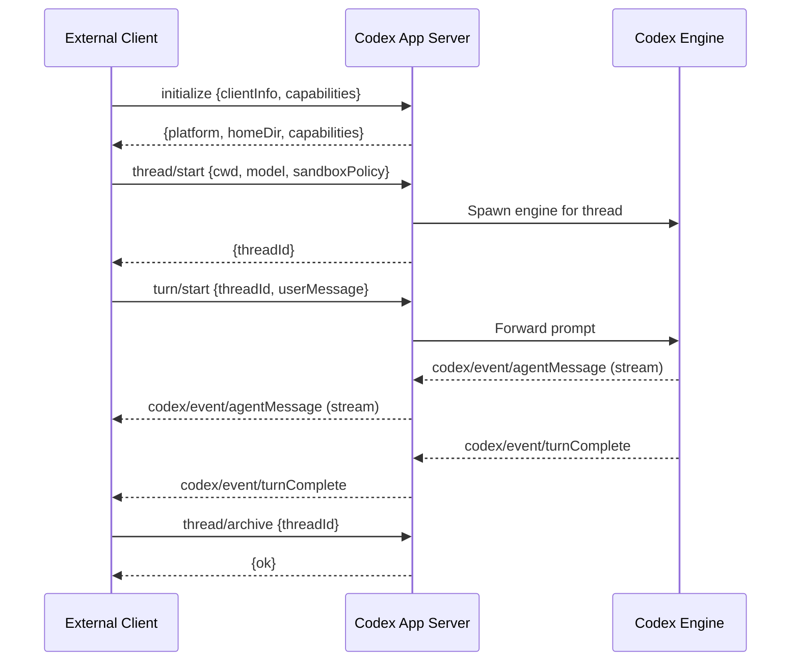

# From `codex mcp-server` to App Server and Codex Plugin: Navigating the v0.149.1 Deprecation


On 24 August 2026, Codex CLI v0.149.1 landed a quiet but architecturally significant change: the `codex mcp-server` subcommand was deprecated.[^1] If your pipeline used `codex mcp-server` to expose Codex's coding-agent capabilities to Claude Code, the OpenAI Agents SDK, or any other MCP client, you have two migration paths — and the sooner you move, the better, because the old command will be removed in a future minor release.

This article explains what the deprecated command did, why it's going away, and exactly how to migrate.

---

## What `codex mcp-server` Did

`codex mcp-server` launched Codex as a **stdio-based JSON-RPC 2.0 server** that spoke the Model Context Protocol.[^2] It ran in process, inherited your `~/.codex/config.toml`, and exited when the client closed the pipe. The tool surface was deliberately minimal — just two MCP tools:[^3]

| Tool | Purpose |
|---|---|
| `codex` | Start a new Codex session. Accepts `prompt`, `model`, `cwd`, `approval-policy`, `sandbox`, `config`, and `developer-instructions`. Returns a stable `thread_id`. |
| `codex-reply` | Continue an existing session using the `thread_id` from `codex`. |

Configuring it for **Claude Desktop** looked like this:

```json
{
  "mcpServers": {
    "codex": {
      "command": "codex",
      "args": ["mcp-server"]
    }
  }
}
```

For the **OpenAI Agents SDK**, you wired it up as an `MCPServerStdio`:

```python
from openai.agents import Agent, MCPServerStdio

codex = MCPServerStdio(command="codex", args=["mcp-server"])

orchestrator = Agent(
    name="orchestrator",
    instructions="Coordinate coding tasks by delegating to the codex tool.",
    mcp_servers=[codex],
)
```

It worked — but it was a thin shim. Every `codex` call spawned a fresh engine behind the scenes, context was not shared between calls unless you passed `thread_id`, and the protocol surface gave external clients no visibility into what was happening inside the session.

---

## Why It's Being Retired

The `codex mcp-server` command pre-dates the Codex **app server**, a full JSON-RPC 2.0 daemon that has been the authoritative integration point since early 2026.[^4] The app server already powers:

- The **Codex VS Code extension**
- The **Codex desktop app**
- The **`codex agents` interactive dashboard** (shipped in v0.149.0)
- The **`codex queue`** inter-session messaging primitive (v0.149.0)
- **Working-directory slash commands** (`/cd`, `/pwd`, `/cwd`) (v0.149.0)

Maintaining two separate integration surfaces — a thin two-tool MCP wrapper and a rich 88-method app-server protocol — was unnecessary duplication. Retiring `codex mcp-server` consolidates all external access through the app server and its higher-level wrappers.

The protocol difference is stark:

| Capability | `codex mcp-server` | App server |
|---|---|---|
| Session start | `codex` tool | `thread/start` |
| Session continuation | `codex-reply` tool | `turn/start` |
| Session fork | ✗ | `thread/fork` |
| Session list / search | ✗ | `thread/list` |
| Archive / restore | ✗ | `thread/archive`, `thread/unarchive` |
| Working directory change | ✗ | `/cd` via `turn/start` |
| In-flight steering | ✗ | `turn/steer` |
| Turn interruption | ✗ | `turn/interrupt` |
| Filesystem operations | ✗ | `fs/readFile`, `fs/writeFile`, … |
| Agents dashboard integration | ✗ | Native |
| Queue integration | ✗ | Native |
| Transport options | stdio only | stdio, unix socket, WebSocket |

---

## Migration Path 1 — Claude Code Users: Install the Codex Plugin

If you were using `codex mcp-server` to drive Codex **from inside Claude Code**, the official replacement is the **Codex plugin for Claude Code** (`openai/codex-plugin-cc`).[^5] This plugin wraps the local Codex CLI and app server, so it inherits your existing authentication, `config.toml`, MCP configuration, and environment variables automatically.

### Installation

Inside a Claude Code session:

```bash
/plugin marketplace add openai/codex-plugin-cc
```

Or via the CLI directly:

```bash
/plugin install codex@openai-codex
```

Once installed, a family of `/codex:` slash commands appears in your terminal session:[^6]

| Command | What it does |
|---|---|
| `/codex:review` | Instant AI code review of the current diff or selection |
| `/codex:rescue` | Hand off a tricky bug to Codex for investigation |
| `/codex:delegate` | Delegate an entire task to Codex and wait for a result |
| `/codex:audit` | Adversarial security audit of the current file or repository |

**Requirements:** Node.js 18.18 or later, plus either a ChatGPT subscription (including the Free tier) or an OpenAI API key.

The plugin communicates with your local Codex app server over the unix socket, not over stdio, so it does not need `codex mcp-server` running at all.

---

## Migration Path 2 — Custom Clients and the Agents SDK: Speak to the App Server Directly

For custom integrations, CI tooling, or orchestrators that were previously calling `codex mcp-server`, the replacement is a direct connection to the **Codex app server** on its unix socket (the default transport for local integrations).[^7]

### Transport Options

```toml
# ~/.codex/config.toml

# Default: app server listens on a unix socket. No configuration required.
# Socket path: $CODEX_HOME/app-server-control/app-server-control.sock

# To also expose a WebSocket endpoint (experimental, not for production):
# [app_server]
# listen = "ws://127.0.0.1:60100"
```

The unix socket is production-grade and is what the VS Code extension uses. WebSocket is experimental and subject to change.[^8]

### Protocol Handshake

Every client must send an `initialize` request before any other operation:

```json
{
  "jsonrpc": "2.0",
  "id": 1,
  "method": "initialize",
  "params": {
    "clientInfo": { "name": "my-orchestrator", "version": "1.0.0" },
    "capabilities": {
      "experimentalApi": true
    }
  }
}
```

The server responds with platform metadata, home directory, and supported capabilities.

### Starting a Session and a Turn

```json
{
  "jsonrpc": "2.0",
  "id": 2,
  "method": "thread/start",
  "params": {
    "cwd": "/home/user/myproject",
    "model": "gpt-5.6-terra",
    "sandboxPolicy": "workspace-write"
  }
}
```

```json
{
  "jsonrpc": "2.0",
  "id": 3,
  "method": "turn/start",
  "params": {
    "threadId": "<id-from-thread/start-response>",
    "userMessage": "Add integration tests for the billing module."
  }
}
```

The server streams `codex/event/*` notifications until the turn is complete.

### Protocol Flow



### Backpressure

If the server is saturated it returns JSON-RPC error code `-32001` ("Server overloaded; retry later"). Implement exponential backoff with jitter in any client that sends bursts.[^9]

---

## Integrating with the Agents SDK Post-Deprecation

The old `MCPServerStdio` approach is no longer required. Instead, communicate with the app server through the unix socket using any JSON-RPC 2.0 client, or use the **Codex SDK** which wraps the app-server protocol natively:[^10]

```python
# Using the Codex SDK (wraps app-server internally)
import codex

async def run_task():
    async with codex.Session(model="gpt-5.6-terra", cwd="/workspace") as session:
        result = await session.run("Refactor the auth module to use OAuth 2.1")
        print(result.summary)
```

No `codex mcp-server` call, no MCP tool invocation — the SDK handles the app-server handshake transparently.

---

## What the App Server Gives You That the Old Command Never Could

### Session Forking

With `codex mcp-server`, every interaction was independent. The app server exposes `thread/fork`, letting you branch from a known-good mid-task state — critical for long-horizon tasks where you want to explore two different approaches without discarding context.

### Agents Dashboard Visibility

Sessions started via the app server appear in `codex agents` — the interactive TUI dashboard introduced in v0.149.0. You can search, rename, and stop them from a separate terminal without needing to know their PIDs or thread IDs.

### `codex queue` Integration

Messages enqueued via `codex queue` target app-server sessions by ID. External orchestrators can fire-and-forget work items to a running session and the session wakes to process them, without polling.

### Working Directory Commands

`/cd`, `/pwd`, and `/cwd` slash commands are available inside turns managed by the app server. An orchestrator can reposition a long-running session to a different repository directory without spawning a new engine — the sandbox writable-root list, AGENTS.md chain, and file-search root all update atomically.[^11]

### Thread Persistence

The app server keeps a thread loaded in memory for 30 minutes after the last subscriber disconnects. Reconnecting a client to an existing `threadId` resumes the session without re-initialising the engine.

---

## Practical config.toml Template

```toml
# ~/.codex/config.toml

model = "gpt-5.6-terra"
approval_policy = "on-failure"

[sandbox]
mode = "workspace-write"

# No app_server section needed for local unix-socket operation.
# The daemon starts automatically when the TUI or any app-server client connects.

# MCP servers Codex *consumes* (unchanged by this deprecation):
[[mcp_servers]]
name = "github"
command = "npx"
args = ["-y", "@modelcontextprotocol/server-github"]
```

Note that `[app_server]` configuration is only needed if you want non-default transport (e.g. WebSocket). The unix socket starts automatically; you do not need to add any section to use it.

---

## Action Checklist

- [ ] **Audit your config files** — search for `"codex mcp-server"` in Claude Desktop JSON, Zed settings, and any CI scripts
- [ ] **Claude Code users** — run `/plugin marketplace add openai/codex-plugin-cc` and remove the `mcpServers.codex` entry
- [ ] **Agents SDK users** — replace `MCPServerStdio(command="codex", args=["mcp-server"])` with the Codex SDK or direct app-server client
- [ ] **Custom clients** — implement the `initialize` handshake and migrate from `codex` / `codex-reply` MCP tools to `thread/start` / `turn/start`
- [ ] **Verify** with `codex doctor` — it now reports app-server health as part of its diagnostics output[^12]

---

## Citations

[^1]: OpenAI. "Codex CLI v0.149.1 Release Notes." GitHub Releases, August 24, 2026. <https://github.com/openai/codex/releases/tag/rust-v0.149.1>
[^2]: OpenAI. "Codex MCP Interface Documentation." `codex-rs/docs/codex_mcp_interface.md`, GitHub, 2026. <https://github.com/openai/codex/blob/main/codex-rs/docs/codex_mcp_interface.md>
[^3]: DeepWiki. "MCP Server Implementation (codex-mcp-server)." openai/codex, 2026. <https://deepwiki.com/openai/codex/6.4-mcp-server-implementation-(codex-mcp-server)>
[^4]: OpenAI. "Codex App Server README." `codex-rs/app-server/README.md`, GitHub, 2026. <https://github.com/openai/codex/blob/main/codex-rs/app-server/README.md>
[^5]: OpenAI. "Codex Plugin for Claude Code." GitHub, 2026. <https://github.com/openai/codex-plugin-cc>
[^6]: CoddyKit. "Codex Plugin for Claude Code: How to Use OpenAI's Codex From Inside Claude Code." 2026. <https://www.coddykit.com/pages/blog-detail?id=512900>
[^7]: OpenAI. "Codex App Server." ChatGPT Learn, 2026. <https://learn.chatgpt.com/docs/app-server>
[^8]: OpenAI. "Codex App Server README — Transport Options." GitHub, 2026. <https://github.com/openai/codex/blob/main/codex-rs/app-server/README.md>
[^9]: OpenAI. "Codex App Server README — Backpressure." GitHub, 2026. <https://github.com/openai/codex/blob/main/codex-rs/app-server/README.md>
[^10]: OpenAI. "Use Codex with the Agents SDK." ChatGPT Learn, 2026. <https://developers.openai.com/codex/guides/agents-sdk>
[^11]: OpenAI. "Codex CLI v0.149.0 Release Notes." GitHub Releases, August 20, 2026. <https://github.com/openai/codex/releases/tag/rust-v0.149.0>
[^12]: OpenAI. "Codex CLI v0.149.0 — Enhanced `codex doctor` Diagnostics." GitHub Releases, August 20, 2026. <https://github.com/openai/codex/releases/tag/rust-v0.149.0>
