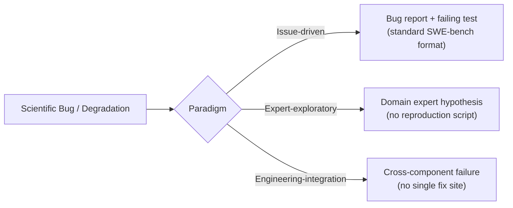
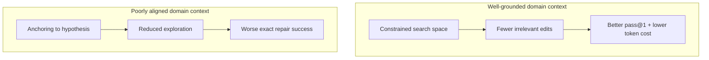

# SWE-bench Science: Why Coding Agents Fail at Scientific Software — and What It Means for Your Codex CLI Configuration


---

Just as agents crossed 80% on SWE-bench Verified, a new benchmark appeared to remind us how narrow that achievement is. SWE-bench Science[^1] — published by Zhipeng Xu, Jiahao Lu, Yining Zheng, Yuxin Wang, and Xipeng Qiu on 20 August 2026 — evaluates whether coding agents can repair scientific software. The headline result: even the best-performing configuration, Claude Code with Opus-5 at maximum reasoning effort, resolves fewer than half the tasks.[^2] If your team writes simulation, analysis, or data-processing code, this paper has direct implications for how you configure and constrain Codex CLI.

## The Benchmark: 119 Tasks, 20 Scientific Domains

SWE-bench Science comprises 119 repository-level repair tasks drawn from 98 real GitHub repositories across 20 scientific domains.[^1] The domains span numerical behaviour, scientific data models, file formats, geometry, simulation, imaging, spectroscopy, and more. Each task ships with a containerised environment image, a verifier image, and a per-task `reward.json`, evaluated through the Pier runner (v0.3.0) which is compatible with Harbor task formats.[^3]

Of the 119 tasks, 96 are unrestricted (suitable for unmediated evaluation) and 23 carry GPL/LGPL/AGPL or other licence restrictions that require explicit opt-in.[^3] For knowledge-ablation experiments the authors use a 91-task selection.

### Three Task Paradigms

Tasks are organised into three paradigms that represent different ways scientific software gets fixed in practice:



**Issue-driven** tasks resemble SWE-bench Verified: a filed bug report plus a failing test case. **Expert-exploratory** tasks supply a domain-expert hypothesis instead of a reproduction script — the agent must reason from scientific intuition. **Engineering-integration** tasks expose failures spanning multiple components, with no obvious fix location.[^1]

This three-way split is important because Claude-Opus-5 achieves 65.31% on Expert tasks but only 27.78% on Engineering-integration tasks[^5] — the gap reveals that agents are better at following an expert's lead than at diagnosing cross-cutting failures in unfamiliar scientific codebases.

## Leaderboard: The Performance Ceiling

As of 24 August 2026, the public leaderboard[^2] shows:

| Rank | Model | Harness | Pass@1 |
|------|-------|---------|--------|
| 1 | Claude-Opus-5 (max) | Claude Code | 47.90% |
| 2 | GPT-5.6-sol (max) | Codex | 46.22% |
| 3 | DeepSeek-V4-Pro (max) | Claude Code | 42.02% |
| 4 | Kimi-K3 (max) | Kimi Code | 35.29% |
| 5 | GLM-5.2 (max) | Codex | 31.93% |

For context, frontier agents now resolve over 85% of SWE-bench Verified tasks.[^4] The 40-percentage-point gap between general-purpose software repair and scientific software repair is stark: scientific software does not merely require coding skill — it requires understanding what the code is supposed to *mean* in its domain.

## Four Recurring Failure Modes

The authors identify four failure mechanisms that account for most agent failures:[^1]

### 1. Scientific Knowledge or Abstraction Deficits

Agents misidentify root causes because they lack domain knowledge — a spectroscopy library's normalisation convention, a simulation's numerical stability contract, or a mesh library's coordinate semantics. Without that grounding the agent produces syntactically correct patches that violate the scientific contract.

### 2. Shallow Exploration or Surface-Level Repair

Agents fix the symptom at the point of failure without tracing the causal chain into the domain logic. A numerical precision bug that originates in an upstream aggregation step gets patched at the assertion site instead.

### 3. Incomplete Coverage or System Integration Failures

Scientific software frequently has distributed correctness conditions: a change in one module must be reflected in dependent serialisers, file format handlers, or downstream analysis steps. Agents that patch one component and halt leave the system in a partially correct state that still fails verification.

### 4. Failure to Generalise Scientific Knowledge

Even when an agent correctly reasons about one instance of a scientific pattern (e.g., energy conservation in a physics simulation), it fails to apply that reasoning to related cases within the same repository. Successful patch A does not transfer to similar patch B three files away.

## The Double-Edged Sword of Domain Knowledge

The paper's most practically significant finding concerns domain-knowledge injection.[^1] The 91-task ablation study shows:

- **Well-grounded scientific context** constrains the search space, improves average pass@1, and reduces token expenditure.
- **Poorly aligned guidance** induces anchoring bias — agents anchor on the provided (incorrect) hypothesis and explore less, *reducing* exact repair success.

This is a direct challenge to the common pattern of inserting domain documentation into AGENTS.md or prepending it to every prompt. Authoritative, precise domain context helps; vague or partially-correct domain context can be worse than no context at all.



## What This Means for Codex CLI Configuration

### Use Named Profiles for Scientific Work

Codex CLI's `config.toml` named profiles let you set a higher reasoning effort for scientific repositories, where the agent needs sustained deliberation rather than fast pattern-matching:

```toml
[profiles.science]
model = "gpt-5.6-sol"
model_reasoning_effort = "max"
approval_policy = "unless-allow-listed"
```

Activate with `codex --profile science` when working in scientific repositories. Maximum reasoning effort is measurably necessary: GPT-5.6-sol at `max` scores 46.22% vs. significantly lower scores at reduced effort.[^2]

### Treat Domain Context in AGENTS.md as Authoritative or Absent

Given the anchoring risk, the practical rule for scientific AGENTS.md content is binary: either provide precise, verified domain constraints, or omit domain context entirely and let the agent explore freely.

A bad AGENTS.md entry:

```markdown
## Domain context
This module probably uses SI units throughout (not verified).
```

A useful AGENTS.md entry:

```markdown
## Domain invariants (verified against test suite)
- All energy values stored in electron-volts (eV), never Joules.
- `spectrum.normalise()` must return a sum of 1.0 ± 1e-9 over the wavelength axis.
- Coordinate origin is bottom-left; y increases upward.
```

The first example is precisely the kind of "poorly aligned guidance" the paper warns against.

### Use PostToolUse Hooks for Scientific Contract Verification

The three Engineering-integration failure patterns — incomplete coverage, missed downstream effects — can be partially caught by PostToolUse hooks that run domain-specific verifiers after every file write:

```toml
[[hooks.post_tool_use]]
name = "science-invariant-check"
run = "python scripts/check_invariants.py"
# exits 2 on failure → Codex CLI blocks the turn and surfaces the error
```

This converts the agent's blind spot (failure to generalise fixes across components) into immediate feedback, giving the agent an opportunity to extend its patch.

### PreToolUse Scope Guards for Scientific Repositories

Engineering-integration failures frequently arise from agents editing the wrong component. A PreToolUse hook can restrict edits to validated subsets of the repository:

```toml
[[hooks.pre_tool_use]]
name = "restrict-to-src"
run = "bash scripts/scope-guard.sh"
# exits 2 if the proposed write target is outside src/ or tests/
```

For repositories with particularly sensitive numerical components (e.g., Monte Carlo kernels, spectral estimators), you can make these targets read-only in the sandbox:

```toml
[sandbox]
deny_write = [
  "/repo/src/core/numerics/**",
  "/repo/src/core/stats/**"
]
```

### The Expert-Exploratory Paradigm as a Model for Prompting

Claude-Opus-5's 65.31% Expert score versus 47.90% overall suggests that framing prompts in the style of an expert-exploratory task — providing a diagnostic hypothesis rather than a raw bug report — is a practical improvement lever. Instead of pasting the stack trace, pre-process it into a hypothesis:

> "The spectral normalisation step in `core/spectrum.py` may be dividing by the wrong axis. Investigate whether `axis=0` should be `axis=-1` and check downstream consumers."

This framing constrains the agent's exploration to the right subgraph without anchoring it to an incorrect answer.

## Comparison with Related Scientific Benchmarks

SWE-bench Science is not the first domain-specific benchmark, but its scope and the rigour of its three-paradigm structure distinguish it:[^1]

- **AInsteinBench** (July 2026) evaluates coding on scientific repositories but focuses on implementation tasks rather than bug repair.
- **Collider-Bench** covers particle physics analysis reproduction specifically, vs. the breadth of 20 domains here.
- **SWE-bench Verified** remains the standard for general software engineering but offers no signal on domain correctness.

SWE-bench Science fills the gap: it evaluates correctness against scientific contracts, not just test pass rates.

## Practical Takeaways

The paper's findings, mapped to operational decisions for Codex CLI teams working in scientific domains:

| Finding | Operational decision |
|---------|---------------------|
| Best agent at 47.9% — far from reliable | Use `approval_policy = "unless-allow-listed"` for all writes in scientific repos |
| Expert-exploratory outperforms issue-driven | Frame prompts as diagnostic hypotheses, not raw bug reports |
| Engineering-integration failures dominate | Add PostToolUse hooks that verify cross-component invariants |
| Anchoring from vague domain context | Either provide precise verified invariants in AGENTS.md, or none at all |
| Max reasoning effort required | Set `model_reasoning_effort = "max"` for science profiles |
| 20% gap between frontier models | Test your specific repo with multiple models before committing to a pipeline |

Scientific software is not just harder code — it carries correctness obligations that transcend test pass rates. Until agents reliably understand those obligations, the human remains the verifier of last resort.

## Citations

[^1]: Xu, Z., Lu, J., Zheng, Y., Wang, Y., & Qiu, X. (2026). *SWE-bench Science: Can Coding Agents Resolve Engineering Tasks in Science?* arXiv:2608.19799. https://arxiv.org/abs/2608.19799

[^2]: SWE-bench Science Leaderboard (last updated 2026-08-24). https://swescience.github.io/

[^3]: OpenMOSS/SWE-bench-Science GitHub repository. https://github.com/OpenMOSS/SWE-bench-Science

[^4]: SWE-Bench Verified leaderboard, August 2026. Claude Mythos Preview leads at 93.9%; GPT-5.3 Codex at 85%. https://www.swebench.com

[^5]: SWE-bench Science leaderboard per-paradigm breakdown: Claude-Opus-5 achieves 38.46% (Issue), 65.31% (Expert), 27.78% (Engineering). https://swescience.github.io/
