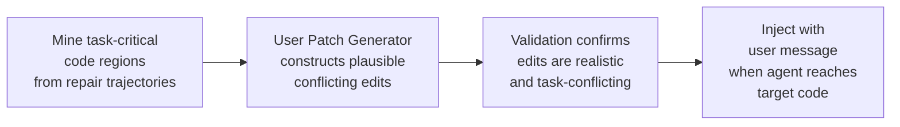

# SWE-Touch: What Happens When You Edit Code While Your Agent Is Running — and How to Configure Codex CLI for Shared Workspaces


## The Problem No Benchmark Measures

Every coding agent leaderboard measures performance on isolated tasks: the agent sees a fresh repository, works alone, and produces a patch. This is not how software is actually written.

Real development is shared. You run `codex` in full-auto mode to fix an API endpoint, notice a typo in a nearby file, fix it directly, then the agent pushes forward — and the two edits are now in conflict. Or a colleague pushes a commit mid-session. Or you decide the function signature needs changing halfway through the agent's multi-file refactor.

Tan et al. (CASIA Institute of Automation) built SWE-Touch[^1] to measure exactly this: what happens to resolve rates when users edit code while the agent is still running. The results reveal a structural gap between benchmark performance and production readiness that every Codex CLI user should understand.

---

## The Counter-Edit Framework

SWE-Touch introduces *Counter-Edits* — plausible, syntactically valid modifications to task-critical code that are injected mid-run, accompanied by a contextual user message. The construction pipeline has three stages:[^1]



The key design constraint is *plausibility*. Counter-Edits are not random corruption; they are the kind of edit a developer might actually make — a changed function signature, an extracted helper, a renamed variable. The agent should detect and reconcile them. In the majority of evaluated runs, it does not.[^1]

---

## What the Numbers Say

Evaluating nine frontier coding models on SWE-bench Verified, SWE-bench Pro, and DeepSWE, the paper reports:[^1]

- **7.7 percentage points** average resolve-rate drop on SWE-bench Verified from a single Counter-Edit injection
- **Up to 16.5pp** degradation for open-source models
- Degradation **persists across longer-horizon benchmarks** (SWE-bench Pro and DeepSWE), ruling out a SWE-bench-specific artefact
- Only **Claude Opus 4.8 and GPT 5.5** showed meaningful resilience to Counter-Edits

The most striking statistic is the failure mode breakdown. In **63.3% of failed runs**, the agent simply left the user's conflicting code in place — it neither detected the edit nor reconciled it with its own changes.[^1]

---

## Four Failure Modes

The trajectory analysis identifies four structural failure modes:[^1]

### 1. Limited Workspace Awareness
Agents that have already read a file do not re-read it after a user modifies it. The agent's mental model of the repository diverges from reality silently.

### 2. Conflicting Retention
When the agent eventually writes to a file, it overwrites or ignores the user's edit without examining the diff between what it remembers and what is actually on disk.

### 3. Inadequate Re-Inspection
Even agents that notice something has changed do not consistently re-inspect related files. A changed function signature in `utils.py` should trigger review of every call site — most agents skip this.

### 4. Poor Validation Protocols
After reconciling an edit (when they do), agents rarely run targeted tests to verify the merged state is correct. They proceed on the assumption that their patch still applies cleanly.

These failure modes follow a common pattern: agents treat the repository as a static snapshot, not as a live environment.[^1]

---

## Why This Matters for Codex CLI

Codex CLI's three approval tiers exist precisely because workspace interaction carries risk in both directions:[^2]

```toml
# config.toml
[sandbox]
mode = "workspace-write"   # agent can edit files inside repo
                           # requires approval for external writes/network

[approval]
policy = "on-request"      # agent stops to ask before risky actions
```

The SWE-Touch findings suggest that the risk model needs to account for *user edits during agent execution*, not just agent edits escaping the workspace. The standard modes do not address this:

| Mode | Agent writes | User writes | Conflict detection |
|---|---|---|---|
| `read-only` | Blocked | Possible | None |
| `workspace-write` | Allowed in repo | Possible | None |
| `full-auto` | Allowed anywhere | Possible | None |

None of the standard approval modes gives the agent any signal that the workspace has changed beneath it.

---

## Configuring Codex CLI for Shared Workspaces

### Strategy 1: Session Isolation via Fork

When a user needs to make edits and restart the agent from a clean state, `codex exec fork`[^3] (introduced in v0.148.0) provides the safest escape hatch:

```bash
# Fork the current session, preserving context but resetting workspace state
codex exec fork --session <session-id> --message "I've modified utils.py — please re-read it and continue"
```

The forked session inherits the conversation context but re-initialises its workspace snapshot, ensuring the agent reads the current state of every file before proceeding.

### Strategy 2: PreToolUse Hook for Modification Detection

A PreToolUse hook on `apply_patch` can compare the in-memory file snapshot against the current disk state before the agent writes:

```json
{
  "hooks": [
    {
      "event": "PreToolUse",
      "matcher": "apply_patch",
      "handler": {
        "type": "command",
        "command": [
          "bash", "-c",
          "python3 /usr/local/bin/workspace-drift-check.py \"$CODEX_TOOL_INPUT\""
        ]
      }
    }
  ]
}
```

The `workspace-drift-check.py` script computes a hash of each file the agent intends to patch and compares it against a baseline captured at session start. If hashes diverge, it exits with code 2, blocking the patch and returning a message that lists which files have changed since the agent last read them.

```python
#!/usr/bin/env python3
# workspace-drift-check.py
# Detects workspace drift before agent applies patches.
# Exit 1 = allow, Exit 2 = block with message.
import json, hashlib, os, sys

baseline_file = "/tmp/codex-workspace-baseline.json"
tool_input = json.loads(sys.argv[1]) if len(sys.argv) > 1 else {}

# Load or create baseline
if not os.path.exists(baseline_file):
    sys.exit(1)  # No baseline yet, allow

with open(baseline_file) as f:
    baseline = json.load(f)

drifted = []
# Check files the patch targets
for path in tool_input.get("files", []):
    if os.path.exists(path):
        with open(path, "rb") as fh:
            current_hash = hashlib.sha256(fh.read()).hexdigest()
        if path in baseline and baseline[path] != current_hash:
            drifted.append(path)

if drifted:
    msg = f"Workspace drift detected. Files changed since last read: {', '.join(drifted)}. Re-read these files before patching."
    print(json.dumps({"decision": "block", "reason": msg}))
    sys.exit(2)

sys.exit(1)
```

### Strategy 3: AGENTS.md Workspace-Change Protocol

Encoding a workspace-change detection directive in AGENTS.md gives the agent standing instructions for collaborative sessions:[^4]

```markdown
## Workspace Collaboration Protocol

This session may involve concurrent user edits. Before applying any patch:

1. Re-read every file you intend to modify using the `read_file` tool
2. If the current content differs from what you last read, stop and report the diff to the user
3. Do not assume your earlier file reads are still current
4. After applying changes, run `git diff HEAD` to verify the final state is coherent
5. Run targeted tests covering any function whose signature you have changed or observed to have changed
```

Research on agent-facing documentation shows that AGENTS.md-style instruction files account for 60.5% of all agent documentation interactions, making this the highest-leverage place to encode collaborative behaviour.[^5]

### Strategy 4: PostToolUse Re-Inspection Hook

A PostToolUse hook can trigger an automatic git-diff check after every `apply_patch` call, surfacing any unexpected state:

```json
{
  "hooks": [
    {
      "event": "PostToolUse",
      "matcher": "apply_patch",
      "async": true,
      "handler": {
        "type": "command",
        "command": ["bash", "-c", "git diff HEAD --stat 2>&1 | head -20 >> /tmp/codex-patch-log.txt"]
      }
    }
  ]
}
```

Setting `async: true` (v0.148.0+)[^6] means this runs in the background without blocking the agent turn.

### Strategy 5: Approval Mode as a Collaboration Signal

When you know you will be making concurrent edits, temporarily switching to `on-request` approval mode via the `/permissions` slash command gives the agent natural pause points at which you can communicate changes:

```
/permissions sandbox=workspace-write ask-for-approval=always
```

The agent will pause before each write, giving you a window to review what it intends to do and interject with edits before conflicts accumulate.

---

## The Broader Context: Interactive Benchmarks

SWE-Touch is not the only effort to move evaluation beyond isolated agent runs. SWE-Together[^7] (arXiv:2606.29957) curated 109 repository-level tasks from 11,260 recorded real-world coding sessions, introducing a reactive user simulator that replays multi-turn clarification patterns. That work found a correlation between agent capability and both solution quality and number of interventions required — stronger agents need fewer corrective feedback turns.

Together, these benchmarks establish a clear research agenda: static leaderboards measure a capability that is necessary but not sufficient. Production deployment requires agents that are aware of, and resilient to, the human activity happening alongside them.

---

## Recommended Codex CLI Configuration

The following `config.toml` profile is suitable for shared-workspace sessions where concurrent edits are anticipated:

```toml
[model]
name = "claude-opus-4.8"   # One of two models showing Counter-Edit resilience

[sandbox]
mode = "workspace-write"

[approval]
policy = "on-request"

[agents]
max_threads = 1            # Single thread reduces state-divergence surface area

[session]
auto_compact = true
auto_compact_token_limit = 80000   # Compact early to preserve re-read budget
```

Pair this with the AGENTS.md workspace-change protocol and the PreToolUse drift-detection hook for defence in depth.

---

## Identified Gaps in Codex CLI

SWE-Touch exposes gaps that the current Codex CLI feature set cannot fully address:[^1]

- **No filesystem watch integration**: The agent has no event-driven mechanism to learn that a file it has already read has been modified on disk
- **No workspace-snapshot diffing**: Session resume and fork restore permission profiles but do not surface file-state drift
- **No re-read obligation tracking**: There is no mechanism to require the agent to re-verify files before patching them
- **PostToolUse cannot inspect user edits**: Hook events fire on agent tool calls, not on out-of-band user writes
- **`codex doctor` does not diagnose workspace drift**: The diagnostic command surfaces configuration and connectivity issues but has no workspace-state consistency check

---

## Summary

SWE-Touch's Counter-Edit methodology quantifies something practitioners already know intuitively: the moment a user edits a file the agent is working on, resolve rates fall. A 7.7pp average drop — and up to 16.5pp for open-source models — makes workspace awareness a first-class capability gap, not an edge case. The 63.3% conflicting-retention failure rate shows the root cause: agents treat the repository as a static snapshot.

Until workspace-awareness primitives land in Codex CLI natively, the combination of session forking, PreToolUse drift-detection hooks, PostToolUse re-inspection, AGENTS.md collaboration protocols, and conservative approval modes gives practitioners the best available approximation of a conflict-aware shared workspace.

---

## Citations

[^1]: Tan, Y., Meng, J., Lei, F., Wang, M., He, S., Zhao, J., & Liu, K. (2026). *SWE-Touch: Benchmarking Coding Agents When Users Touch the Code*. arXiv:2608.02499. <https://arxiv.org/abs/2608.02499>

[^2]: OpenAI. (2026). *Codex CLI — Sandbox & Approval Modes*. <https://github.com/openai/codex/blob/main/docs/sandbox.md>

[^3]: OpenAI. (2026). *Codex CLI v0.148.0 Release Notes*. <https://github.com/openai/codex/releases/tag/rust-v0.148.0>

[^4]: OpenAI. (2026). *AGENTS.md — Codex CLI Agent Instructions*. <https://github.com/openai/codex/blob/main/docs/agents-md.md>

[^5]: Gao, Z., & Chen, L. (2026). *From Agent Behaviour to Agent-Friendly Documentation: An Empirical Study of How Coding Agents Discover, Read, and Write Technical Documentation*. arXiv:2608.20195. <https://arxiv.org/abs/2608.20195>

[^6]: OpenAI. (2026). *Codex CLI v0.148.0 — Async Hooks and MCP Tool Hooks*. GitHub Release Notes. <https://github.com/openai/codex/releases/tag/rust-v0.148.0>

[^7]: Wu, Y., Zhao, Z., Li, S., Lee, H. H., Zhu, J., Wu, S., Yu, T., Li, S., Zhang, L., Fan, X., & Li, S. (2026). *SWE-Together: Evaluating Coding Agents in Interactive User Sessions*. arXiv:2606.29957. <https://arxiv.org/abs/2606.29957>
