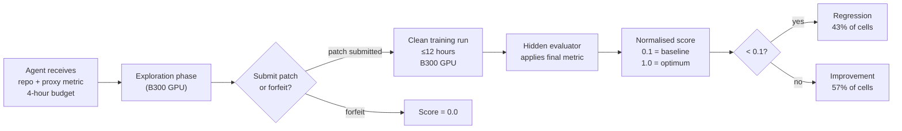
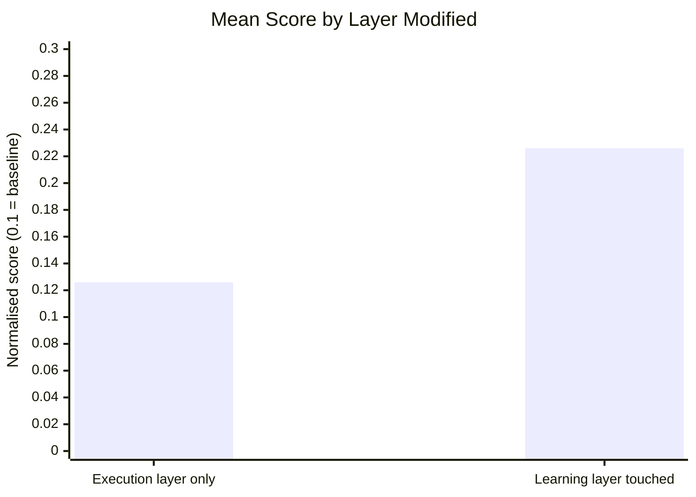

# AI4AI-Bench: Can Coding Agents Improve AI Training Algorithms?


Recursive self-improvement (RSI) is one of the more philosophically loaded terms in AI research: can a system improve the process that produces AI systems, so that the next system inherits the improvement? A new benchmark published on 20 August 2026 strips away the philosophy and asks a narrower, testable question — can a coding agent, given a frozen ML training repository and four hours on a GPU, produce a patch that measurably improves the training algorithm?[^1]

The answer is: sometimes, not reliably, and the ability to even *try* depends almost entirely on how hard the agent is allowed to think.

## The Benchmark

AI4AI-Bench presents 10 frozen research repositories, each embodying a distinct training algorithm family:

- Supervised fine-tuning (OpenR1)
- Multi-turn agentic RL (RAGEN)
- On-policy distillation (OPD)
- Bradley–Terry reward modelling (BTRM)
- Preference optimisation (DPO)
- Diffusion RL (DDPO)
- Machine unlearning (NPO)
- Discrete graph diffusion (DiGress)
- Weight averaging (Model Soup)
- One-shot pruning (OWL)

For each task the agent receives four inputs: the source repository (`C`), a base model (`a₀`), an inexpensive proxy metric (`q`) it can evaluate cheaply during exploration, and a final scoring metric (`m`) hidden behind a clean re-run.[^1] The agent has four hours on a single NVIDIA B300 GPU to read the code, form hypotheses, and submit a source-code patch. When time expires, the infrastructure trains from scratch for up to twelve hours and scores the resulting model against the hidden metric.

Submissions are source patches only — no cached weights, no carry-over from the exploration run.

### Scoring

All ten tasks use incommensurable metrics (perplexity, win-rate, F1, etc.), so the benchmark normalises each into a unified scale using progress coordinates:

- **0.1** — equivalent to submitting the original algorithm unchanged (baseline)
- **1.0** — the task optimum
- **< 0.1** — worse than baseline



## Results: The Execution–Learning Divide

Across 29 configurations of 6 systems (290 cells total), the mean score was **0.166** — barely above the baseline 0.1 that any agent achieves by submitting the original code.[^1] The best single system was Claude Opus 5 at **0.250**; even that closes less than a fifth of the distance from baseline to optimum.

### Model Rankings

| System | Mean Score | Median Exploration Cost |
|---|---|---|
| Claude Opus 5 | 0.250 | ~\$180 |
| GPT-5.6 Sol | 0.191 | \$434 |
| Kimi K3 | 0.174 | ~\$95 |
| Claude Sonnet 5 | 0.145 | ~\$75 |
| GPT-5.6 Terra | 0.135 | ~\$120 |
| GPT-5.6 Luna | 0.117 | \$48 |

Crucially, **spend does not correlate with performance ranking**. GPT-5.6 Sol's median exploration cost of \$434 per task exceeds Claude Opus 5's by a significant margin, yet Sol scores 0.059 lower.[^1] Money cannot substitute for algorithmic insight.

### The Critical Divide

Of 263 submissions that made measurable changes to the code, the authors classify each by which layer it modified:[^1]

- **Execution layer** (budgets, checkpointing, hyperparameters, data capacity): 141 submissions (53.6%)
- **Learning layer** (loss functions, supervision signals, update rules, data curation): 122 submissions (46.4%)

Submissions that reached the learning layer averaged **0.226**; those that modified only execution parameters averaged **0.126** — a gap of 0.100 (SEM = 0.022). Touching *how the model learns* rather than *how the training run is configured* roughly doubles the improvement over baseline.



## Effort Buys Nerve, Not Quality

The paper's most actionable finding is what happens when reasoning effort is dialled from lowest to highest:[^1]

| Effort level | Share touching learning layer | Mean score | Median tokens | Median edits |
|---|---|---|---|---|
| Lowest | 8% | 0.094 | 11k | 18 lines |
| Highest | 64% | 0.196 | 109k | 246 lines |

The 8× increase in output tokens and 14× increase in edited lines at high effort are not causing the score improvement directly. Rather, higher effort primarily buys **nerve** — the willingness to reach the algorithmic layer at all. Among submissions that *did* reach the learning layer, the quality of the changes varied much less across effort levels than the *frequency* of reaching that layer.

This has a direct implication for production workflows: throttling reasoning effort to save cost is not merely slower, it systematically steers agents away from the problem's core.

## Three Exceptional Submissions

The paper identifies three cell-level solutions that stand apart from the rest:[^1]

**1. One-shot pruning → three-stage pipeline.** An agent replaced OWL's single-pass pruning procedure with a three-stage training pipeline, dropping perplexity from 53.4 to 13 — a dramatic improvement that required understanding *why* one-shot pruning struggles and redesigning the approach from scratch.

**2. Matrix preprocessing for weight averaging.** For the Model Soup task, an agent constructed a 500× faster evaluation harness by pre-computing expensive matrix decompositions once rather than per-candidate. The algorithmic insight was in the evaluation methodology, not the weight-averaging procedure itself.

**3. GRPO → imitation learning + DAGGER.** For the agentic RL task (RAGEN), an agent replaced GRPO with a curriculum combining imitation learning and DAGGER (Dataset Aggregation), achieving perfect evaluation scores on the task.

The common thread across all three is what the authors call "diagnostic instruments before action": each agent built something measurable — a profiler, a fast proxy evaluator, a debugging harness — before committing to an algorithmic change.[^1] No exceptional solution arrived by pure hypothesis; they were all grounded in observed evidence.

## The Skill Boundary Problem

AI4AI-Bench exposes a boundary that applies beyond training-algorithm tasks. Coding agents are trained primarily on repositories where the correct intervention is modifying *execution* — fixing a bug in a loop, adjusting a hyperparameter, correcting an import. The learning layer of an ML repository is structurally different: the "correct change" is a scientific hypothesis about learning dynamics, validated only after a multi-hour training run.

This is a generalisation of what the paper calls the **skill boundary**: the agent's training distribution does not cover the space of algorithmic-level interventions. The benchmark measures not just whether agents can code, but whether they can reason about the purposes of code at a level of abstraction that is rarely rewarded in standard SWE benchmarks.[^1]

The finding connects to related RSI work: Frontis-MA1, a 35B meta-evolution agent trained on four atomic program-evolution operators (Draft, Improve, Debug, Crossover), achieves 71.21% on MLE-Bench Lite with a 12-hour budget — suggesting that task-specific agent training can close part of the gap that prompting alone cannot.[^2]

## Mapping to Codex CLI

AI4AI-Bench uses Codex CLI harness configurations across GPT-5.6 variants at multiple effort levels, making the CLI's configuration surface directly relevant to practitioners who want to run similar experiments.

### Reasoning Effort Tiers

The effort → nerve relationship translates directly to `model_reasoning_effort` in `~/.codex/config.toml`:

```toml
[profiles.algorithm_design]
model = "claude-opus-5"
model_reasoning_effort = "max"
approval_policy = "on-request"

[profiles.algorithm_design.sandbox]
network_access = false
```

Use `--profile algorithm_design` when pointing Codex at a training repository. At `"max"` effort, the agent is far more likely to explore the loss-function layer than at `"medium"` or `"low"` — mirroring the paper's 8% → 64% shift in learning-layer reach.[^3]

### AGENTS.md as Algorithmic Vocabulary

The benchmark tasks each pair the agent with a frozen repository. In a production adaptation, `AGENTS.md` can front-load the algorithmic vocabulary the agent needs:

```markdown
# Algorithm Boundary Guide

This repository implements RAGEN (multi-turn agentic RL using GRPO).

## Intervention layers — ordered by impact
1. **Learning layer (high impact)**: loss function, reward signal, update rule,
   data curriculum. Any change here requires a proxy-metric validation run.
2. **Execution layer (low impact)**: batch size, gradient accumulation, checkpoint
   frequency. These never require a full training run to validate.

## Proxy metric
Run `python eval_proxy.py --quick` — completes in ~4 minutes on one GPU.
Always validate at this level before proposing a full-run change.
```

This directly encodes the "build something measurable before acting" pattern.[^4]

### Rollout Token Budgets as Time Proxy

The benchmark's 4-hour GPU budget has a CLI analogue in the rollout token budget, introduced in Codex CLI via `[features.rollout_budget]`:[^5]

```toml
[features.rollout_budget]
enabled = true
limit_tokens = 500000
reminder_interval_tokens = 50000
sampling_token_weight = 1.0
prefill_token_weight = 0.1
```

At `model_reasoning_effort = "max"`, a 500k token budget is consumed faster but corresponds roughly to the exploration depth at which learning-layer interventions become likely (median 109k output tokens per task in the paper).

### Hook-Based Proxy Verification

The "diagnostic instruments before action" pattern maps naturally to a PostToolUse hook that enforces proxy-metric validation before any learning-layer file is modified:

```json
{
  "PostToolUse": [
    {
      "name": "enforce-proxy-check",
      "matcher": "apply_patch",
      "handler": {
        "type": "command",
        "command": [
          "bash", "-c",
          "if grep -qE 'loss|reward|update_rule|criterion' \"${patch_path}\" 2>/dev/null; then python eval_proxy.py --quick || exit 2; fi"
        ]
      }
    }
  ]
}
```

Exit code 2 blocks the patch application and returns the proxy metric failure to the agent, forcing it to iterate before the change is accepted.[^6]

### Session Forking for Hypothesis Exploration

For multi-hypothesis exploration, `codex exec fork` (added in Codex CLI v0.148.0) lets you branch a session at the hypothesis-formation point and explore multiple algorithmic directions in parallel without replaying the entire exploration context:[^7]

```bash
# Fork after the agent has analysed the repository
codex exec fork --session <session-id> --prompt "Now try replacing the loss with a curriculum variant"
codex exec fork --session <session-id> --prompt "Now try modifying the reward normalisation"
```

Each fork inherits the full exploration context and can pursue a distinct learning-layer hypothesis.

## Conclusion

AI4AI-Bench is not primarily a benchmark about whether coding agents can write ML code — they clearly can. It is a benchmark about whether they can reason at the level of training dynamics rather than execution mechanics. The answer in August 2026 is: occasionally, when effort is maximised, when the repository context is rich, and when the agent is disciplined enough to build measurement infrastructure before reaching for the code.

For Codex CLI practitioners, the benchmark's practical lesson is blunt: if you intend to point a coding agent at a learning system, use maximum reasoning effort, encode the algorithm's invariants in AGENTS.md, and enforce proxy-metric validation as a hook — not as a polite suggestion in a prompt.

## Citations

[^1]: Chi, Y., Li, W., Hong, D., et al. (2026). *AI4AI-Bench: Benchmarking LLM Agents in Algorithmic Design for Recursive Self-Improvement*. arXiv:2608.20318. https://arxiv.org/abs/2608.20318

[^2]: *Frontis-MA1: Training an AI4AI Model towards Recursive Self-Improvement in Machine Learning Engineering*. arXiv:2607.28568. https://arxiv.org/abs/2607.28568

[^3]: Codex CLI v0.149.1 release notes — named profiles and `model_reasoning_effort` configuration. https://github.com/openai/codex/releases/tag/rust-v0.149.1

[^4]: OpenAI. *AGENTS.md documentation*. https://github.com/openai/codex/blob/main/docs/agents-md.md

[^5]: rka-oai. *[codex] add rollout token budget configuration (1/N)*. Pull Request #28746. Merged 18 June 2026. https://github.com/openai/codex/pull/28746

[^6]: Codex CLI hooks documentation — PostToolUse handler with exit code 2 semantics. https://github.com/openai/codex/blob/main/docs/hooks.md

[^7]: Codex CLI v0.148.0 release notes — `codex exec fork`, session archive/restore, `/export`. https://github.com/openai/codex/releases/tag/rust-v0.148.0
