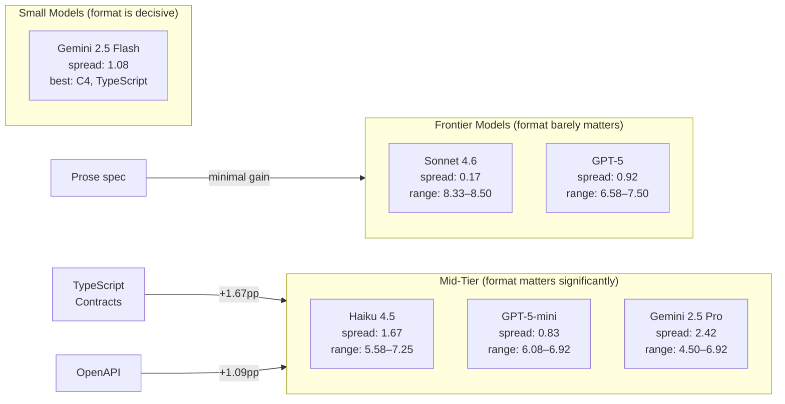
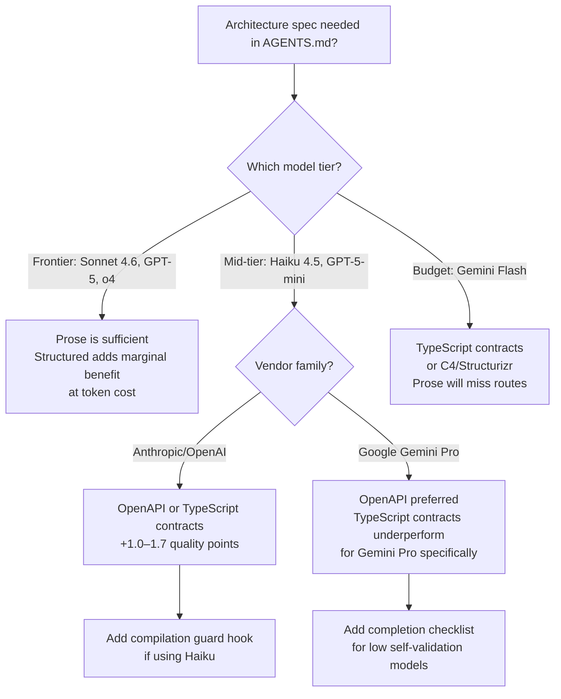

# Architecture Specs as a Capability Equalizer: What Spec Format Tells Us About Codex CLI Model Tier Selection


A controlled experiment by Arquimedes Canedo (arXiv:2608.21747, August 22, 2026) ran 90 multi-turn agent trials across five architecture specification formats and six models from three vendor families.[^1] The headline finding is deceptively simple: **on frontier models, specification format barely matters; on weaker models, format is the decisive variable**. For teams using Codex CLI with cost-optimised model tiers, this changes how you should write architecture documents, AGENTS.md specs, and named-profile configurations.

## The Experiment

The task was building a Task Management API: 7 components (Router, User/Project/Task/Comment/Notification Services, Event Bus), 25 HTTP routes, in-memory storage, with explicit inter-service communication constraints.[^1] Five informationally equivalent specification formats were compared:

| Format | Key characteristic |
|---|---|
| **Prose** | Natural language description (control) |
| **Mermaid + Constraints + ADRs** | Diagrams with numbered rules |
| **OpenAPI 3.0 + Mermaid** | Formal API schema |
| **C4/Structurizr DSL** | Hierarchical decomposition |
| **TypeScript Contracts + ArchUnit rules** | Typed interfaces with pseudo-code constraints |

Models spanned the full capability spectrum: Claude Sonnet 4.6 and Haiku 4.5 (Anthropic), GPT-5 and GPT-5-mini (OpenAI), Gemini 2.5 Pro and Gemini 2.5 Flash (Google).[^1] Quality was measured on four LLM-judged dimensions (1–10 scale), automated route coverage (%), and end-to-end self-validation pass rate.

## Results by Model Tier

The interaction effect between specification format and model capability is the core finding:



Specific scores from the paper:[^1]

**Claude Sonnet 4.6** — Format spread: 0.17 points across all five formats (8.33–8.50). Prose alone earns 8.42; TypeScript contracts earn 8.42. Equivalent.

**Claude Haiku 4.5** — Format spread: 1.67 points. Prose: 5.58; TypeScript contracts: 7.08; OpenAPI: 7.25. Structured specs recover 1.67 quality points at no model-cost increase.

**Gemini 2.5 Pro** — Largest spread: 2.42 points (4.50–6.92). Critically, TypeScript contracts produced the *worst* result for Gemini Pro (4.50), while OpenAPI produced the best (6.92). **Format selection is not universal across model families.**[^1]

**Gemini 2.5 Flash (route coverage)** — The most striking result: prose, Mermaid, and OpenAPI each delivered 33% of 25 required routes. C4/Structurizr jumped to 67%. TypeScript interface contracts hit **100%**, tripling coverage from format alone.[^1]

### The Capability Equaliser Effect

The paper frames structured specification as a capability equaliser: code-proximate formats (OpenAPI, TypeScript) transfer structural intent in a token representation the model can parse directly, reducing the need for the model to infer intent from natural language.[^1] For Gemini Flash, the gap between 33% and 100% route coverage is entirely attributable to this transfer mechanism.

The implication for TypeScript contracts is particularly striking. A TypeScript interface already encodes type relationships, method signatures, and dependency direction — the same information a weaker model would need to derive from prose through multi-step reasoning. Providing it pre-compiled bypasses that reasoning step entirely.

## Three Failure Modes

The experiment mapped three distinct failure patterns:[^1]

**Compilation death spiral** — Haiku averaged 8.6 TypeScript compiler fix attempts per trial, versus 5.1 for Sonnet. Despite a higher pass rate (61% vs 53%), the attempt count reflects a loop where the model detects a compile error, applies a local fix, introduces a new error, and repeats. This inflates token consumption without improving architectural coherence.

**Premature termination** — Gemini Flash stopped after approximately 12 turns without running end-to-end validation. The model declared success based on file creation rather than execution confirmation. Self-validation rate: 0%.

**Perfectionist iteration** — Sonnet continued rewriting to match spec constraints *after* achieving compilability. Higher quality output, but at the cost of increased token consumption (640K average).

## The Self-Validation Collapse

Self-validation — the agent's ability to run its own code end-to-end and confirm correct behaviour — shows a monotonic decline across the capability spectrum that has no correlation with judge scores:[^1]

| Model | Self-validation pass rate |
|---|---|
| Claude Sonnet 4.6 | 100% |
| Claude Haiku 4.5 | 80% |
| GPT-5 | 53% |
| GPT-5-mini | 40% |
| Gemini 2.5 Pro | 20% |
| Gemini 2.5 Flash | 0% |

This matters for Codex CLI workflows because `codex --approval-policy on-failure` relies implicitly on the agent recognising failure. If the model terminates prematurely (Gemini Flash pattern), no failure signal is generated, and no retry is triggered. The agent confidently reports success while delivering an incomplete implementation.

## Token Efficiency Inversion

Haiku's token consumption in the experiment is a direct warning for cost-optimised deployments:[^1]

| Model | Tokens (K) | Quality score | Score per 100K tokens |
|---|---|---|---|
| Sonnet 4.6 | 640 | 8.42 | 1.32 |
| GPT-5 | 248 | 7.08 | 2.85 |
| **Haiku 4.5** | **735** | **6.50** | **0.88** |
| GPT-5-mini | 225 | 6.72 | 2.99 |
| Gemini 2.5 Pro | 329 | 6.07 | 1.85 |
| Gemini 2.5 Flash | 223 | 6.35 | 2.85 |

Haiku consumed 15% *more* tokens than Sonnet while scoring 1.9 points lower — yielding 0.88 quality units per 100K tokens versus Sonnet's 1.32. The compilation death spiral is the mechanism: each failed compile attempt consumes tokens for error analysis, attempted fix, and recompilation prompt, with no architectural progress. Structured specifications that reduce ambiguity reduce the likelihood of entering this spiral.[^1]

GPT-5-mini and Gemini Flash achieve competitive efficiency scores (2.99 and 2.85 respectively) despite lower absolute quality — because their token budgets are lower and their failure modes (premature termination, GPT-5-mini's 4.7 average compile attempts at 17% pass rate) are less expensive than Haiku's.

## Codex CLI Configuration Implications

### Spec Format Routing by Named Profile

The experiment's practical recommendation maps directly to Codex CLI's named-profile system.[^2] Different model tiers warrant different spec format strategies:

```toml
# config.toml — frontier-tier profile (prose specs sufficient)
[profiles.frontier]
model = "o4"
model_reasoning_effort = "medium"
# AGENTS.md can use plain prose for architecture sections

# Mid-tier profile — structured specs reduce failure rate
[profiles.cost-optimised]
model = "claude-haiku-4-5"
model_reasoning_effort = "high"
# AGENTS.md should use OpenAPI or TypeScript contracts

# Budget profile — structured specs are mandatory
[profiles.budget]
model = "gpt-5-mini"
model_reasoning_effort = "medium"
# TypeScript interface contracts required for complex API tasks
```

### Architecture Section Format in AGENTS.md

The paper's finding is actionable in how you structure the architecture section of your AGENTS.md files. For repositories where you deploy with a cost-optimised profile, replace prose architecture descriptions with code-proximate formats:

```markdown
<!-- AGENTS.md — prose (sufficient for frontier models only) -->
## Architecture
The system consists of a Router that delegates to service classes.
Services communicate via an Event Bus. All routes are RESTful.

<!-- AGENTS.md — TypeScript contracts (required for mid/budget-tier models) -->
## Architecture

```typescript
interface RouterConfig {
  services: Record<ServiceName, ServiceHandler>;
  eventBus: EventBus;
}

interface UserService {
  create(dto: CreateUserDTO): Promise<User>;
  findById(id: string): Promise<User | null>;
}

interface EventBus {
  publish(event: DomainEvent): void;
  subscribe(type: EventType, handler: EventHandler): void;
}

// ArchUnit constraint: Services MUST NOT import each other directly.
// All cross-service communication MUST go through EventBus.
```
```

### Preventing Compilation Death Spirals

Haiku's 8.6-attempt compilation loops suggest a hook-based early-exit strategy:

```bash
#!/usr/bin/env bash
# hooks/post-tool-use/compilation-guard.sh
# Exit code 2 aborts the turn when compile attempts exceed threshold

ATTEMPTS_FILE="/tmp/codex-compile-attempts"
LIMIT=5

count=$(cat "$ATTEMPTS_FILE" 2>/dev/null || echo 0)
count=$((count + 1))
echo "$count" > "$ATTEMPTS_FILE"

if [ "$count" -gt "$LIMIT" ]; then
  echo "Compilation attempt $count exceeds threshold $LIMIT. Aborting to prevent death spiral." >&2
  exit 2
fi
```

```toml
# hooks.json-style config
[[hooks]]
trigger = "post_tool_use"
command = ["bash", ".codex/hooks/compilation-guard.sh"]
tool = "shell"
```

### Handling Self-Validation Gaps

For models with low self-validation rates (below 80%), add an explicit end-to-end validation step to AGENTS.md:[^3]

```markdown
## Mandatory Completion Checklist
Before reporting completion, you MUST:
1. Run the server: `npm start &`
2. Hit every route with curl or a test script
3. Confirm HTTP 200 (or expected error code) for each
4. Kill the server: `kill %1`
5. Report actual output, not expected output
```

This compensates for premature-termination failure mode without changing the model.

## What the Experiment Does Not Cover

The study uses a single task domain (Task Management API) and measures output quality at completion of a single multi-turn session.[^1] It does not measure:

- **Iterative refinement performance** — whether structured specs help models recover from partial failures across sessions
- **Token consumption at scale** — 25-route APIs are modest; the efficiency inversion may compound at larger service boundaries ⚠️
- **Instruction-following with conflicting specs** — what happens when AGENTS.md prose contradicts a TypeScript contract added later ⚠️
- **Codex CLI-specific agent behaviour** — all trials used a generic multi-turn agent framework, not Codex CLI's sandbox model, rollout tracing, or hook system

The Gemini Pro anomaly (TypeScript contracts produced the *worst* result at 4.50, versus OpenAPI's 6.92) is unexplained and flagged as requiring further investigation.[^1] Do not assume TypeScript contracts are universally superior; the finding holds for Gemini Flash but reverses for Gemini Pro.

## Decision Framework



## Summary

The paper establishes that architecture specification format acts as a capability equaliser — its value is inversely proportional to model strength. On Codex CLI with cost-optimised profiles, this means:

- **Mid-tier models** (Haiku 4.5, GPT-5-mini): switch from prose to OpenAPI or TypeScript interface contracts in architecture sections; expect 0.83–1.67 quality point improvement
- **Budget models** (Gemini Flash): TypeScript contracts are mandatory; prose delivers one-third of required coverage
- **Frontier models** (Sonnet, GPT-5, o4): prose is sufficient; structured formats yield marginal gains at token cost
- **Haiku compilation spirals**: monitor attempt counts and abort via PostToolUse hooks at threshold
- **Self-validation gaps**: enforce explicit end-to-end validation checklists in AGENTS.md for models below 80% self-validation rate

The experiment dataset (93 trials, all codebases, judge scores, automated compliance) is publicly available.[^4]

## Citations

[^1]: Canedo, A. (2026). *Architecture as Capability Equalizer for Coding Agents*. arXiv:2608.21747. <https://arxiv.org/abs/2608.21747>

[^2]: OpenAI. (2026). *Codex CLI Named Profiles documentation*. <https://github.com/openai/codex>

[^3]: OpenAI. (2026). *AGENTS.md — Codex CLI instruction file reference*. <https://github.com/openai/codex/blob/main/AGENTS.md>

[^4]: Canedo, A. (2026). *Architecture as Capability Equalizer — dataset and trial transcripts*. <https://github.com/arquicanedo/architecture-as-equalizer>

[^5]: Codex Changelog. (2026, August). *Codex CLI v0.149.0 release*. <https://releasebot.io/updates/openai/codex>

[^6]: OpenAI. (2026). *Codex CLI model selection and named profiles*. <https://developers.openai.com/codex/changelog>
