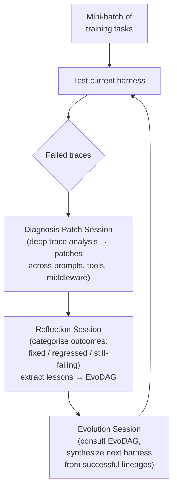
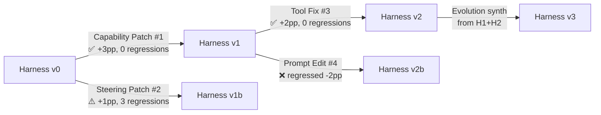

# AutoSaddler: What Automatic Harness Optimisation Teaches Us About Improving Codex CLI Configuration


## The Harness Is the Lever

Most Codex CLI practitioners already know that `AGENTS.md`, `hooks.json`, and `config.toml` matter. What they often lack is a systematic method for improving them — one that goes beyond gut-feel edits after a frustrating session. AutoSaddler, published on 24 August 2026 by researchers across thirteen authors, provides exactly that: a formal framework for treating harness improvement as an offline learning problem, and empirical evidence that doing it well is worth roughly **nine to ten percentage points** of task-resolution rate across three independent benchmarks.[^1]

For Codex CLI teams, the paper's taxonomy, architecture, and failure-mode analysis translate almost directly into an actionable harness-improvement workflow.

---

## What "Harness" Means in the AutoSaddler Sense

AutoSaddler defines the harness as everything external to the language model itself: the system prompt and behavioural rules, the tools exposed to the agent, and the middleware logic (hooks, control flow, retry logic, output formatting).[^1] In Codex CLI terms, this maps precisely to three artefacts:

| AutoSaddler component | Codex CLI artefact |
|---|---|
| System-prompt / behavioural rules | `AGENTS.md` instructions |
| Tool definitions and descriptions | `config.toml` `[mcp]` blocks, `enabled_tools` |
| Middleware / hooks / control flow | `hooks.json` PreToolUse, PostToolUse, SessionStart handlers |

The paper's central claim is that harness design is a **first-class machine-learning problem** — not a one-time setup task. The corollary for Codex CLI is that your initial `AGENTS.md` is a hypothesis, not a specification, and systematic iteration is the mechanism for converging on one that actually works.

---

## The Three-Phase Optimisation Loop

AutoSaddler operates iteratively, running a mini-batch of training tasks against the current harness, then executing three specialised agent sessions:[^1]



### Diagnosis-Patch: Deep Reading, Not Shallow Reflection

The most distinctive design choice is the insistence on *in-depth diagnosis*. Rather than asking the agent to reflect on a failure summary, the Diagnosis-Patch session progressively retrieves relevant sections of both the execution trace and the harness source, drilling into root causes rather than symptoms.[^1]

The ablation result is striking: removing in-depth diagnosis drops GAIA2 performance from **62.0% to 57.8%**, with the number of accepted patches falling from 13 to 5 by iteration 25. Shallow reflection produces mostly noise; deep diagnosis produces signal.

### Patch Taxonomy: Capability vs Steering

AutoSaddler distinguishes two patch classes that should influence how Codex CLI teams think about their own edits:[^1]

**Capability Patches** modify executable code — adding a new tool, fixing a tool's argument parsing, changing control logic, adding an infrastructure hook. These alter what the agent *can* do.

**Steering Patches** are textual edits — rewriting a system prompt clause, adding an AGENTS.md rule, improving a tool description. These alter how the agent *behaves*.

The critical empirical finding: **Capability Patches induce significantly fewer regressions than Steering Patches** (8% vs 17% regression rate). The paper's explanation is that executable code changes have localised, predictable effects, while text edits interact with the model's internal representations in ways that are hard to anticipate. For Codex CLI practitioners, the implication is counter-intuitive: when an agent is failing, reaching for `hooks.json` or a new MCP tool may be more durable than rewriting `AGENTS.md`.

### Phased Scheduling: Capability First

AutoSaddler schedules patch types analogously to learning-rate schedules in gradient descent: Capability Patches early (when the harness has structural gaps), transitioning to Steering Patches later (when behaviour needs fine-tuning). Starting with behavioural text edits before structural capability gaps are closed wastes iteration budget.[^1]

### EvoDAG: Escaping Local Optima

The Evolution Session does not simply continue from the most recent harness. Instead, it consults the **EvoDAG** — a directed acyclic graph recording every patch, its outcome category (fixed/regressed/still-failing/still-passing), and extracted lessons.[^1]



This structure lets the Evolution agent synthesise candidates from different lineages, combining a tool fix that succeeded in one branch with a prompt edit that succeeded in another. In one ablation, a single overly-broad hook modification caused an 8%→22% regression spike — the kind of catastrophic edit that EvoDAG-aware evolution prevents by selecting against regression-prone patch patterns.[^1]

---

## Experimental Results

AutoSaddler was evaluated on three benchmarks using Claude Opus 4.6 as the optimisation backbone (itself built on the Claude Agent SDK):[^1]

| Benchmark | Base harness | AutoSaddler | Gain |
|---|---|---|---|
| GAIA2 | 53.0% | 62.0% | **+9.0 pp** |
| SWE-Bench Pro | 37.3% | 46.9% | **+9.6 pp** |
| Terminal-Bench 2.0 | 40.0% | 50.0% | **+10.0 pp** |

The gains are not just larger than baselines — they are achieved with **ten times fewer traces** than the comparable Meta-Harness approach (~1,000 task executions vs ~2,800 to reach the same accuracy level).[^1]

### Cross-Model Transfer

A particularly important finding for Codex CLI teams running multiple model tiers: harnesses optimised with Opus 4.6 **transfer to Haiku 4.5**, improving performance by +5.6 percentage points.[^1] This means investment in harness optimisation on your most capable model propagates to your cheaper routing tier — a meaningful return given the cost differential.

---

## Mapping AutoSaddler to a Codex CLI Workflow

The paper describes an automated system. The principles, however, translate into a manual practice that Codex CLI users can adopt today.

### Step 1: Establish a Failure-Trace Corpus

Enable structured trace output before your optimisation sessions:

```toml
# config.toml
[session]
rollout_path = "~/.codex/traces/"
```

```bash
# Run a representative task set and capture traces
codex exec --json "Fix the failing integration tests in services/auth/" \
  > ~/.codex/traces/$(date +%Y%m%d-%H%M%S)-auth-fix.jsonl
```

The rollout JSONL records every tool call, its arguments, its output, and the model's reasoning. This is your raw material for diagnosis.[^2]

### Step 2: Apply the Patch Taxonomy to Your Configuration

When a failure pattern emerges, classify the required fix before editing:

```bash
# Is this a Capability gap?
# → Fix in config.toml (add MCP server, adjust tool limits) or hooks.json (add new hook)
#
# Is this a Steering issue?
# → Fix in AGENTS.md (add rule, clarify constraint, improve example)
```

Prioritise Capability Patches first. A missing tool or a broken hook cannot be compensated by even the most carefully worded AGENTS.md instruction.

```toml
# Example Capability Patch: add a missing tool the agent needs
# config.toml
[[mcp.servers]]
name = "ast-grep"
command = "mcp-server-ast-grep"
enabled_tools = ["search_pattern", "replace_pattern"]
```

### Step 3: Validate Before Promoting

Before committing a harness change to your main branch, verify it on a held-out task set using session forking:

```bash
# Fork a reference session, apply proposed harness, test against held-out tasks
codex exec fork <SESSION_ID> "Run the auth service test suite with the new hooks config"
```

This mirrors AutoSaddler's generalization-aware selection: a patch that fixes the training failure but regresses other tasks should be rejected.[^3]

### Step 4: Track Changes with Structured Notes

Without an EvoDAG, use git commit messages and a `harness-changelog.md` to track the reasoning behind each edit:

```markdown
## 2026-08-26 — Added ast-grep MCP tool (Capability Patch)
**Problem:** Agent used regex on large TypeScript files, missing structural patterns.
**Fix:** Added ast-grep MCP server to config.toml.
**Verification:** Ran 12 auth-service tasks; +3 resolved, 0 regressions.
**Transfer:** Tested on haiku profile — same gain observed.
```

---

## What Codex CLI Lacks

AutoSaddler highlights several structural gaps in the current Codex CLI toolchain:

- **No built-in trace-analysis primitive**: The rollout JSONL is rich, but there is no `codex trace diagnose` command that systematically identifies failure root causes across a task corpus.
- **No patch-type gating**: AGENTS.md and hooks.json can be edited freely; there is no mechanism to enforce phased scheduling or classify edits by capability vs steering impact.
- **No regression detection across sessions**: Each session is independent. AutoSaddler's regression tracking requires comparing task outcomes across harness versions, which Codex CLI does not natively support.
- **No EvoDAG equivalent**: Git history records what changed, but not the performance outcome of each change or the reasoning behind the evolution strategy.

These gaps do not invalidate the practice — they define the scope of current manual overhead.

---

## Related Work

AutoSaddler sits in an emerging lineage of harness-as-ML papers. HARBOR (arXiv:2604.20938) frames harness configuration as constrained Bayesian optimisation over components like context compaction and tool caching.[^4] HarnessX (arXiv:2606.14249) introduces composable, trace-driven harness evolution achieving +14.5% average absolute gain.[^5] AutoSaddler's contribution is the deepest mechanistic account of why harness optimisation works: the capability-before-steering scheduling, the EvoDAG escape from local optima, and the durability advantage of executable over textual changes.

---

## Summary

AutoSaddler reframes what looks like routine configuration tuning as a systematic engineering discipline with measurable returns. The paper's three core findings transfer directly to Codex CLI practice:

1. **Capability Patches (config, hooks, tools) are more durable than Steering Patches (AGENTS.md text)** — fewer regressions, more predictable effects.
2. **Deep failure-trace diagnosis consistently outperforms shallow reflection** — investing in trace analysis pays off in accepted patches.
3. **Harness optimisation is cross-model portable** — improvements derived from frontier-model sessions transfer to cheaper tiers.

The methodology does not require an automated loop. Applied as a structured manual practice — corpus building, patch classification, fork-based validation, structured changelog — it makes the difference between AGENTS.md as a random accumulation of instructions and AGENTS.md as a converging specification.

---

## Citations

[^1]: AutoSaddler Authors. (2026). *AutoSaddler: Automatic Harness Optimization with Durable Updates from Agent Execution Traces*. arXiv:2608.23041. <https://arxiv.org/abs/2608.23041>

[^2]: OpenAI. (2026). *Codex CLI — Session and Rollout Configuration*. <https://github.com/openai/codex/blob/main/docs/configuration.md>

[^3]: OpenAI. (2026). *Codex CLI v0.148.0 Release Notes — codex exec fork*. <https://github.com/openai/codex/releases/tag/rust-v0.148.0>

[^4]: HARBOR Authors. (2026). *HARBOR: Automated Harness Optimization*. arXiv:2604.20938. <https://arxiv.org/abs/2604.20938>

[^5]: Chen, X., et al. (2026). *HarnessX: A Composable Evolvable Agent Harness Foundry*. arXiv:2606.14249. <https://arxiv.org/abs/2606.14249>

[^6]: OpenAI. (2026). *Codex CLI — AGENTS.md Reference*. <https://github.com/openai/codex/blob/main/docs/agents-md.md>

[^7]: OpenAI. (2026). *Codex CLI — Hooks Configuration Reference*. <https://github.com/openai/codex/blob/main/docs/hooks.md>
